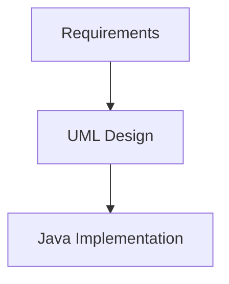
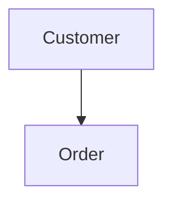

# What is UML?

## UML

UML stands for **Unified Modeling Language**.

UML is a standardized visual language used to represent the structure and behavior of software systems.

UML is not a programming language.

It is used to communicate and visualize software design.

## UML in LLD

A typical LLD flow is:

```
flowchart TB
    A[Requirements] --> B[UML Design]
    B --> C[Java Implementation]
```




---

# 🧪 Think about this requirement:

> A `Customer` places an `Order`.

Don't worry about the correct UML relationship yet.

Just create this conceptual Mermaid diagram:

```text
Customer → Order
```


```
flowchart TD
    Customer --> Order
```
