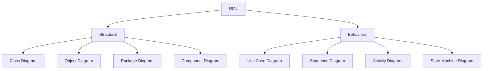

# Structural vs Behavioral UML

## Structural UML

Structural diagrams describe the static structure of a software system.

They answer:

> What exists in the system?

Examples:

- Class Diagram
- Object Diagram
- Package Diagram
- Component Diagram
- Deployment Diagram

## Behavioral UML

Behavioral diagrams describe the behavior of a software system.

They answer:

> What happens in the system?

Examples:

- Use Case Diagram
- Sequence Diagram
- Activity Diagram
- State Machine Diagram

## Overview

```
flowchart TD
    UML[UML]

    UML --> S[Structural]
    UML --> B[Behavioral]

    S --> C[Class Diagram]
    S --> O[Object Diagram]
    S --> P[Package Diagram]
    S --> CO[Component Diagram]

    B --> U[Use Case Diagram]
    B --> SE[Sequence Diagram]
    B --> A[Activity Diagram]
    B --> ST[State Machine Diagram]
```



---

# 🧪 Knowledge Check

Classify these as **Structural** or **Behavioral**:

1. Class Diagram
2. Sequence Diagram
3. Object Diagram
4. Use Case Diagram
5. State Machine Diagram
6. Package Diagram

### Solution

| Diagram | Type |
|---|---|
| Class Diagram | ✅ Structural |
| Sequence Diagram | ✅ Behavioral |
| Object Diagram | ✅ Structural |
| Use Case Diagram | ✅ Behavioral |
| State Machine Diagram | ✅ Behavioral |
| Package Diagram | ✅ Structural |
