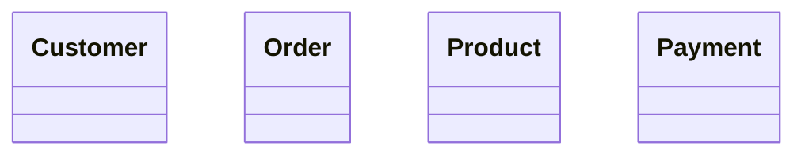
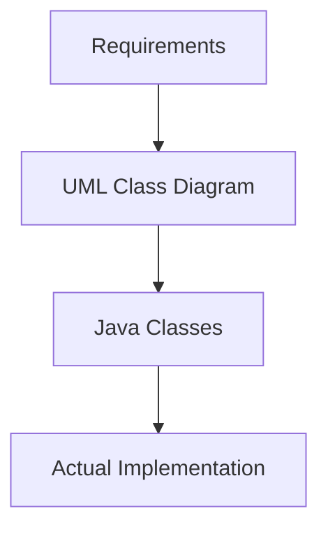
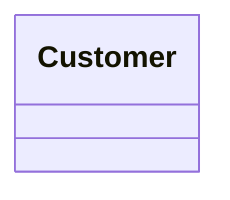
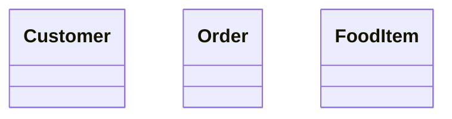
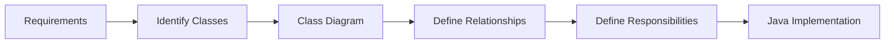
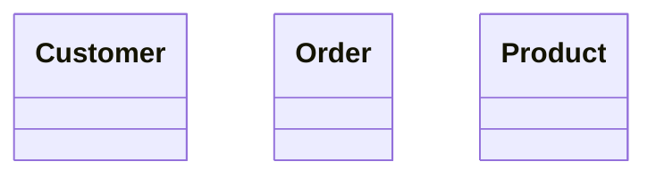

# Class Diagram — Introduction

## 1. What is a Class Diagram?

A **Class Diagram** is a UML structural diagram that represents the **static structure** of a system.

It helps us visualize:

- What classes exist
- What data those classes contain
- What behavior those classes provide
- How classes are related

For Low-Level Design (LLD), the Class Diagram is one of the most important UML diagrams because it closely mirrors the structure of our Java classes.

---

## 2. Simple Mental Model

Think of a Class Diagram as:

> A blueprint of the classes in our system.

For example, an e-commerce system might contain:

- `Customer`
- `Order`
- `Product`
- `Payment`

At the initial design stage, we simply identify these classes — nothing more.

```
classDiagram
    class Customer
    class Order
    class Product
    class Payment
```




At this stage we're only naming the major classes. Attributes, methods, and relationships come later.

---

## 3. Class Diagram and LLD

A typical LLD process looks like this:

```
flowchart TD
    A[Requirements] --> B[UML Class Diagram]
    B --> C[Java Classes]
    C --> D[Actual Implementation]
```



The Class Diagram acts as a **design bridge** between requirements and implementation:

```
Requirements
     ↓
UML Design
     ↓
Java Classes
     ↓
Implementation
```

This lets us think through the design *before* writing code.

---

## 4. Example — E-Commerce System

**Requirement:**
> A customer can place orders. An order contains products and requires payment.

From this, we identify the initial classes:

- `Customer`
- `Order`
- `Product`
- `Payment`

```
classDiagram
    class Customer
    class Order
    class Product
    class Payment
```


At this stage we intentionally *don't* show relationships. Those come later:

- Association
- Inheritance
- Aggregation
- Composition
- Dependency

---

## 5. Class Diagram vs. Java Code

A UML Class Diagram is **not** Java code — it's a design model.

**Java implementation:**
```java
class Customer {
}
```

**UML representation:**
```
classDiagram
    class Customer
```



The UML diagram describes the *design*, while Java represents the *implementation*.

---

## 6. Why Use Class Diagrams in LLD?

Class Diagrams let us reason about a design before building it. They help us progressively identify:

**Classes** — what objects/classes exist in the system?
> `Customer`, `Order`, `Product`, `Payment`

**Responsibilities** — what should each class be responsible for?
> `Customer` → customer-related operations
> `Order` → order-related operations
> `Payment` → payment-related operations

**Relationships** — how do classes interact with each other?
> `Customer` → `Order`
> `Order` → `Product`
> `Order` → `Payment`

**Implementation structure** — how does the design map to code?
```
UML Class
   ↓
Java Class
```

---

## 7. Example — Food Delivery System

**Requirement:**
> A customer places an order. The order contains food items.

Initial classes:

- `Customer`
- `Order`
- `FoodItem`

```
classDiagram
    class Customer
    class Order
    class FoodItem
```



Again — only classes so far. Relationships aren't modeled yet.

---

## 8. Important Distinction

A Class Diagram represents the **design**, not necessarily the complete implementation.

```
Requirement
    ↓
"Customer places an order"
    ↓
Identify classes → Customer, Order
    ↓
Create Class Diagram
    ↓
Implement Java classes
```

This stops us from jumping straight into code without thinking through the design first.

---

## 9. Class Diagram in the LLD Process

A simplified LLD workflow:

```
flowchart LR
    A[Requirements] --> B[Identify Classes]
    B --> C[Class Diagram]
    C --> D[Define Relationships]
    D --> E[Define Responsibilities]
    E --> F[Java Implementation]
```



The exact process can vary, but the core idea holds: **we use UML to model the design before or alongside implementation.**

---

## 10. What We'll Learn Next

A Class Diagram can contain much more than just class names:

```
Class
 ├── Class Name
 ├── Attributes
 └── Methods
```

Topics coming up:

| Structure | Type System | Relationships |
|---|---|---|
| Visibility | Interfaces | Association |
| Constructors | Enums | Aggregation |
| Static members | Abstract classes | Composition |
| Final members | Abstract methods | Inheritance |
| Generics | Stereotypes | Dependency |
| Notes / Constraints | | Realization |
| Multiplicity/Cardinality | | Navigability, Role names |

Each concept will be introduced separately.

---

## 11. Practice

**Question**

You are designing a food delivery system.

> Requirement: A customer places an order. The order contains food items.

Identify the initial classes.

**Solution**

```
classDiagram
    class Customer
    class Order
    class FoodItem
```


Note that relationships are still not shown — that's a separate step.

---

## 12. Key Takeaways

1. A Class Diagram is a structural UML diagram.
2. It represents the static structure of a system.
3. It helps identify the classes in a system.
4. It can later show attributes, methods, and relationships.
5. It is heavily used in LLD.
6. It is a design/model, not Java implementation.
7. It acts as a bridge between requirements and Java code.

```
Requirements
      ↓
UML Class Diagram
      ↓
Java Classes
      ↓
Implementation
```

---

## 13. Mermaid — Basic Class Diagram Syntax

```
classDiagram
    class Customer
    class Order
    class Product
```



General form:

```text
classDiagram
class ClassName
```

We'll progressively add attributes, methods, and relationships as we go.

---

## 14. Final Mental Model

```
Class Diagram
      │
      ├── Represents system structure
      ├── Identifies classes
      ├── Later shows attributes
      ├── Later shows methods
      └── Later shows relationships
```
**Class Diagram = Blueprint of the classes that make up a system.**