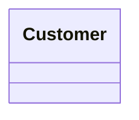
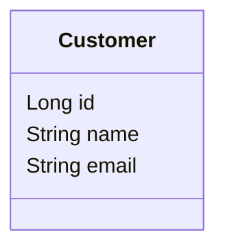
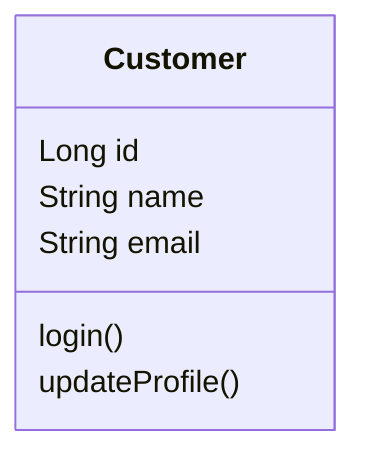
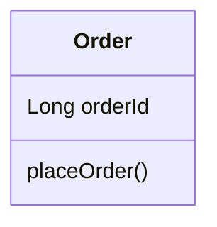
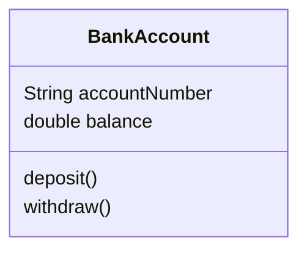

# UML Class Diagram — Basic Class Structure

## 1. What is the Structure of a UML Class?

A UML Class is generally divided into three sections:

1. Class Name
2. Attributes
3. Methods / Operations

The basic structure is:

```text
┌─────────────────────────┐
│       Class Name        │
├─────────────────────────┤
│       Attributes        │
├─────────────────────────┤
│       Methods           │
└─────────────────────────┘
```

A simple mental model:

```text
Class
├── Name
├── Data
└── Behavior
```

---

## 2. Class Name

The top section contains the name of the class.

```text
classDiagram
class Customer
```



Conceptually:

```text
┌───────────────┐
│   Customer    │
└───────────────┘
```

The class name represents the type/object concept we're modeling — for example:

- `Customer`
- `Order`
- `Product`
- `Payment`
- `Account`

---

## 3. Attributes

The middle section represents the data/state maintained by the class.

For example, a `Customer` may contain: `id`, `name`, `email`.

```text
classDiagram
class Customer {
    Long id
    String name
    String email
}
```



Conceptually:

```text
┌─────────────────────────┐
│        Customer         │
├─────────────────────────┤
│ Long id                 │
│ String name             │
│ String email            │
├─────────────────────────┤
│                         │
└─────────────────────────┘
```

Attributes represent the **data/state** of an object.

---

## 4. Methods / Operations

The bottom section represents the behavior provided by the class.

For example: `login()`, `updateProfile()`.

```text
classDiagram
    class Customer {
        Long id
        String name
        String email

        login()
        updateProfile()
    }
```



Conceptually:

```text
┌─────────────────────────┐
│        Customer         │
├─────────────────────────┤
│ Long id                 │
│ String name             │
│ String email            │
├─────────────────────────┤
│ login()                 │
│ updateProfile()         │
└─────────────────────────┘
```

Methods represent the **behavior** of the class.

---

## 5. Complete Basic Class Structure

Combining everything:

```text
classDiagram
    class Customer {
        Long id
        String name
        String email

        login()
        updateProfile()
    }
```


The structure is:

```text
┌─────────────────────────┐
│        Customer         │  ← Class Name
├─────────────────────────┤
│ Long id                 │  ← Attributes
│ String name             │
│ String email            │
├─────────────────────────┤
│ login()                 │  ← Methods
│ updateProfile()         │
└─────────────────────────┘
```

---

## 6. Class Structure in Java

The UML class structure maps naturally to Java.

**UML:**

```text
classDiagram
    class Customer {
        Long id
        String name
        String email
        
        login()
        updateProfile()
    }
```


**Java:**

```java
class Customer {

    // Data / State
    Long id;
    String name;
    String email;

    // Behavior
    void login() {
    }

    void updateProfile() {
    }

}
```

**Mapping:**

| UML | Java |
|---|---|
| Class | `class Customer` |
| Attribute | Field |
| Method / Operation | Method |

---

## 7. Data vs Behavior

One of the most important mental models:

```text
        CLASS
          │
   ┌──────┴──────┐
   │             │
  Data        Behavior
   │             │
Attributes    Methods
```

For `Customer`:

**Data:** `id`, `name`, `email`
**Behavior:** `login()`, `updateProfile()`

This distinction becomes very important when we start discussing responsibility-driven design in LLD.

---

## 8. Example — Order

**Requirement:**
> An Order has an order ID and provides a `placeOrder()` operation.

```text
classDiagram
    class Order {
        Long orderId

        placeOrder()
    }
```



Conceptually:

```text
┌─────────────────────┐
│       Order         │
├─────────────────────┤
│ Long orderId        │
├─────────────────────┤
│ placeOrder()        │
└─────────────────────┘
```

**Java equivalent:**

```java
class Order {

    Long orderId;

    void placeOrder() {
    }

}
```

---

## 9. Why Are There Three Sections?

The three sections visually separate different aspects of a class.

**Section 1 — Class Name**
Answers: *What class are we modeling?*
Example: `Customer`

**Section 2 — Attributes**
Answers: *What data/state does this class contain?*
Example: `Long id`, `String name`, `String email`

**Section 3 — Methods**
Answers: *What behavior does this class provide?*
Example: `login()`, `updateProfile()`

```text
┌───────────────────┐
│     Class Name    │
├───────────────────┤
│      Data         │
├───────────────────┤
│    Behavior       │
└───────────────────┘
```

---

## 10. Important Note About What We Haven't Learned Yet

At this stage, we're only learning the basic structure of a UML class.

We have **not** yet covered:

- Attribute visibility
- Method visibility
- `+`, `-`, `#`, `~`
- Return types
- Method parameters
- Static members
- Final members
- Constructors
- Abstract methods
- Abstract classes
- Interfaces
- Enums
- Generics
- Stereotypes
- Constraints

These will be introduced one concept at a time.

---

## 11. Practice

**Question**

Create a UML class for:
> `Order` has an order ID and provides a `placeOrder()` operation.

**Solution**

```text
classDiagram
class Order {
    Long orderId

    placeOrder()
}
```


Conceptually:

```text
┌─────────────────────┐
│       Order         │
├─────────────────────┤
│ Long orderId        │
├─────────────────────┤
│ placeOrder()        │
└─────────────────────┘
```

---

## 12. Another Example — BankAccount

`BankAccount` has: `accountNumber`, `balance`
And provides: `deposit()`, `withdraw()`

```text
classDiagram
    class BankAccount {
        String accountNumber
        double balance
        
        deposit()
        withdraw()
    }
```



**Java equivalent:**

```java
class BankAccount {

    String accountNumber;
    double balance;

    void deposit() {
    }

    void withdraw() {
    }

}
```

---

## 13. Key Takeaways

1. A UML class has three basic sections.
2. The first section contains the class name.
3. The second section contains attributes.
4. The third section contains methods/operations.
5. Attributes represent data/state.
6. Methods represent behavior.
7. UML classes map naturally to Java classes.
8. We'll learn the detailed notation gradually.

```text
Class
│
├── Name
│
├── Attributes → Data / State
│
└── Methods → Behavior
```

---

## 14. Basic Mermaid Syntax

```text
classDiagram
    class Customer {
        Long id
        String name
        String email
        
        login()
        updateProfile()
    }
```


General pattern:

```text
classDiagram
    class ClassName {
        Attribute
        Attribute
        
        Method()
        Method()
    }
```

This is the foundation for the more detailed UML class notation we'll learn next.

---

## 15. Final Mental Model

Think of every UML class initially as:

```text
┌─────────────────────────┐
│       Class Name        │
├─────────────────────────┤
│       Attributes        │
│       ↓                 │
│       Data / State      │
├─────────────────────────┤
│       Methods           │
│       ↓                 │
│       Behavior          │
└─────────────────────────┘
```

In Java:

```text
Class
├── Fields  → Data / State
└── Methods → Behavior
```

**A UML Class is a visual representation of a class's name, data, and behavior.**