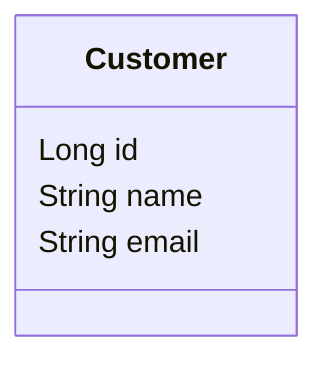
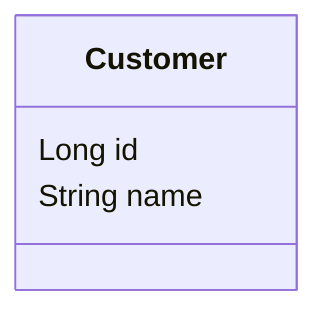
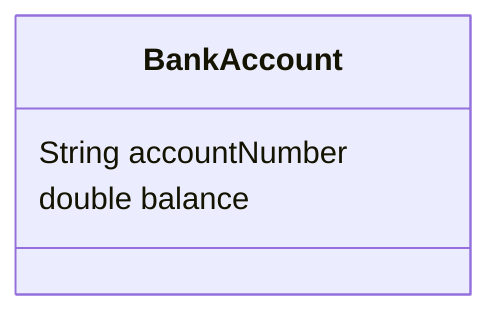
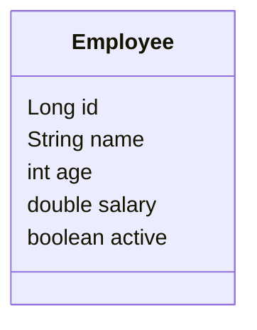
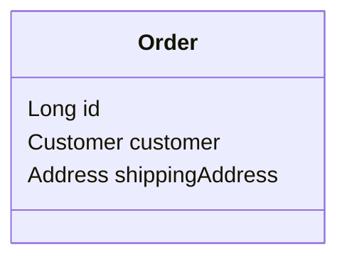
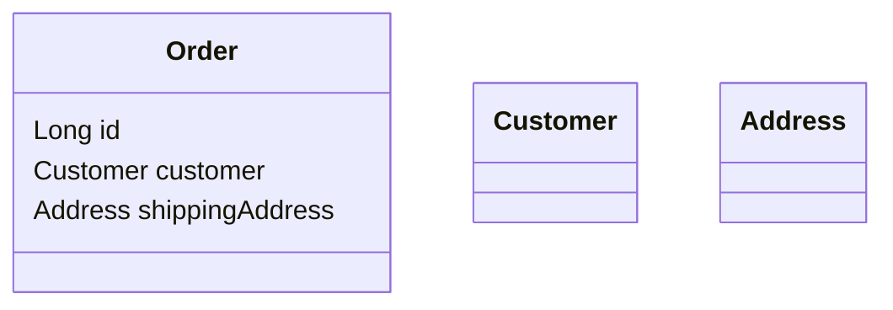
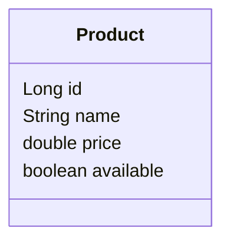
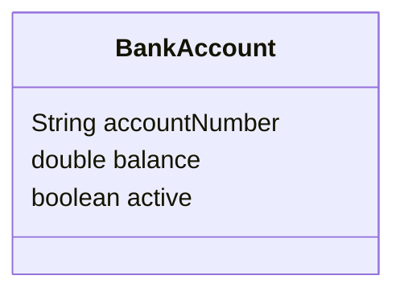

# UML Attributes

## 1. What is an Attribute?

An **attribute** represents the data or state maintained by a UML class.

For example, a `Customer` may have: `id`, `name`, `email`.

```text
classDiagram
class Customer {
    Long id
    String name
    String email
}
```



Here, `id`, `name`, and `email` are attributes of the `Customer` class.

---

## 2. Basic Attribute Syntax

The basic UML attribute syntax:

```text
type attributeName
```

Examples:

```text
Long id
String name
String email
double balance
boolean active
```

The structure is:

```text
Data Type + Attribute Name
```

For example, `String name` contains:

- `String` → Data Type
- `name` → Attribute Name

---

## 3. Attributes Inside a Class

Attributes appear in the **middle section** of a UML class.

```text
classDiagram
    class Customer {
        Long id
        String name
        String email
    }
```


Conceptually:

```text
┌─────────────────────────┐
│        Customer         │
├─────────────────────────┤
│ Long id                 │
│ String name             │
│ String email            │
├─────────────────────────┤
│                         │
└─────────────────────────┘
```

The middle section represents the **data/state** of the class.

---

## 4. UML Attribute vs. Java Field

A UML attribute maps roughly to a **field / instance variable** in Java.

**UML:**

```text
classDiagram
    class Customer {
        Long id
        String name
    }
```



**Java:**

```java
class Customer {
    Long id;
    String name;
}
```

**Mapping:**

| UML | Java |
|---|---|
| Attribute | Field / Instance Variable |
| `Long id` | `Long id;` |
| `String name` | `String name;` |

So when looking at a UML class, think: **UML Attribute → Java Field**.

---

## 5. Attributes Represent State

An attribute represents part of the current **state** of an object.

```text
classDiagram
    class BankAccount {
        String accountNumber
        double balance
    }
```



Suppose an actual object has:

```text
accountNumber = "ACC1001"
balance = 5000
```

That `balance` is part of the current state of that `BankAccount`.

Similarly, a customer could have:

```text
name = "Shiv"
email = "shiv@example.com"
```

These values represent the current state of the customer.

**Mental model:**

```text
Object
  ↓
State
  ↓
Attributes
```

---

## 6. Different Attribute Types

A class can contain attributes with different data types.

```text
classDiagram
    class Employee {
        Long id
        String name
        int age
        double salary
        boolean active
    }
```



| Attribute | Type |
|---|---|
| `id` | `Long` |
| `name` | `String` |
| `age` | `int` |
| `salary` | `double` |
| `active` | `boolean` |

The basic pattern remains: `type attributeName`.

---

## 7. Custom Types as Attribute Types

Attributes don't have to use only primitive or standard types — a class can use **another class** as an attribute type.

```text
classDiagram
    class Order {
        Long id
        Customer customer
        Address shippingAddress
    }
```



Here:

- `Long` → `id`
- `Customer` → `customer`
- `Address` → `shippingAddress`

`Customer` and `Address` can themselves be classes:

```text
classDiagram
    class Order {
        Long id
        Customer customer
        Address shippingAddress
    }

    class Customer
    class Address
```



At this stage we're only looking at attribute *types* — not the relationships between these classes. Relationships are covered separately.

---

## 8. Example — Product

A product has: **ID, Name, Price, Availability**.

```text
classDiagram
    class Product {
        Long id
        String name
        double price
        boolean available
    }
```



The attributes are: `Long id`, `String name`, `double price`, `boolean available`.

---

## 9. Example — Bank Account

A bank account contains: **Account number, Balance, Active status**.

**UML:**

```text
classDiagram
    class BankAccount {
        String accountNumber
        double balance
        boolean active
    }
```



**Java equivalent:**

```java
class BankAccount {
    String accountNumber;
    double balance;
    boolean active;
}
```

Again: `UML Attribute → Java Field`.

---

## 10. Attribute Syntax — Current Scope

For this step, we're using the simple form:

```text
type attributeName
```

Examples:

```text
Long id
String name
double price
boolean active
Customer customer
Address address
```

We haven't introduced visibility yet, so we're intentionally **not** using:

```text
+id
-id
#id
~id
```

Those symbols are covered in the dedicated Visibility step. We'll also later cover:

- Default values
- Static attributes
- Final/constant attributes
- Derived attributes
- Multiplicity
- More advanced UML attribute notation

---

## 11. Practice

**Question**

Create a UML class named `Product` with the following attributes:

```text
Long id
String name
double price
boolean available
```

**Solution**

```text
classDiagram
    class Product {
        Long id
        String name
        double price
        boolean available
    }
```


The class contains four attributes: `Long id`, `String name`, `double price`, `boolean available`.

---

## 12. Practice — Identify Attribute Components

Consider:

```text
String email
```

Identify: 1) Data type, 2) Attribute name.

**Solution**

- Data type → `String`
- Attribute name → `email`

```text
String email
│      │
│      └── Attribute Name
└───────── Data Type
```

---

## 13. Key Takeaways

1. An attribute represents data/state maintained by a class.
2. The basic UML attribute syntax is `type attributeName`.
3. Examples: `Long id`, `String name`, `double price`, `boolean active`.
4. UML attributes map roughly to Java fields.
5. Attributes can use primitive types, standard Java types, or custom class types.
6. Attributes are placed in the middle section of a UML class.
7. We haven't yet covered visibility or advanced attribute notation.

---

## 14. Basic Mermaid Syntax

```text
classDiagram
class Customer {
    Long id
    String name
    String email
}
```


General structure:

```text
classDiagram
    class ClassName {
        type attributeName
        type attributeName
    }
```

---

## 15. Final Mental Model

Think of an attribute as:

```text
Class
  ↓
Data / State
  ↓
Attributes
  ↓
type + name
```

For example:

```text
Customer
├── Long id
├── String name
└── String email
```

And in Java:

```java
class Customer {

    Long id;
    String name;
    String email;

}
```

**UML Attribute = a piece of data/state that belongs to a class.**