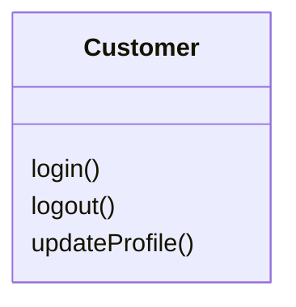
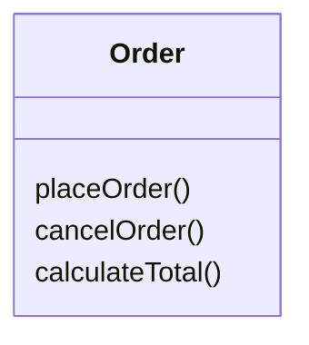
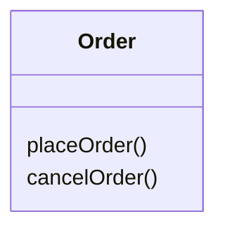
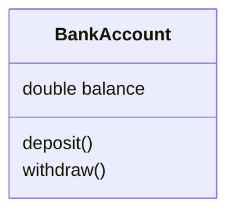
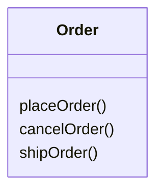
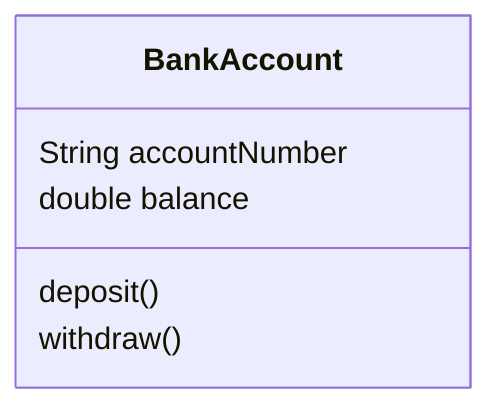
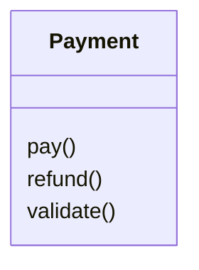

# UML Methods / Operations

## 1. What is a Method / Operation?

A UML **operation** represents behavior that a class can perform.

In Java, an operation corresponds roughly to a **method**.

For example, a `Customer` may be able to: Login, Logout, Update their profile.

```text
classDiagram
class Customer {
    login()
    logout()
    updateProfile()
}
```



**Mental model:**

```text
Class
  ↓
Behavior
  ↓
Methods / Operations
```

---

## 2. Basic Method Syntax

The simplest UML method notation is:

```text
methodName()
```

Examples:

```text
login()
logout()
placeOrder()
cancelOrder()
calculateTotal()
```

```text
classDiagram
    class Order {
        placeOrder()
        cancelOrder()
        calculateTotal()
    }
```



At this stage, we're only using the basic method name notation. Parameters, return types, and visibility are introduced separately.

---

## 3. Method vs. Java Method

A UML operation maps roughly to a Java method.

**UML:**

```text
classDiagram
    class Order {
        placeOrder()
        cancelOrder()
    }
```



**Java:**

```java
class Order {
    void placeOrder() {
    }
    void cancelOrder() {
    }
}
```

**Mapping:**

| UML | Java |
|---|---|
| Operation | Method |
| `placeOrder()` | `void placeOrder()` |
| `cancelOrder()` | `void cancelOrder()` |

The UML diagram focuses on the *design*, while Java contains the actual *implementation*.

---

## 4. Methods Represent Behavior

Recall the basic structure of a UML class:

```text
Class
├── Attributes → Data / State
└── Methods    → Behavior
```

```text
classDiagram
    class BankAccount {
        double balance
        deposit()
        withdraw()
    }
```



Here:

```text
balance
  ↓
State
```

```text
deposit()
withdraw()
  ↓
Behavior
```

**Attributes** describe what an object *has*, while **methods** describe what an object *can do*.

---

## 5. Methods and Business Behavior

In LLD, methods often represent meaningful operations or business behavior.

```text
classDiagram
    class Order {
        placeOrder()
        cancelOrder()
        shipOrder()
    }
```



These methods communicate the capabilities of the `Order` object.

Conceptually:

```text
Order
├── placeOrder()
├── cancelOrder()
└── shipOrder()
```

The class is therefore expressing the behavior it owns.

---

## 6. Methods in a Real-World Example

Consider a bank account. It has `balance`, and can perform `deposit()` and `withdraw()`.

```text
classDiagram
    class BankAccount {
        double balance
        deposit()
        withdraw()
    }
```


The attribute represents state:

```text
balance
```

The operations represent behavior:

```text
deposit()
withdraw()
```

---

## 7. Methods vs. Attributes

This distinction is extremely important for LLD.

| Attribute | Method |
|---|---|
| Represents data | Represents behavior |
| Represents state | Represents an operation |
| Usually a field in Java | Method in Java |
| Example: `balance` | Example: `withdraw()` |

```text
classDiagram
    class BankAccount {
        String accountNumber
        double balance
        deposit()
        withdraw()
    }
```



The class can be mentally divided as:

```text
┌──────────────────────────┐
│       BankAccount        │
├──────────────────────────┤
│ String accountNumber     │
│ double balance           │
├──────────────────────────┤
│ deposit()                │
│ withdraw()                │
└──────────────────────────┘
```

---

## 8. Methods and Responsibilities

Methods are also useful for understanding the responsibility of a class.

```text
classDiagram
    class Order {
        placeOrder()
        cancelOrder()
        shipOrder()
    }
```


From this, we can start understanding that `Order` is responsible for operations related to its lifecycle.

This idea becomes important later when we study:

- Encapsulation
- Responsibility-driven design
- SOLID
- LLD class design

For now, the important concept is simply: **methods represent the behavior/responsibilities provided by a class.**

---

## 9. Practice

**Question**

Create a UML class named `Payment` with these operations: `pay()`, `refund()`, `validate()`.

**Solution**

```text
classDiagram
    class Payment {
        pay()
        refund()
        validate()
    }
```



Conceptually:

```text
┌─────────────────────┐
│       Payment       │
├─────────────────────┤
│                     │
├─────────────────────┤
│ pay()               │
│ refund()            │
│ validate()          │
└─────────────────────┘
```

---

## 10. Practice — Identify Data vs. Behavior

Consider the following:

```text
Customer
├── Long id
├── String name
├── login()
└── logout()
```

Identify which are attributes and which are methods.

**Solution**

**Attributes:**

```text
Long id
String name
```

These represent the data/state of the `Customer`.

**Methods:**

```text
login()
logout()
```

These represent the behavior of the `Customer`.

---

## 11. Current UML Method Syntax

For this step, the notation we learned is:

```text
methodName()
```

Examples:

```text
login()
logout()
placeOrder()
cancelOrder()
refund()
```

We have not yet introduced:

- Method parameters
- Return types
- Visibility
- Static methods
- Abstract methods
- Constructors
- Generic methods

These will be covered separately.

---

## 12. Mermaid Syntax

```text
classDiagram
    class Customer {
        login()
        logout()
        updateProfile()
    }
```


Another example:

```text
classDiagram
class Order {
    placeOrder()
    cancelOrder()
    shipOrder()
}
```


General pattern:

```text
classDiagram
    class ClassName {
        methodName()
        methodName()
    }
```

---

## 13. Java Mapping

The UML:

```text
classDiagram
    class Payment {
        pay()
        refund()
        validate()
    }
```


translates conceptually into:

```java
class Payment {
    void pay() {
    }

    void refund() {
    }

    void validate() {
    }
}
```

Again:

```text
UML Operation
  ↓
Java Method
```

The UML does not necessarily show the complete Java implementation.

---

## 14. Key Takeaways

1. A UML operation represents behavior.
2. In Java, an operation maps roughly to a method.
3. The basic syntax is `methodName()`.
4. Examples: `login()`, `placeOrder()`, `cancelOrder()`, `refund()`.
5. Attributes represent data/state.
6. Methods represent behavior.
7. Methods can represent the responsibilities/capabilities of a class.
8. Parameters, return types, visibility, and advanced method notation are learned separately.

---

## 15. Final Mental Model

Think of a UML class as:

```text
                CLASS
                  │
        ┌─────────┴─────────┐
        │                   │
      STATE               BEHAVIOR
        │                   │
    Attributes            Methods
        │                   │
    id, name          login(), logout()
```

Or simply:

```text
Class
├── Attributes → What the object HAS
└── Methods    → What the object CAN DO
```

**UML Operation / Method = behavior that a class provides.**