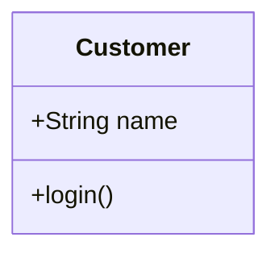
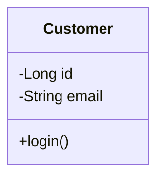
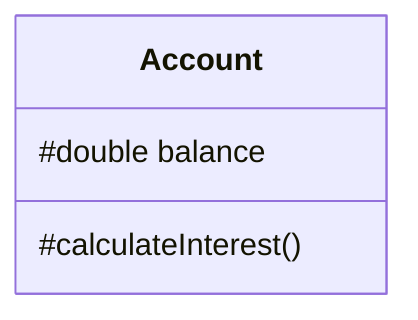
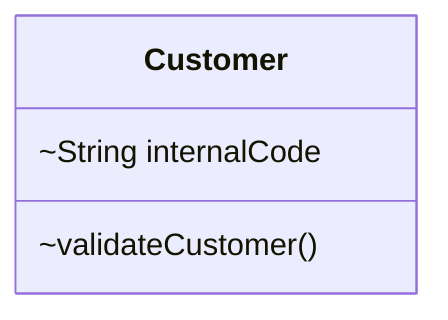
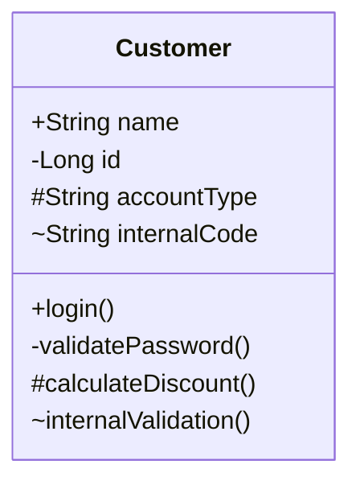
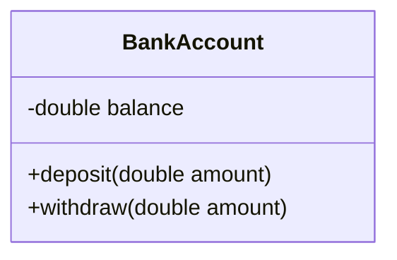
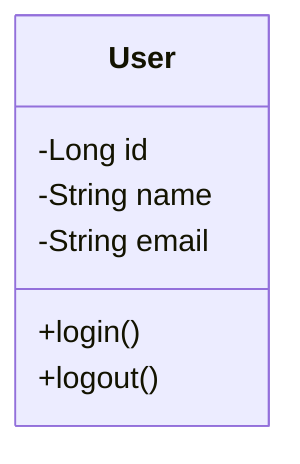
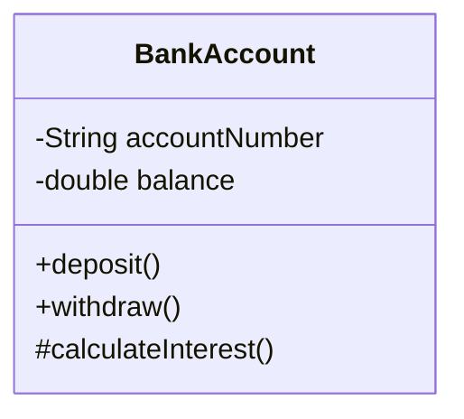
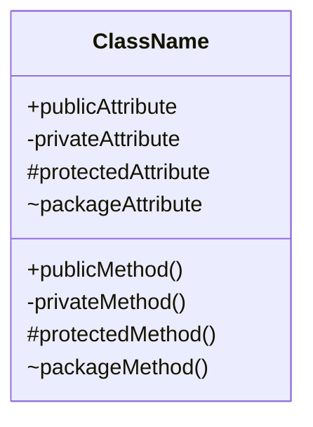

# UML Visibility

## 1. What is UML Visibility?

**Visibility** defines who can access an attribute or method of a class.

In UML class diagrams, visibility is represented using symbols placed before an attribute or method.

The four commonly used visibility levels are:

| UML Symbol | Visibility | Java Equivalent |
|---|---|---|
| `+` | Public | `public` |
| `-` | Private | `private` |
| `#` | Protected | `protected` |
| `~` | Package | Package-private / default |

Visibility is especially important in LLD because it helps us model **encapsulation** and control how classes interact with each other.

---

## 2. Visibility Symbols

The general UML syntax is:

```text
visibility name
```

For example:

```text
+String name
-Long id
#double balance
~String internalCode
```

For methods:

```text
+login()
-validatePassword()
#calculateInterest()
~internalValidation()
```

---

## 3. Public Visibility `+`

The `+` symbol represents **public** visibility.

A public member can be accessed from outside the class.

```text
classDiagram
    class Customer {
        +String name
        +login()
    }
```



**Java equivalent:**

```java
class Customer {
    public String name;

    public void login() {
    }
}
```

This means:

- `name` is public
- `login()` is public

Public members can be accessed by other classes.

---

## 4. Private Visibility `-`

The `-` symbol represents **private** visibility.

A private member can only be accessed directly within the class itself.

```text
classDiagram
class Customer {
    -Long id
    -String email
    +login()
}
```



**Java equivalent:**

```java
class Customer {
    private Long id;
    private String email;

    public void login() {
    }
}
```

Here:

- `id` is private
- `email` is private
- `login()` is public

Private attributes are very common in well-designed Java classes because they support encapsulation.

---

## 5. Protected Visibility `#`

The `#` symbol represents **protected** visibility.

In Java, a protected member can be accessed:

- Within the same class
- By subclasses
- By classes in the same package

```text
classDiagram
    class Account {
        #double balance

        #calculateInterest()
    }
```



**Java equivalent:**

```java
class Account {
    protected double balance;

    protected void calculateInterest() {
    }
}
```

Protected visibility is particularly relevant when inheritance is involved.

---

## 6. Package Visibility `~`

The `~` symbol represents **package** visibility.

In Java, this corresponds to package-private / default visibility — no explicit access modifier is written.

```text
classDiagram
    class Customer {
        ~String internalCode

        ~validateCustomer()
    }
```



**Java equivalent:**

```java
class Customer {
    String internalCode;

    void validateCustomer() {
    }
}
```

These members are accessible from classes within the same package.

---

## 7. Complete Visibility Example

We can combine all four visibility levels in one class.

```text
classDiagram
    class Customer {
        +String name
        -Long id
        #String accountType
        ~String internalCode

        +login()
        -validatePassword()
        #calculateDiscount()
        ~internalValidation()
    }
```



| Member | Visibility |
|---|---|
| `name` | Public |
| `id` | Private |
| `accountType` | Protected |
| `internalCode` | Package |
| `login()` | Public |
| `validatePassword()` | Private |
| `calculateDiscount()` | Protected |
| `internalValidation()` | Package |

---

## 8. UML Visibility and Java

UML visibility maps naturally to Java access modifiers.

**UML:**

```text
+ → public
- → private
# → protected
~ → package-private
```

**Java:**

```java
public String name;

private Long id;

protected String accountType;

String internalCode;
```

The last one has no explicit Java access modifier, so it has package-private/default visibility.

---

## 9. Visibility and Encapsulation

Visibility is strongly connected to **encapsulation**.

Encapsulation means:

> Keep an object's internal state controlled, and expose only what other objects actually need.

For example, consider a bank account. We generally don't want other classes directly modifying the `balance`.

**Instead of:**

```java
class BankAccount {
    public double balance;
}
```

**we use:**

```java
class BankAccount {
    private double balance;

    public void deposit(double amount) {
        balance += amount;
    }

    public void withdraw(double amount) {
        balance -= amount;
    }
}
```

Now external classes cannot directly modify `balance` — they interact with the object through controlled operations.

---

## 10. UML Representation of Encapsulation

The same design can be represented using UML.

```text
classDiagram
    class BankAccount {
        -double balance

        +deposit(double amount)
        +withdraw(double amount)
    }
```



The important idea is:

```text
                BankAccount
                    │
        ┌───────────┴───────────┐
        │                       │
   - balance              + deposit()
                           + withdraw()
```

`balance` is hidden. `deposit()` and `withdraw()` provide controlled access.

This is one of the most important ideas behind object-oriented design.

---

## 11. Why Private Attributes Are Common in LLD

In LLD, we frequently see classes designed like this:

```text
classDiagram
    class User {
        -Long id
        -String name
        -String email

        +login()
        +logout()
    }
```



The object's internal state is private while meaningful operations are exposed publicly. This creates a boundary between:

**Internal implementation:**

```text
- id
- name
- email
```

**Public behavior:**

```text
+ login()
+ logout()
```

Other classes don't need to know how the internal implementation works — they only need to know what operations are available.

---

## 12. Visibility Is Not Just Syntax

When designing an LLD, visibility should represent an intentional design decision.

For example:

```text
- balance
+ withdraw()
```

communicates more than just Java syntax. It communicates:

> "The balance is internal state. Other objects should not directly manipulate it. They should ask the `BankAccount` to perform an operation."

This is an important difference between simply writing Java code and actually *designing* an object-oriented system.

---

## 13. Practice

**Question**

Design a `BankAccount` class using UML. It should contain:

**Attributes**

- `accountNumber` → private
- `balance` → private

**Methods**

- `deposit()` → public
- `withdraw()` → public
- `calculateInterest()` → protected

Represent the class using a Mermaid class diagram.

**Solution**

```text
classDiagram
    class BankAccount {
        -String accountNumber
        -double balance

        +deposit()
        +withdraw()
        #calculateInterest()
    }
```



**Visibility breakdown:**

| Member | Visibility |
|---|---|
| `accountNumber` | Private |
| `balance` | Private |
| `deposit()` | Public |
| `withdraw()` | Public |
| `calculateInterest()` | Protected |

The design hides the account's internal state while exposing operations that other objects can use.

---

## 14. Mermaid Syntax

The basic syntax for visibility is:

```text
classDiagram
    class ClassName {
        +publicAttribute
        -privateAttribute
        #protectedAttribute
        ~packageAttribute

        +publicMethod()
        -privateMethod()
        #protectedMethod()
        ~packageMethod()
    }
```



---

## 15. Visibility Cheat Sheet

```text
┌────────┬─────────────────┬──────────────────────────┐
│ Symbol │ UML Visibility  │ Java                     │
├────────┼─────────────────┼──────────────────────────┤
│   +    │ Public          │ public                   │
│   -    │ Private         │ private                  │
│   #    │ Protected       │ protected                │
│   ~    │ Package         │ package-private/default  │
└────────┴─────────────────┴──────────────────────────┘
```

Easy memory trick:

```text
+ → Public
- → Private
# → Protected
~ → Package
```

---

## 16. Key Takeaways

1. **Visibility controls accessibility:**

    ```text
    + → public
    - → private
    # → protected
    ~ → package-private
    ```

2. **UML visibility maps to Java access modifiers** — UML can describe the intended accessibility of a class's attributes and operations before implementation.

3. **Private state + public behavior is common** — a class often hides its internal data and exposes controlled operations.

4. **Visibility supports encapsulation.** For example:

    ```text
    -private state
    +public operations
    ```

    is a common object-oriented design.

5. **Visibility is a design decision.** When creating an LLD, ask: *"Who actually needs access to this member?"* — rather than making everything public.

---

## 17. LLD Mental Model

When designing a class, think:

```text
                Class
                  │
        ┌─────────┴─────────┐
        │                   │
      State               Behavior
    Attributes            Methods
        │                   │
     Usually               Expose
     private             required API
```

For example:

```text
classDiagram
    class BankAccount {
        -double balance

        +deposit(double amount)
        +withdraw(double amount)
    }
```


The class owns its state and controls how that state changes.

That is the core connection between UML visibility, Java access modifiers, and encapsulation.