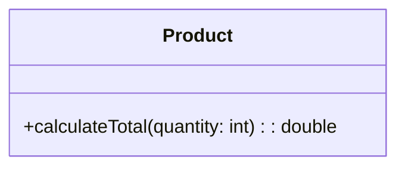
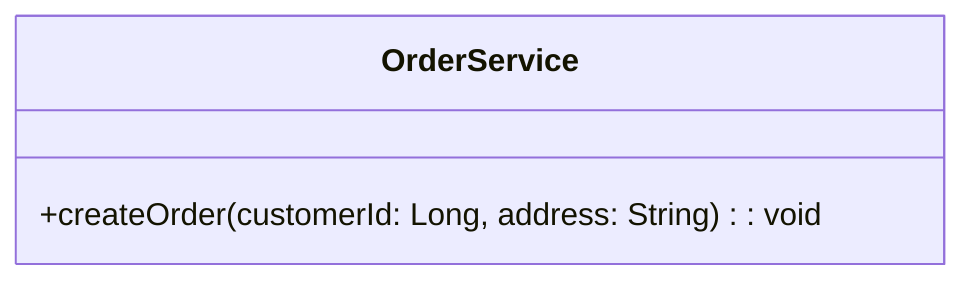
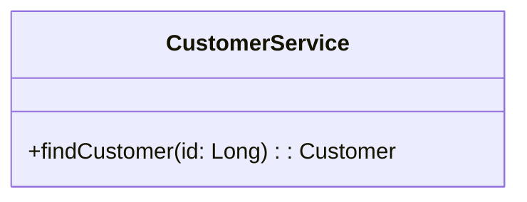
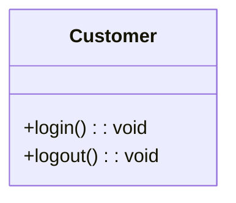
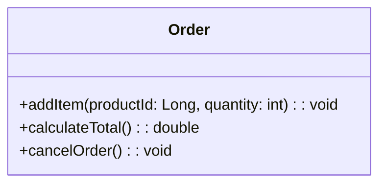
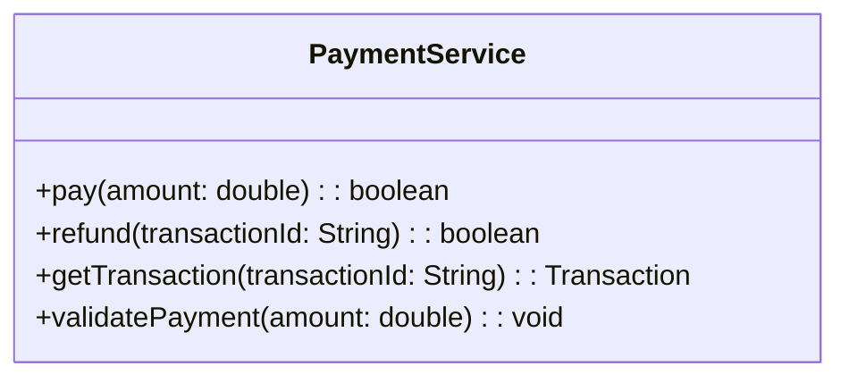
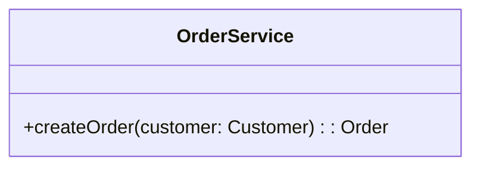
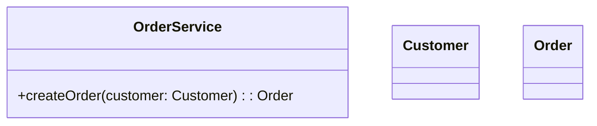
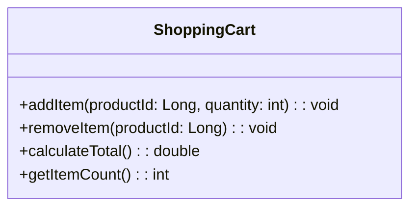

# UML Method Parameters & Return Types

## 1. Introduction

In UML class diagrams, methods can contain:

- Method name
- Visibility
- Parameters
- Parameter types
- Return type

Previously, we learned to represent methods like:

```text
+login()
+logout()
+calculateTotal()
```

This tells us the methods exist, but not what input they require or what they return. UML lets us represent this information too.

---

## 2. UML Method Syntax

The general UML syntax is:

```text
visibility methodName(parameterName: Type): ReturnType
```

For example:

```text
+calculateTotal(quantity: int): double
```

**Breakdown:**

```text
+calculateTotal(quantity: int): double
│              │        │       │
│              │        │       └── return type
│              │        └── parameter type
│              └── parameter name
└── visibility, then method name
```

So `+calculateTotal(quantity: int): double` means:

- `+` → public
- `calculateTotal` → method name
- `quantity` → parameter name
- `int` → parameter type
- `double` → return type

---

## 3. Simple Parameter

Consider this Java method:

```java
double calculateTotal(int quantity)
```

The UML representation is:

```text
+calculateTotal(quantity: int): double
```

```text
classDiagram
    class Product {
        +calculateTotal(quantity: int): double
    }
```



**Java ↔ UML:**

```text
Java: double calculateTotal(int quantity)
UML:  +calculateTotal(quantity: int): double
```

The important difference is that UML places the parameter type *after* the parameter name.

---

## 4. Multiple Parameters

Consider this Java method:

```java
void createOrder(Long customerId, String address)
```

**UML representation:**

```text
+createOrder(customerId: Long, address: String): void
```

```text
classDiagram
    class OrderService {
        +createOrder(customerId: Long, address: String): void
    }
```



Multiple parameters are separated by commas.

---

## 5. Return Type

The return type appears after the closing parenthesis.

```java
double calculateTotal()
```

```text
+calculateTotal(): double
```

Another example:

```java
Customer findCustomer(Long id)
```

```text
+findCustomer(id: Long): Customer
```

```text
classDiagram
    class CustomerService {
        +findCustomer(id: Long): Customer
    }
```



---

## 6. Void Return Type

If a Java method doesn't return anything:

```java
void login()
```

```text
+login(): void
```

```text
classDiagram
    class Customer {
        +login(): void
        +logout(): void
    }
```



`void` represents that the operation does not return a value.

---

## 7. Complete Example

Consider this Java class:

```java
class Order {

    public void addItem(Long productId, int quantity) {
    }

    public double calculateTotal() {
        return 0;
    }

    public void cancelOrder() {
    }

}
```

**UML representation:**

```text
classDiagram
    class Order {
        +addItem(productId: Long, quantity: int): void
        +calculateTotal(): double
        +cancelOrder(): void
    }
```



The UML diagram now communicates method names, visibility, parameters, parameter types, and return types.

---

## 8. How to Read a UML Method

Consider:

```text
+addItem(productId: Long, quantity: int): void
```

Read it as:

> A public method called `addItem` accepts a `Long productId` and an `int quantity`, and returns nothing.

Consider:

```text
+calculateTotal(): double
```

Read it as:

> A public method called `calculateTotal` accepts no parameters and returns a `double`.

---

## 9. Parameter Type vs. Return Type

This distinction is important.

Consider:

```text
+findProduct(id: Long): Product
```

There are two types here:

```text
+findProduct(id: Long): Product
              │             │
              │             └── return type
              └── parameter type
```

The method receives a `Long` and returns a `Product`.

```text
findProduct(id: Long): Product

Input  → Long
Output → Product
```

---

## 10. Multiple Methods Example

Consider a payment service:

```text
classDiagram
    class PaymentService {
        +pay(amount: double): boolean
        +refund(transactionId: String): boolean
        +getTransaction(transactionId: String): Transaction
        +validatePayment(amount: double): void
    }
```



| Method | Parameters | Return Type |
|---|---|---|
| `pay()` | `amount: double` | `boolean` |
| `refund()` | `transactionId: String` | `boolean` |
| `getTransaction()` | `transactionId: String` | `Transaction` |
| `validatePayment()` | `amount: double` | `void` |

---

## 11. Custom Classes as Types

Parameter and return types don't have to be primitive Java types — they can also be custom classes.

```java
Order createOrder(Customer customer)
```

```text
+createOrder(customer: Customer): Order
```

```text
classDiagram
    class OrderService {
        +createOrder(customer: Customer): Order
    }
```



Here `Customer` is the parameter type and `Order` is the return type. This is very common in LLD because domain objects frequently interact with one another.

---

## 12. Parameters and Return Types Can Reveal Dependencies

```text
classDiagram
    class OrderService {
        +createOrder(customer: Customer): Order
    }

class Customer
class Order
```



Even without explicitly drawing a relationship, we can see that `OrderService` works with `Customer` and `Order`. The method signature itself gives us useful information about how classes interact.

Later, when we study UML relationships and dependencies, this becomes especially important.

---

## 13. UML → Java Mapping

| UML | Java |
|---|---|
| `+` | `public` |
| `-` | `private` |
| `#` | `protected` |
| `~` | package-private |
| `name: Type` | `Type name` |
| `: ReturnType` | Java return type |
| `method(): void` | `void method()` |
| `method(x: int): double` | `double method(int x)` |

**Parameter example**

```text
UML:  quantity: int
Java: int quantity
```

**Return type example**

```text
UML:  calculateTotal(): double
Java: double calculateTotal()
```

The important difference is that the position of the type is different.

---

## 14. Complete UML Example

```text
classDiagram
    class ShoppingCart {
        +addItem(productId: Long, quantity: int): void
        +removeItem(productId: Long): void
        +calculateTotal(): double
        +getItemCount(): int
    }
```



This diagram communicates the complete method contracts of `ShoppingCart`. For example, `+addItem(productId: Long, quantity: int): void` means:

```text
Visibility   → public
Method       → addItem
Parameter 1  → productId: Long
Parameter 2  → quantity: int
Return type  → void
```

---

## 15. Practice

**Question**

Create a UML class diagram for `ShoppingCart`. It should have the following methods, all public:

1. `addItem(productId: Long, quantity: int)` → returns `void`
2. `removeItem(productId: Long)` → returns `void`
3. `calculateTotal()` → returns `double`
4. `getItemCount()` → returns `int`

**Solution**

```text
classDiagram
    class ShoppingCart {
        +addItem(productId: Long, quantity: int): void
        +removeItem(productId: Long): void
        +calculateTotal(): double
        +getItemCount(): int
    }
```


**Java equivalent:**

```java
class ShoppingCart {

    public void addItem(Long productId, int quantity) {
    }

    public void removeItem(Long productId) {
    }

    public double calculateTotal() {
        return 0;
    }

    public int getItemCount() {
        return 0;
    }

}
```

---

## 16. Important UML Syntax

**No parameters**

```text
+login(): void
```

**One parameter**

```text
+withdraw(amount: double): boolean
```

**Multiple parameters**

```text
+createOrder(customerId: Long, address: String): void
```

**Custom return type**

```text
+findUser(id: Long): User
```

**Custom parameter type**

```text
+createOrder(customer: Customer): Order
```

---

## 17. Method Syntax Cheat Sheet

```text
+method(): ReturnType
+method(parameterName: Type): ReturnType
+method(first: Type1, second: Type2): ReturnType
```

Examples:

```text
+login(): void
+getBalance(): double
+withdraw(amount: double): boolean
+findUser(id: Long): User
+createOrder(user: User, product: Product): Order
```

---

## 18. Mental Model

Think of a UML operation as:

```text
                    Method
                      │
        ┌─────────────┼─────────────┐
        │              │              │
   Visibility      Parameters     Return Type
        │              │              │
        +          name: type     ReturnType
```

Or more simply:

```text
+methodName(parameterName: Type): ReturnType
│              │                    │
│              │                    └── Output
│              └── Input
└── Visibility
```

---

## 19. Key Takeaways

1. **UML parameters use `name: Type`:**

    ```text
    quantity: int
    customer: Customer
    amount: double
    ```

2. **Return type comes after `)`:**

    ```text
    calculateTotal(): double
    findUser(id: Long): User
    ```

3. **Multiple parameters are comma-separated:**

    ```text
    createOrder(customerId: Long, address: String): void
    ```

4. **Return types can be custom classes:**

    ```text
    findOrder(id: Long): Order
    ```

5. **Parameters can also be custom classes:**

    ```text
    createOrder(customer: Customer): Order
    ```

6. **UML describes the method contract.** A method signature tells us:
    - Who can access it
    - What it's called
    - What input it accepts
    - What output it produces

---

## 20. LLD Perspective

Method signatures are important in LLD because they help us understand how objects communicate.

```text
classDiagram
    class OrderService {
        +createOrder(customer: Customer): Order
    }

    class Customer
    class Order
```


From this method alone, we can understand:

```text
Customer     → input
Order        → output
OrderService → performs the operation
```

This becomes increasingly useful when we start modeling dependencies and relationships between classes.