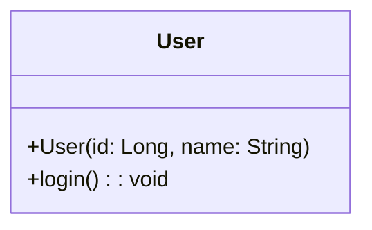
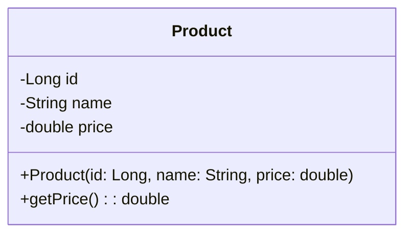
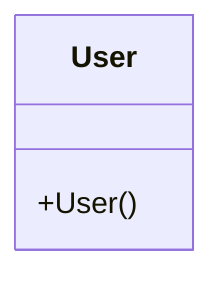
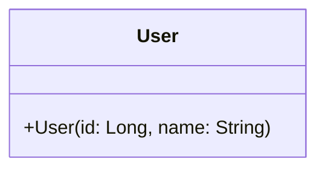
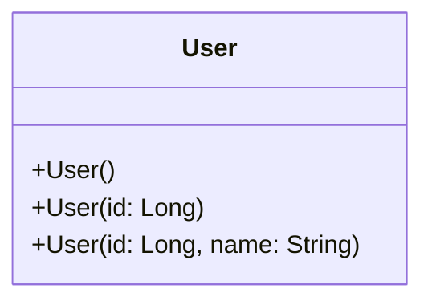
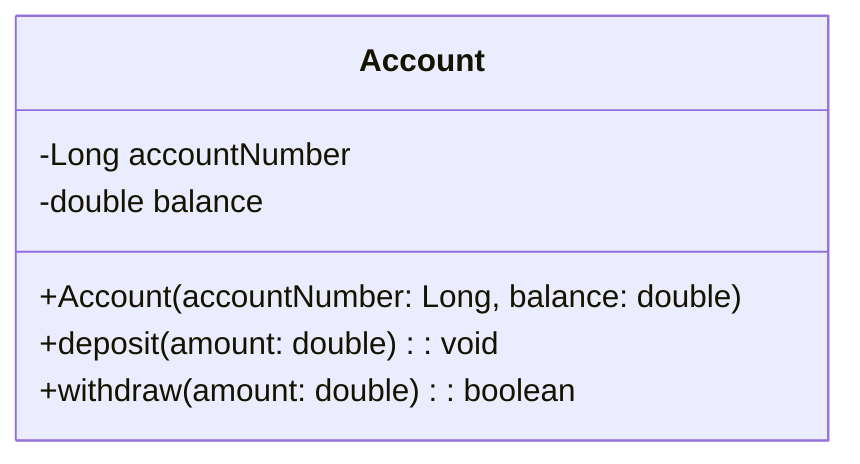
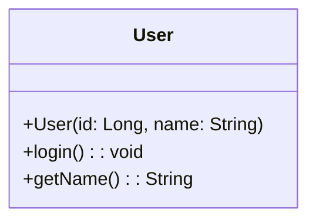
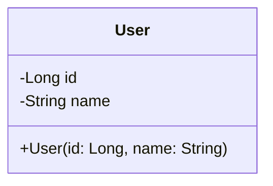
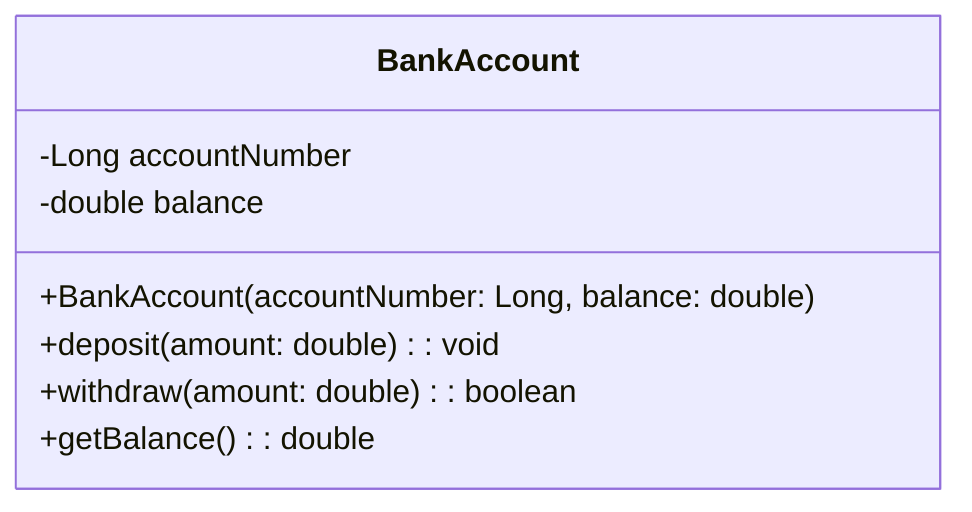

# UML Constructors

## 1. Introduction

A **constructor** is a special operation used to create and initialize an object.

For example, in Java:

```java
class User {

    private Long id;
    private String name;

    public User(Long id, String name) {
        this.id = id;
        this.name = name;
    }

}
```

When we write:

```java
new User(101L, "Shivraj");
```

a `User` object is created and initialized using the constructor.

---

## 2. Constructor vs. Normal Method

A constructor is different from a normal method.

| Constructor | Method |
|---|---|
| Initializes an object | Performs behavior |
| Same name as class in Java | Can have any valid name |
| Has no return type | Has a return type, including `void` |
| Called during object creation | Called to perform an operation |
| `new User(...)` | `user.login()` |

Example:

```java
class User {

    public User(Long id, String name) {
        // Constructor
    }

    public void login() {
        // Normal method
    }

}
```

---

## 3. How is a Constructor Represented in UML?

A constructor is represented as an operation inside the class. A common UML notation is to use the class name as the operation name.

```text
classDiagram
    class User {
        +User(id: Long, name: String)
        +login(): void
    }
```



Here, `+User(id: Long, name: String)` represents the constructor, and `+login(): void` represents a normal method.

---

## 4. Constructor Has No Return Type

Previously, we learned that a normal UML method follows:

```text
visibility methodName(parameters): ReturnType
```

For example:

```text
+login(): void
+findUser(id: Long): User
```

A constructor is different:

```text
+User(id: Long, name: String)
```

Notice there is no `: ReturnType` — constructors do not have a return type.

**Comparison:**

```text
Normal method: +findUser(id: Long): User
Constructor:   +User(id: Long, name: String)
```

The constructor has parameters but no return type.

---

## 5. Constructor Example

Consider this Java class:

```java
class Product {

    private Long id;
    private String name;
    private double price;

    public Product(Long id, String name, double price) {
        this.id = id;
        this.name = name;
        this.price = price;
    }

    public double getPrice() {
        return price;
    }

}
```

**The UML representation is:**

```text
classDiagram
class Product {
    -Long id
    -String name
    -double price

    +Product(id: Long, name: String, price: double)
    +getPrice(): double
}
```



Here `Product(...)` is the constructor, and `getPrice()` is a normal method.

---

## 6. No-Argument Constructor

A constructor doesn't necessarily need parameters.

**Java:**

```java
class User {
    public User() {
    }
}
```

**UML:**

```text
+User()
```

```text
classDiagram
    class User {
        +User()
    }
```



This represents a no-argument constructor.

---

## 7. Constructor with Parameters

**Java:**

```java
class User {
    public User(Long id, String name) {
        this.id = id;
        this.name = name;
    }
}
```

**UML:**

```text
+User(id: Long, name: String)
```

```text
classDiagram
    class User {
        +User(id: Long, name: String)
    }
```



The constructor accepts `id: Long` and `name: String`.

---

## 8. Multiple Constructors

Java supports constructor overloading.

```java
class User {
    public User() {
    }

    public User(Long id) {
        this.id = id;
    }
    public User(Long id, String name) {
        this.id = id;
        this.name = name;
    }
}
```

UML can represent all three constructors:

```text
classDiagram
class User {
    +User()
    +User(id: Long)
    +User(id: Long, name: String)
}
```



This communicates that the class supports multiple ways of creating a `User` object.

---

## 9. Constructor Visibility

Constructors can also have visibility. The same visibility symbols we learned previously apply here.

| Symbol | Visibility |
|---|---|
| `+` | Public |
| `-` | Private |
| `#` | Protected |
| `~` | Package |

**Public constructor**

```text
+User()
```

```java
public User() {
}
```

**Private constructor**

```text
-User()
```

```java
private User() {
}
```

**Protected constructor**

```text
#User()
```

```java
protected User() {
}
```

**Package-private constructor**

```text
~User()
```

```java
User() {
}
```

---

## 10. Constructor + Attributes

A common LLD class contains: attributes representing state, a constructor initializing that state, and methods representing behavior.

```text
classDiagram
    class Account {
        -Long accountNumber
        -double balance

        +Account(accountNumber: Long, balance: double)
        +deposit(amount: double): void
        +withdraw(amount: double): boolean
    }
```



We can divide the class into three conceptual parts:

**State**

```text
-accountNumber
-balance
```

**Constructor**

```text
+Account(accountNumber: Long, balance: double)
```

**Behavior**

```text
+deposit(amount: double): void
+withdraw(amount: double): boolean
```

This is a very common pattern in object-oriented design.

---

## 11. UML → Java

Consider this UML constructor:

```text
+Account(accountNumber: Long, balance: double)
```

It maps to:

```java
public Account(Long accountNumber, double balance) {
    this.accountNumber = accountNumber;
    this.balance = balance;
}
```

The design flow is:

```text
UML Design
  ↓
+Account(accountNumber: Long, balance: double)
  ↓
Java Implementation
  ↓
public Account(Long accountNumber, double balance)
```

---

## 12. Constructor vs. Method in UML

```text
classDiagram
class User {
    +User(id: Long, name: String)
    +login(): void
    +getName(): String
}
```



There are three operations shown:

```text
User(id: Long, name: String) → Constructor
login(): void                → Normal method
getName(): String            → Normal method
```

The constructor `+User(id: Long, name: String)` does not have a return type. The normal methods do: `+login(): void`, `+getName(): String`.

---

## 13. Constructor and Object Creation

A constructor is related to object creation.

```java
User user = new User(101L, "Shivraj");
```

Conceptually:

```text
new
  ↓
User constructor
  ↓
User object
```

The UML class diagram describes the constructor that can be used to create that object:

```text
classDiagram
class User {
    -Long id
    -String name

    +User(id: Long, name: String)
}
```



---

## 14. Practice

**Question**

Create a UML class diagram for a `BankAccount`. It should contain:

**Attributes**

- `accountNumber` → private `Long`
- `balance` → private `double`

**Constructor**

A public constructor accepting `accountNumber: Long` and `balance: double`.

**Methods**

- `deposit(amount: double)` → public, returns `void`
- `withdraw(amount: double)` → public, returns `boolean`
- `getBalance()` → public, returns `double`

**Solution**

```text
classDiagram
    class BankAccount {
        -Long accountNumber
        -double balance

        +BankAccount(accountNumber: Long, balance: double)
        +deposit(amount: double): void
        +withdraw(amount: double): boolean
        +getBalance(): double
    }
```



**Java equivalent:**

```java
class BankAccount {
    private Long accountNumber;
    private double balance;

    public BankAccount(Long accountNumber, double balance) {
        this.accountNumber = accountNumber;
        this.balance = balance;
    }

    public void deposit(double amount) {
        balance += amount;
    }

    public boolean withdraw(double amount) {
        return true;
    }

    public double getBalance() {
        return balance;
    }
}
```

---

## 15. Important Constructor Syntax

**No-argument constructor**

```text
+User()
```

**Constructor with one parameter**

```text
+User(id: Long)
```

**Constructor with multiple parameters**

```text
+User(id: Long, name: String)
```

**Private constructor**

```text
-User()
```

**Protected constructor**

```text
#User()
```

**Package-private constructor**

```text
~User()
```

---

## 16. Constructor Cheat Sheet

```text
+ClassName()
```
No-argument public constructor.

```text
+ClassName(id: Long)
```
Public constructor with one parameter.

```text
+ClassName(id: Long, name: String)
```
Public constructor with multiple parameters.

```text
-ClassName()
```
Private constructor.

```text
#ClassName()
```
Protected constructor.

```text
~ClassName()
```
Package-private constructor.

**Most important rule:**

```text
Constructor = ClassName(parameters)

No return type.
```

---

## 17. UML Method vs. Constructor Cheat Sheet

| Feature | Constructor | Normal Method |
|---|---|---|
| Name | Class name | Any valid method name |
| Parameters | Optional | Optional |
| Return type | None | Required, including `void` |
| Purpose | Initialize object | Perform behavior |
| Example | `+User(id: Long)` | `+login(): void` |

---

## 18. LLD Perspective

When designing an LLD class, we often model:

```text
Class
│
├── Attributes  → Object state
├── Constructor → Object initialization
└── Methods     → Object behavior
```

```text
classDiagram
    class BankAccount {
        -Long accountNumber
        -double balance

        +BankAccount(accountNumber: Long, balance: double)
        +deposit(amount: double): void
        +withdraw(amount: double): boolean
        +getBalance(): double
    }
```


This gives us a high-level blueprint of: what data the object owns, how the object is initialized, and what operations the object exposes.

---

## 19. Key Takeaways

1. **Constructor initializes an object** — it is used when an object is created.

2. **Constructor uses the class name:**

    ```text
    +User(id: Long, name: String)
    ```

3. **Constructor has no return type.**

    Correct: `+User(id: Long)`
    Not: `+User(id: Long): void`

4. **Constructor visibility follows normal UML visibility:**

    ```text
    + → public
    - → private
    # → protected
    ~ → package-private
    ```

5. **Multiple constructors can be represented:**

    ```text
    classDiagram
    class User {
        +User()
        +User(id: Long)
        +User(id: Long, name: String)
    }
    ```

    ```mermaid
    classDiagram
    class User {
    +User()
    +User(id: Long)
    +User(id: Long, name: String)
    }
    ```

6. **Constructor + attributes + methods form an important class blueprint:**

    ```text
    Class
    ├── State
    ├── Initialization
    └── Behavior
    ```
