# UML Abstract Classes

## 1. What is an Abstract Class in UML?

An **abstract class** is a class that is intended to act as a base/general concept rather than being represented as a directly usable concrete class.

In UML, an abstract class is commonly represented using the stereotype `<<abstract>>`.

```text
classDiagram
    class Payment {
        <<abstract>>
        +pay()
    }
```

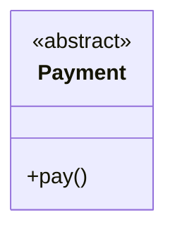

Here:

- `Payment` → class name
- `<<abstract>>` → indicates that the class is abstract
- `pay()` → operation defined by the abstract class

The important point from a UML perspective: **`<<abstract>>` tells us this class represents an abstract concept in the design.**

---

## 2. Abstract Class vs. Concrete Class

A **concrete class** represents a class that can be used as an actual implementation. An **abstract class** represents a generalized concept that is intended to be specialized.

```text
classDiagram
    class Payment {
        <<abstract>>

        +pay()
    }

    class CreditCardPayment {
        +pay()
    }

    class UPIPayment {
        +pay()
    }

    Payment <|-- CreditCardPayment
    Payment <|-- UPIPayment
```

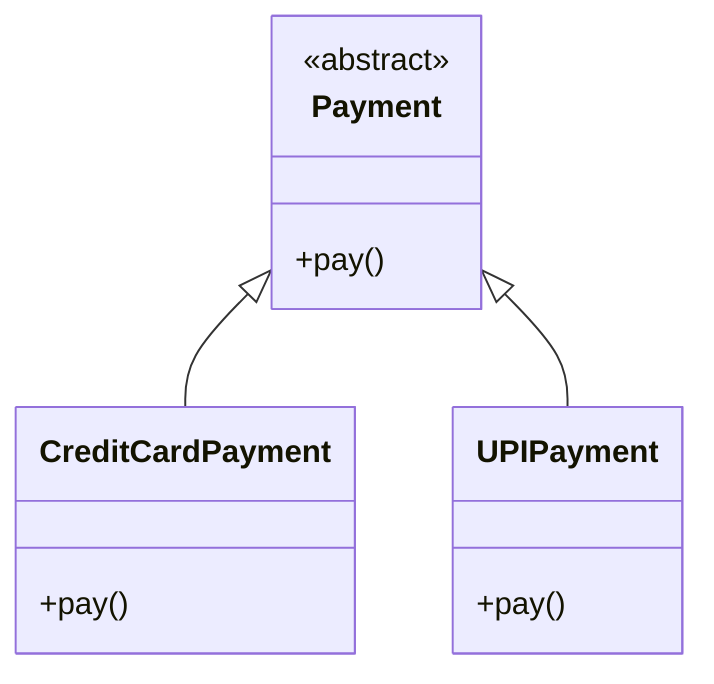

Visually:

```text
                Payment
               «abstract»
                   △
                  / \
                 /   \
                /     \
        CreditCard    UPI
         Payment      Payment
```

The diagram communicates:

- `Payment` is the generalized abstract concept.
- `CreditCardPayment` is a specialization.
- `UPIPayment` is another specialization.
- Both are connected to the abstract class.

The `<|--` relationship represents generalization/inheritance. We'll study generalization deeply in the relationships section.

---

## 3. How Mermaid Represents an Abstract Class

The basic Mermaid syntax is:

```text
classDiagram
    class ClassName {
        <<abstract>>
    }
```

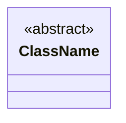

Example:

```text
classDiagram
    class Vehicle {
        <<abstract>>
    }
```

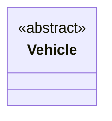

The important Mermaid syntax is `<<abstract>>`, placed inside the class definition.

---

## 4. Abstract Class with Attributes

An abstract class can also contain attributes.

```text
classDiagram
class Vehicle {
    <<abstract>>

    -String registrationNumber
    +start()
}
```

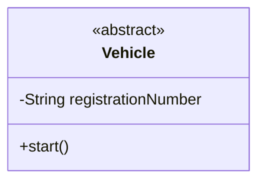

Here `Vehicle` is abstract, `registrationNumber` is an attribute, and `start()` is an operation.

The abstract nature of the class does not mean it cannot contain attributes or operations.

---

## 5. Abstract Class with Concrete Classes

A common LLD pattern is:

```text
Abstract concept
       ↓
Concrete implementations
```

```text
classDiagram
    class Vehicle {
        <<abstract>>

        -String registrationNumber
        +start()
    }

    class Car {
        +start()
    }

    class Bike {
        +start()
    }

    Vehicle <|-- Car
    Vehicle <|-- Bike
```

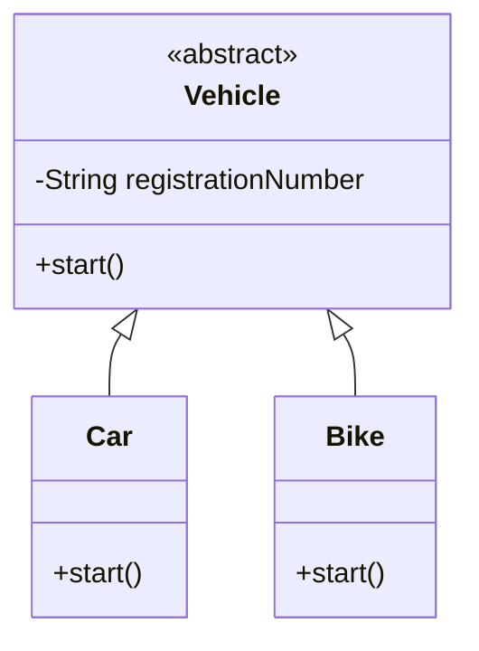

The diagram tells us:

```text
             Vehicle
            «abstract»
                △
               / \
              /   \
             /     \
           Car     Bike
```

The abstract class represents the common/general concept; the concrete classes represent specialized versions.

---

## 6. Abstract Class Can Contain Normal Operations

An abstract class can contain operations as part of the design.

```text
classDiagram
    class Notification {
        <<abstract>>

        +send()
        +validate()
    }

    class EmailNotification {
        +send()
    }
    class SMSNotification {
        +send()
    }

    Notification <|-- EmailNotification
    Notification <|-- SMSNotification
```

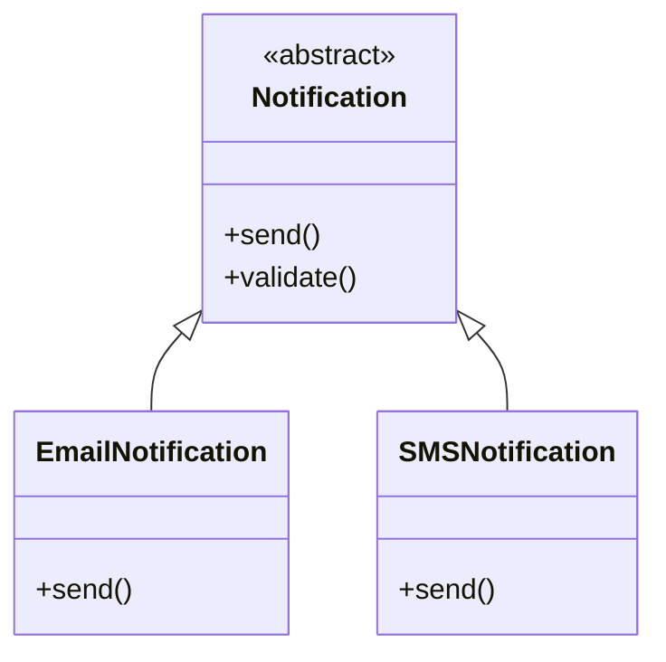

From the UML perspective, the important thing is that `Notification` is marked `<<abstract>>`, while `EmailNotification` and `SMSNotification` are concrete specializations.

---

## 7. Real-World Example — Notification System

Consider a notification system with different types: Email, SMS, Push Notification. Instead of treating every notification as completely unrelated, we can model the common concept as an abstract class.

```text
classDiagram
    class Notification {
        <<abstract>>
        +send()
    }

    class EmailNotification {
        +send()
    }
    class SMSNotification {
        +send()
    }
    class PushNotification {
        +send()
    }

    Notification <|-- EmailNotification
    Notification <|-- SMSNotification
    Notification <|-- PushNotification
```

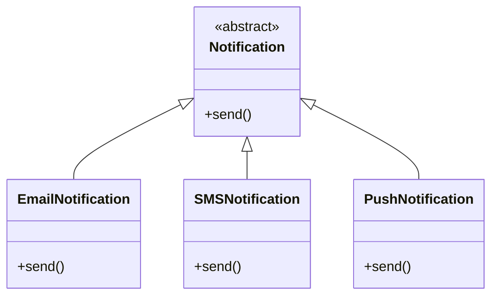

The UML communicates the hierarchy:

```text
                  Notification
                   «abstract»
                       △
                ┌──────┼──────┐
                │      │      │
              Email   SMS    Push
```

This is useful in LLD because the diagram makes the generalization hierarchy visible before implementation.

---

## 8. Abstract Class + Generalization

An abstract class is frequently used together with generalization.

```text
classDiagram
    class Employee {
        <<abstract>>
        
        -Long id
        -String name
        +work()
    }

    class Developer {
        +work()
    }
    class Manager {
        +work()
    }
    Employee <|-- Developer
    Employee <|-- Manager
```

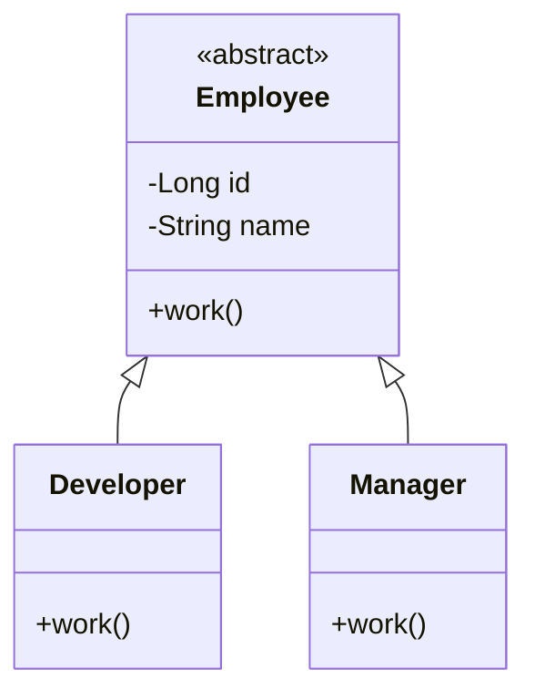

The structure is:

```text
              Employee
             «abstract»
                 △
                / \
               /   \
              /     \
        Developer   Manager
```

The relationship says: `Developer` is a type of `Employee`; `Manager` is a type of `Employee`. The exact meaning and notation of this relationship will be studied separately when we cover Generalization / Inheritance.

---

## 9. Abstract Class Does Not Mean "Only Abstract Methods"

A common misconception is: *abstract class = class containing only abstract operations.* That's **not** what the UML notation means.

The important UML distinction is that the **class itself** is abstract.

```text
classDiagram
    class Vehicle {
        <<abstract>>

        -String registrationNumber
        +start()
        +stop()
    }

    class Car {
        +start()
        +stop()
    }

    Vehicle <|-- Car
```

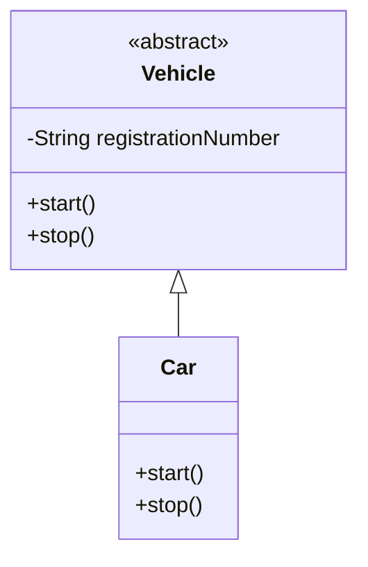

`Vehicle` contains an attribute, operations, *and* `<<abstract>>`. The key visual indicator is simply `<<abstract>>`.

---

## 10. Abstract Class Name in UML

In standard UML notation, abstract elements can also be represented using italicized names.

Conceptually:

```text
        Vehicle
       (italicized)
```

However, when using Mermaid, explicitly writing `<<abstract>>` is a clear and practical way to communicate the abstraction. For our Mermaid-based LLD diagrams, we'll use:

```text
classDiagram
class Vehicle {
    <<abstract>>
}
```


---

## 11. Abstract Class — Complete Example

Here is a complete UML example combining the concepts:

```text
classDiagram
    class Payment {
        <<abstract>>

        -Long transactionId
        +pay(amount: double): boolean
        +refund(): boolean
    }

    class CreditCardPayment {
        +pay(amount: double): boolean
        +refund(): boolean
    }
    class UPIPayment {
        +pay(amount: double): boolean
        +refund(): boolean
    }

    Payment <|-- CreditCardPayment
    Payment <|-- UPIPayment
```

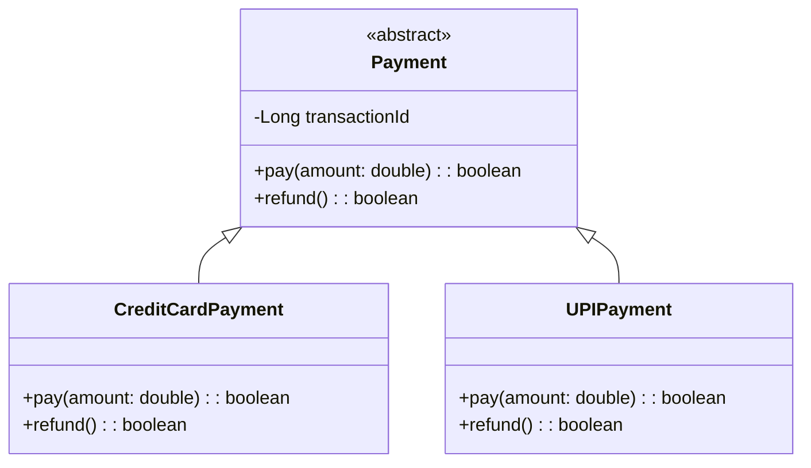

The diagram communicates:

- `Payment` is an abstract class.
- `transactionId` is an attribute.
- `pay()` and `refund()` are operations.
- `CreditCardPayment` specializes `Payment`.
- `UPIPayment` specializes `Payment`.

---

## 12. UML Mental Model

When you see:

```text
classDiagram
class Payment {
    <<abstract>>
}
```

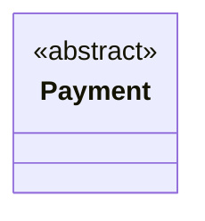

Think:

```text
Payment
   │
   └── General / Abstract Concept
```

When you see:

```text
classDiagram
class Payment {
    <<abstract>>
}

class UPIPayment
Payment <|-- UPIPayment
```

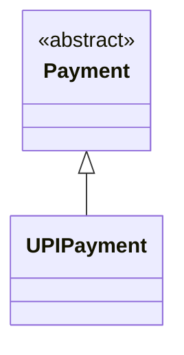

Think:

```text
        Payment
       «abstract»
           △
           │
       UPIPayment
```

The important thing is the visual relationship between the abstraction and its specializations.

---

## 13. Mermaid Syntax Cheat Sheet

**Abstract class**

```text
classDiagram
class Payment {
    <<abstract>>
}
```


**Abstract class with attributes**

```text
classDiagram
class Payment {
    <<abstract>>
    -Long id
    -double amount
}
```

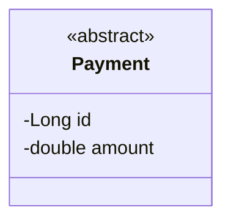

**Abstract class with operations**

```text
classDiagram
class Payment {
    <<abstract>>
    +pay()
    +refund()
}
```

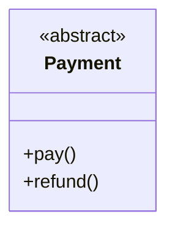

**Abstract class with concrete subclasses**

```text
classDiagram
class Payment {
    <<abstract>>
}

class CreditCardPayment
class UPIPayment
Payment <|-- CreditCardPayment
Payment <|-- UPIPayment
```

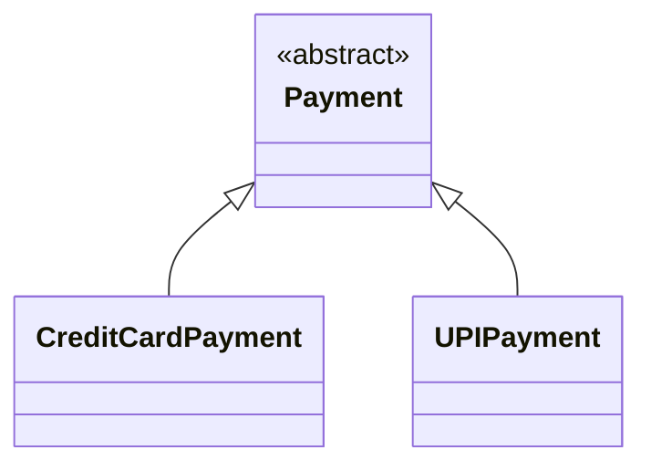


---

## 14. Practice Question 1

Create a UML class diagram for:

- `Animal` → abstract class
- `Dog` → concrete class
- `Cat` → concrete class
- `Animal` has `makeSound()`
- `Dog` has `makeSound()`
- `Cat` has `makeSound()`

**Solution**


```text
classDiagram
    class Animal {
        <<abstract>>

        +makeSound()
    }

    class Dog {
        +makeSound()
    }
    class Cat {
        +makeSound()
    }

    Animal <|-- Dog
    Animal <|-- Cat
```

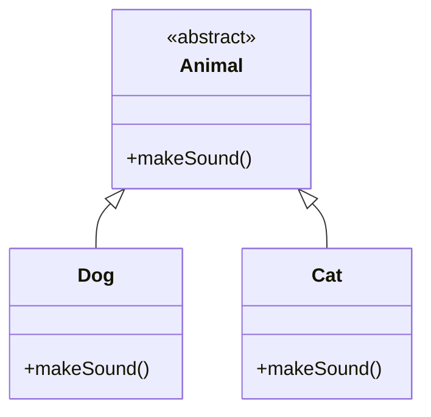

---

## 15. Practice Question 2

Create a UML diagram for a payment system:

- `Payment` → abstract
- `CreditCardPayment`
- `UPIPayment`
- `CashPayment`
- All three specialize `Payment`
- `Payment` contains `pay()`

**Solution**

```text
classDiagram
    class Payment {
        <<abstract>>
        +pay()
    }

    class CreditCardPayment {
        +pay()
    }
    class UPIPayment {
        +pay()
    }
    class CashPayment {
        +pay()
    }

    Payment <|-- CreditCardPayment
    Payment <|-- UPIPayment
    Payment <|-- CashPayment
```

```mermaid
classDiagram
    class Payment {
        <<abstract>>
        +pay()
    }

    class CreditCardPayment {
        +pay()
    }
    class UPIPayment {
        +pay()
    }
    class CashPayment {
        +pay()
    }

    Payment <|-- CreditCardPayment
    Payment <|-- UPIPayment
    Payment <|-- CashPayment
```

---

## 16. Practice Question 3

Create a UML diagram for:

- `Employee` → abstract
- `Developer`
- `Manager`
- `Tester`
- `Employee` has `id`
- `Employee` has `work()`
- All three are specializations of `Employee`

**Solution**

```text
classDiagram
    class Employee {
        <<abstract>>
        -Long id
        +work()
    }

    class Developer {
        +work()
    }

    class Manager {
        +work()
    }

    class Tester {
        +work()
    }

    Employee <|-- Developer
    Employee <|-- Manager
    Employee <|-- Tester
```

```mermaid
classDiagram
    class Employee {
        <<abstract>>

        -Long id
        +work()
    }

    class Developer {
        +work()
    }

    class Manager {
        +work()
    }

    class Tester {
        +work()
    }

    Employee <|-- Developer
    Employee <|-- Manager
    Employee <|-- Tester
```

---

## 17. Key Takeaways

1. An abstract class represents a generalized concept in UML.
2. Mermaid represents it using `<<abstract>>`.
3. An abstract class can contain attributes, operations, or both.
4. Abstract classes are commonly connected to concrete classes using generalization.
5. Mermaid generalization syntax: `Parent <|-- Child`.
6. The abstract class is normally placed above its concrete specializations for easy visual understanding.
7. `<<abstract>>` identifies the class as abstract.
8. Abstract class and generalization are closely related but not the same thing:
    - `<<abstract>>` describes the class.
    - `<|--` represents the relationship.
9. For LLD, abstract classes help communicate common/general concepts and their specialized implementations visually.

---

## Final Mental Model

The most important thing to remember from this step:

```text
              Abstract Concept
                     │
                «abstract»
                     │
              Generalization
                 /       \
                /         \
       Concrete Class   Concrete Class
```

In Mermaid:

```text
classDiagram
    class AbstractConcept {
        <<abstract>>
    }

    class ConcreteA
    class ConcreteB

    AbstractConcept <|-- ConcreteA
    AbstractConcept <|-- ConcreteB
```

```mermaid
classDiagram
    class AbstractConcept {
        <<abstract>>
    }

    class ConcreteA
    class ConcreteB
    
    AbstractConcept <|-- ConcreteA
    AbstractConcept <|-- ConcreteB
```

This is the core UML pattern for representing an abstract class and its concrete specializations.