# UML Interfaces

## 1. What is an Interface in UML?

In UML, an **interface** represents a contract that specifies operations that implementing classes are expected to provide.

The important UML notation is `<<interface>>`.

```text
classDiagram
    class PaymentService {
        <<interface>>
        +pay()
    }
```

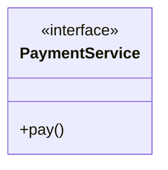

Here:

- `PaymentService` → interface name
- `<<interface>>` → identifies the element as an interface
- `pay()` → operation defined by the interface

From a UML perspective: **an interface describes a contract of behavior without modeling the concrete implementation inside the interface.**

---

## 2. Interface Notation

The most important Mermaid syntax for an interface is:

```text
classDiagram
    class InterfaceName {
        <<interface>>
        +operation()
    }
```

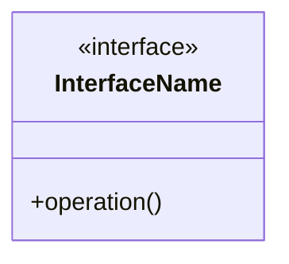

For example:

```text
classDiagram
    class PaymentService {
        <<interface>>
        +pay()
        +refund()
        +validate()
    }
```

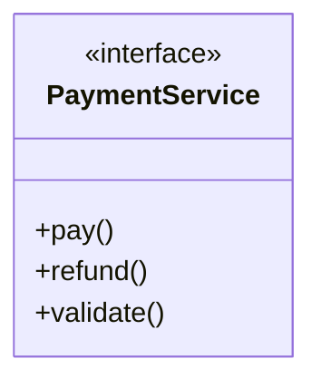

The key part is `<<interface>>` — a UML stereotype that identifies the element as an interface.

---

## 3. Interface with Multiple Operations

An interface can contain multiple operations.

```text
classDiagram
    class PaymentService {
        <<interface>>
        +pay()
        +refund()
        +validate()
    }
```


Conceptually:

```text
┌─────────────────────────────┐
│       PaymentService        │
│        «interface»          │
├─────────────────────────────┤
│ +pay()                      │
│ +refund()                   │
│ +validate()                 │
└─────────────────────────────┘
```

The diagram communicates the operations that form the interface contract.

---

## 4. Class Realizing an Interface

A concrete class can realize an interface.

```text
classDiagram
    class PaymentService {
        <<interface>>
        +pay()
    }

    class CreditCardPayment {
        +pay()
    }

    PaymentService <|.. CreditCardPayment
```

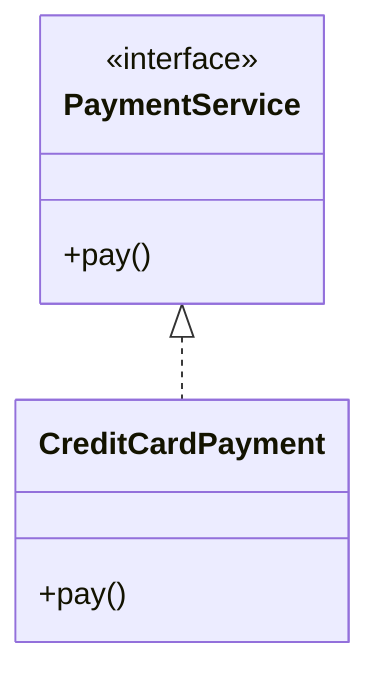

The important relationship is `<|..`, which represents **realization**.

---

## 5. What is Realization?

**Realization** represents a relationship where a class fulfills the contract defined by an interface.

Conceptually:

```text
       PaymentService
         «interface»
              △
              ┆
              ┆
              ┆
      CreditCardPayment
```

The relationship has a **dashed line** and a **hollow triangle**. This visually distinguishes realization from normal inheritance/generalization.

---

## 6. Mermaid Realization Syntax

The basic Mermaid syntax is:

```text
Interface <|.. Implementation
```

```text
classDiagram
    class Storage {
        <<interface>>
        +save()
    }

    class DatabaseStorage {
        +save()
    }

    Storage <|.. DatabaseStorage
```

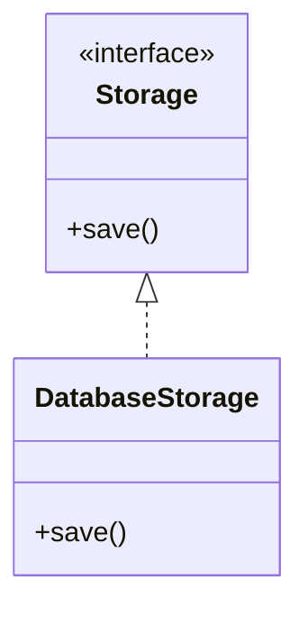

Here `Storage` is the interface, `DatabaseStorage` is the concrete class, and `<|..` denotes realization.

---

## 7. Multiple Classes Realizing One Interface

Multiple classes can realize the same interface.

```text
classDiagram
    class NotificationService {
        <<interface>>
        +send()
    }

    class EmailNotification {
        +send()
    }
    class SMSNotification {
        +send()
    }
    class PushNotification {
        +send()
    }

    NotificationService <|.. EmailNotification
    NotificationService <|.. SMSNotification
    NotificationService <|.. PushNotification
```

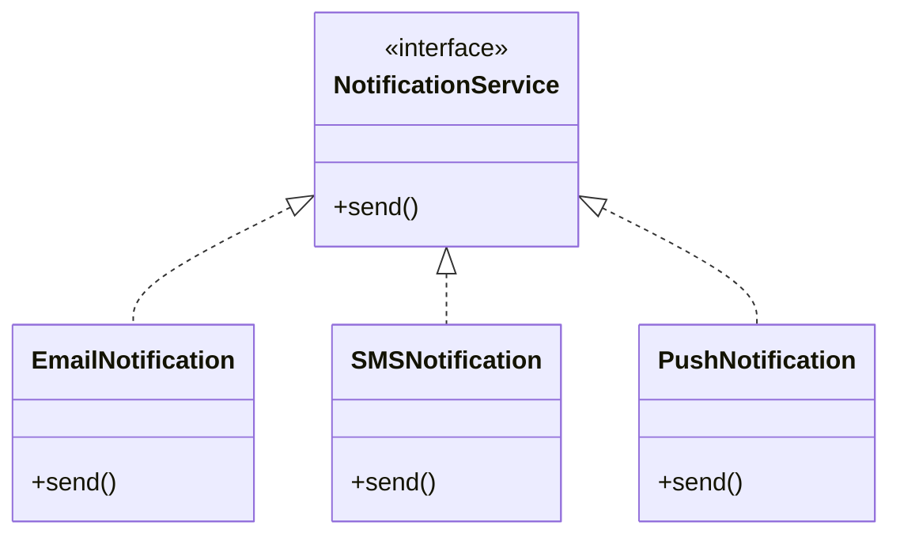

Visually:

```text
                    NotificationService
                         «interface»
                              △
                       ┌──────┼──────┐
                       ┆      ┆      ┆
                       ┆      ┆      ┆
                     Email   SMS    Push
```

The UML meaning is: **one interface → multiple realizations.**

---

## 8. Interface as a Contract

```text
classDiagram
    class PaymentGateway {
        <<interface>>
        +pay(amount: double)
        +refund(transactionId: Long)
    }

    class StripePayment {
        +pay(amount: double)
        +refund(transactionId: Long)
    }

    class UPIPayment {
        +pay(amount: double)
        +refund(transactionId: Long)
    }

    PaymentGateway <|.. StripePayment
    PaymentGateway <|.. UPIPayment
```

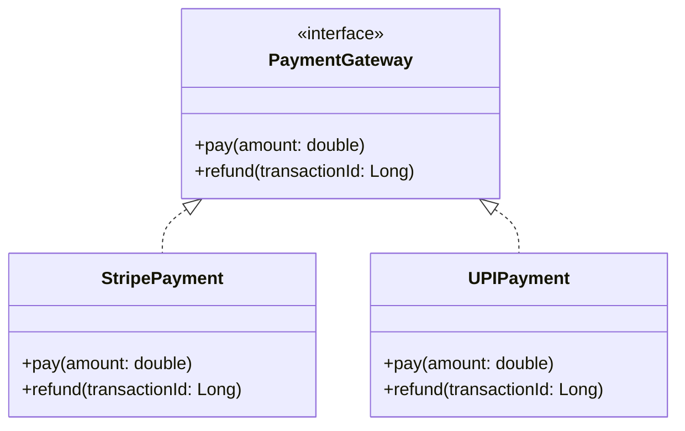

The UML diagram communicates:

```text
                 PaymentGateway
                   «interface»
                        △
                  ┌─────┴─────┐
                  ┆           ┆
                  ┆           ┆
            StripePayment  UPIPayment
```

The interface defines the common contract; the concrete classes realize that contract.

---

## 9. Interface vs. Abstract Class

This is an important distinction from the UML diagram perspective.

**Abstract class** — marked with `<<abstract>>`:

```text
classDiagram
class Payment {
    <<abstract>>
    +pay()
}

class UPIPayment {
    +pay()
}
Payment <|-- UPIPayment
```

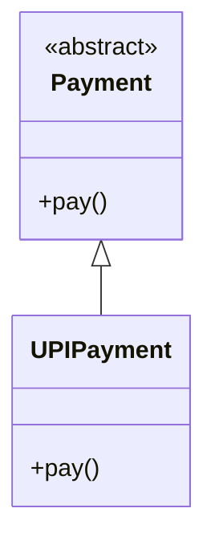

The relationship `<|--` represents **generalization**.

**Interface** — marked with `<<interface>>`:

```text
classDiagram
    class PaymentService {
        <<interface>>
        +pay()
    }

    class UPIPayment {
        +pay()
    }

    PaymentService <|.. UPIPayment
```

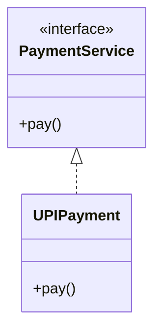

The relationship `<|..` represents **realization**.

---

## 10. Visual Difference

**Abstract class:**

```text
        Payment
       «abstract»
            △
            │
            │
       UPIPayment
```

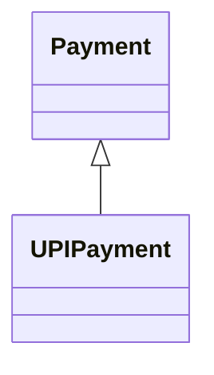

**Interface:**

```text
    PaymentService
      «interface»
           △
           ┆
           ┆
      UPIPayment
```

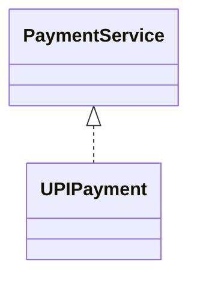

---

## 11. Generalization vs. Realization

This distinction is very important for reading UML diagrams.

| Concept | Mermaid | UML Meaning |
|---|---|---|
| Generalization | `<\|--` | "is a" via inheritance |
| Realization | `<\|..` | fulfills an interface contract |

**Generalization:**

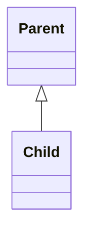

Visual idea:

```text
Parent
  △
  │
Child
```

**Realization:**

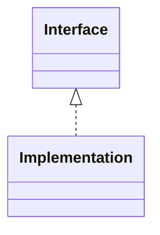

Visual idea:

```text
Interface
   △
   ┆
Implementation
```

The solid vs. dashed line is the important visual difference.

---

## 12. Interface + Multiple Implementations

A common LLD UML pattern:

```text
classDiagram
class Storage {
    <<interface>>
    +save()
    +delete()
}

class DatabaseStorage {
    +save()
    +delete()
}
class FileStorage {
    +save()
    +delete()
}
class CloudStorage {
    +save()
    +delete()
}
Storage <|.. DatabaseStorage
Storage <|.. FileStorage
Storage <|.. CloudStorage
```

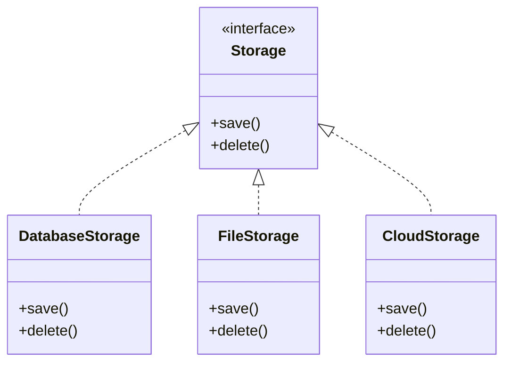

Visual structure:

```text
                       Storage
                      «interface»
                           △
                     ┌─────┼─────┐
                     ┆     ┆     ┆
                     ┆     ┆     ┆
                  Database File  Cloud
```

This is one of the most common patterns you'll encounter while designing LLD systems.

---

## 13. Interface + Abstract Class + Concrete Class

UML can also represent both an interface and an abstract class in the same model.

```text
classDiagram
class PaymentService {
    <<interface>>
    +pay()
}

class Payment {
    <<abstract>>
    +validate()
}
class UPIPayment {
    +pay()
    +validate()
}
PaymentService <|.. UPIPayment
Payment <|-- UPIPayment
```

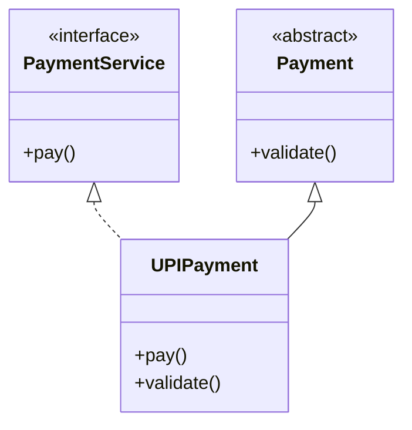

There are two different relationships:

```text
PaymentService «interface»
          △
          ┆
          ┆ realization
          ┆
      UPIPayment
          △
          │
          │ generalization
          │
    Payment «abstract»
```

This demonstrates why it's important to distinguish `<<interface>>`, `<<abstract>>`, `<|..`, and `<|--` — they communicate different UML meanings.

---

## 14. Interface with Parameters and Return Types

Interfaces can also show detailed operation signatures.

```text
classDiagram
class PaymentGateway {
    <<interface>>
    +pay(amount: double): boolean
    +refund(transactionId: Long): boolean
}
```

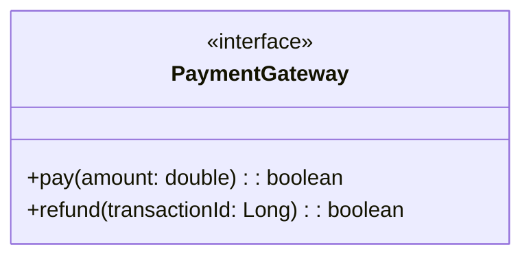

The UML operation syntax used here is:

```text
visibility operationName(parameterName: Type): ReturnType
```

For example: `+pay(amount: double): boolean`. The focus remains on the UML representation of the operation.

---

## 15. Real-World Example — Notification System

Consider: `NotificationService` (interface), `EmailNotification`, `SMSNotification`, `PushNotification`.

```text
classDiagram
class NotificationService {
    <<interface>>
    +send(message: String)
}

class EmailNotification {
    +send(message: String)
}
class SMSNotification {
    +send(message: String)
}
class PushNotification {
    +send(message: String)
}
NotificationService <|.. EmailNotification
NotificationService <|.. SMSNotification
NotificationService <|.. PushNotification
```

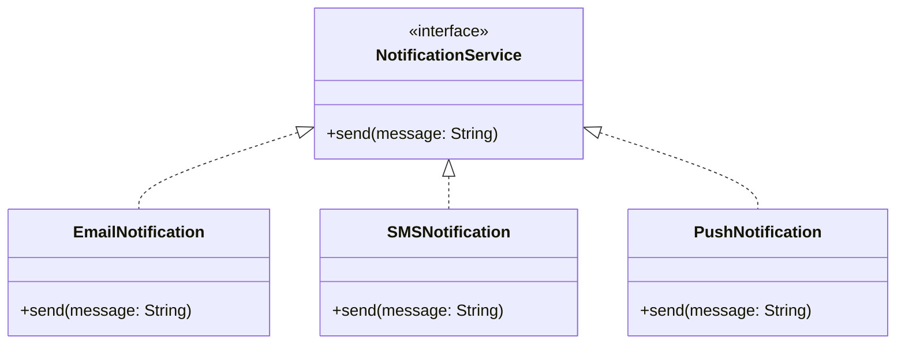

The diagram clearly communicates:

```text
              NotificationService
                  «interface»
                       △
                 ┌─────┼─────┐
                 ┆     ┆     ┆
                 ┆     ┆     ┆
               Email   SMS   Push
```

---

## 16. Practice Question 1

Create a UML diagram for:

- `Storage` → interface, with `save()`, `delete()`
- `DatabaseStorage`
- `FileStorage`
- Both classes realize `Storage`

**Solution**

```text
classDiagram
class Storage {
    <<interface>>
    +save()
    +delete()
}

class DatabaseStorage {
    +save()
    +delete()
}
class FileStorage {
    +save()
    +delete()
}
Storage <|.. DatabaseStorage
Storage <|.. FileStorage
```

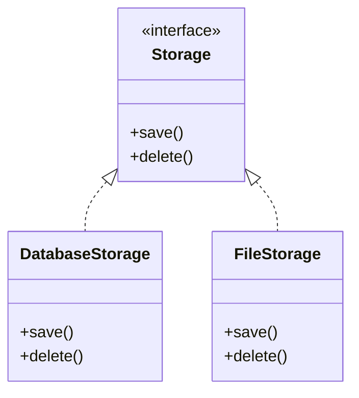

---

## 17. Practice Question 2

Create a UML diagram for:

- `PaymentService` → interface, with `pay()`
- `CreditCardPayment`
- `UPIPayment`
- `CashPayment`
- All three realize `PaymentService`

**Solution**

```text
classDiagram
class PaymentService {
    <<interface>>
    +pay()
}

class CreditCardPayment {
    +pay()
}
class UPIPayment {
    +pay()
}
class CashPayment {
    +pay()
}
PaymentService <|.. CreditCardPayment
PaymentService <|.. UPIPayment
PaymentService <|.. CashPayment
```

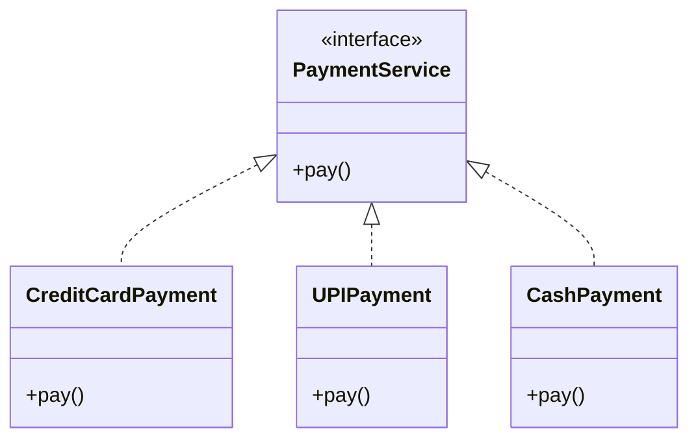

---

## 18. Practice Question 3

Create a UML diagram for:

- `AuthenticationService` → interface, with `login()`, `logout()`
- `EmailAuthentication`
- `OAuthAuthentication`
- Both realize `AuthenticationService`

**Solution**

```text
classDiagram
class AuthenticationService {
    <<interface>>
    +login()
    +logout()
}

class EmailAuthentication {
    +login()
    +logout()
}
class OAuthAuthentication {
    +login()
    +logout()
}
AuthenticationService <|.. EmailAuthentication
AuthenticationService <|.. OAuthAuthentication
```

```mermaid
classDiagram
class AuthenticationService {
<<interface>>
+login()
+logout()
}

class EmailAuthentication {
+login()
+logout()
}
class OAuthAuthentication {
+login()
+logout()
}
AuthenticationService <|.. EmailAuthentication
AuthenticationService <|.. OAuthAuthentication
```

---

## 19. Mermaid Syntax Cheat Sheet

**Interface**

```mermaid
classDiagram
class InterfaceName {
<<interface>>
+operation()
}
```

**Interface with multiple operations**

```mermaid
classDiagram
class PaymentService {
<<interface>>
+pay()
+refund()
+validate()
}
```

**One implementation**

```mermaid
classDiagram
class PaymentService {
<<interface>>
+pay()
}

class UPIPayment {
+pay()
}
PaymentService <|.. UPIPayment
```

**Multiple implementations**

```mermaid
classDiagram
class PaymentService {
<<interface>>
+pay()
}

class UPI
class CreditCard
class Cash
PaymentService <|.. UPI
PaymentService <|.. CreditCard
PaymentService <|.. Cash
```

**Abstract class**

```mermaid
classDiagram
class Payment {
<<abstract>>
+pay()
}
```

**Generalization**

```text
Parent <|-- Child
```

**Realization**

```text
Interface <|.. Implementation
```

---

## 20. Key Takeaways

1. An interface represents a contract in UML.
2. Use `<<interface>>` to identify an interface.
3. Interfaces primarily describe operations that implementing classes must provide.
4. A class that fulfills an interface has a **realization** relationship with it.
5. Mermaid realization syntax: `Interface <|.. Implementation`
6. Mermaid generalization syntax: `Parent <|-- Child`
7. Generalization uses a **solid** line.
8. Realization uses a **dashed** line.
9. `<<abstract>>` identifies an abstract class.
10. `<<interface>>` identifies an interface.
11. Multiple classes can realize the same interface.
12. Interface + realization is a very common pattern in LLD diagrams.

---

## 21. Important UML Symbols From This Step

```text
┌──────────────────────────────────────────┐
│              UML Notation                 │
├──────────────────────────────────────────┤
│                                            │
│  <<interface>>                            │
│        ↓                                  │
│    Interface                              │
│                                            │
│  <<abstract>>                             │
│        ↓                                  │
│    Abstract Class                         │
│                                            │
│  <|--                                     │
│        ↓                                  │
│    Generalization                         │
│                                            │
│  <|..                                     │
│        ↓                                  │
│    Realization                            │
│                                            │
└──────────────────────────────────────────┘
```

---

## Final Mental Model

The most important thing from this step is to visually distinguish these four things:

```text
<<abstract>>   → Abstract Class
<<interface>>  → Interface
<|--           → Generalization
<|..           → Realization
```

A typical UML design looks like:

```text
classDiagram
class PaymentService {
    <<interface>>
    +pay()
}

class Payment {
    <<abstract>>
    +validate()
}
class UPIPayment {
    +pay()
    +validate()
}
PaymentService <|.. UPIPayment
Payment <|-- UPIPayment
```

```mermaid
classDiagram
class PaymentService {
<<interface>>
+pay()
}

class Payment {
<<abstract>>
+validate()
}
class UPIPayment {
+pay()
+validate()
}
PaymentService <|.. UPIPayment
Payment <|-- UPIPayment
```

This is the key visual knowledge to carry forward into the next UML concepts.