# UML Enums

## 1. What is an Enum in UML?

An **enum** represents a fixed set of predefined values.

For example, an order can have a fixed set of statuses: `PENDING`, `CONFIRMED`, `SHIPPED`, `DELIVERED`, `CANCELLED`.

In UML, an enum is represented using the stereotype `<<enumeration>>`.

```text
classDiagram
class OrderStatus {
    <<enumeration>>
    PENDING
    CONFIRMED
    SHIPPED
    DELIVERED
    CANCELLED
}
```

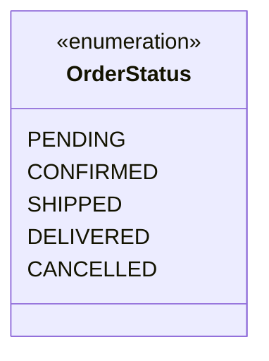

The important UML concept: **`<<enumeration>>` identifies the element as an enumeration rather than a normal class.**

---

## 2. Enumeration Notation

The basic Mermaid syntax is:

```text
classDiagram
class EnumName {
    <<enumeration>>
    VALUE_1
    VALUE_2
    VALUE_3
}
```

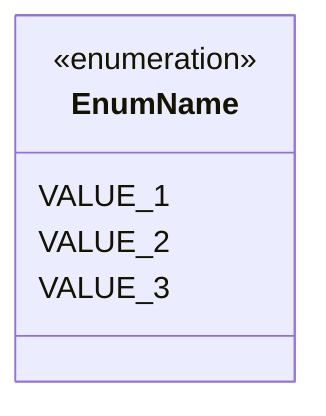

Example:

```text
classDiagram
class PaymentStatus {
    <<enumeration>>
    PENDING
    SUCCESS
    FAILED
    REFUNDED
}
```

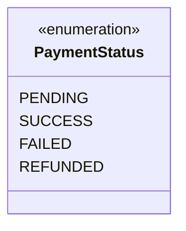

The structure visually looks like:

```text
┌──────────────────────┐
│    PaymentStatus     │
│    «enumeration»     │
├──────────────────────┤
│ PENDING              │
│ SUCCESS              │
│ FAILED               │
│ REFUNDED             │
└──────────────────────┘
```

---

## 3. Enumeration Literals

The individual values inside an enum are called **enumeration literals**.

```text
classDiagram
class OrderStatus {
    <<enumeration>>
    PENDING
    CONFIRMED
    SHIPPED
    DELIVERED
    CANCELLED
}
```


The enumeration is `OrderStatus`. Its enumeration literals are `PENDING`, `CONFIRMED`, `SHIPPED`, `DELIVERED`, `CANCELLED`.

From a UML perspective, these represent the predefined values of the enumeration.

---

## 4. Enum vs. Normal Class

**A normal class** is represented as:

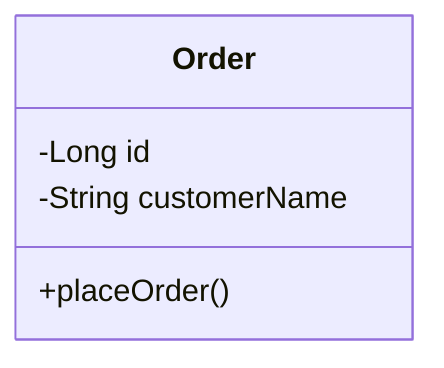

**An enum** is represented as:

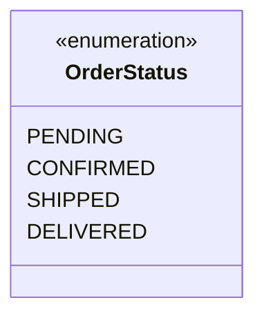

The important visual distinction:

```text
Normal Class
     │
     └── Order

Enumeration
     │
     ├── «enumeration»
     └── OrderStatus
```

The enum communicates a fixed set of possible values.

---

## 5. Using an Enum as a Class Attribute

An enum is commonly referenced by another class.

```text
classDiagram
class OrderStatus {
    <<enumeration>>
    PENDING
    CONFIRMED
    SHIPPED
    DELIVERED
    CANCELLED
}

class Order {
    -Long id
    -OrderStatus status
}
```

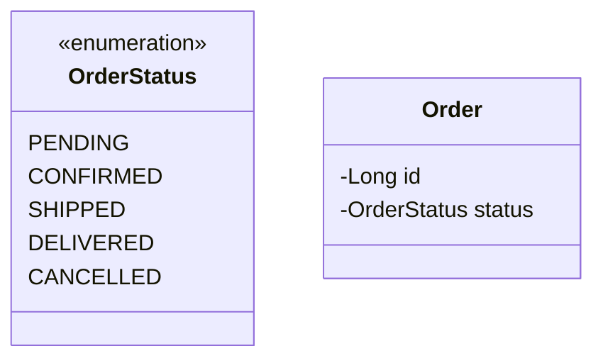

Here `OrderStatus` is used as the type of `status`. So the UML communicates:

```text
Order
 ├── id
 └── status : OrderStatus
```

---

## 6. Class and Enum Relationship

We can explicitly represent the relationship between the class and enum.

```text
classDiagram
class OrderStatus {
    <<enumeration>>
    PENDING
    CONFIRMED
    SHIPPED
    DELIVERED
    CANCELLED
}

class Order {
    -Long id
    -OrderStatus status
}
Order --> OrderStatus
```

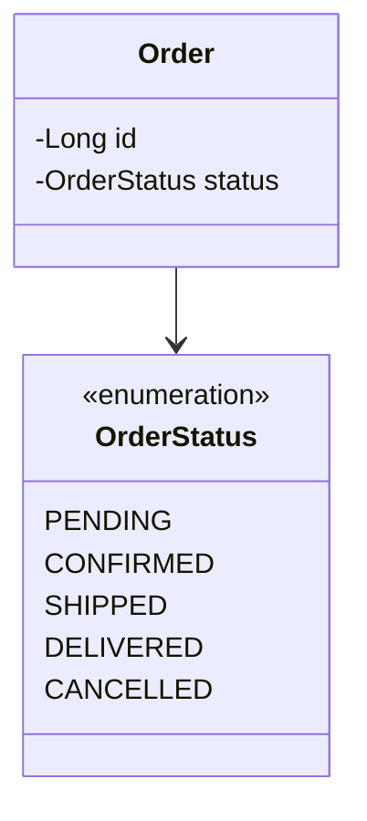

Visually:

```text
┌───────────────┐
│     Order     │
├───────────────┤
│ -Long id      │
│ -OrderStatus  │───────────────┐
│  status       │               │
└───────────────┘               │
                                 ▼
                       ┌─────────────────┐
                       │   OrderStatus   │
                       │ «enumeration»   │
                       ├─────────────────┤
                       │ PENDING         │
                       │ CONFIRMED       │
                       │ SHIPPED         │
                       │ DELIVERED       │
                       │ CANCELLED       │
                       └─────────────────┘
```

The exact relationship semantics will be covered later when we study UML relationships in depth. For this step, the important point is recognizing that **a class can use an enumeration as the type of one of its attributes.**

---

## 7. Real-World Example — Order Status

An e-commerce system may have an order status with a predefined set of values.

```text
classDiagram
class OrderStatus {
    <<enumeration>>
    CREATED
    CONFIRMED
    PACKED
    SHIPPED
    DELIVERED
    CANCELLED
}

class Order {
    -Long orderId
    -OrderStatus status
    +placeOrder()
    +cancelOrder()
}
Order --> OrderStatus
```

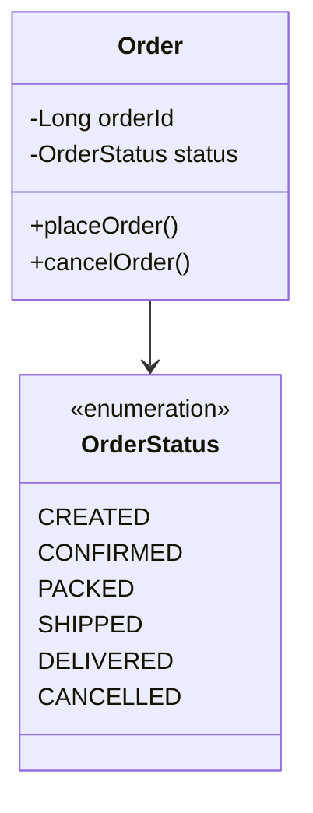

The UML communicates:

```text
Order
  │
  └── status : OrderStatus
                    │
                    ├── CREATED
                    ├── CONFIRMED
                    ├── PACKED
                    ├── SHIPPED
                    ├── DELIVERED
                    └── CANCELLED
```

This is a very common pattern in LLD diagrams.

---

## 8. Real-World Example — Payment Method

A payment system may have a predefined set of payment methods.

```text
classDiagram
class PaymentMethod {
    <<enumeration>>
    CREDIT_CARD
    DEBIT_CARD
    UPI
    CASH
}

class Payment {
    -Long id
    -double amount
    -PaymentMethod method
}
Payment --> PaymentMethod
```

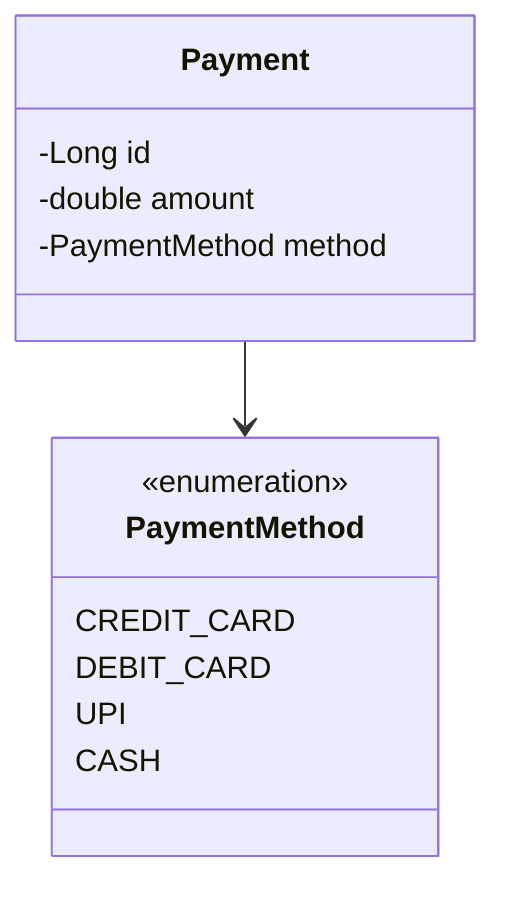

The relationship can be understood as:

```text
Payment
   │
   └── method : PaymentMethod
                       │
                       ├── CREDIT_CARD
                       ├── DEBIT_CARD
                       ├── UPI
                       └── CASH
```

---

## 9. Real-World Example — User Role

Another common example is a fixed set of roles.

```text
classDiagram
class UserRole {
    <<enumeration>>
    ADMIN
    MANAGER
    DEVELOPER
    TESTER
    CUSTOMER
    GUEST
}

class User {
    -Long id
    -String name
    -UserRole role
}
User --> UserRole
```

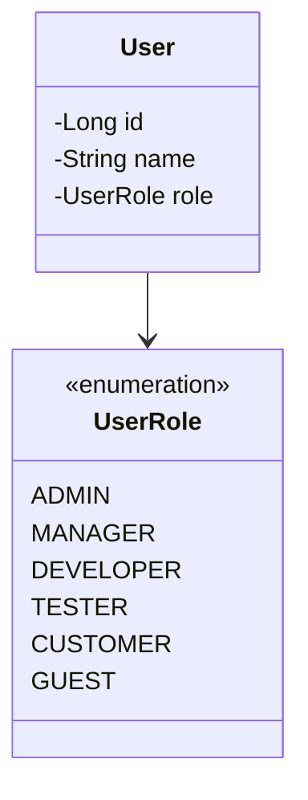

The UML communicates:

```text
User
 └── role : UserRole
               │
               ├── ADMIN
               ├── MANAGER
               ├── DEVELOPER
               ├── TESTER
               ├── CUSTOMER
               └── GUEST
```

---

## 10. Enum with Many Values

There's no special syntax required for additional values — simply list the enumeration literals.

```text
classDiagram
class TicketPriority {
    <<enumeration>>
    LOW
    MEDIUM
    HIGH
    CRITICAL
}
```

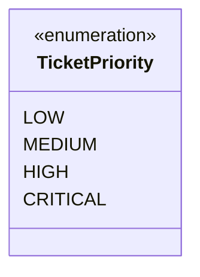

The important thing is `<<enumeration>>` followed by the predefined values.

---

## 11. Enum in a Larger UML Model

Enums can appear alongside normal classes, interfaces, and abstract classes.

```text
classDiagram
class PaymentService {
    <<interface>>
    +pay()
}

class Payment {
    <<abstract>>
    -Long transactionId
    -PaymentStatus status
}
class PaymentStatus {
    <<enumeration>>
    PENDING
    SUCCESS
    FAILED
    REFUNDED
}
class UPIPayment {
    +pay()
}
PaymentService <|.. UPIPayment
Payment <|-- UPIPayment
Payment --> PaymentStatus
```

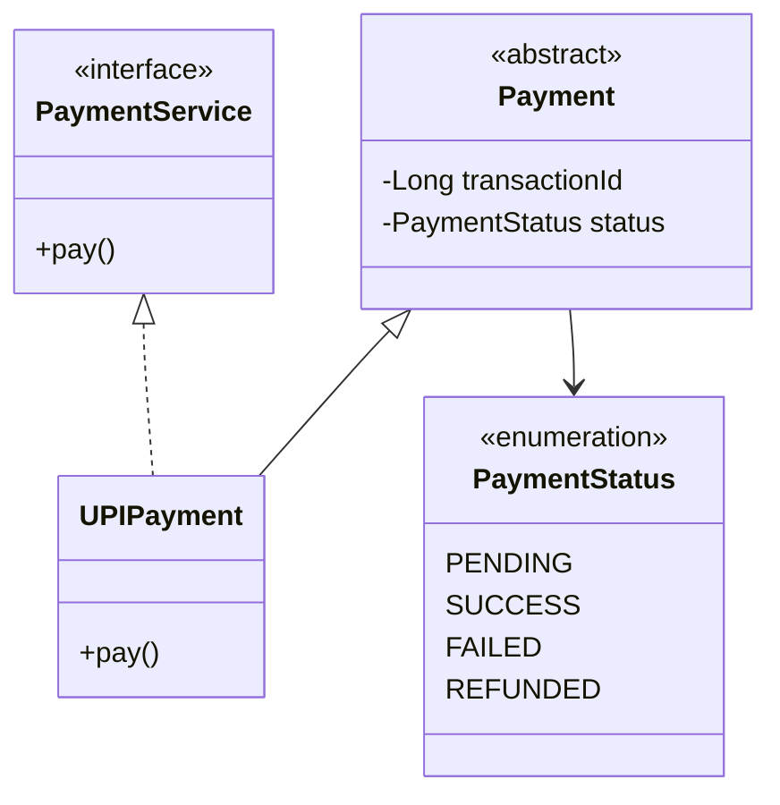

This demonstrates four UML concepts we've learned:

```text
<<interface>>    → Interface
<<abstract>>     → Abstract Class
<<enumeration>>  → Enumeration
<|..             → Realization
```

---

## 12. Mermaid Syntax Cheat Sheet

**Basic enum**

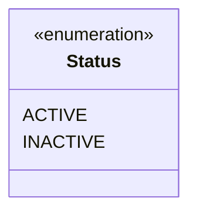

**Enum with multiple values**


**Class using an enum**

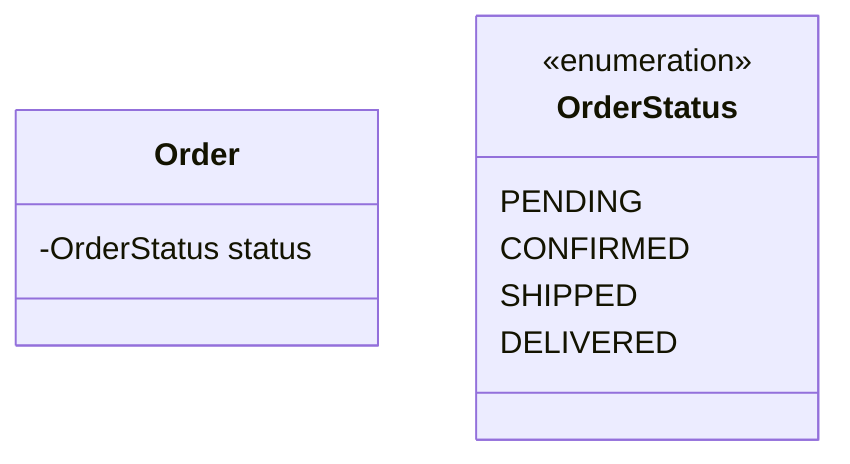

**Explicit class → enum relationship**

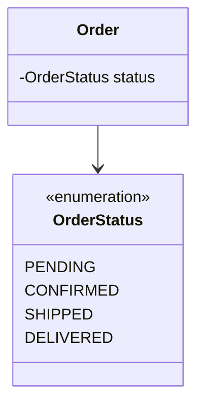

**Enum with another UML element**

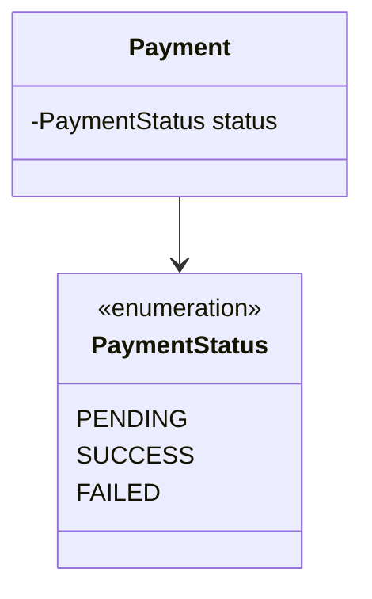

---

## 13. Practice Question 1

Create a UML diagram for:

- `TicketPriority` → enum, values: `LOW`, `MEDIUM`, `HIGH`, `CRITICAL`
- `Ticket` → class, containing `Long id`, `TicketPriority priority`

**Solution**

```text
classDiagram
class TicketPriority {
    <<enumeration>>
    LOW
    MEDIUM
    HIGH
    CRITICAL
}

class Ticket {
    -Long id
    -TicketPriority priority
}
Ticket --> TicketPriority
```

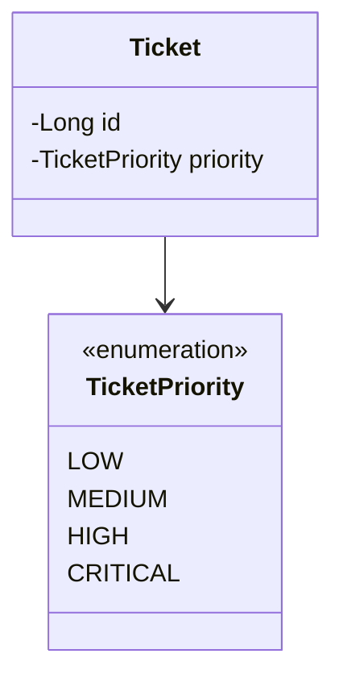

---

## 14. Practice Question 2

Create a UML diagram for:

- `AccountStatus` → enum, values: `ACTIVE`, `BLOCKED`, `CLOSED`
- `Account` → class, containing `Long accountNumber`, `AccountStatus status`

**Solution**

```text
classDiagram
class AccountStatus {
    <<enumeration>>
    ACTIVE
    BLOCKED
    CLOSED
}

class Account {
    -Long accountNumber
    -AccountStatus status
}
Account --> AccountStatus
```

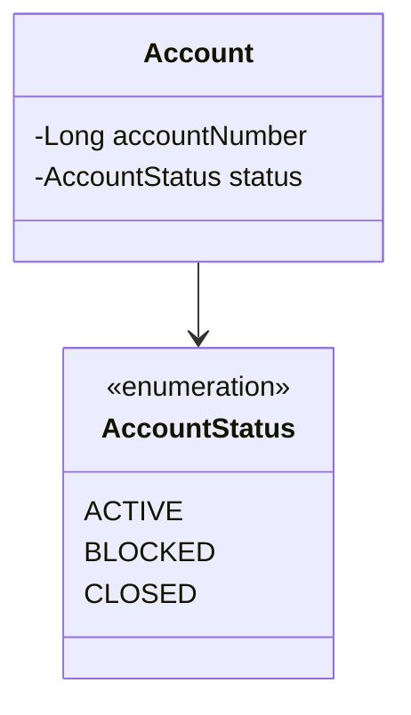

---

## 15. Practice Question 3

Create a UML diagram for:

- `DeliveryStatus` → enum, values: `ASSIGNED`, `PICKED_UP`, `IN_TRANSIT`, `DELIVERED`, `FAILED`
- `Delivery` → class, containing `Long deliveryId`, `DeliveryStatus status`

**Solution**

```text
classDiagram
class DeliveryStatus {
    <<enumeration>>
    ASSIGNED
    PICKED_UP
    IN_TRANSIT
    DELIVERED
    FAILED
}

class Delivery {
    -Long deliveryId
    -DeliveryStatus status
}
Delivery --> DeliveryStatus
```

```mermaid
classDiagram
class DeliveryStatus {
<<enumeration>>
ASSIGNED
PICKED_UP
IN_TRANSIT
DELIVERED
FAILED
}

class Delivery {
-Long deliveryId
-DeliveryStatus status
}
Delivery --> DeliveryStatus
```

---

## 16. Practice Question 4

Create a UML diagram containing:

- `PaymentMethod` → enum, values: `CREDIT_CARD`, `DEBIT_CARD`, `UPI`, `CASH`
- `Payment` → class, containing `Long id`, `double amount`, `PaymentMethod method`

**Solution**

```text
classDiagram
class PaymentMethod {
    <<enumeration>>
    CREDIT_CARD
    DEBIT_CARD
    UPI
    CASH
}

class Payment {
    -Long id
    -double amount
    -PaymentMethod method
}
Payment --> PaymentMethod
```

```mermaid
classDiagram
class PaymentMethod {
<<enumeration>>
CREDIT_CARD
DEBIT_CARD
UPI
CASH
}

class Payment {
-Long id
-double amount
-PaymentMethod method
}
Payment --> PaymentMethod
```

---

## 17. Important UML Notation Learned So Far

At this point, you've learned several important UML stereotypes:

```text
<<abstract>>     → Abstract Class
<<interface>>    → Interface
<<enumeration>>  → Enumeration
```

And two important relationships:

```text
<|--             → Generalization
<|..             → Realization
```

These symbols will become increasingly important when reading LLD UML diagrams.

---

## 18. Key Takeaways

1. An enum represents a fixed set of predefined values.
2. UML represents an enum using `<<enumeration>>`.
3. The values inside an enum are called enumeration literals.
4. Mermaid represents an enum like:

    ```mermaid
    classDiagram
    class Status {
    <<enumeration>>
    ACTIVE
    INACTIVE
    }
    ```

5. A class can use an enum as an attribute type.
6. An enum can be explicitly connected to a class in a UML diagram.
7. Enums are useful for modeling fixed states, statuses, roles, types, categories, and modes.
8. `<<enumeration>>` is different from `<<class>>`, `<<abstract>>`, and `<<interface>>`.
9. The main focus when reading an enum in UML is:
    - identify the enumeration
    - identify its literals
    - identify which classes use it

---

## 19. Final Mental Model

When you see:

```mermaid
classDiagram
class OrderStatus {
<<enumeration>>
PENDING
CONFIRMED
SHIPPED
DELIVERED
}
```

Think:

```text
OrderStatus
     │
     └── fixed set of allowed values
             │
             ├── PENDING
             ├── CONFIRMED
             ├── SHIPPED
             └── DELIVERED
```

When you see:

```mermaid
classDiagram
class Order {
-OrderStatus status
}

class OrderStatus {
<<enumeration>>
PENDING
CONFIRMED
SHIPPED
DELIVERED
}
Order --> OrderStatus
```

Think:

```text
Order
  │
  └── status
         │
         ▼
    OrderStatus
    «enumeration»
```

That is the core UML concept for this step.

---

## 20. Quick Reference

| UML Concept | Mermaid Representation |
|---|---|
| Abstract Class | `<<abstract>>` |
| Interface | `<<interface>>` |
| Enumeration | `<<enumeration>>` |
| Generalization | `<\|--` |
| Realization | `<\|..` |

The most important syntax from this step is:

```mermaid
classDiagram
class OrderStatus {
<<enumeration>>
PENDING
CONFIRMED
SHIPPED
DELIVERED
}
```

This is the core Mermaid pattern for representing an enum in a UML class diagram.