# UML Stereotypes

## 1. What is a Stereotype?

A **stereotype** is a UML mechanism used to give a UML element a more specific meaning, role, or classification.

A stereotype is written using `<<stereotype-name>>`.

```text
classDiagram
class PaymentService {
    <<interface>>
    +pay()
}
```

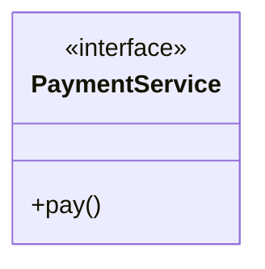

Here, `<<interface>>` is a stereotype. The stereotype adds additional meaning to the UML element.

---

## 2. Why Do We Use Stereotypes?

**Without a stereotype:**

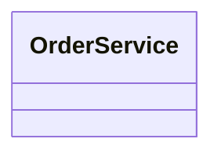

We only know that `OrderService` is a class.

**With a stereotype:**

```text
classDiagram
class OrderService {
    <<service>>
}
```

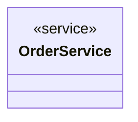

the diagram communicates: `OrderService` has the role of a **service**.

Stereotypes make UML diagrams more expressive and easier to understand.

---

## 3. Stereotype Syntax

The general UML notation is `<<stereotype-name>>`.

```text
classDiagram
class OrderService {
    <<service>>
}
```


The class name and stereotype represent different information:

```text
OrderService   → element name
<<service>>    → element's role/classification
```

The stereotype does not replace the class name.

---

## 4. Stereotypes We Have Already Used

Several UML concepts studied earlier are represented using stereotypes.

| Stereotype | Meaning |
|---|---|
| `<<abstract>>` | Abstract class |
| `<<interface>>` | Interface |
| `<<enumeration>>` | Enumeration |

```text
classDiagram
class Payment {
    <<abstract>>
    +pay()
}
class PaymentService {
    <<interface>>
    +process()
}
class OrderStatus {
    <<enumeration>>
    PENDING
    CONFIRMED
    CANCELLED
}
```

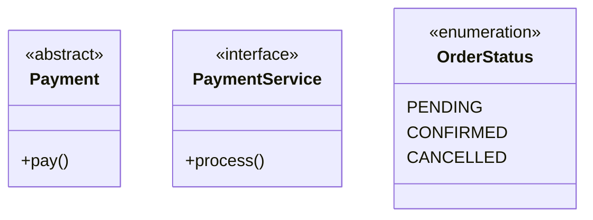

---

## 5. `<<abstract>>`

`<<abstract>>` identifies an abstract class.

```text
classDiagram
class Payment {
    <<abstract>>
    +pay()
}
class CreditCardPayment {
    +pay()
}
Payment <|-- CreditCardPayment
```

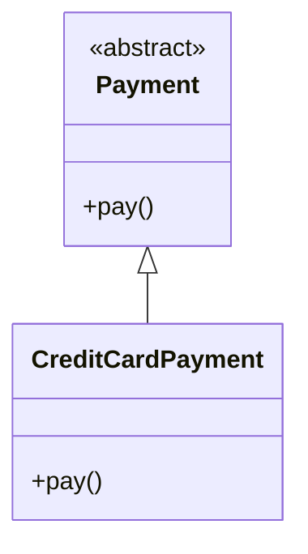

Meaning:

```text
Payment
   │
   └── <<abstract>>
```

The stereotype communicates that `Payment` is an abstract class.

---

## 6. `<<interface>>`

`<<interface>>` identifies an interface.

```text
classDiagram
class PaymentService {
    <<interface>>
    +pay()
}
class CreditCardPayment {
    +pay()
}
PaymentService <|.. CreditCardPayment
```

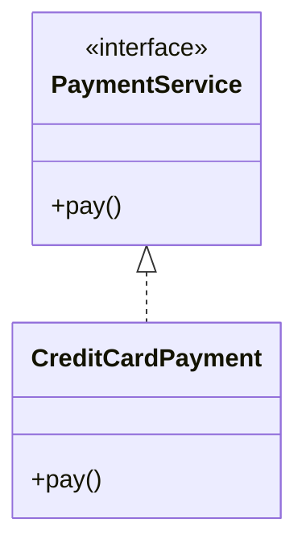

The relationship `<|..` represents realization.

So `<<interface>> + <|..` communicates that a class realizes an interface.

---

## 7. `<<enumeration>>`

`<<enumeration>>` identifies an enumeration.

```text
classDiagram
class OrderStatus {
    <<enumeration>>
    PENDING
    CONFIRMED
    SHIPPED
    DELIVERED
    CANCELLED
}
```

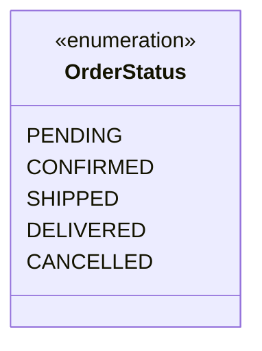

The values inside the enumeration are called **enumeration literals** — for example: `PENDING`, `CONFIRMED`, `SHIPPED`, `DELIVERED`, `CANCELLED`.

---

## 8. Custom Stereotypes

UML also allows stereotypes to communicate domain-specific or architectural roles.

Common examples in software design include:

```text
<<controller>>
<<service>>
<<repository>>
<<entity>>
```

```text
classDiagram
class OrderController {
    <<controller>>
}
class OrderService {
    <<service>>
}
class OrderRepository {
    <<repository>>
}
class Order {
    <<entity>>
}
```

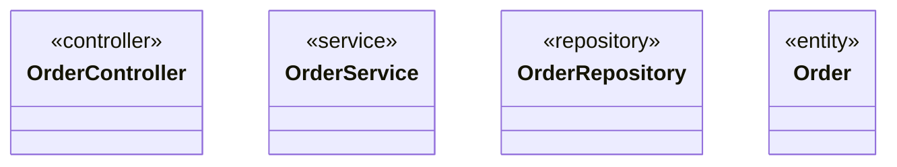

These stereotypes communicate the architectural role of each element.

---

## 9. Standard UML vs. Custom/Architectural Stereotypes

It's important to distinguish between established UML meanings and project-specific modeling conventions.

**Established UML concepts:**

```text
<<abstract>>
<<interface>>
<<enumeration>>
```

These communicate recognized UML concepts.

**Architectural / domain stereotypes:**

```text
<<controller>>
<<service>>
<<repository>>
<<entity>>
```

These are commonly used in software architecture and LLD diagrams to communicate architectural roles. Their exact meaning can depend on the modeling convention being followed.

---

## 10. Stereotype Does Not Change the Class Name

```text
classDiagram
class OrderService {
    <<service>>
    +createOrder()
    +cancelOrder()
}
```

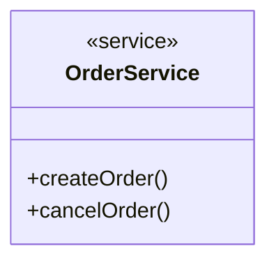

Here `OrderService` is the class name, and `<<service>>` is the stereotype.

```text
OrderService  = UML element name
<<service>>   = additional role/classification
```

---

## 11. Stereotypes in an LLD Diagram

Stereotypes become particularly useful when an LLD contains many different types of components/classes.

```text
classDiagram
class OrderController {
    <<controller>>
    +createOrder()
    +getOrder()
}
class OrderService {
    <<service>>
    +createOrder()
    +cancelOrder()
}
class OrderRepository {
    <<repository>>
    +save()
    +findById()
}
class Order {
    <<entity>>
    -Long id
    -OrderStatus status
}
OrderController --> OrderService
OrderService --> OrderRepository
OrderService --> Order
```

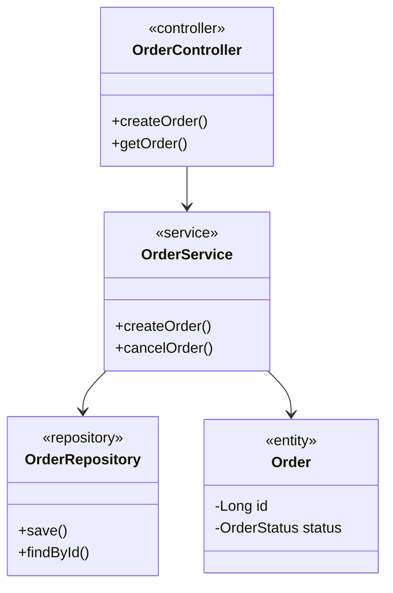

The stereotypes allow the reader to immediately identify the roles:

```text
OrderController  → <<controller>>
OrderService     → <<service>>
OrderRepository  → <<repository>>
Order            → <<entity>>
```

---

## 12. Stereotype Perspective

A useful way to think about stereotypes:

> Stereotype = additional meaning attached to a UML element.

```text
<<service>>
     │
     ▼
OrderService
```

The UML element is `OrderService`. The stereotype tells us `<<service>>`. Therefore, the stereotype provides additional information about the role of the element.

---

## 13. Common Stereotypes for LLD

These are useful stereotypes you may encounter while designing software systems:

| Stereotype | Typical Meaning |
|---|---|
| `<<interface>>` | Interface |
| `<<abstract>>` | Abstract class |
| `<<enumeration>>` | Enumeration |
| `<<controller>>` | Controller layer/component |
| `<<service>>` | Service/business-logic component |
| `<<repository>>` | Data-access component |
| `<<entity>>` | Domain/entity object |
| `<<factory>>` | Factory-related component |
| `<<strategy>>` | Strategy-related component |
| `<<observer>>` | Observer-related component |

The last group is especially useful when documenting design-pattern-based LLD.

---

## 14. Complete Example

Consider a simple order system:

```text
classDiagram
class OrderController {
    <<controller>>
    +createOrder()
    +getOrder()
}
class OrderService {
    <<service>>
    +createOrder()
    +cancelOrder()
}
class OrderRepository {
    <<repository>>
    +save()
    +findById()
}
class Order {
    <<entity>>
    -Long id
    -OrderStatus status
}
class OrderStatus {
    <<enumeration>>
    PENDING
    CONFIRMED
    SHIPPED
    DELIVERED
    CANCELLED
}
OrderController --> OrderService
OrderService --> OrderRepository
OrderService --> Order
Order --> OrderStatus
```

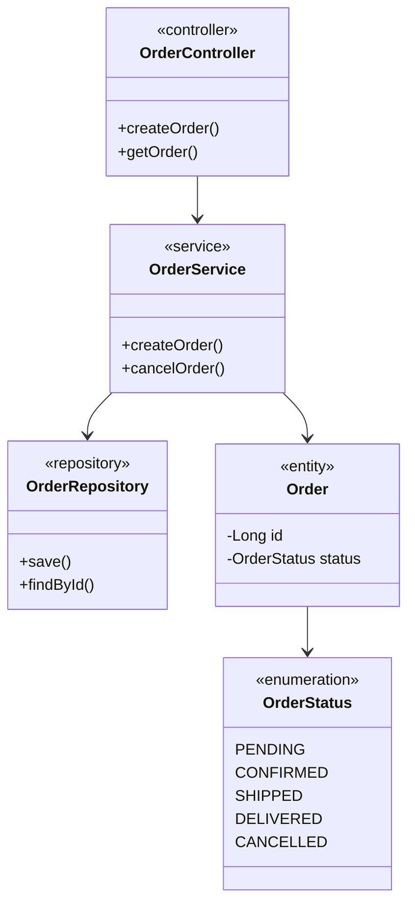

This diagram communicates both **structural information** (`OrderController`, `OrderService`, `OrderRepository`, `Order`, `OrderStatus`) and their **roles** (`<<controller>>`, `<<service>>`, `<<repository>>`, `<<entity>>`, `<<enumeration>>`).

---

## 15. Important Mermaid Syntax

**Basic stereotype**

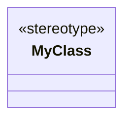

**Interface**

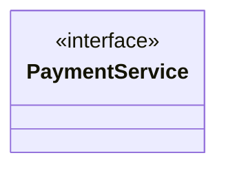

**Abstract class**

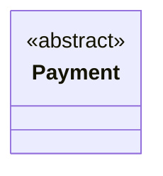

**Enumeration**

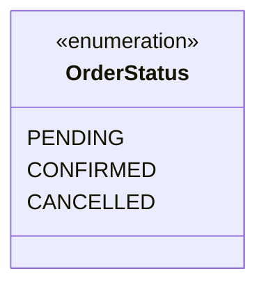

**Custom stereotype**


---

## 16. Practice 1


Create a UML class diagram containing:

- `PaymentService` as an interface
- `PaymentController` with `<<controller>>`
- `PaymentProcessor` with `<<service>>`
- `Payment` with `<<entity>>`

Show appropriate relationships.

**Solution**

```text
classDiagram
class PaymentService {
    <<interface>>
    +pay()
}
class PaymentController {
    <<controller>>
    +makePayment()
}
class PaymentProcessor {
    <<service>>
    +processPayment()
}
class Payment {
    <<entity>>
    -Long id
    -double amount
}
PaymentController --> PaymentProcessor
PaymentProcessor ..> PaymentService
PaymentProcessor --> Payment
```

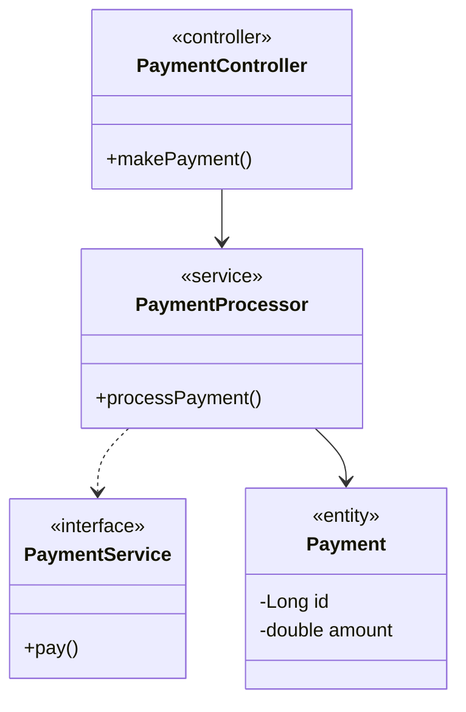

---

## 17. Practice 2

Model the following:

- `UserController` → controller
- `UserService` → service
- `UserRepository` → repository
- `User` → entity
- `UserRole` → enumeration

Show the relationships.

**Solution**

```text
classDiagram
class UserController {
    <<controller>>
}
class UserService {
    <<service>>
}
class UserRepository {
    <<repository>>
}
class User {
    <<entity>>
    -Long id
    -String name
}
class UserRole {
    <<enumeration>>
    ADMIN
    USER
    GUEST
}
UserController --> UserService
UserService --> UserRepository
UserService --> User
User --> UserRole
```

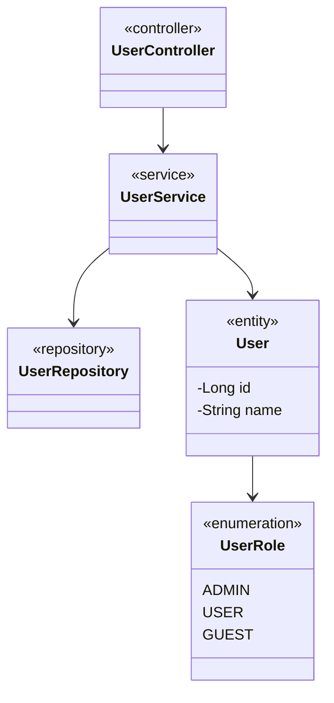

---

## 18. Key Takeaways

1. A stereotype gives additional meaning or classification to a UML element.
2. Stereotypes use `<<stereotype-name>>` notation.
3. `<<abstract>>` identifies an abstract class.
4. `<<interface>>` identifies an interface.
5. `<<enumeration>>` identifies an enumeration.
6. Stereotypes such as `<<controller>>`, `<<service>>`, `<<repository>>`, and `<<entity>>` are commonly used in software architecture/LLD modeling.
7. A stereotype does not replace the element's name.
8. Stereotypes make large UML diagrams easier to understand.
9. Mermaid supports stereotypes inside class definitions.
10. Stereotypes are particularly useful for communicating architectural roles in LLD diagrams.

---

## 19. Quick Reference

```text
<<abstract>>      → Abstract class
<<interface>>     → Interface
<<enumeration>>   → Enumeration

<<controller>>    → Controller role
<<service>>       → Service role
<<repository>>    → Repository role
<<entity>>        → Entity role
```

The core idea:

```text
UML Element
    +
Stereotype
    =
More expressive UML model
```