# UML Notes & Constraints

## 1. UML Notes

A **Note** is an annotation or comment attached to a UML element. It provides additional information that helps the reader understand the diagram.

A Note:

- Does not represent a class
- Does not represent an attribute
- Does not represent a method
- Does not create a structural relationship
- Provides additional explanation about the model

Conceptually:

```text
┌─────────────┐
│    Order    │
└─────────────┘
       │
       │
┌──────────────────────────────┐
│ An order must contain         │
│ at least one item.            │
└──────────────────────────────┘
```

The note is simply explanatory information.

---

## 2. Why Use Notes?

Notes are useful when the diagram needs additional context.

```text
classDiagram
    class Customer {
        -Long id
        -String email
    }
    note for Customer "Email must be unique."
```

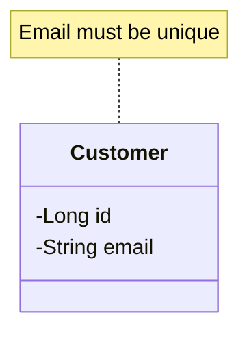

The class itself shows:

```text
Customer
├── id
└── email
```

The Note adds additional information: `Email must be unique.`

This keeps the structural part of the diagram separate from explanatory information.

---

## 3. Mermaid Note Syntax

The basic Mermaid syntax is:

```text
note for ClassName "Note text"
```

```text
classDiagram
    class Order {
        +createOrder()
    }
    note for Order "An order must contain at least one item."
```

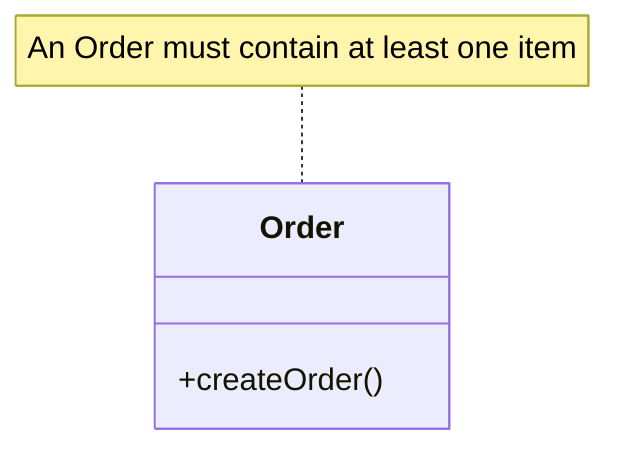

The important syntax is `note for Order` followed by the note text.

---

## 4. Note for a Class

```text
classDiagram
    class Customer {
        -Long id
        -String email
    }
    note for Customer "Email must be unique."
```


The Note is associated with `Customer`. It does not become part of the class structure.

---

## 5. Note vs. Class Member

```text
classDiagram
    class Customer {
        -String email
        +login()
    }
    note for Customer "Customer must have a unique email."
```

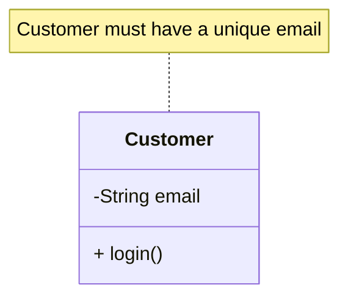

There are three different things here:

```text
email                                      → Attribute
login()                                    → Operation
"Customer must have a unique email."       → Note
```

A Note should not be confused with an attribute or operation.

---

## 6. Notes for Design Explanation

Notes are especially useful for explaining design decisions.

```text
classDiagram
    class PaymentService {
        <<interface>>
        +pay()
    }
    note for PaymentService "Allows multiple payment implementations."
```

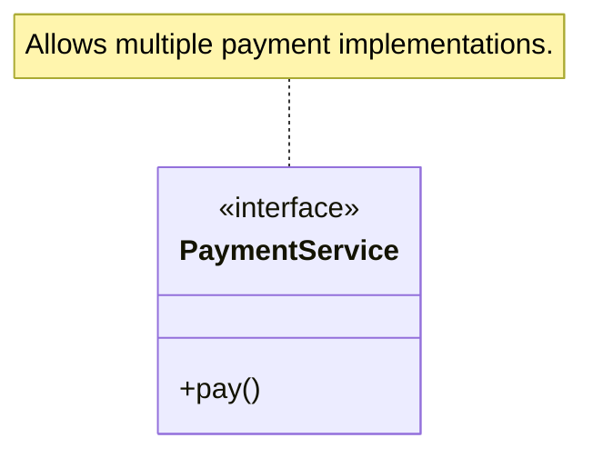

The interface structure is already visible. The Note explains why the element exists or how it should be understood.

---

## 7. Notes and Relationships

A relationship can often be explained using a relationship label.

```text
classDiagram
    Customer "1" --> "0..*" Order : places
```

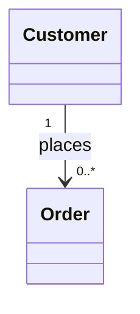

Here, `places` explains the meaning of the relationship.

For Mermaid class diagrams, relationship labels are often cleaner than trying to attach a separate Note directly to the relationship. A Note can instead explain the relevant class or rule:

```text
classDiagram
    Customer "1" --> "0..*" Order : places
    note for Customer "Only active customers can place orders."
```

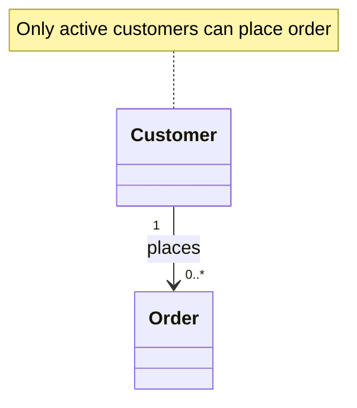

---

## 8. What is a Constraint?

A **constraint** represents a rule or condition that must be satisfied by the model. A constraint is commonly represented using curly braces: `{constraint}`.

Examples:

```text
{age >= 18}
{amount > 0}
{quantity >= 1}
{email is unique}
```

A constraint is different from a normal explanatory Note because it represents a rule or condition.

---

## 9. Constraint Examples

**Age constraint**

```text
{age >= 18}
```
Meaning: the age must be at least 18.

**Price constraint**

```text
{price > 0}
```
Meaning: the price must be greater than zero.

**Quantity constraint**

```text
{quantity >= 1}
```
Meaning: the quantity must be at least one.

**Uniqueness constraint**

```text
{email is unique}
```
Meaning: email values must be unique.

---

## 10. Note vs. Constraint

This is an important distinction.

**Note** — provides additional information or explanation.

```text
"Customer information is verified during registration."
```

**Constraint** — defines a rule or condition.

```text
{age >= 18}
```

Think of it as:

```text
Note       → Explanation / information
Constraint → Rule / condition
```

---

## 11. Constraint on an Attribute

Suppose we have:

```text
classDiagram
    class OrderItem {
        -int quantity
    }
```

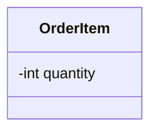

We can define a constraint: `{quantity > 0}`.

Conceptually:

```text
OrderItem
    quantity : int
    {quantity > 0}
```

A Mermaid-friendly way of documenting this is:

```text
classDiagram
    class OrderItem {
        -int quantity
    }
    note for OrderItem "Constraint: quantity must be greater than 0."
```

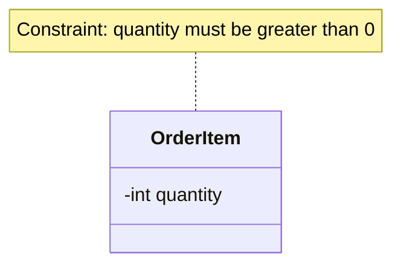

The actual UML idea is the constraint; the Note is being used here as a practical Mermaid representation.

---

## 12. Constraint on a Class

```text
classDiagram
    class User {
        -Long id
        -String email
        -int age
    }
    note for User "Constraints: email must be unique; age >= 18."
```

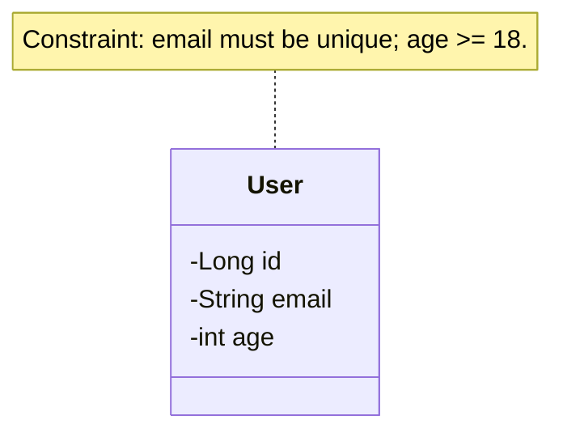

Conceptually:

```text
User
├── email
│      └── {unique}
│
└── age
       └── {age >= 18}
```

---

## 13. Multiple Constraints

A class can have multiple constraints.

```text
Product
    {price > 0}
    {stock >= 0}
    {name is not empty}
```

A Mermaid representation can use a Note:

```text
classDiagram
    class Product {
        -Long id
        -String name
        -double price
        -int stock
    }
    note for Product "Constraints: price > 0; stock >= 0; name must not be empty."
```

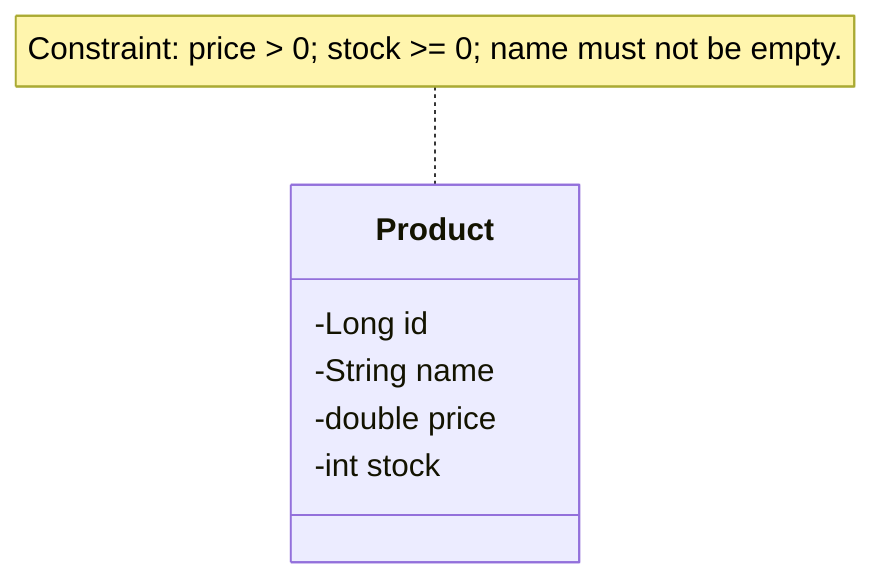

---

## 14. Constraints on Relationships

Constraints can describe rules involving relationships.

```text
Customer "1" --> "0..*" Order

{only active customers can place orders}
```

In Mermaid, this can be documented with a Note:

```text
classDiagram
    Customer "1" --> "0..*" Order : places
    note for Customer "Constraint: only active customers can place orders."
```

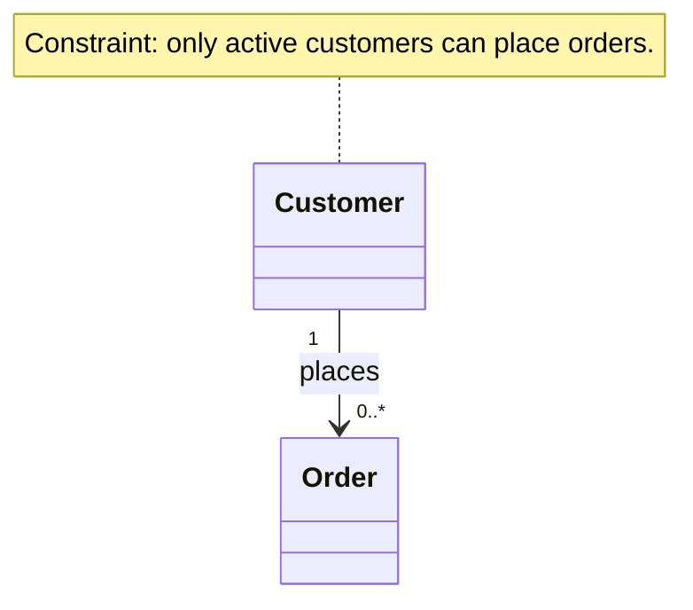

The relationship itself represents the structure. The constraint describes an additional rule.

---

## 15. Notes + Constraints Together

Both can appear in the same UML model.

```text
classDiagram
    class Order {
        -Long id
        -double totalAmount
        -OrderStatus status
    }
    class OrderItem {
        -int quantity
        -double price
    }
    Order "1" *-- "1..*" OrderItem : contains
    note for Order "An order must contain at least one item."
    note for OrderItem "Constraints: quantity > 0; price > 0."
```

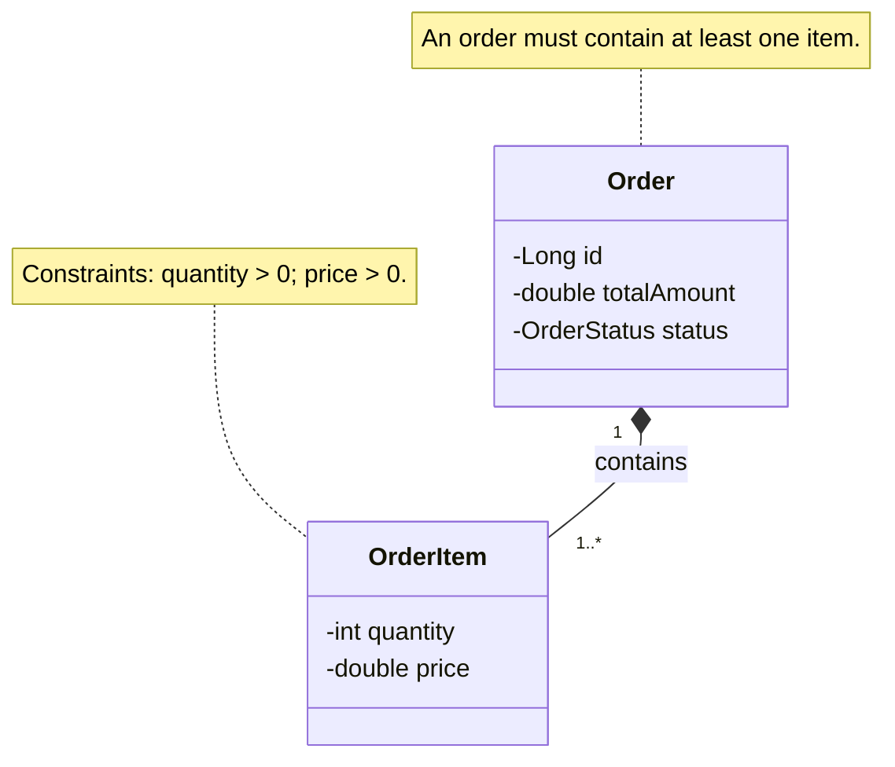

The diagram communicates several different kinds of information:

**Structure**
```text
Order *-- OrderItem
```
Describes the relationship.

**Multiplicity**
```text
1..*
```
Describes how many `OrderItem` objects an `Order` contains.

**Note**
```text
An order must contain at least one item.
```
Provides additional explanation.

**Constraint**
```text
quantity > 0
price > 0
```
Defines rules.

---

## 16. Structure vs. Multiplicity vs. Constraint vs. Note

These concepts should not be mixed together.

| UML Information | Question It Answers |
|---|---|
| Relationship | What is connected? |
| Multiplicity | How many? |
| Constraint | What rule must be satisfied? |
| Note | What additional information should the reader know? |

```text
classDiagram
    class Order
    class OrderItem
    Order "1" *-- "1..*" OrderItem : contains
    note for Order "An order must contain at least one item."
```

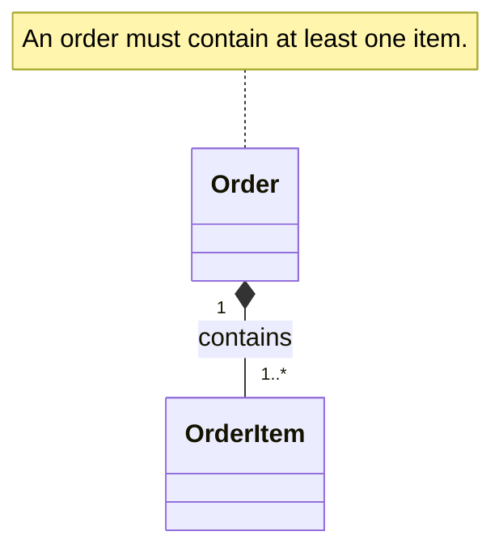

Interpretation:

```text
Order *-- OrderItem   → What relationship?
1..*                  → How many OrderItems?
Note                  → Additional explanation
```

---

## 17. Real-World LLD Example

Consider an order system.

**Requirements:**

- An order must contain at least one item.
- Quantity must be greater than zero.
- Price must be greater than zero.

```text
classDiagram
    class Order {
        -Long id
        -double totalAmount
    }
    class OrderItem {
        -Long productId
        -int quantity
        -double price
    }
    Order "1" *-- "1..*" OrderItem : contains
    note for Order "Constraint: an order must contain at least one item."
    note for OrderItem "Constraints: quantity > 0; price > 0."
```

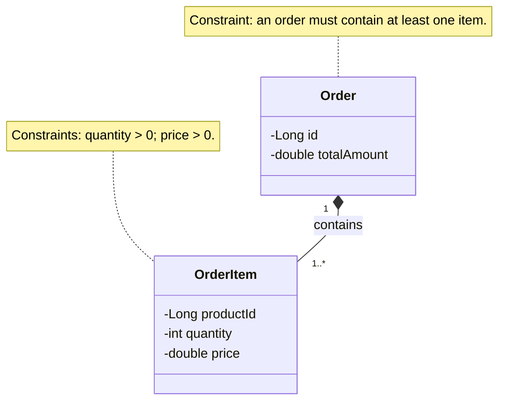

This is much more informative than showing only:

```text
classDiagram
    Order *-- OrderItem
```

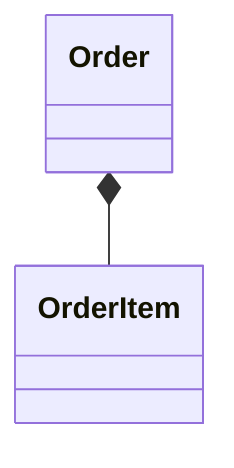

because the additional UML information communicates the business rules.

---

## 18. Important UML Perspective

When designing an LLD diagram, think in layers:

```text
1. ELEMENT
       What exists?

2. RELATIONSHIP
       What is connected to what?

3. MULTIPLICITY
       How many?

4. CONSTRAINT
       What rules apply?

5. NOTE
       What additional explanation is useful?
```

This mental model will become useful when we start converting requirements into UML.

---

## 19. Mermaid Quick Reference

**Class**

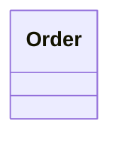

**Note**

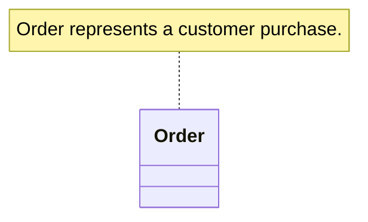

**Relationship label**

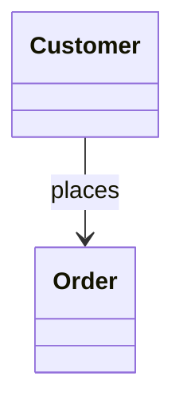

**Constraint notation** (traditional UML)

```text
{constraint}
```

Examples:

```text
{age >= 18}
{price > 0}
{quantity >= 1}
{email is unique}
```

**Mermaid-friendly constraint documentation**

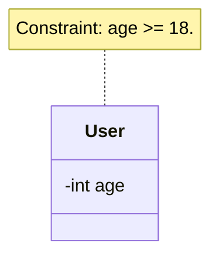

---

## 20. Practice 1

Create a UML diagram for a `User` class containing `id`, `email`, `age`.

**Requirements:**

- Email must be unique.
- Age must be at least 18.

**Solution**

```text
classDiagram
    class User {
        -Long id
        -String email
        -int age
    }
    note for User "Constraints: email must be unique; age >= 18."
```

```mermaid
classDiagram
    class User {
        -Long id
        -String email
        -int age
    }
    note for User "Constraints: email must be unique; age >= 18."
```

---

## 21. Practice 2

Model:

- `Order`, `OrderItem`
- An order contains one or more order items.
- Quantity must be greater than zero.
- Add a note explaining the order rule.

**Solution**

```text
classDiagram
    class Order {
        -Long id
    }
    class OrderItem {
        -int quantity
    }
    Order "1" *-- "1..*" OrderItem : contains
    note for Order "An order must contain at least one item."
    note for OrderItem "Constraint: quantity must be greater than 0."
```

```mermaid
classDiagram
    class Order {
        -Long id
    }
    class OrderItem {
        -int quantity
    }
    Order "1" *-- "1..*" OrderItem : contains
    note for Order "An order must contain at least one item."
    note for OrderItem "Constraint: quantity must be greater than 0."
```

---

## 22. Key Takeaways

1. A **Note** is an annotation used to provide additional information.
2. A **Constraint** represents a rule or condition.
3. Notes are generally explanatory.
4. Constraints are rule-oriented.
5. Traditional UML constraints use curly braces: `{constraint}`.
6. Mermaid class diagrams support Notes using `note for ClassName "text"`.
7. Relationship labels are useful for explaining relationships in Mermaid.
8. Notes and constraints should not be confused with class attributes or methods.
9. Constraints are particularly useful for documenting domain/business rules.
10. Notes are useful for documenting additional context or design decisions.

---

## 23. Quick Revision

```text
NOTE          → Additional information
CONSTRAINT    → Rule / condition
RELATIONSHIP  → What is connected?
MULTIPLICITY  → How many?
ATTRIBUTE     → What data?
METHOD        → What behavior?
```

The key distinction:

```text
"Customer information is verified."   → NOTE
{age >= 18}                           → CONSTRAINT
```