# UML Derived Properties

## 1. What is a Derived Property?

A **derived property** is a UML attribute whose value is calculated or derived from other information.

The UML notation is:

```text
/attributeName
```

The `/` at the beginning is the important part. It communicates: **this property is derived rather than independently represented as a base value.**

---

## 2. Simple Example

Suppose an `Order` has:

```text
quantity
price
/totalAmount
```

`totalAmount` can be calculated from:

```text
totalAmount = quantity × price
```

Therefore, we can represent it as:

```text
classDiagram
    class Order {
        -int quantity
        -double price
        -double /totalAmount
    }
```

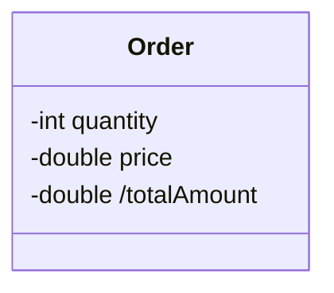

The `/` before `totalAmount` indicates that it is a derived property.

---

## 3. UML Derived Property Notation

Traditional UML notation:

```text
/totalAmount : double
```

The `/` is the derived property indicator.

Compare:

```text
totalAmount : double
```

with:

```text
/totalAmount : double
```

The second notation explicitly communicates that `totalAmount` is derived.

---

## 4. Mermaid Syntax

Mermaid class diagrams can represent the `/` notation.

```text
classDiagram
    class Order {
        -int quantity
        -double price
        -double /totalAmount
    }
```


The important part is `/totalAmount`.

---

## 5. Another Example — Full Name

Suppose a `User` contains:

```text
firstName
lastName
/fullName
```

The value of `fullName` can be derived from `firstName` and `lastName`.

```text
classDiagram
    class User {
        -String firstName
        -String lastName
        -String /fullName
    }
```

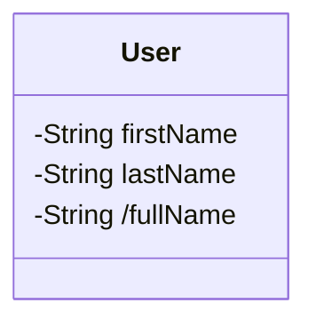

Conceptually:

```text
/fullName = firstName + lastName
```

The exact calculation is not the important UML notation — the `/` communicates that the property is derived.

---

## 6. Normal Property vs. Derived Property

**Normal property**

```text
price : double
```

This represents an ordinary property.

**Derived property**

```text
/totalPrice : double
```

The `/` tells the reader that `totalPrice` is derived.

```text
price        → Normal property
/totalPrice  → Derived property
```

---

## 7. Why Use Derived Properties?

Derived properties make the UML model clearer.

```text
classDiagram
    class ShoppingCart {
        -double /totalAmount
        -int /itemCount
    }
```

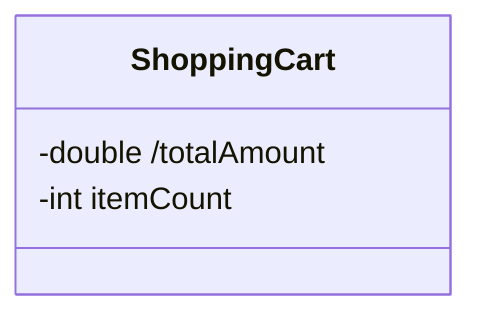

The diagram immediately communicates that `/totalAmount` and `/itemCount` are calculated values. The reader does not have to assume that these values are independent pieces of stored information.

---

## 8. Derived Property from Multiple Properties

A derived property can depend on multiple properties.

```text
classDiagram
    class Rectangle {
        -double width
        -double height
        -double /area
        -double /perimeter
    }
```

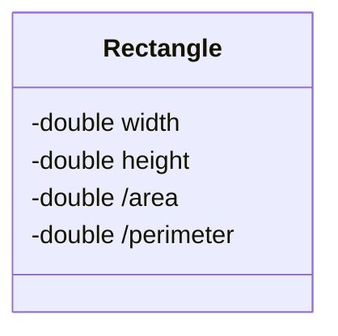

Conceptually:

```text
/area = width × height
/perimeter = 2 × (width + height)
```

Again, the important UML notation is the `/`.

---

## 9. Derived Property vs. Operation

A derived property is different from an operation.

**Derived property**

```text
/totalAmount : double
```

**Operation**

```text
+calculateTotal() : double
```

```text
classDiagram
    class Order {
        -double price
        -int quantity
        -double /totalAmount
        +calculateTotal() : double
    }
```

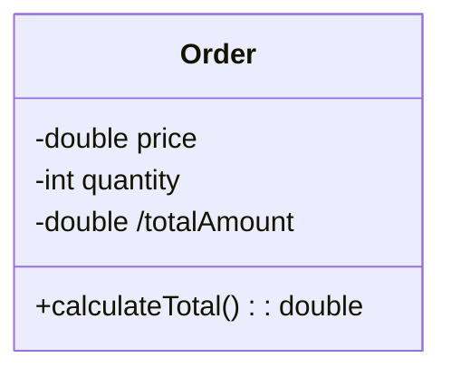

The UML interpretation is:

```text
/totalAmount     → Derived property
calculateTotal() → Operation
```

The derived property represents a value; the operation represents behavior.

---

## 10. Real-World LLD Example

Consider an `Order`.

```text
classDiagram
    class Order {
        -Long id
        -double subtotal
        -double tax
        -double discount
        -double /totalAmount
    }
```

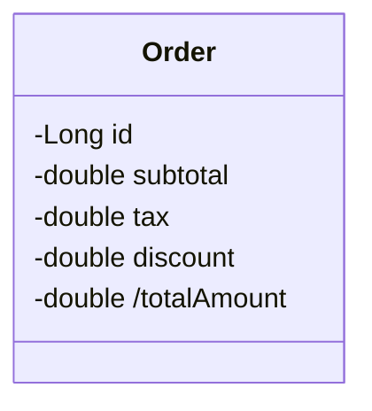

Conceptually:

```text
/totalAmount = subtotal + tax - discount
```

The UML model communicates that `totalAmount` is derived from other information.

---

## 11. Derived Property and Relationships

A derived property can conceptually depend on related objects as well.

```text
classDiagram
    class Order {
        -Long id
        -double /totalAmount
    }
    class OrderItem {
        -double price
        -int quantity
    }
    Order "1" *-- "1..*" OrderItem : contains
```

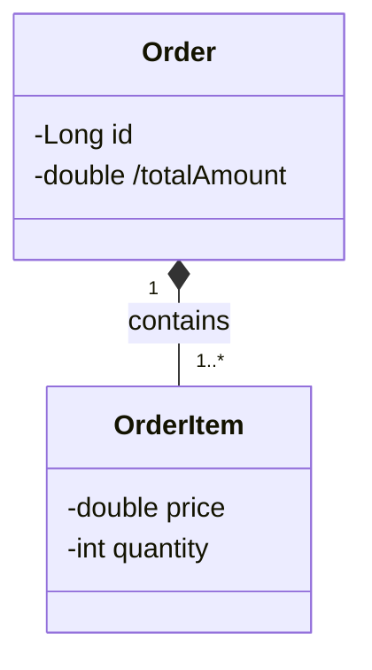

Conceptually:

```text
Order
  │
  └── /totalAmount
           ▲
           │
      OrderItems
```

The `/` communicates that `totalAmount` is derived. The exact calculation is a domain detail; the UML notation identifies the property as derived.

---

## 12. Multiple Derived Properties

A class can contain multiple derived properties.

```text
classDiagram
    class Order {
        -double subtotal
        -double tax
        -double discount
        -double /totalAmount
        -int /itemCount
    }
```

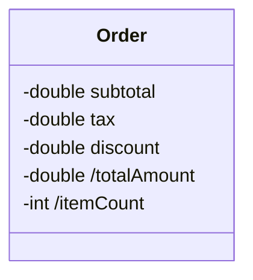

Here:

```text
subtotal, tax, discount   → Normal properties
/totalAmount, /itemCount  → Derived properties
```

---

## 13. Derived Properties in Different Domains

Derived properties can appear in many models.

**User**


**Rectangle**


**Shopping Cart**

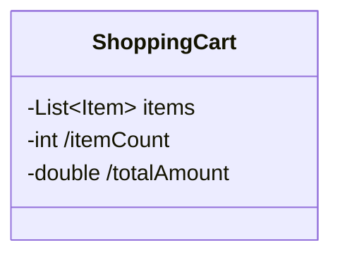

**Order**

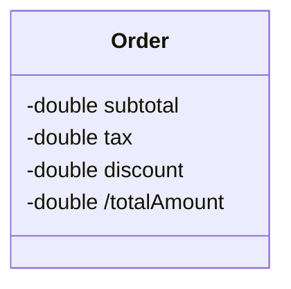

---

## 14. Important UML Perspective

When reading a class diagram:

```text
property   → ordinary property
/property  → derived property
```

The `/` is therefore an important UML visual indicator. Whenever you see `/propertyName`, read it as: **derived property.**

---

## 15. Derived Property vs. Stored Property

The purpose of the notation is to distinguish a value that is derived from other model information.

```text
Order
    subtotal
    tax
    discount
    /totalAmount
```

Conceptually:

```text
subtotal ─┐
tax       ├──→ /totalAmount
discount  ┘
```

The diagram communicates that `totalAmount` depends on other information.

---

## 16. Mermaid Quick Reference

**Normal attribute**

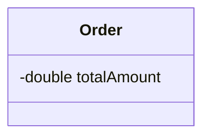

**Derived attribute**

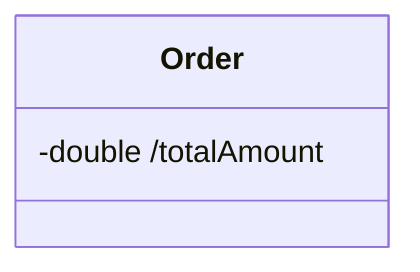

**Multiple derived properties**

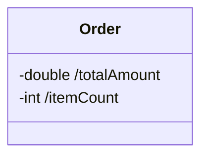

**Derived property with other attributes**

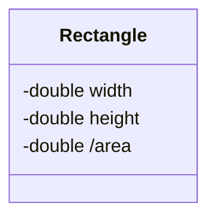

---

## 17. Practice 1

Create a `ShoppingCart` class containing: `items`, `/itemCount`, `/totalAmount`. Indicate that `itemCount` and `totalAmount` are derived properties.

**Solution**

```text
classDiagram
    class ShoppingCart {
        -List~Item~ items
        -int /itemCount
        -double /totalAmount
    }
```


---

## 18. Practice 2

Create a `User` class containing: `firstName`, `lastName`, `/fullName`.

**Solution**

```text
classDiagram
    class User {
        -String firstName
        -String lastName
        -String /fullName
    }
```


---

## 19. Practice 3

Create a `Product` class containing: `price`, `discount`, `/finalPrice`. Represent `finalPrice` as a derived property.

**Solution**

```text
classDiagram
    class Product {
        -double price
        -double discount
        -double /finalPrice
    }
```

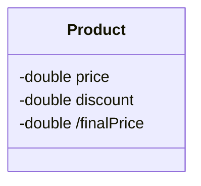

Conceptually:

```text
/finalPrice = price - discount
```

---

## 20. Key Takeaways

1. A derived property is a UML property whose value is derived or calculated from other information.
2. The UML notation is `/propertyName`.
3. The `/` is the derived property indicator.
4. A normal property does not have `/`.
5. Derived properties represent values, not operations.
6. A method/operation is represented separately.
7. Derived properties can depend on:
    - Other properties
    - Related objects
    - Calculated values
8. Mermaid class diagrams can represent derived properties using `/`.

---

## 21. Quick Revision

```text
price : double           → Normal property
/totalAmount : double    → Derived property
calculateTotal() : double → Operation
```

The key notation:

```text
/attributeName
```

means: **this is a derived property.**