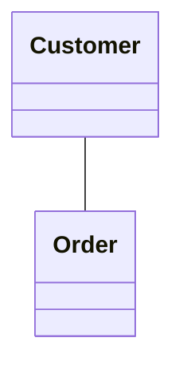
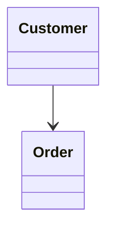
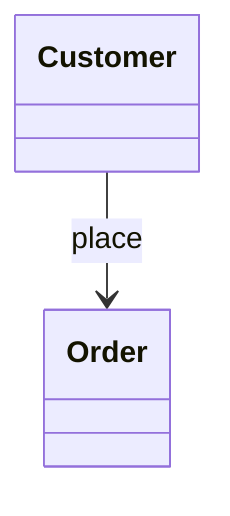
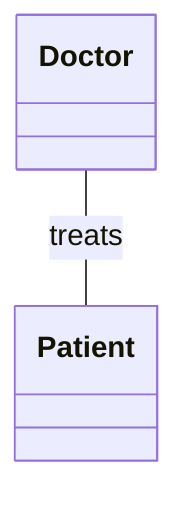
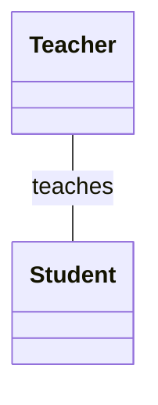
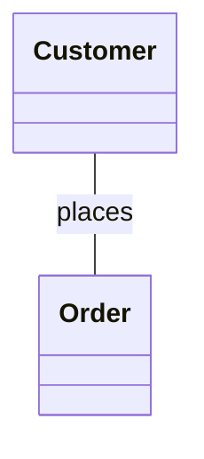
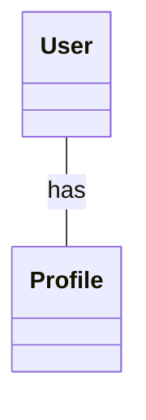
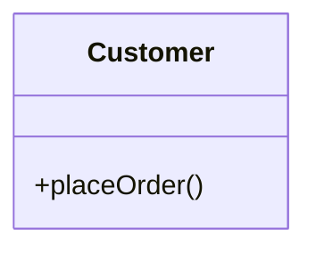
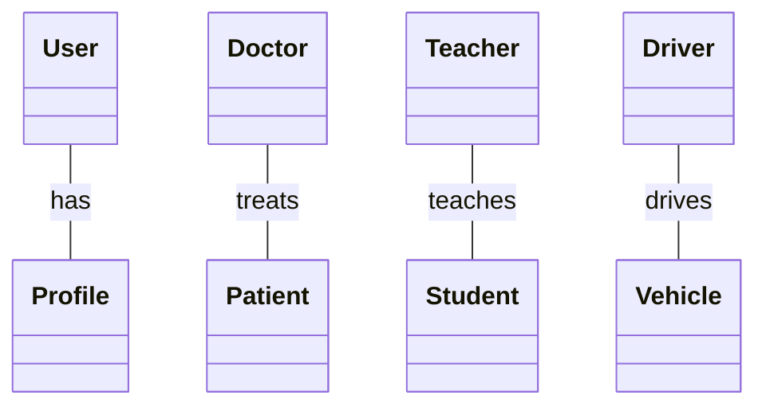
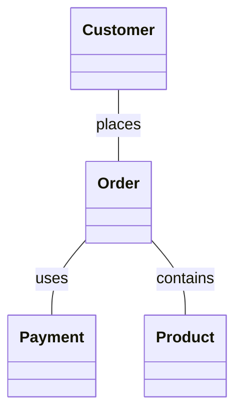

# UML Association

## 1. What is Association?

An **association** represents a structural relationship between two UML elements, usually two classes.

In simple words: *Class A is related to Class B.*

```text
Customer ───────── Order
```

This tells us: **a `Customer` has a relationship with an `Order`.**

Association by itself does *not* tell us:

- how many objects are involved
- who owns whom
- whether one object controls another object's lifecycle
- whether the relationship is navigable in one direction
- whether the relationship is temporary or permanent

Those concepts are represented using additional UML relationships and notations.

---

## 2. Basic Association Notation

The basic UML notation is a solid line connecting two classes.

```text
Customer ───────── Order
```

```text
classDiagram
    Customer -- Order
```



This represents an association between `Customer` and `Order`.

---

## 3. Simple Association

```text
classDiagram
    class Customer
    class Order
    Customer -- Order
```


The meaning is simply:

```text
Customer
    │
    │ association
    │
  Order
```

The diagram tells us that these two classes are related. It does not provide additional information such as multiplicity or ownership.

---

## 4. Directed Association

Association can also show a direction.

```text
Customer ─────────> Order
```

```text
classDiagram
    Customer --> Order
```



This indicates a directed relationship. The exact concept behind the direction is **navigability**, which is covered separately in the next step.

For now, remember:

```text
A -- B   means association
A --> B  means association with a direction shown
```

---

## 5. Association with a Relationship Name

An association can have a label describing the relationship.

```text
classDiagram
    class Customer
    class Order

    Customer --> Order : places
```



This can be read as: *Customer places Order.*

```text
classDiagram
    class Doctor
    class Patient

    Doctor -- Patient : treats
```



This can be read as: *Doctor treats Patient.*

```text
classDiagram
    class Teacher
    class Student

    Teacher -- Student : teaches
```



This can be read as: *Teacher teaches Student.*

The label helps communicate the meaning of the relationship.

---

## 6. Real-World Association Examples

**Customer and Order**

```text
classDiagram
    class Customer
    class Order

    Customer -- Order : places
```



**Doctor and Patient**

```text
classDiagram
    class Doctor
    class Patient

    Doctor -- Patient : treats
```


**Teacher and Student**

```text
classDiagram
    class Teacher
    class Student

    Teacher -- Student : teaches
```


**User and Profile**

```text
classDiagram
    class User
    class Profile

    User -- Profile : has
```


---

## 7. Association Does NOT Automatically Mean Ownership

This is one of the most important points.

```text
classDiagram
    class Customer
    class Order

    Customer -- Order
```


We know `Customer` and `Order` are related. But we **cannot** automatically conclude:

- *Customer owns Order.*
- *Customer controls Order's lifecycle.*
- *Order cannot exist without Customer.*

Those meanings require more specific UML relationships such as **Aggregation** and **Composition**. These will be covered separately.

Therefore: **association should initially be understood as a general relationship between elements.**

---

## 8. Association vs. Operation

Association and operations represent different things.

```text
classDiagram
    class Customer
    class Order

    Customer -- Order : places
```


Here, `Customer ── Order` (labeled `places`) represents a **relationship**.

Compare that with:

```text
classDiagram
    class Customer {
        +placeOrder()
    }
```



Here, `placeOrder()` is an **operation** of the class.

| UML Concept | Represents |
|---|---|
| Association | Relationship between elements |
| Operation | Behavior of a class |

Association answers: *what classes are related?*
An operation answers: *what behavior does this class provide?*

---

## 9. Association in LLD

When reading requirements, look for statements describing relationships.

Examples:

```text
Customer places Order
Doctor treats Patient
Teacher teaches Student
User has Profile
Driver drives Vehicle
Employee works for Company
```

These can indicate potential associations.

```text
classDiagram
    class User
    class Profile

    User -- Profile : has
```


The important thing at this stage is identifying `User ── Profile` as a relationship.

Later, we can add more UML information such as:

```text
Association
    │
    ├── Navigability
    ├── Role names
    ├── Multiplicity
    ├── Aggregation
    └── Composition
```

This is why these concepts are being learned separately.

---

## 10. Association vs. Other UML Relationships

Association is the general relationship concept. Other relationships communicate more specific meanings.

| Relationship | Basic Meaning |
|---|---|
| Association | Related to |
| Dependency | Uses / temporarily depends on |
| Aggregation | Whole-part relationship with weak ownership |
| Composition | Whole-part relationship with strong ownership/lifecycle |
| Generalization | Is-a |
| Realization | Implements a contract |


Do not mix these relationships. For example:

```text
Customer ───── Order
```

is simply an association. It does **not** automatically mean *Customer owns Order*, or *Customer creates Order*, or *Order cannot exist without Customer*. Additional UML semantics are required to express those meanings.

---

## 11. Association and Relationship Labels

Relationship labels make diagrams easier to understand.

**Without a label:**

```text
classDiagram
    Customer -- Order
```


**With a label:**

```text
classDiagram
    Customer -- Order : places
```


The second diagram communicates more clearly what the association represents.

More examples:

```text
classDiagram
    User -- Profile : has
    Doctor -- Patient : treats
    Teacher -- Student : teaches
    Driver -- Vehicle : drives
```


---

## 12. Multiple Associations

A class can participate in multiple associations.

```text
classDiagram
    class Customer
    class Order
    class Payment
    class Product

    Customer -- Order : places
    Order -- Payment : uses
    Order -- Product : contains
```

```text
classDiagram
    class Customer
    class Order
    class Payment
    class Product

    Customer -- Order : places
    Order -- Payment : uses
    Order -- Product : contains
```



Conceptually:

```text
Customer
    │
    │ places
    ▼
  Order
   │    \
   │     \
   ▼      ▼
Payment  Product
```

The important point is that each connection represents a separate association.

---

## 13. Association Without Direction

```text
classDiagram
    Customer -- Order
```


Conceptually:

```text
Customer ───────── Order
```

---

## 14. Association With Direction

```text
classDiagram
    Customer --> Order
```


Conceptually:

```text
Customer ─────────> Order
```

The arrow introduces direction. The detailed meaning of this direction is the topic of **Navigability**.

---

## 15. Important Mermaid Syntax

**Simple association**

```text
classDiagram
    A -- B
```

```mermaid
classDiagram
    A -- B
```

**Directed association**

```text
classDiagram
    A --> B
```

```mermaid
classDiagram
    A --> B
```

**Association with label**

```mermaid
classDiagram
    A -- B : relatedTo
```

**Directed association with label**

```text
classDiagram
    A --> B : uses
```

```mermaid
classDiagram
    A --> B : uses
```

**Multiple associations**

```text
classDiagram
    A -- B
    B -- C
    C -- D
```

```mermaid
classDiagram
    A -- B
    B -- C
    C -- D
```

---

## 16. Practice Questions

**Practice 1**

Requirement: *A Customer places Orders.* Draw the association.

**Solution**

```text
classDiagram
    class Customer
    class Order

    Customer -- Order : places
```

```mermaid
classDiagram
    class Customer
    class Order

    Customer -- Order : places
```

**Practice 2**

Requirement: *A Doctor treats Patients.*

**Solution**

```text
classDiagram
    class Doctor
    class Patient

    Doctor -- Patient : treats
```

```mermaid
classDiagram
    class Doctor
    class Patient

    Doctor -- Patient : treats
```

**Practice 3**

Requirement: *A Teacher teaches Students.*

**Solution**

```mermaid
classDiagram
    class Teacher
    class Student

    Teacher -- Student : teaches
```

**Practice 4**

Requirement: *A User has a Profile.*

**Solution**

```text
classDiagram
    class User
    class Profile

    User -- Profile : has
```

```mermaid
classDiagram
    class User
    class Profile

    User -- Profile : has
```

**Practice 5**

Identify the UML relationship:

```text
classDiagram
    class User
    class Profile

    User -- Profile
```

```mermaid
classDiagram
    class User
    class Profile

    User -- Profile
```

**Solution**

The relationship is **Association**. The diagram simply indicates that `User` and `Profile` are related. It does not specify ownership, multiplicity, lifecycle, or navigability.

---

## 17. Association Mental Model

When you see:

```text
A ───── B
```
think: *A is related to B.*

When you see:

```text
A ───── B : relationship
```
think: *A has a specific relationship with B.*

When you see:

```text
A ─────> B
```
think: *there is a directed association from A toward B.*

The detailed meaning of that direction will be covered in Navigability.

---

## 18. Key Takeaways

1. **Association represents a relationship.**

```text
Customer ───── Order
```
    means *Customer and Order are related.*

2. **Association is represented by a solid line:**

```text
A ───── B
```

3. **Mermaid syntax:**

```text
classDiagram
    A -- B
```

```mermaid
classDiagram
    A -- B
```

4. **Association can have a label:**

```text
classDiagram
    A -- B : relatesTo
```

```mermaid
classDiagram
    A -- B : relatesTo
```

5. **Association can show direction:**

```text
classDiagram
    A --> B
```

```mermaid
classDiagram
    A --> B
```

6. **Association does not automatically mean ownership** — ownership/lifecycle semantics belong to more specific relationships.

7. **Association is different from an operation:**

    ```text
    Association → relationship between classes
    Operation   → behavior of a class
    ```
