# UML Navigability

## 1. What is Navigability?

**Navigability** tells us: *in which direction can we navigate from one class to another through an association?*

```text
Customer ─────────> Order
```

This indicates `Customer → Order`. The relationship is navigable from `Customer` toward `Order`.

Navigability adds directional information to an association.

---

## 2. Association vs. Navigability

**Association** tells us two classes are related:

```text
Customer ───────── Order
```

**Navigability** tells us in which direction the relationship can be navigated:

```text
Customer ─────────> Order
```

```text
Association    → Relationship exists
Navigability   → Direction of navigation
```

---

## 3. Basic Navigability Notation

A directed association can be represented as:

```text
A ─────────> B
```

Meaning: `A → B`.

```text
classDiagram
    A --> B
```

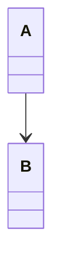

The arrow points toward the navigable target.

---

## 4. Unidirectional Navigability

When navigation is represented in only one direction, we have **unidirectional navigability**.

```text
A ─────────> B
```

```text
classDiagram
    class Customer
    class Order

    Customer --> Order
```

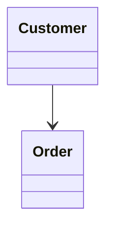

Direction: `Customer → Order`. The diagram explicitly shows navigation from `Customer` toward `Order`.

---

## 5. Bidirectional Navigability

Sometimes navigation is represented in both directions.

```text
A <────────> B
```

This means `A → B` and `B → A`.

```text
classDiagram
    class Customer
    class Order

    Customer <--> Order
```

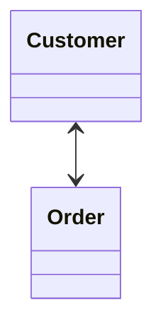

Conceptually:

```text
Customer ─────────> Order
Customer <───────── Order
```

Therefore: `Customer ↔ Order`.

---

## 6. Three Important Association Forms

**Association without explicit direction**

```text
A ───────── B
```

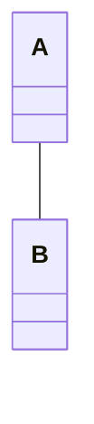

Think: *A and B are related.*

**Unidirectional association**

```text
A ─────────> B
```


Think: *A can navigate toward B.*

**Bidirectional association**

```text
A <────────> B
```

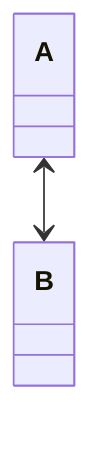

Think: *A and B can navigate toward each other.*

---

## 7. Real-World Example — User and Profile

**Unidirectional:**

```text
classDiagram
    class User
    class Profile

    User --> Profile
```

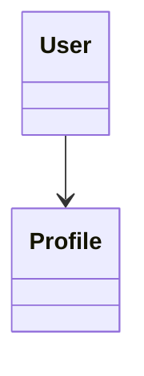

Meaning: `User → Profile`. The relationship is navigable from `User` toward `Profile`.

**Bidirectional:**

```text
classDiagram
    class User
    class Profile

    User <--> Profile
```

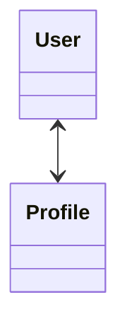

Meaning: `User → Profile` and `Profile → User`. Both directions are represented.

---

## 8. Navigability with Relationship Labels

Navigability can be combined with a relationship label.

```text
classDiagram
    class Customer
    class Order

    Customer --> Order : places
```

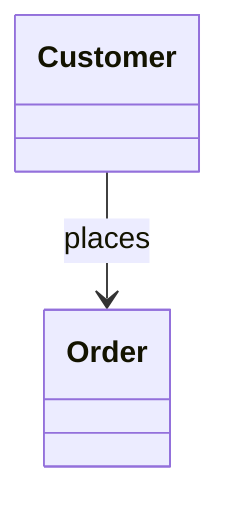

There are two pieces of information here:

```text
Customer ─────────> Order
         places
```

The arrow `-->` communicates direction. The label `places` describes the relationship.

```text
Arrow → navigation direction
Label → relationship meaning
```

---

## 9. Doctor and Patient Example

```text
classDiagram
    class Doctor
    class Patient

    Doctor --> Patient : treats
```

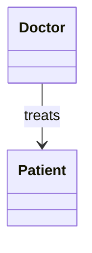

Navigation: `Doctor → Patient`. Relationship: `treats`.

So the diagram communicates: *Doctor treats Patient, with navigation from Doctor toward Patient.*

---

## 10. Bidirectional Example

```text
classDiagram
    class User
    class Profile

    User <--> Profile : associatedWith
```

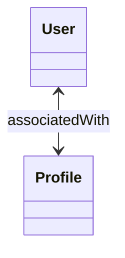

Navigation: `User → Profile` and `Profile → User`. The relationship is navigable in both directions.

---

## 11. Navigability Is About the Relationship

```text
classDiagram
    Customer --> Order : places
```


The arrow does *not* primarily mean *Customer places Order first and then Order exists.* Instead, the arrow communicates the **direction of navigation**. The label `places` describes the relationship.

```text
Arrow → Direction
Label → Meaning of relationship
```

---

## 12. Navigability Does Not Mean Ownership

```text
classDiagram
    class Customer
    class Order

    Customer --> Order
```


This does **not** automatically mean *Customer owns Order.* It means `Customer → Order`.

Ownership and lifecycle semantics require other UML relationship types — **Aggregation** and **Composition** — covered later.

---

## 13. Navigability Does Not Mean Inheritance

```text
classDiagram
    Customer --> Order
```


This is an association. It does **not** mean *Customer is an Order.* Inheritance/generalization uses a different UML relationship:

```text
Child ─────▷ Parent
```

Generalization will be covered separately.

---

## 14. Navigability Does Not Mean Dependency

**Association:**

```text
A ─────────> B
```

**Dependency:**

```text
A - - - - -> B
```

Important visual difference:

```text
Association → solid line
Dependency  → dashed line
```

Dependency will be covered separately. For now, remember: **a solid line with an arrow represents a directed association/navigability relationship.**

---

## 15. Unidirectional vs. Bidirectional

| UML | Meaning |
|---|---|
| `A -- B` | Association without explicit direction |
| `A --> B` | Navigation from A to B |
| `A <--> B` | Navigation in both directions |

Conceptually:

```text
A ───── B
A ─────> B
A <────> B
```

---

## 16. LLD Example

Consider an e-commerce system:

```text
classDiagram
    class Customer
    class Order
    class Payment

    Customer --> Order : places
    Order --> Payment : uses
```

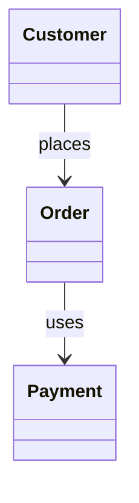

Navigation: `Customer → Order`, `Order → Payment`. The arrows communicate the modeled navigation directions.

---

## 17. Multiple Navigable Associations

A class can participate in multiple navigable relationships.

```text
classDiagram
    class Customer
    class Order
    class Payment
    class Product

    Customer --> Order
    Order --> Payment
    Order --> Product
```

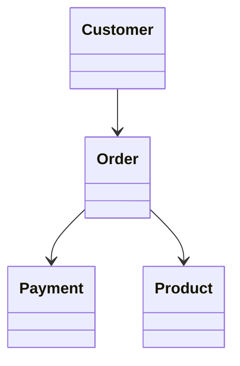

The diagram communicates: `Customer → Order`, `Order → Payment`, `Order → Product`. Each arrow represents a navigation direction for its corresponding association.

---

## 18. Important Mermaid Syntax

**Simple association**


**Unidirectional association**


**Bidirectional association**


**Directed association with label**

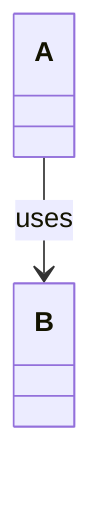

**Bidirectional association with label**

```mermaid
classDiagram
    A <--> B : interacts
```

---

## 19. Practice Questions

**Practice 1**

Requirement: *A Customer can navigate to its Orders.* Model the relationship.

**Solution**

```mermaid
classDiagram
    class Customer
    class Order

    Customer --> Order
```

Navigation: `Customer → Order`.

**Practice 2**

Requirement: *A User can navigate to Profile, and Profile can navigate back to User.*

**Solution**

```mermaid
classDiagram
    class User
    class Profile

    User <--> Profile
```

Navigation: `User → Profile`, `Profile → User`.

**Practice 3**

Identify the navigation direction:

```mermaid
classDiagram
    class Doctor
    class Patient

    Doctor --> Patient
```

**Solution**

`Doctor → Patient` — navigation is represented from `Doctor` toward `Patient`.

**Practice 4**

What does this diagram communicate?

```mermaid
classDiagram
    class Customer
    class Order

    Customer -- Order
```

**Solution**

It represents an association without an explicitly shown navigation direction. It does not explicitly communicate `Customer → Order` or `Order → Customer`.

**Practice 5**

What is the difference between these?

**Diagram A**

```mermaid
classDiagram
    A -- B
```

**Diagram B**

```mermaid
classDiagram
    A --> B
```

**Solution**

Diagram A (`A ───── B`) represents an association without an explicitly shown navigation direction.

Diagram B (`A ─────> B`) represents a directed/navigable association from `A` toward `B`.

---

## 20. UML Mental Model

When you see:

```text
A ─────────> B
```
ask: *can I navigate from A to B through this relationship?*

When you see:

```text
A <────────> B
```
ask: *can I navigate in both directions?*

This is the core mental model for navigability.

---

## 21. Association vs. Navigability

Keep this distinction clear:

```text
Association    → A relationship exists
Navigability   → Direction of navigation is specified
```

```text
A ───────── B
```
versus:
```text
A ─────────> B
```

The second diagram gives additional directional information.

---

## 22. Key Takeaways

1. **Navigability specifies direction.**

    ```text
    A ─────> B
    ```
    means `A → B`.

2. **Unidirectional navigation:**

    ```text
    A ─────> B
    ```
    Navigation is represented from A toward B.

3. **Bidirectional navigation:**

    ```text
    A <────> B
    ```
    Navigation is represented in both directions.

4. **Association and navigability are related but different:**

    ```text
    Association   → Relationship
    Navigability  → Direction
    ```

5. **Arrow direction is not ownership.**

    ```text
    A ─────> B
    ```
    does not automatically mean *A owns B.*

6. **Relationship labels and arrows have different purposes:**

    ```text
    A ─────> B : places
    ```
    means:
    ```text
    Arrow  → navigation direction
    places → relationship meaning
    ```

---

## 23. Mermaid Cheat Sheet for Navigability

```text
A -- B                  → Association without explicit direction
A --> B                 → Navigation from A to B
A <--> B                → Navigation in both directions
A --> B : uses          → Directed association with a relationship label
A <--> B : interacts    → Bidirectional association with a relationship label
```
