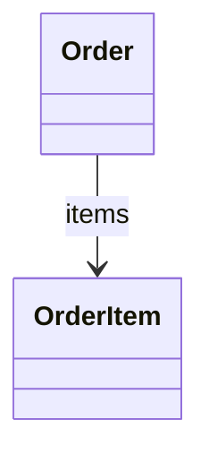
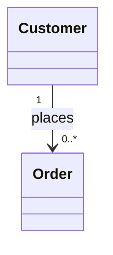
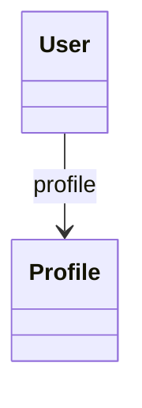
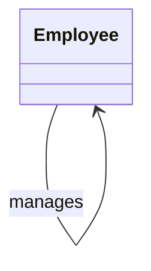
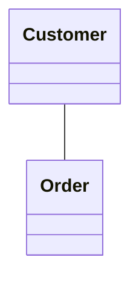
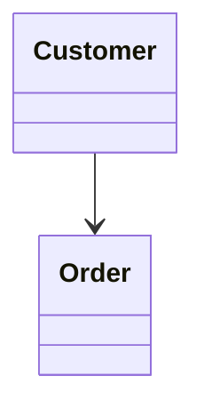
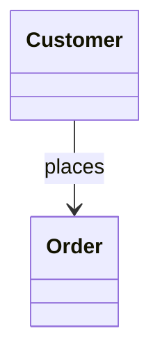

# UML Role Names

## 1. What is a Role Name?

A **role name** describes the role that one class plays at an association end, from the perspective of the other class.

Consider:

```text
Customer ───────── Order
```

The association tells us `Customer` and `Order` are related. A role name gives additional meaning to one end of that association.

```text
Customer ───────── Order
                    orders
```

The role name `orders` describes what the `Order` end represents from the perspective of `Customer`.

---

## 2. Role Names Belong to Association Ends

An association has two ends:

```text
Customer ───────── Order
   ↑                   ↑
  end                  end
```

A role name is attached to an association end.

```text
Class ───────── Class
  ↑                ↑
role              role
name              name
```

Therefore, don't think of a role name as simply being "the name of the line." Think: **a role name identifies the role played by an association end.**

---

## 3. Simple Example

```text
Customer ───────── Order
                    orders
```

The role name is `orders`. It describes the `Order` association end.

Conceptually: *from the perspective of a Customer, the associated Orders are its orders.*

---

## 4. Role Name vs. Relationship Label

This distinction is extremely important.

```text
Customer ───────── Order
          places
```

`places` describes the relationship/action — it is a **relationship label**.

```text
Customer ───────── Order
                    orders
```

`orders` describes the role played by the `Order` association end — it is a **role name**.

```text
Relationship label → What is the relationship?
Role name          → What role does this association end play?
```

Easy mental model:

```text
Relationship label = relationship meaning
Role name          = role of an association end
```

---

## 5. Role Name Is Not a Class Name

```text
Customer ───────── Order
                    orders
```

Here: `Customer` → class, `Order` → class, `orders` → role name. The role name does not replace the class name.

---

## 6. Role Name Is Not an Attribute

```text
Customer ───────── Order
                    orders
```

`orders` is a role name. It does **not** automatically mean that the UML class must contain an attribute named `orders`.

The UML diagram is describing a relationship. The eventual implementation may represent that relationship using a reference or collection, but that's a separate design concern.

For UML learning: **don't automatically turn every role name into an attribute.**

---

## 7. Role Name on One End

A role name can be specified on only one association end.

```text
Customer ───────── Order
                    orders
```

The `Order` end has the role name `orders`. The `Customer` end does not have an explicitly specified role name.

---

## 8. Role Names on Both Ends

Both association ends can have role names.

```text
Customer ───────── Order
 customer            orders
```

Both ends now have explicit roles. Another example:

```text
Teacher ───────── Student
 teacher            students
```

The association ends are explicitly named `teacher` and `students`.

---

## 9. Role Names + Multiplicity

Role names become especially useful when combined with multiplicity.

```text
Customer "1" ───────── "0..*" Order
                                orders
```

Conceptually:

```text
Customer ───────── Order
    1                0..*
                     orders
```

This can be read as: *a Customer is associated with zero or more Orders, represented by the `orders` role.*

Multiplicity is a separate UML concept and will be studied in more depth later. For now, understand that role names make association ends easier to interpret.

---

## 10. Example — Company and Employee

```text
Company ───────── Employee
```

Possible role names:

```text
Company ───────── Employee
 company            employees
```

The `Employee` end has the role `employees`. This communicates: *employees are associated with the Company through the `employees` role.*

---

## 11. Example — Library and Book

```text
Library ───────── Book
                    books
```

The role name is `books`. This describes what the `Book` association end represents from the `Library`'s perspective.

---

## 12. Example — Order and OrderItem

This is useful in LLD.

```text
Order ───────── OrderItem
                  items
```

The role name is `items`. It tells us: *the `OrderItem` end represents the items associated with an `Order`.*

**Mermaid approximation:**

```text
classDiagram
    class Order
    class OrderItem

    Order --> OrderItem : items
```



Important: in this Mermaid example, `items` is technically an *association label*, used to communicate the role concept. It is not the full dedicated UML association-end role-name notation.

---

## 13. Mermaid and Role Names

Mermaid's `classDiagram` syntax does not provide the same complete association-end role-name notation available in specialized UML tools.

```text
classDiagram
    Customer "1" --> "0..*" Order : places
```



Here, `places` is a relationship label — it is not a dedicated UML role-end name.

For LLD diagrams using Mermaid, labels can often communicate the intended meaning clearly. However, conceptually we should understand the distinction:

```text
UML role name  ≠  association label
```

---

## 14. Role Name + Navigability

Role names can be combined conceptually with navigability.

```text
Customer ─────────> Order
                     orders
```

There are two pieces of information:

```text
Arrow  → Navigation direction
orders → Role at the Order association end
```

Navigability and role names are separate UML concepts.

---

## 15. Example — User and Profile

```text
User ───────── Profile
                profile
```

The role name `profile` describes the role played by the `Profile` end.

**Mermaid approximation:**

```text
classDiagram
    class User
    class Profile

    User --> Profile : profile
```



---

## 16. Self-Association

A **self-association** occurs when a class is associated with itself.

```text
Employee ───────── Employee
```

This can represent: *an Employee manages another Employee.*

The problem is that both association ends refer to the same class. Role names make the relationship much clearer.

```text
Employee ───────── Employee
 manager             employees
```

Now we can distinguish the two ends.

---

## 17. Self-Association with Role Names

The relationship can be understood as:

```text
Employee A
    │
    │ manages
    ▼
Employee B
```

The association ends can have roles: `manager`, `employees`.

**Mermaid approximation:**

```text
classDiagram
    class Employee

    Employee --> Employee : manages
```



In a full UML model, the association ends could be explicitly named `manager` and `employees`. This is one of the most useful practical applications of role names.

---

## 18. Why Self-Association Needs Role Names

Without role names:

```text
Employee ───────── Employee
```

It's ambiguous. Which Employee is the manager? The subordinate? The reporting employee?

With role names:

```text
Employee ───────── Employee
 manager             employees
```

the two ends become meaningful.

---

## 19. Role Names in Complex Models

```text
User ───────── User
```

Both ends represent the same class. Role names can distinguish them:

```text
User ───────── User
 sender          receiver
```

Now we know the purpose of each association end. This is especially useful for:

- Self-associations
- Recursive relationships
- Multiple relationships between the same classes
- Complex domain models

---

## 20. Multiple Relationships Between the Same Classes

Suppose two classes can have more than one relationship.

```text
Employee ───────── Company
```

One relationship could represent `worksFor`. Another could represent `manages`.

Role names and relationship labels can help distinguish the association ends and their meanings.

The general lesson: **use names when a plain line is not sufficiently clear.**

---

## 21. Role Names and Association Ends

Always remember the concept visually:

```text
Class A ───────────────── Class B
   ↑                            ↑
association end          association end
   ↑                            ↑
role name                  role name
```

A role name belongs to the end, not to the class itself.

---

## 22. Relationship Label vs. Role Name — Final Comparison

**Relationship label**

```text
Customer ───────── Order
          places
```

Answers: *what relationship exists?* Answer: `places`.

**Role name**

```text
Customer ───────── Order
                    orders
```

Answers: *what role does this association end play?* Answer: `orders`.

**Mental shortcut:**

```text
Relationship label → Meaning of relationship
Role name          → Meaning of association end
```

---

## 23. Mermaid Syntax Used in Practice

**Association**



**Directed association**



**Association with label**



**Association with multiplicity and label**


Here: `1` and `0..*` → multiplicity, `places` → relationship label. This is useful for visually communicating role-like meaning in Mermaid.

---

## 24. Practice Questions

**Practice 1**

Identify the role name:

```text
Customer ───────── Order
                    orders
```

**Solution**

The role name is `orders`. It belongs to the `Order` association end.

**Practice 2**

What is the difference between:

```text
Customer ───────── Order
          places
```

and:

```text
Customer ───────── Order
                    orders
```

**Solution**

`places` is a relationship label — it describes the relationship *Customer places Order*.

`orders` is a role name — it describes the role played by the `Order` association end.

**Practice 3**

Identify the role names:

```text
Employee ───────── Employee
 manager             employees
```

**Solution**

The two role names are `manager` and `employees`. They distinguish the two association ends of the self-association.

**Practice 4**

Why are role names particularly useful in this diagram?

```text
User ───────── User
```

**Solution**

Both ends refer to the same class. Without role names, it's ambiguous which `User` plays which role. Role names can clarify the ends:

```text
User ───────── User
 sender          receiver
```

**Practice 5**

Is `places` in the following Mermaid diagram a dedicated UML role name?


**Solution**

No. In Mermaid, `places` is an association/relationship label. It can communicate the relationship meaning, but it's not the same thing as dedicated UML association-end role-name notation.

---

## 25. Key Takeaways

1. **Role names belong to association ends:**

    ```text
    A ───────── B
                role
    ```

2. **A role name describes the role played by that end:**

    ```text
    Customer ───────── Order
                        orders
    ```

3. **Relationship labels and role names are different:**

    ```text
    places → relationship label
    orders → role name
    ```

4. **Role names are especially useful for self-associations:**

    ```text
    Employee ───────── Employee
     manager             employees
    ```

5. **Role names are not class names:**

    ```text
    Customer → class
    Order    → class
    orders   → role
    ```

6. **Role names are not automatically attributes.** A role name describes an association end — it does not automatically mean an attribute must be created.

7. **Mermaid has limitations.** Mermaid can easily represent association labels:

    ```mermaid
    classDiagram
        Customer --> Order : places
    ```

    but does not provide the same dedicated association-end role-name notation available in specialized UML tools. For our LLD work, we'll use Mermaid where it communicates the model clearly while keeping the underlying UML concept correct.

