# UML Generalization

## 1. What is Generalization?

**Generalization** represents an "is-a" relationship between two classifiers. It means that a more specific class is a specialized form of a more general class.

Examples:

- `Car` is a `Vehicle`
- `Bike` is a `Vehicle`
- `Dog` is an `Animal`
- `SavingsAccount` is an `Account`

Generalization is commonly used to represent an inheritance hierarchy in an object-oriented design.

---

## 2. Generalization in UML

Generalization is represented using a **solid line** with a **hollow triangle**. The triangle points toward the general/parent class.

```text
Car ─────────▷ Vehicle
```

This means: *Car is a Vehicle.*

---

## 3. Mermaid Syntax

The Mermaid syntax for generalization is:

```text
Parent <|-- Child
```

```text
classDiagram
    class Vehicle
    class Car

    Vehicle <|-- Car
```

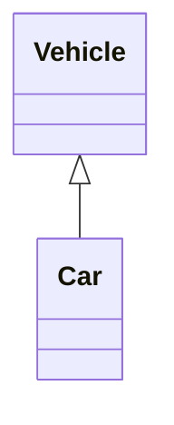

The important syntax is `<|--`. So `Vehicle <|-- Car` means: *Car is a specialized form of Vehicle.*

---

## 4. Direction of the Generalization Arrow

One of the most important things to remember: **the hollow triangle points toward the general/parent class.**

```text
Vehicle
   ▲
   │
  Car
```

```text
classDiagram
    class Vehicle
    class Car

    Vehicle <|-- Car
```


Here: `Vehicle` = general class, `Car` = specialized class, and the triangle points toward `Vehicle`.

---

## 5. Multiple Generalizations

A general class can have multiple specialized classes.

```text
classDiagram
    class Vehicle

    class Car
    class Bike
    class Truck
    Vehicle <|-- Car
    Vehicle <|-- Bike
    Vehicle <|-- Truck
```

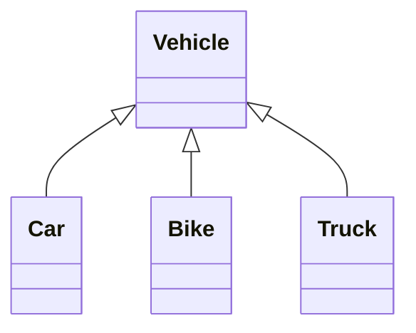

Conceptually:

```text
                Vehicle
                   ▲
          ┌────────┼────────┐
          │        │        │
         Car      Bike     Truck
```

This means: `Car` is a `Vehicle`, `Bike` is a `Vehicle`, `Truck` is a `Vehicle`.

---

## 6. Generalization with an Abstract Class

Generalization is commonly used together with abstract classes.

```text
classDiagram
    class Payment {
        <<abstract>>
    }

    class CreditCardPayment
    class UPIPayment
    class CashPayment
    Payment <|-- CreditCardPayment
    Payment <|-- UPIPayment
    Payment <|-- CashPayment
```

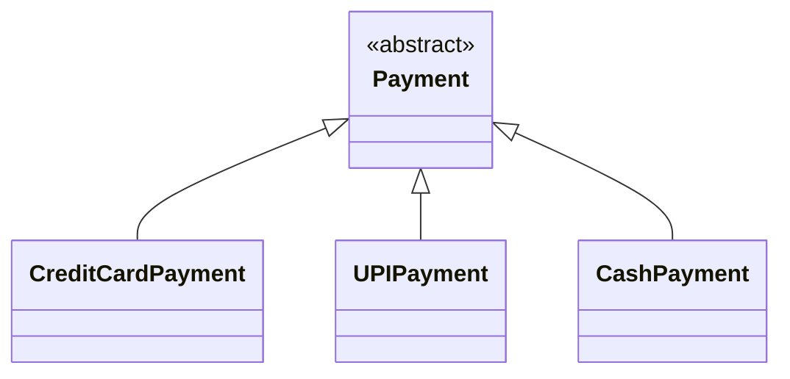

Conceptually:

```text
                Payment
                   ▲
          ┌────────┼────────┐
          │        │        │
      CreditCard  UPI      Cash
```

Here: `Payment` is the general concept, and `CreditCardPayment`, `UPIPayment`, `CashPayment` are specialized types.

---

## 7. Multi-Level Generalization

Generalization can contain multiple levels.

```text
classDiagram
    class Animal
    class Mammal
    class Dog

    Animal <|-- Mammal
    Mammal <|-- Dog
```

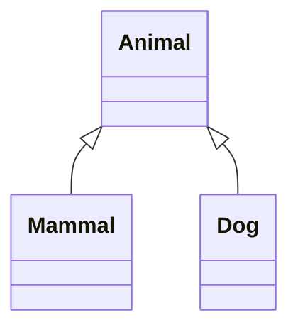

Conceptually:

```text
Animal
  ▲
  │
Mammal
  ▲
  │
 Dog
```

This represents: `Dog is a Mammal`, `Mammal is an Animal`. Therefore, indirectly: `Dog is an Animal`.

---

## 8. Generalization vs. Association

These two relationships have completely different meanings.

**Association**

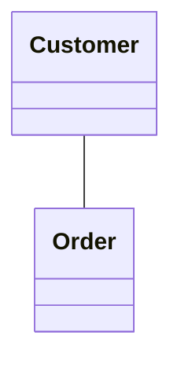

Meaning: *Customer is related to Order.* It does not say that one class is a specialized type of the other.

**Generalization**


Meaning: *Car is a Vehicle.*

Quick distinction:

```text
Association    → "is related to"
Generalization → "is a"
```

---

## 9. Generalization vs. Realization

**Generalization:**

```text
classDiagram
    class Vehicle
    class Car

    Vehicle <|-- Car
```


Relationship: `Class → Class`. Meaning: *Car is a specialized Vehicle.*

**Realization:**

```text
classDiagram
    class PaymentService {
        <<interface>>
        +pay()
    }

    class UPIPayment {
        +pay()
    }
    PaymentService <|.. UPIPayment
```

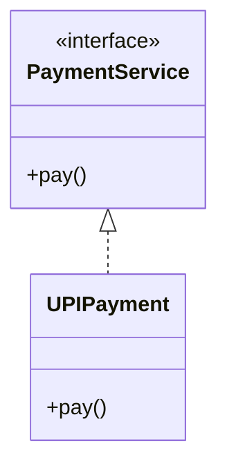

Relationship: `Class → Interface`. Meaning: *UPIPayment realizes the contract represented by PaymentService.*

The visual difference is important:

```text
Generalization:  ─────────▷   (solid line + hollow triangle)
Realization:     - - - - -▷   (dashed line + hollow triangle)
```

---

## 10. Generalization vs. Dependency

**Generalization:**

```text
classDiagram
    Vehicle <|-- Car
```


Means: *Car is a Vehicle.*

**Dependency:**

```text
classDiagram
    OrderService ..> Dependency
```

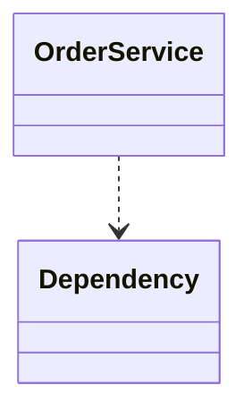

Means approximately: *OrderService depends on or uses PaymentService.*

The important distinction:

```text
Generalization → "is-a"
Dependency     → "depends on / uses"
```

Dependency will be covered separately.

---

## 11. Generalization is a Semantic Relationship

The relationship symbol itself carries meaning. Compare:

```text
classDiagram
    Customer -- Order
```


with:

```text
classDiagram
    Order <|-- OnlineOrder
```

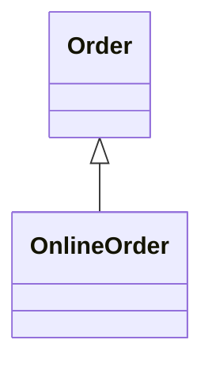

The first means: *Customer is related to Order.*
The second means: *OnlineOrder is an Order.*

Therefore, in UML: **the shape and style of a relationship line are important because they communicate different meanings.**

---

## 12. Common Generalization Examples

**Vehicle hierarchy**

```text
classDiagram
    Vehicle <| -- Car
    Vehicle <| -- Bike
    Vehicle <| -- Truck
```


**Payment hierarchy**

```text
classDiagram
    Payment <|-- CardPayment
    Payment <|-- UPIPayment
    Payment <|-- CashPayment
```

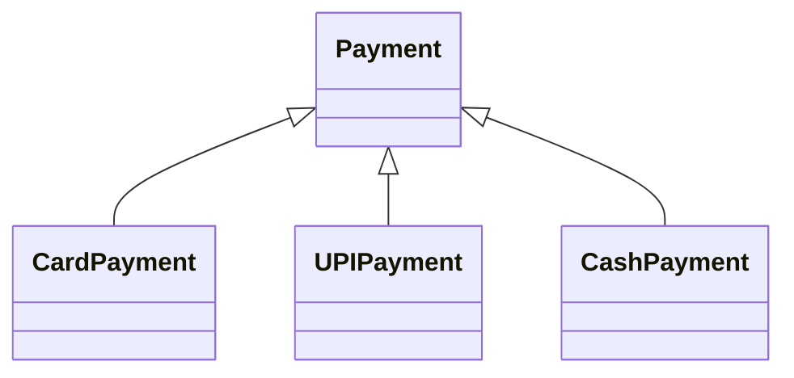

**Account hierarchy**

```text
classDiagram
    Account <|-- SavingsAccount
    Account <|-- CurrentAccount
```


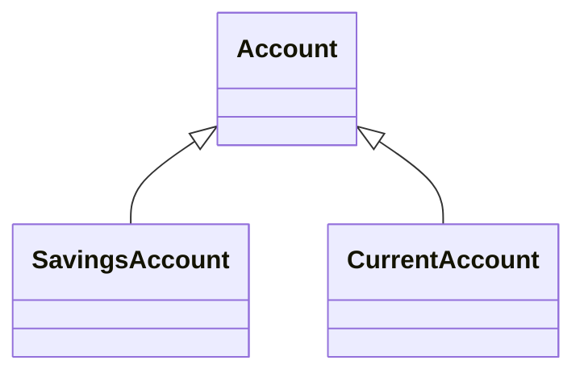

**Employee hierarchy**

```text
classDiagram
    Employee <|-- Developer
    Employee <|-- Manager
```


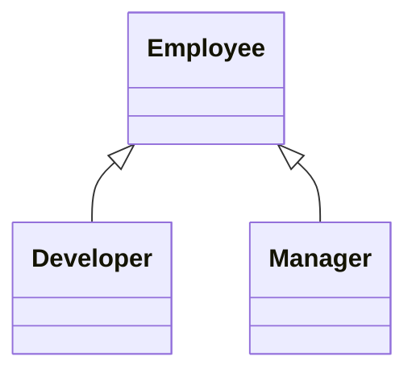

The common pattern:

```text
Specific Class
      │
      ▼
General Class
```

---

## 13. Generalization Mental Model

Whenever you see a possible relationship between two classes, ask: *"Is one class a specialized type of the other?"* If yes, generalization may be appropriate.

Examples:

```text
Dog → Animal
Car → Vehicle
SavingsAccount → Account
Manager → Employee
```

All represent an "is-a" relationship.

---

## 14. Mermaid Syntax Cheat Sheet

**Basic generalization**

```text
classDiagram
    Parent <|-- Child
```

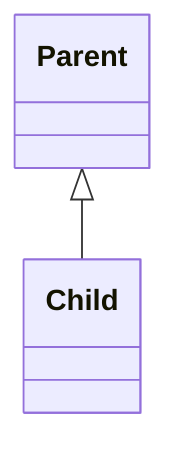

**Multiple children**

```text
classDiagram
    Vehicle <|-- Car
    Vehicle <|-- Bike
    Vehicle <|-- Truck
```


**Multi-level generalization**

```text
classDiagram
    Animal <|-- Mammal
    Mammal <|-- Dog
```

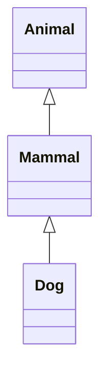

**Abstract parent**

```text
classDiagram
    class Payment {
        <<abstract>>
    }

    Payment <|-- CreditCardPayment
    Payment <|-- UPIPayment
```


```mermaid
classDiagram
    class Payment {
        <<abstract>>
    }

    Payment <|-- CreditCardPayment
    Payment <|-- UPIPayment
```

---

## 15. Practice 1

**Requirement:** model this relationship — `Car` and `Bike` are specialized types of `Vehicle`.

**Solution**

```text
classDiagram
    class Vehicle
    class Car
    class Bike

    Vehicle <|-- Car
    Vehicle <|-- Bike
```

```mermaid
classDiagram
    class Vehicle
    class Car
    class Bike

    Vehicle <|-- Car
    Vehicle <|-- Bike
```

---

## 16. Practice 2

**Requirement:** model `UPIPayment`, `CardPayment`, and `CashPayment` as specialized types of an abstract `Payment`.

**Solution**

```text
classDiagram
    class Payment {
        <<abstract>>
    }

    class UPIPayment
    class CardPayment
    class CashPayment
    Payment <|-- UPIPayment
    Payment <|-- CardPayment
    Payment <|-- CashPayment
```

```mermaid
classDiagram
    class Payment {
        <<abstract>>
    }

    class UPIPayment
    class CardPayment
    class CashPayment

    Payment <|-- UPIPayment
    Payment <|-- CardPayment
    Payment <|-- CashPayment
```

---

## 17. Practice 3

**Requirement:** create a three-level generalization hierarchy:

```text
Animal
  ↓
Mammal
  ↓
 Dog
```

**Solution**

```text
classDiagram
    class Animal
    class Mammal
    class Dog

    Animal <|-- Mammal
    Mammal <|-- Dog
```

```mermaid
classDiagram
    class Animal
    class Mammal
    class Dog

    Animal <|-- Mammal
    Mammal <|-- Dog
```

---

## 18. Important UML Notation

| UML Concept | Meaning | Mermaid |
|---|---|---|
| Generalization | "is-a" | `Parent <\|-- Child` |
| Association | General relationship | `A -- B` |
| Directed Association | Navigable relationship | `A --> B` |
| Realization | Implements a contract/interface | `Interface <\|.. Class` |
| Dependency | Depends on/uses | `A ..> B` |
| Abstract class | Abstract classifier | `<<abstract>>` |
| Interface | Interface classifier | `<<interface>>` |

---

## 19. Key Takeaways

1. Generalization represents an "is-a" relationship.
2. It connects a specialized classifier to a more general classifier.
3. The UML notation is a solid line + hollow triangle.
4. The triangle points toward the general/parent class.
5. Mermaid syntax: `Parent <|-- Child`
6. Generalization can have multiple specialized classes.
7. Generalization can contain multiple levels.
8. Generalization is different from association.
9. Generalization is different from realization.
10. Generalization is different from dependency.

---

## 20. One-Line Memory Trick

```text
<|--  =  Generalization  =  "is-a"
```

Example: `Vehicle <|-- Car` — read it as: *Car is a Vehicle.*
