# UML Realization

## 1. What is Realization?

**Realization** represents a relationship where one classifier fulfills the contract or specification defined by another classifier.

The most common UML example:

- An interface defines a contract.
- A concrete class realizes that contract.

Conceptually:

```text
PaymentService
      ▲
      ┆
      ┆
  UPIPayment
```

Meaning: *`UPIPayment` realizes the contract defined by `PaymentService`.*

---

## 2. UML Realization Notation

Realization is represented using a **dashed line** with a **hollow triangle**. The triangle points toward the classifier being realized.

```text
UPIPayment - - - - -▷ PaymentService
```

```text
classDiagram
    class PaymentService {
        <<interface>>
        +pay()
    }

    class UPIPayment {
        +pay()
    }
    PaymentService <|.. UPIPayment
```

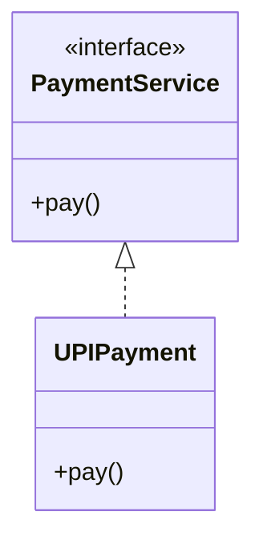

The important Mermaid syntax is `<|..`. So `PaymentService <|.. UPIPayment` means: *`UPIPayment` realizes `PaymentService`.*

---

## 3. Why is the Line Dashed?

The dashed line distinguishes realization from generalization.

**Generalization**

```text
Car ─────────▷ Vehicle
```

Uses a solid line.

```text
classDiagram
    Vehicle <| -- Car
```

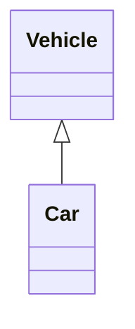

**Realization**

```text
UPIPayment - - - -▷ PaymentService
```

Uses a dashed line.

```text
classDiagram
    PaymentService <|.. UPIPayment
```

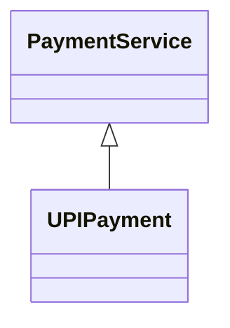

Remember:

```text
<|--  → Generalization
<|..  → Realization
```

---

## 4. Realization with an Interface

The most common usage of realization is connecting an interface to one or more implementing classes.

```text
classDiagram
    class PaymentService {
        <<interface>>
        +pay()
    }

    class CreditCardPayment {
        +pay()
    }
    class UPIPayment {
        +pay()
    }
    class CashPayment {
        +pay()
    }
    PaymentService <|.. CreditCardPayment
    PaymentService <|.. UPIPayment
    PaymentService <|.. CashPayment
```

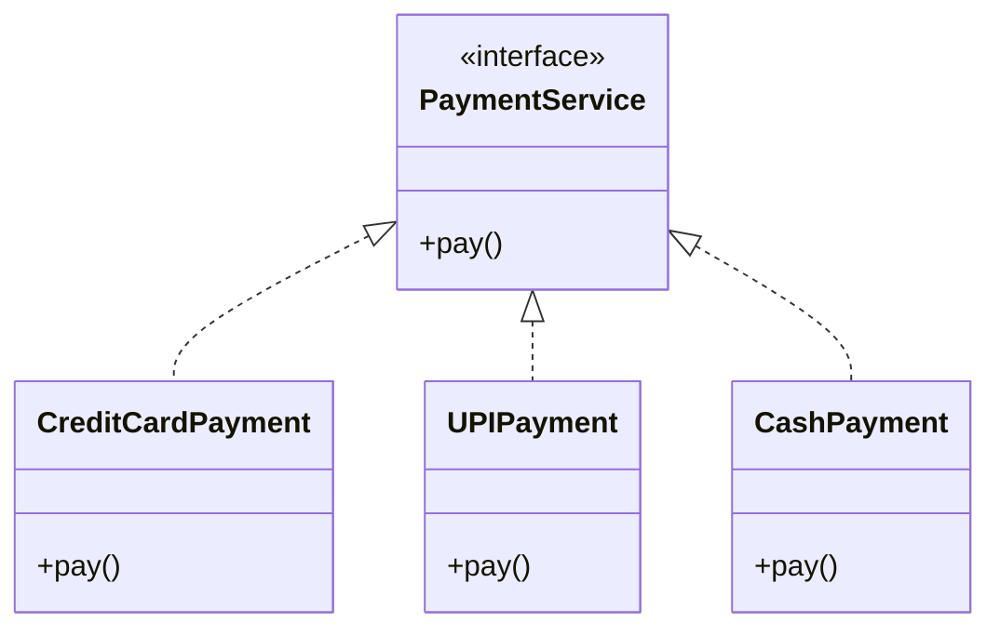

Conceptually:

```text
            PaymentService
              «interface»
                   ▲
        ┌──────────┼──────────┐
        ┆          ┆          ┆
        ┆          ┆          ┆
   CreditCard      UPI        Cash
```

The interface represents the common contract, while the concrete classes realize that contract.

---

## 5. Direction of the Triangle

The hollow triangle points toward the classifier being realized.

```text
Implementation - - - - -▷ Interface
```

For example:

```text
UPIPayment - - - - -▷ PaymentService
```

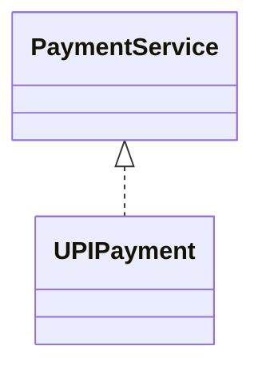

Therefore:

```text
Triangle → Interface / Contract
```

---

## 6. Multiple Realizations

One interface can be realized by multiple classes.

```text
classDiagram
    class NotificationService {
        <<interface>>
        +send()
    }

    class EmailNotification {
        +send()
    }
    class SMSNotification {
        +send()
    }
    class PushNotification {
        +send()
    }
    NotificationService <|.. EmailNotification
    NotificationService <|.. SMSNotification
    NotificationService <|.. PushNotification
```

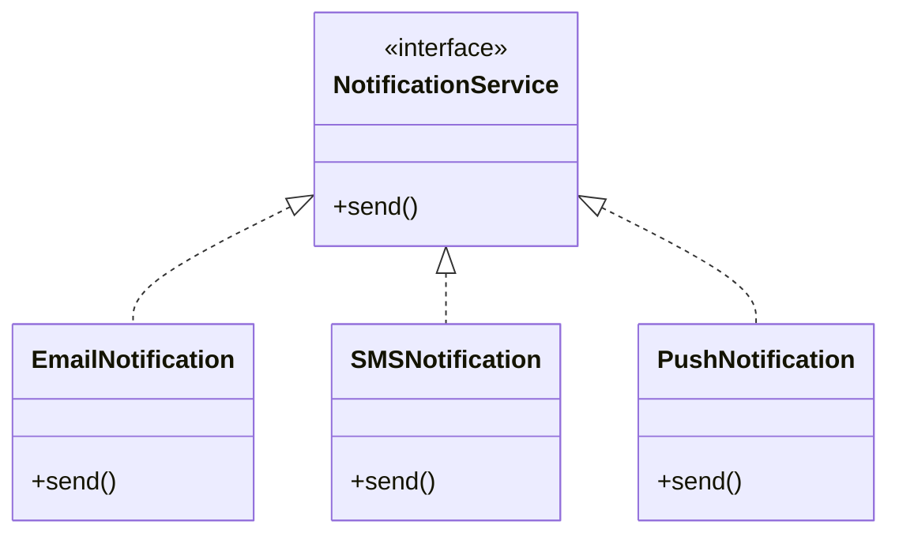

Conceptually:

```text
          NotificationService
              «interface»
                   ▲
          ┌────────┼────────┐
          ┆        ┆        ┆
          ┆        ┆        ┆
        Email     SMS      Push
```

This communicates that all three classes fulfill the same contract.

---

## 7. Realization with Multiple Operations

An interface can contain multiple operations.

```text
classDiagram
    class PaymentService {
        <<interface>>
        +pay()
        +refund()
        +getStatus()
    }

    class CreditCardPayment {
        +pay()
        +refund()
        +getStatus()
    }
    PaymentService <|.. CreditCardPayment
```

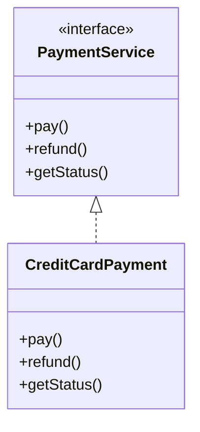

The important UML concept here is that the concrete classifier realizes the specification represented by the interface.

---

## 8. Realization Represents Contract Fulfillment

A useful mental model:

```text
   Contract
      ▲
      ┆
      ┆  Realization
      ┆
      ┆
Implementation
```

```text
classDiagram
    class Storage {
        <<interface>>
        +save()
        +load()
    }

    class FileStorage {
        +save()
        +load()
    }
    Storage <|.. FileStorage
```

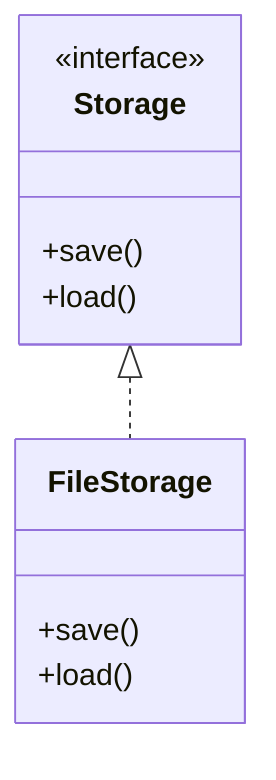

The diagram tells us that `FileStorage` realizes the `Storage` contract. The UML diagram doesn't need to show the implementation details of how the contract is fulfilled.

---

## 9. Generalization vs. Realization

This is one of the most important distinctions.

**Generalization**

```text
classDiagram
    class Vehicle
    class Car

    Vehicle <|-- Car
```


Meaning: *Car is a specialized Vehicle.* Notation: solid line + hollow triangle.

**Realization**

```text
classDiagram
    class PaymentService {
        <<interface>>
    }

    class UPIPayment
    PaymentService <|.. UPIPayment
```

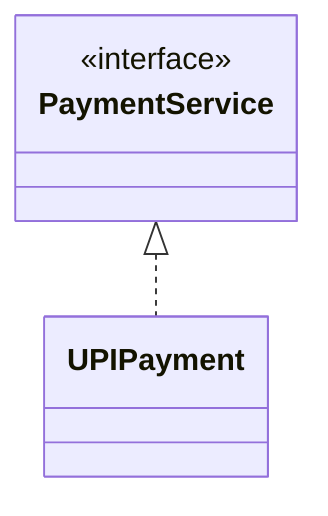

Meaning: *UPIPayment realizes PaymentService.* Notation: dashed line + hollow triangle.

**Quick comparison:**

| Relationship | Line | Main Meaning |
|---|---|---|
| Generalization | Solid | "is-a" specialization |
| Realization | Dashed | Fulfills a contract/specification |

---

## 10. Realization vs. Association

**Association:**

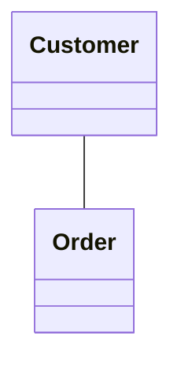

Meaning: `Customer is related to Order`.

**Realization:**


Meaning: `UPIPayment fulfills the contract represented by PaymentService`.

These represent completely different UML relationships.

---

## 11. Realization vs. Dependency

**Dependency:**

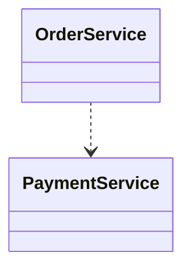

**Realization:**


The visual distinction:

```text
Dependency:   - - - - -> (dashed line + open arrowhead)
Realization:  - - - - -▷ (dashed line + hollow triangle)
```

Realization has a hollow triangle. Dependency has a simple arrowhead. Dependency will be covered separately.

---

## 12. Common Realization Examples

**Payment**

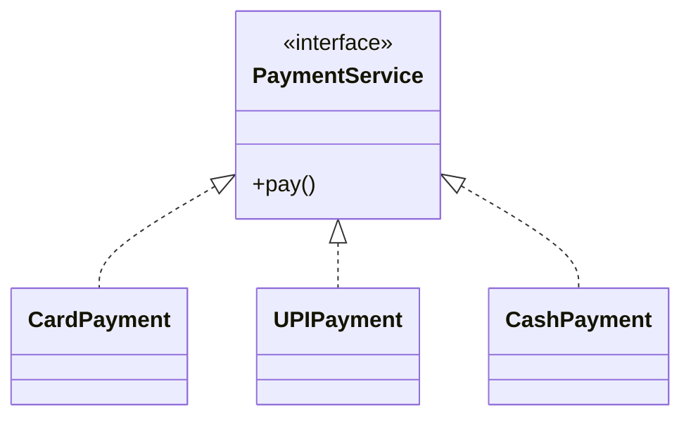

**Notification**

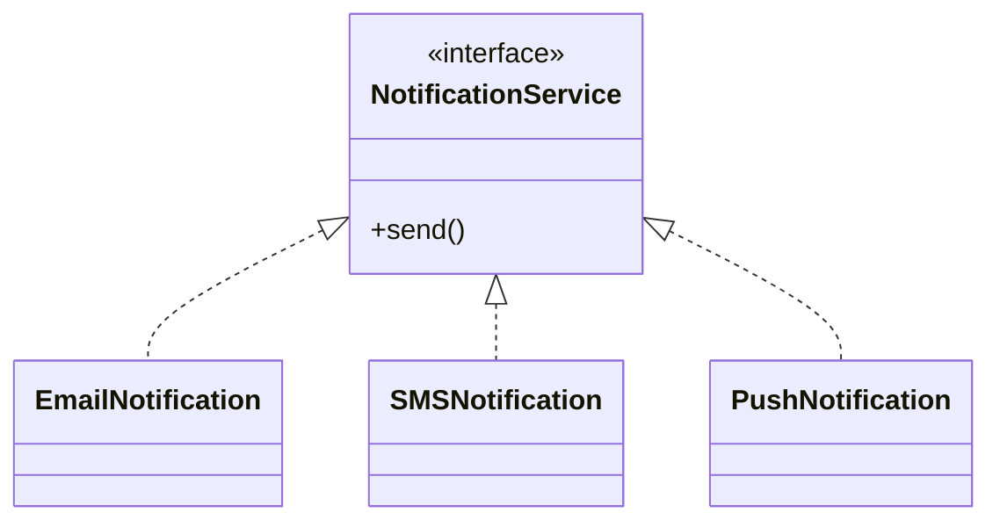

**Storage**

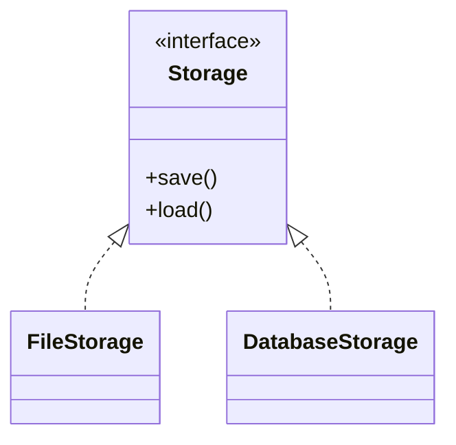

The common pattern:

```text
Interface / Contract
        ▲
        ┆
        ┆
Concrete Implementation
```

---

## 13. Mermaid Syntax Cheat Sheet

**Basic realization**

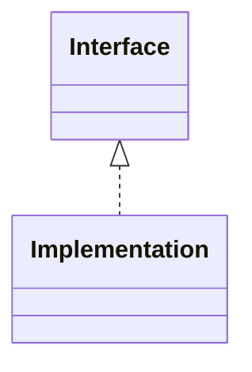

**Interface declaration**

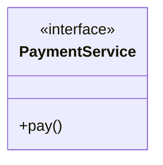

**Interface + implementation**


**Multiple implementations**

```mermaid
classDiagram
    class PaymentService {
        <<interface>>
        +pay()
    }

    class UPIPayment
    class CardPayment
    class CashPayment
    PaymentService <|.. UPIPayment
    PaymentService <|.. CardPayment
    PaymentService <|.. CashPayment
```

---

## 14. Practice 1

**Requirement:** create an interface called `Storage` with `save()` and `load()`. Then model `FileStorage` realizing it.

**Solution**

```text
classDiagram
    class Storage {
        <<interface>>
        +save()
        +load()
    }

    class FileStorage {
        +save()
        +load()
    }
    Storage <|.. FileStorage
```

```mermaid
classDiagram
    class Storage {
        <<interface>>
        +save()
        +load()
    }

    class FileStorage {
        +save()
        +load()
    }
    Storage <|.. FileStorage
```

---

## 15. Practice 2

**Requirement:** create an interface `NotificationService`. Three classes should realize it: `EmailNotification`, `SMSNotification`, `PushNotification`.

**Solution**

```text
classDiagram
    class NotificationService {
        <<interface>>
        +send()
    }

    class EmailNotification {
        +send()
    }
    class SMSNotification {
        +send()
    }
    class PushNotification {
        +send()
    }
    NotificationService <|.. EmailNotification
    NotificationService <|.. SMSNotification
    NotificationService <|.. PushNotification
```

```mermaid
classDiagram
    class NotificationService {
        <<interface>>
        +send()
    }

    class EmailNotification {
        +send()
    }
    class SMSNotification {
        +send()
    }
    class PushNotification {
        +send()
    }
    NotificationService <|.. EmailNotification
    NotificationService <|.. SMSNotification
    NotificationService <|.. PushNotification
```

---

## 16. Practice 3

Identify the relationship:

```text
PaymentService
      ▲
      ┆
      ┆
  UPIPayment
```

Options: 1) Association, 2) Generalization, 3) Realization, 4) Dependency

**Solution**

**Realization.** The relationship uses a dashed line + hollow triangle, which represents a realization relationship.

---

## 17. Important UML Relationship Notation Learned So Far

| UML Relationship | Mermaid | Meaning |
|---|---|---|
| Association | `A -- B` | General relationship |
| Directed Association | `A --> B` | Navigable relationship |
| Generalization | `Parent <\|-- Child` | "is-a" |
| Realization | `Interface <\|.. Implementation` | Fulfills a contract |
| Dependency | `A ..> B` | Depends on / uses |

---

## 18. Key Takeaways

1. Realization represents fulfillment of a contract or specification.
2. It's commonly used between an interface and its implementations.
3. Realization uses a dashed line.
4. The relationship ends with a hollow triangle.
5. The triangle points toward the interface/contract being realized.
6. Mermaid realization syntax: `Interface <|.. Implementation`
7. Multiple classes can realize the same interface.
8. Realization is different from generalization.
9. Generalization uses a solid line: `<|--`
10. Realization uses a dashed line: `<|..`

---

## 19. One-Line Memory Trick

```text
<|.. = Realization = "fulfills a contract"
```

Example: `PaymentService <|.. UPIPayment` — read it as: *UPIPayment realizes PaymentService.*
