# UML Dependency

## 1. What is Dependency?

A **Dependency** represents a relationship where one UML element uses, needs, or depends on another UML element.

```text
OrderService - - - - - - > PaymentService
```

Read it as: *OrderService depends on PaymentService.*

The core idea:

```text
A uses / needs B
        ↓
A depends on B
```

---

## 2. UML Dependency Notation

Dependency is represented using a **dashed line** with a **simple/open arrowhead**. The arrow points toward the element being depended upon.

```text
OrderService - - - - -> PaymentService
```

```text
classDiagram
    class OrderService
    class PaymentService

    OrderService ..> PaymentService
```

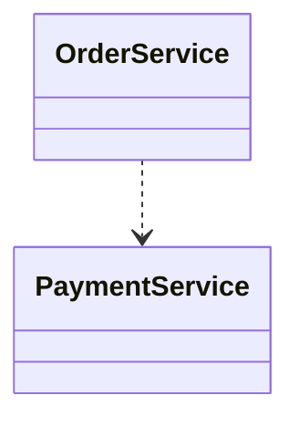

The important Mermaid syntax is `..>`. So `OrderService ..> PaymentService` means: *OrderService depends on PaymentService.*

---

## 3. Direction of Dependency

The direction of the arrow is important.

```text
OrderService - - - - - > PaymentService
```

means:

```text
OrderService
     │
     │ depends on
     ▼
PaymentService
```

```text
classDiagram
    OrderService ..> PaymentService
```


It does **not** mean that `PaymentService` depends on `OrderService`.

---

## 4. Dependency vs. Association

These relationships have different meanings.

**Association**

```text
classDiagram
    Customer -- Order
```

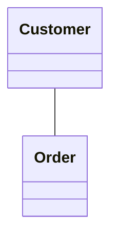

Means: *Customer and Order have a structural relationship.*

**Dependency**

```text
classDiagram
    OrderService ..> PaymentService
```


Means: *OrderService uses or depends on PaymentService.*

Visual difference:

```text
Association:  Customer ───────── Order         (solid line)
Dependency:   OrderService - - - - -> PaymentService  (dashed line)
```

The line style carries meaning.

---

## 5. Dependency vs. Navigability

**Navigable association** (solid line with an arrow):

```text
classDiagram
    Customer --> Order
```


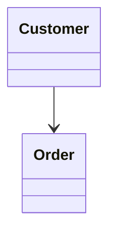

**Dependency** (dashed line):

```tet
classDiagram
    Customer ..> Order
```

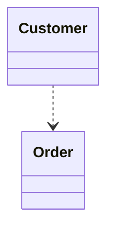

Therefore:

```text
-->   = Directed Association
..>   = Dependency
```

Do not confuse the two.

---

## 6. Dependency vs. Realization

**Realization:**

```text
classDiagram
    class PaymentService {
        <<interface>>
    }

    class UPIPayment
    PaymentService <|.. UPIPayment
```

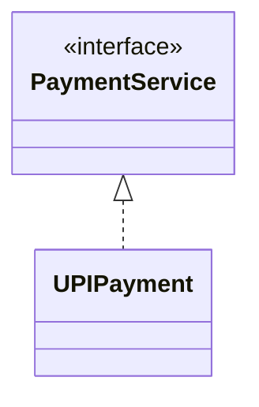

**Dependency:**

```text
classDiagram
    OrderService ..> PaymentService
```


The visual difference is the arrowhead:

```text
Dependency:   - - - - -> (dashed line + open arrowhead)
Realization:  - - - - -▷ (dashed line + hollow triangle)
```

Dependency has a simple arrowhead. Realization has a hollow triangle.

---

## 7. Dependency vs. Generalization

**Generalization:**

```text
classDiagram
    Vehicle <|-- Car
```

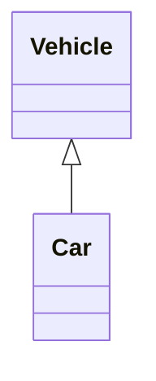

Meaning: *Car is a Vehicle.*

**Dependency:**

```text
classDiagram
    CarService ..> Vehicle
```

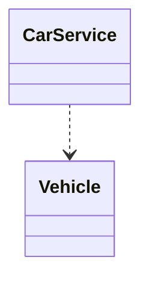

Meaning: *CarService uses or depends on Vehicle.*

Therefore:

```text
<|--  → Generalization
..>   → Dependency
```

---

## 8. Dependency Relationship Labels

A dependency can have a label describing why the dependency exists.

```text
classDiagram
    OrderService ..> PaymentService : uses
```

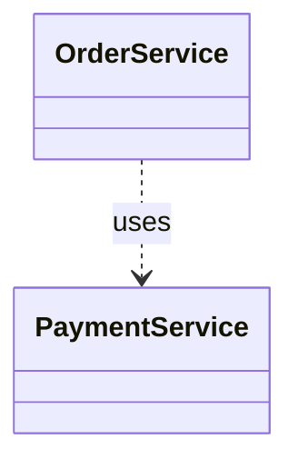


```text
classDiagram
    ReportService ..> ReportGenerator : uses
```


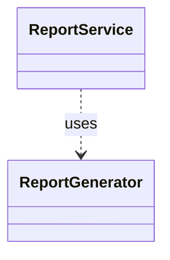

The label communicates the purpose of the dependency. Common labels include:

```text
uses
depends on
calls
creates
invokes
requires
```

The exact label should describe the actual relationship in the design.

---

## 9. Common Dependency Examples

**Order Service → Payment Service**

```text
classDiagram
    OrderService ..> PaymentService : uses
```


**Report Service → Report Generator**

```text
classDiagram
    ReportService ..> ReportGenerator : uses
```


**Controller → Service**

```text
classDiagram
    OrderController ..> OrderService : uses
```

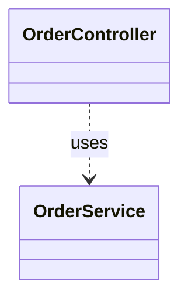

**Service → Repository**

```text
classDiagram
    OrderService ..> OrderRepository : uses
```

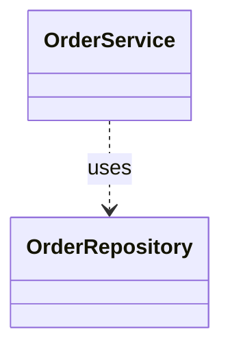

All of these communicate that one element depends on another.

---

## 10. Multiple Dependencies

One class can depend on multiple elements.

```text
classDiagram
    class OrderService
    class PaymentService
    class InventoryService
    class NotificationService

    OrderService ..> PaymentService
    OrderService ..> InventoryService
    OrderService ..> NotificationService
```

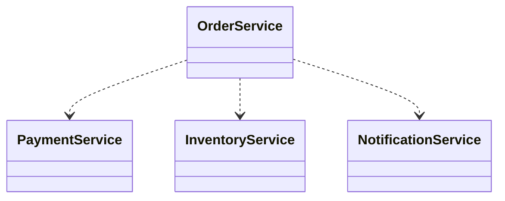

Conceptually:

```text
                  PaymentService
                        ▲
                        ┆
                        ┆
OrderService - - - - - -┤
                        ┆
                        ┆
                        ▼
                  InventoryService

OrderService - - - - - -> NotificationService
```

The important point is that `OrderService` has dependencies on multiple elements.

---

## 11. Dependency Between Different UML Elements

Dependency is not restricted to classes. It can represent relationships between different UML elements, such as:

- Classes
- Interfaces
- Packages
- Components
- Other UML elements

For LLD class diagrams, the most important forms are:

```text
Class - - - - > Class
Class - - - - > Interface
```

---

## 12. Dependency Does Not Mean Ownership

```text
classDiagram
    OrderService ..> PaymentService
```


This does **not** automatically mean:

- `OrderService` owns `PaymentService`
- `PaymentService` belongs to `OrderService`
- `OrderService` controls `PaymentService`'s lifecycle
- `PaymentService` must be permanently contained inside `OrderService`

It simply communicates a dependency.

```text
Dependency → uses / needs
```

Ownership and lifecycle relationships will be represented using other UML relationships, particularly **aggregation** and **composition**.

---

## 13. Dependency Does Not Mean "Is-A"

Compare the following.

**Generalization**

```text
classDiagram
    Vehicle <|-- Car
```


Meaning: `Car is a Vehicle`.

**Dependency**

```text
classDiagram
    CarService ..> Vehicle
```


Meaning: `CarService uses / depends on Vehicle`.

Therefore:

```text
"is-a"          → Generalization
"uses / needs"  → Dependency
```

---

## 14. Dependency vs. Structural Relationship

Association generally represents a structural relationship. Dependency is weaker and communicates usage or reliance.

```text
Association → A is structurally related to B
Dependency  → A uses / needs B
```

A dependency does not necessarily mean that the two elements maintain a permanent structural association.

---

## 15. LLD Example

```text
classDiagram
    class OrderController
    class OrderService
    class PaymentService
    class NotificationService

    OrderController ..> OrderService : uses
    OrderService ..> PaymentService : uses
    OrderService ..> NotificationService : uses
```

```mermaid
classDiagram
    class OrderController
    class OrderService
    class PaymentService
    class NotificationService


    OrderController ..> OrderService : uses
    OrderController ..> PaymentService : uses
    OrderController ..> NotificationService : uses
    
```

Conceptually:

```text
OrderController
     │
     │ uses
     ▼
OrderService
     │
     ├──── uses ────> PaymentService
     │
     └──── uses ────> NotificationService
```

Every relationship here is represented using a dashed line with a simple arrowhead.

---

## 16. Mermaid Syntax Cheat Sheet

**Basic dependency**

```text
classDiagram
    A ..> B
```

```mermaid
classDiagram
    A ..> B
```

Meaning: `A depends on B`.

**Dependency with label**

```text
classDiagram
    A ..> B : uses
```

```mermaid
classDiagram
    A ..> B : uses
```

**Multiple dependencies**

```mermaid
classDiagram
    A ..> B
    A ..> C
    A ..> D
```

```text
classDiagram
    A ..> B
    A ..> C
    A ..> D
```

**Class depending on an interface**

```text
classDiagram
    class PaymentService {
        <<interface>>
    }

    class OrderService
    OrderService ..> PaymentService
```

```mermaid
classDiagram
    class PaymentService {
        <<interface>>
    }

    class OrderService
    OrderService ..> PaymentService
```

---

## 17. Practice 1

**Requirement:** `OrderService` uses `PaymentService`. Model the dependency.

**Solution**

```text
classDiagram
    class OrderService
    class PaymentService

    OrderService ..> PaymentService : uses
```

```mermaid
classDiagram
    class OrderService
    class PaymentService

    OrderService ..> PaymentService : uses
```

---

## 18. Practice 2

**Requirement:** `OrderController` uses `OrderService`. `OrderService` uses `PaymentService` and `InventoryService`.

**Solution**

```text
classDiagram
    class OrderController
    class OrderService
    class PaymentService
    class InventoryService

    OrderController ..> OrderService : uses
    OrderService ..> PaymentService : uses
    OrderService ..> InventoryService : uses
```

```mermaid
classDiagram
    class OrderController
    class OrderService
    class PaymentService
    class InventoryService

    OrderController ..> OrderService : uses
    OrderService ..> PaymentService : uses
    OrderService ..> InventoryService : uses
```

---

## 19. Practice 3

Identify the UML relationship:

```text
A - - - - - > B
```

The relationship has a dashed line, a simple arrowhead, and the arrow points from A to B.

**Solution**

**Dependency.**

```text
A ..> B
```

Meaning: *A depends on / uses B.*

---

## 20. Practice 4

Identify the difference between these diagrams.

**Diagram A**

```text
classDiagram
    Vehicle <|-- Car
```

```mermaid
classDiagram
    Vehicle <|-- Car
```

**Diagram B**

```text
classDiagram
    CarService ..> Vehicle
```

```mermaid
classDiagram
    CarService ..> Vehicle
```

**Solution**

```text
Diagram A → Generalization → Car is a Vehicle
Diagram B → Dependency     → CarService uses / depends on Vehicle
```

---

## 21. Relationship Symbols Learned So Far

```text
A -- B      → Association
A --> B     → Directed Association
A <|-- B    → Generalization
A <|.. B    → Realization
A ..> B     → Dependency
```

---

## 22. Visual Comparison

```text
Association:            A ───────── B
Directed Association:   A ─────────> B
Generalization:         A ─────────▷ B
Realization:             A - - - - -▷ B
Dependency:               A - - - - -> B
```

Important:

```text
Solid line  → Association / Generalization
Dashed line → Realization / Dependency
```

The arrowhead further distinguishes the relationships.

---

## 23. Key Takeaways

1. Dependency means one UML element uses or depends on another.
2. Dependency is represented using a dashed line.
3. The arrow points toward the element being depended upon.
4. Mermaid syntax: `A ..> B`
5. A dependency can have a relationship label: `A ..> B : uses`
6. Dependency is different from association.
7. Dependency is different from navigability.
8. Dependency is different from realization.
9. Dependency is different from generalization.
10. Dependency does not automatically indicate ownership.
11. Dependency does not automatically indicate lifecycle control.
12. Aggregation and composition will be used to model stronger whole-part relationships.

---

## 24. One-Line Memory Trick

```text
..> = Dependency = "uses / depends on"
```

Example: `OrderService ..> PaymentService` — read it as: *OrderService depends on PaymentService.*
