# UML Aggregation

## 1. What is Aggregation?

**Aggregation** is a whole–part relationship between two UML elements where the part can exist independently of the whole.

In simple terms: *the Whole has Parts, but the Parts are not exclusively owned by the Whole.*

```text
Team ◇──────── Player
```

Here: `Team` = Whole, `Player` = Part, `◇` = hollow diamond. The `Player` can exist independently of the `Team`.

---

## 2. Aggregation Notation

Aggregation is represented using a **hollow diamond** (`◇`), placed on the whole/aggregate side.

```text
Whole ◇──────── Part
```

For example:

```text
Team ◇──────── Player
```

`Team` is the whole and `Player` is the part.

---

## 3. Aggregation in Mermaid

Mermaid represents aggregation using `o--`.

```text
classDiagram
    Team o-- Player
```

```text
classDiagram
    Team o-- Player
```


This represents `Team ◇──────── Player`. The `o` represents the hollow diamond.

---

## 4. Diamond Placement

The placement of the diamond is extremely important.

**Correct:**

```text
classDiagram
    Team o-- Player
```


Conceptually: `Team ◇──────── Player`. `Team` is the whole, `Player` is the part.

**Reversed:**

```text
classDiagram
    Team --o Player
```

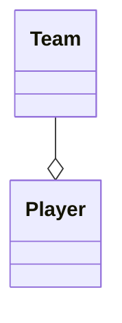

Conceptually: `Team ────────◇ Player`. Now the diamond is on the `Player` side — that means `Player` is being modeled as the whole side of the aggregation.

**Important rule: the diamond always belongs to the whole/aggregate side.**

---

## 5. Whole and Part

Every aggregation relationship has:

```text
Whole
  │
  └── Parts
```

```text
classDiagram
    Team o-- Player
```


Meaning:

```text
Team
  │
  ├── Player
  ├── Player
  └── Player
```

The important UML idea is that the players are parts associated with the team, but their existence is not completely dependent on that particular team.

---

## 6. Independent Lifecycle

The most important semantic idea behind aggregation: **the part can exist independently of the whole.**

```text
Team ◇──────── Player
```

If the Team is removed:

```text
Team deleted
      ↓
Player can still exist
```

The `Player` is not automatically destroyed just because that particular `Team` no longer exists.

This is what differentiates aggregation from stronger whole–part relationships such as composition.

---

## 7. Aggregation vs. Association

Association simply represents a relationship between two classes.

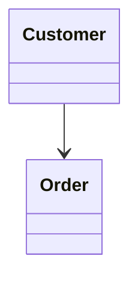

This means `Customer ─────> Order` — the two classes are related. It does not automatically communicate a whole–part relationship, ownership, lifecycle dependency, composition, or aggregation.

Aggregation adds a specific whole–part meaning.


Meaning: `Team ◇──────── Player`. This communicates that `Team` is a whole containing/aggregating `Player` parts, while the parts can exist independently.

---

## 8. Association vs. Aggregation

| Concept | Association | Aggregation |
|---|---|---|
| Basic relationship | Yes | Yes |
| Whole–part meaning | Not necessarily | Yes |
| Hollow diamond | No | Yes |
| Part can exist independently | Not defined by association | Yes |
| Ownership semantics | Not implied | Weak/shared whole–part semantics |

```text
Association → A is related to B
Aggregation → A is a whole containing/aggregating B; B can exist independently
```

---

## 9. Aggregation with a Relationship Label

A relationship label can be added to make the meaning clearer.

```tet
classDiagram
    Team o-- Player : has
```

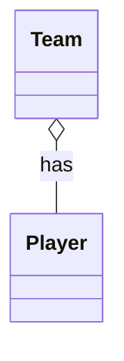

Conceptually:

```text
Team ◇──────── Player
              has
```

The two pieces of information are different:

```text
◇   → Aggregation / whole–part relationship
has → Meaning of the relationship
```

---

## 10. Aggregation with Navigability

Aggregation can also be combined with navigability.

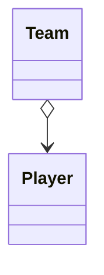

Conceptually: `Team ◇────────> Player`.

Here: `◇` → aggregation, `>` → navigability.

With a relationship label:

```text
classDiagram
    Team o--> Player : has
```

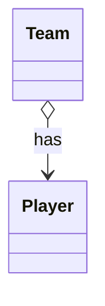

Use navigability when the direction of navigation is relevant to the model.

---

## 11. Multiple Parts

A whole can aggregate multiple types of parts.

```text
classDiagram
    Department o-- Employee
    Department o-- Manager
```

```text
classDiagram
    Department o-- Employee
    Department o-- Manager
```

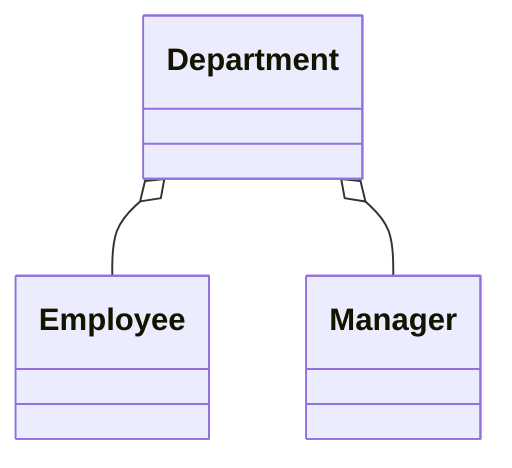

Conceptually:

```text
                ◇── Employee
               /
   Department ◇
               \
                ◇── Manager
```

The `Department` is the aggregate/whole side.

---

## 12. Real-World Modeling Example

Consider:

```text
Library
   │
   ├── Book
   ├── Book
   └── Book
```

If the model treats books as independently existing entities that can move between libraries, aggregation can represent that relationship.

```text
classDiagram
    Library o-- Book : contains
```

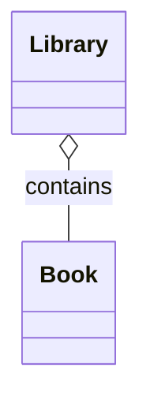

Meaning: `Library ◇──────── Book`. The library aggregates books, while a book can exist independently from that particular library.

The exact relationship depends on the domain being modeled; UML communicates the semantics chosen by the designer.

---

## 13. Another Example — Team and Player

```text
classDiagram
    class Team {
        +name
    }

    class Player {
        +name
    }
    Team o-- Player : has
```

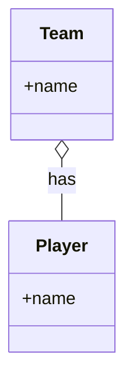

Read it as: *a Team aggregates Player objects.*

The important UML information:

```text
Team ◇── Player
 ↑
Whole
```

The player can exist independently of that particular team.

---

## 14. Aggregation vs. Composition

Aggregation and composition both represent whole–part relationships, but their lifecycle semantics differ.

**Aggregation:**

```text
Whole ◇──── Part
```

The part can exist independently.

**Composition:**

```text
Whole ◆──── Part
```

The part has a strong lifecycle dependency on the whole.

Visual difference:

```text
Aggregation:  Team ◇──────── Player   (hollow diamond)
Composition:  Order ◆──────── OrderItem  (filled diamond)
```

```text
classDiagram
    Team o-- Player
    Order *-- OrderItem
```

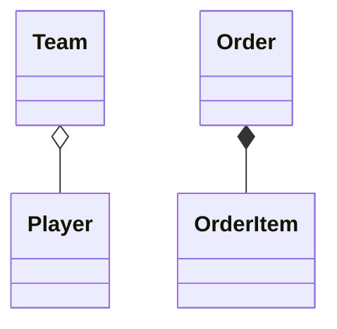

Therefore: `◇` = Aggregation, `◆` = Composition. Composition will be covered separately in the next step.

---

## 15. Aggregation Does Not Mean Inheritance

Aggregation and generalization represent completely different relationships.

**Generalization:**

```text
classDiagram
    Vehicle <|-- Car
```

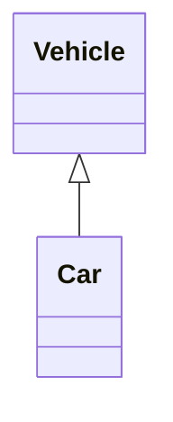

Meaning: `Car IS-A Vehicle`.

**Aggregation:**

```text
classDiagram
    Team o-- Player
```


Meaning: `Team HAS/AGGREGATES Player`.

```text
Generalization → IS-A
Aggregation     → WHOLE-PART
```

---

## 16. Aggregation Does Not Mean Dependency

Dependency uses a dashed arrow.

```text
classDiagram
    OrderService ..> PaymentService
```

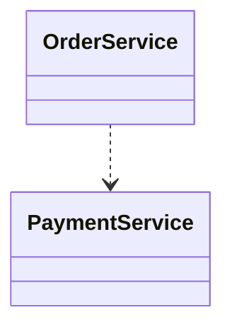

Meaning:

```text
OrderService
      │
      └── depends on / uses
              ▼
      PaymentService
```

Aggregation is different:

```text
classDiagram
    Team o-- Player
```


Meaning:

```text
Team
  │
  │  whole-part relationship
  ▼
Player
```

---

## 17. Important UML Relationships So Far

| Relationship | Mermaid | Meaning |
|---|---|---|
| Association | `A -- B` | A is related to B |
| Directed Association | `A --> B` | A navigates toward B |
| Generalization | `A <\|-- B` | B is a specialized A |
| Realization | `A <\|.. B` | B realizes A |
| Dependency | `A ..> B` | A depends on/uses B |
| Aggregation | `A o-- B` | A is a whole containing B |
| Composition | `A *-- B` | Strong whole–part relationship |

---

## 18. Mermaid Aggregation Cheat Sheet

**Basic aggregation**

```text
classDiagram
    A o-- B
```

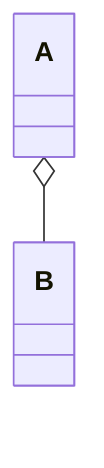

Meaning: `A ◇── B`.

**Aggregation with label**

```text
classDiagram
    A o-- B : contains
```

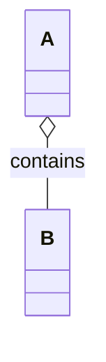

**Aggregation with navigation**

```text
classDiagram
    A o--> B
```

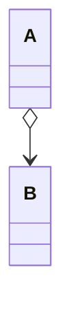

**Aggregation with navigation and label**

```text
classDiagram
    A o--> B : has
```

```mermaid
classDiagram
    A o--> B : has
```

**Multiple aggregations**

```text
classDiagram
    A o-- B
    A o-- C
    A o-- D
```

```mermaid
classDiagram
    A o-- B
    A o-- C
    A o-- D
```

---

## 19. Practice Questions

**Practice 1**

Model: *a Library aggregates Book objects.*

**Solution**

```text
classDiagram
    Library o-- Book : contains
```

```mermaid
classDiagram
    Library o-- Book : contains
```

Interpretation: `Library ◇──────── Book`. `Library` = Whole, `Book` = Part.

**Practice 2**

Model: *a Department aggregates Employee objects.*

**Solution**

```text
classDiagram
    Department o-- Employee : has
```

```mermaid
classDiagram
    Department o-- Employee : has
```

Interpretation: `Department ◇──────── Employee`. The diamond belongs to `Department`, the whole.

**Practice 3**

Which of the following represents aggregation?

**Option A**

```text
classDiagram
    Car <|-- Vehicle
```

```mermaid
classDiagram
    Car <|-- Vehicle
```

**Option B**

```text
classDiagram
    Team o-- Player
```

```mermaid
classDiagram
    Team o-- Player
```

**Option C**

```text
classDiagram
    OrderService ..> PaymentService
```

```mermaid
classDiagram
    OrderService ..> PaymentService
```

**Solution**

**Option B** — `Team o-- Player` — because `o--` is a hollow diamond, which represents aggregation.

**Practice 4**

Identify the whole and part:

```text
classDiagram
    Company o-- Employee
```

```mermaid
classDiagram
    Company o-- Employee
```

**Solution**

`Company` = Whole, `Employee` = Part. The diamond is on `Company`, so `Company` is the aggregate side.

**Practice 5**

What does this relationship represent?

```text
classDiagram
    Order *-- OrderItem
```

```mermaid
classDiagram
    Order *-- OrderItem
```

**Solution**

It represents **composition**, not aggregation. Why? `*--` is a filled diamond, which represents composition. Aggregation uses `o--`, a hollow diamond.

---

## 20. Common Mistakes

**Mistake 1 — Putting the diamond on the part**

Incorrect for `Team` as the whole: `Team ────────◇ Player`
Correct: `Team ◇──────── Player`

**Mistake 2 — Confusing aggregation with association**

`A -- B` only represents association.
`A o-- B` represents aggregation.

**Mistake 3 — Confusing aggregation with composition**

`o--` = Aggregation
`*--` = Composition

**Mistake 4 — Thinking aggregation means inheritance**

`<|--` = Generalization
`o--` = Aggregation

They communicate completely different relationships.

---

## 21. Mental Model

Whenever you see:

```text
classDiagram
    A o-- B
```

```mermaid
classDiagram
    A o-- B
```

Immediately translate it as `A ◇── B`. Then ask: *who has the diamond?* → `A`. Therefore: `A` = Whole, `B` = Part.

Then remember: **the part can exist independently.**

---

## 22. Key Takeaways

1. Aggregation is a whole–part relationship.
2. Aggregation uses a hollow diamond `◇`.
3. Mermaid syntax: `A o-- B`
4. The diamond is placed on the whole/aggregate side.
5. The part can exist independently of the whole.
6. Aggregation represents weaker/shared whole–part semantics than composition.
7. Association does not automatically imply aggregation.
8. Aggregation is not inheritance.
9. Aggregation is not dependency.
10. The most important visual distinction: `◇` = Aggregation, `◆` = Composition.

---

## 23. Quick Revision

**Association**

```text
A ───────── B
```
A is related to B.

**Aggregation**

```text
A ◇──────── B
```
A is the whole, B is the part, B can exist independently.

**Composition**

```text
A ◆──────── B
```
A is the whole, B is the part, B has strong lifecycle dependency on A.

**Generalization**

```text
A △──────── B
```
B is-a A.

**Realization**

```text
A △ - - - - B
```
B realizes A.

**Dependency**

```text
A - - - - > B
```
A uses/depends on B.

**Most important Mermaid syntax:**

```text
A -- B     → Association
A --> B    → Directed Association
A o-- B    → Aggregation
A o--> B   → Aggregation + Navigation
A *-- B    → Composition
A <|-- B   → Generalization
A <|.. B   → Realization
A ..> B    → Dependency
```

---

## 24. Final Mental Picture

```text
                    UML Relationships
                           UML
                            │
        ┌───────────────────┼───────────────────┐
        │                   │                   │
   Association          Whole-Part          Inheritance
        │                   │                   │
        │             ┌─────┴─────┐             │
        │             │           │             │
        │        Aggregation   Composition   Generalization
        │             │           │             │
        │             ◇           ◆             △
        │             │           │             │
        ▼             ▼           ▼             ▼
      A ─── B       A ◇── B     A ◆── B      A <|── B
```

The key thing to remember for Aggregation:

```text
A o-- B
A = Whole
B = Part
o = Hollow Diamond
Part can exist independently
```