# UML Composition

## 1. What is Composition?

**Composition** is a strong whole–part relationship between two UML elements where the part has a strong lifecycle dependency on the whole.

In simple terms: *the whole strongly owns the part.*

The basic notation is:

```text
Whole ◆──────── Part
```

Where: `Whole` = the owner/aggregate side, `Part` = the contained element, `◆` = filled diamond, and the part has a strong lifecycle dependency on the whole.

---

## 2. Composition Notation

Composition is represented using a **filled diamond** (`◆`), placed on the whole/owner side.

```text
Order ◆──────── OrderItem
```

Here: `Order` = Whole, `OrderItem` = Part, `◆` = Composition.

---

## 3. Composition in Mermaid

Mermaid represents composition using `*--`.

```text
classDiagram
    Order *-- OrderItem
```

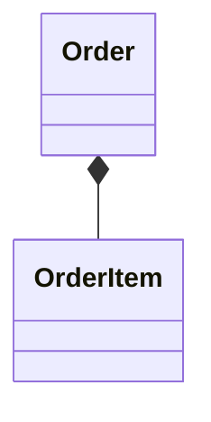

Conceptually: `Order ◆──────── OrderItem`. The `*` represents the filled diamond.

---

## 4. Diamond Placement

The placement of the diamond is extremely important.

**Correct:**

```text
classDiagram
    Order *-- OrderItem
```


Conceptually: `Order ◆──────── OrderItem`. `Order` is the whole, `OrderItem` is the part.

**Important rule: the filled diamond is placed on the whole/owner side.**

---

## 5. Composition and Lifecycle

The most important semantic idea behind composition: **the part has a strong lifecycle dependency on the whole.**

```text
classDiagram
    Order *-- OrderItem
```


Conceptually:

```text
Order
 ├── OrderItem
 ├── OrderItem
 └── OrderItem
```

The `OrderItem` objects are modeled as parts of that particular `Order`. The whole strongly controls the lifecycle of its parts.

```text
Order created
     ↓
OrderItems belong to Order
     ↓
Order removed
     ↓
OrderItems are no longer part of that Order
```

---

## 6. Aggregation vs. Composition

This is the most important comparison.

**Aggregation**

```text
Whole ◇──── Part
```

The part can exist independently.

**Composition**

```text
Whole ◆──── Part
```

The part has a strong lifecycle dependency on the whole.

Visual comparison:

```text
Aggregation:  Team ◇──────── Player      (hollow diamond)
Composition:  Order ◆──────── OrderItem  (filled diamond)
```

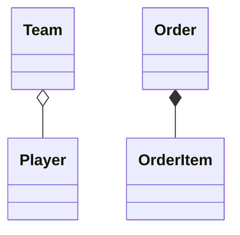

Therefore: `◇` = Aggregation, `◆` = Composition.

---

## 7. The Diamond Difference

This is the most important notation to memorize.

```text
◇  → Aggregation → Hollow diamond
◆  → Composition → Filled diamond
```

Mermaid:

```text
o--  → Aggregation
*--  → Composition
```

---

## 8. Composition vs. Association

**Association:**

```text
classDiagram
    Customer -- Order
```

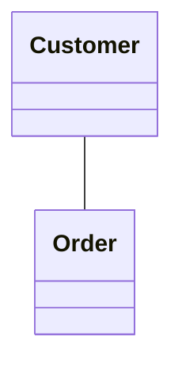

Conceptually: `Customer ───── Order`. This simply represents a relationship. It does not automatically communicate a whole–part relationship, strong ownership, lifecycle dependency, or composition.

**Composition:**

```text
classDiagram
    Order *-- OrderItem
```


Conceptually: `Order ◆──── OrderItem`. This communicates a strong whole–part relationship.

```text
Association  → Classes are related
Composition  → Whole + Part + Strong lifecycle dependency
```

---

## 9. Classic LLD Example — Order and OrderItem

A common LLD modeling example:

```text
classDiagram
    class Order {
        -Long id
    }

    class OrderItem {
        -Long productId
        -int quantity
    }
    Order *-- OrderItem : contains
```

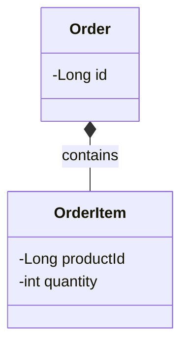

Conceptually: `Order ◆──────── OrderItem`. The `Order` is the whole, the `OrderItem` is the part. The relationship communicates strong ownership/lifecycle semantics.

---

## 10. Another Example — House and Room

A possible composition model:

```text
classDiagram
    House *-- Room
```

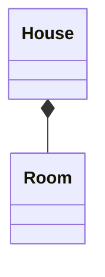

Conceptually: `House ◆──────── Room`. The rooms are modeled as parts of that particular house. The important point is the lifecycle semantics chosen by the model — UML relationships communicate the semantics of the model.

---

## 11. Multiple Parts

A whole can contain multiple composed parts.

```text
classDiagram
    Order *-- OrderItem
    Order *-- ShippingAddress
    Order *-- PaymentDetails
```

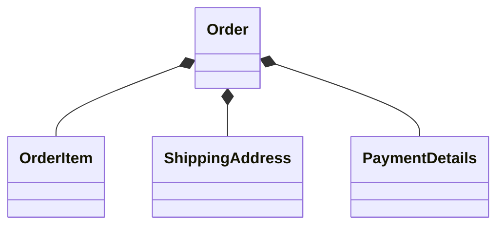

Conceptually:

```text
                    ◆── OrderItem
                   /
   Order ◆────────
                   \
                    ◆── ShippingAddress
                    ◆── PaymentDetails
```

The `Order` is the whole in all three relationships.

---

## 12. Composition with a Relationship Label

A relationship label can be added:

```text
classDiagram
    Order *-- OrderItem : contains
```

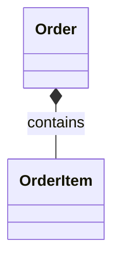

The two pieces of information have different purposes:

```text
◆        → Composition
contains → Relationship meaning
```

---

## 13. Composition with Navigability

Composition can also be combined with navigability:

```text
classDiagram
    Order *--> OrderItem
```

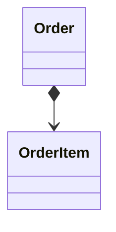

Conceptually: `Order ◆────────> OrderItem`.

Here: `◆` → composition, `>` → navigability.

With a relationship label:

```text
classDiagram
    Order *--> OrderItem : contains
```

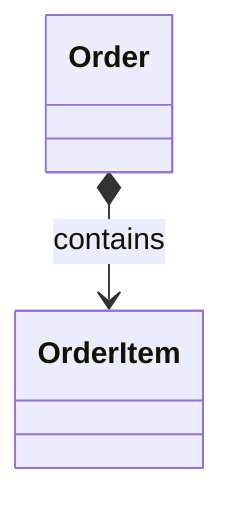

Use navigability when the direction of navigation is relevant to the model.

---

## 14. Composition vs. Aggregation

| Concept | Aggregation | Composition |
|---|---|---|
| Symbol | `◇` | `◆` |
| Mermaid | `o--` | `*--` |
| Whole–part | Yes | Yes |
| Diamond | Hollow | Filled |
| Part independent of whole | Yes | Generally no |
| Lifecycle dependency | Weak/independent | Strong |
| Ownership | Weak/shared | Strong |

Visual difference:

```text
Aggregation:  A ◇──── B
Composition:  A ◆──── B
```

---

## 15. Composition vs. Generalization

**Generalization:**

```text
classDiagram
    Vehicle <|-- Car
```

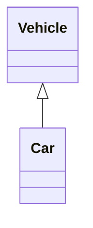

Means: `Car IS-A Vehicle`.

**Composition:**

```text
classDiagram
    Car *-- Engine
```

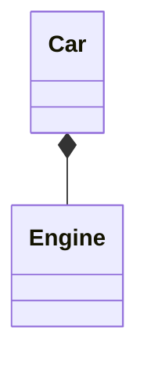

Means: `Car HAS-A Engine`.

```text
Generalization → IS-A
Composition     → HAS-A / WHOLE-PART
```

---

## 16. Composition vs. Dependency

**Dependency:**

```text
classDiagram
    OrderService ..> PaymentService
```

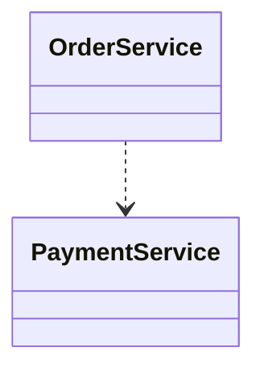

Means:

```text
OrderService
      │
      │  uses / depends on
      ▼
PaymentService
```

**Composition:**

```text
classDiagram
    Order *-- OrderItem
```


Means:

```text
Order
  │
  │  strong whole-part relationship
  ▼
OrderItem
```

They represent completely different concepts.

---

## 17. Mermaid Composition Cheat Sheet

**Basic composition**

```text
classDiagram
    A *-- B
```


Meaning: `A ◆── B`.

**Composition with label**

```text
classDiagram
    A *-- B : contains
```

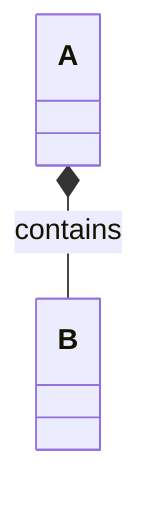

**Composition with navigation**

```text
classDiagram
    A *--> B
```

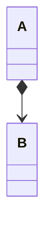

**Composition with navigation + label**

```text
classDiagram
    A *--> B : contains
```

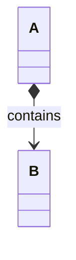

**Multiple parts**

```text
classDiagram
    A *-- B
    A *-- C
    A *-- D
```

```mermaid
classDiagram
    A *-- B
    A *-- C
    A *-- D
```

---

## 18. Practice Questions

**Practice 1**

Model: *an Order is composed of OrderItem objects.*

**Solution**

```text
classDiagram
    Order *-- OrderItem : contains
```

```mermaid
classDiagram
    Order *-- OrderItem : contains
```

Interpretation: `Order ◆──────── OrderItem`.

**Practice 2**

Model: *a House is composed of Room objects.*

**Solution**

```text
classDiagram
    House *-- Room : contains
```

```mermaid
classDiagram
    House *-- Room : contains
```

**Practice 3**

Which represents composition?

**Option A**

```text
classDiagram
    Team o-- Player
```

```mermaid
classDiagram
    Team o-- Player
```

**Option B**

```text
classDiagram
    Order *-- OrderItem
```

```mermaid
classDiagram
    Order *-- OrderItem
```

**Option C**

```text
classDiagram
    OrderService ..> PaymentService
```

```mermaid
classDiagram
    OrderService ..> PaymentService
```

**Solution**

**Option B** — `Order *-- OrderItem` — because `*--` is a filled diamond, which represents composition.

**Practice 4**

Identify the whole and part:

```text
classDiagram
    Order *-- OrderItem
```

```mermaid
classDiagram
    Order *-- OrderItem
```

**Solution**

`Order` = Whole, `OrderItem` = Part. The filled diamond is on `Order`.

**Practice 5**

What is the difference between:

```text
classDiagram
    A o-- B
```

```mermaid
classDiagram
    A o-- B
```

and:

```text
classDiagram
    A *-- B
```

```mermaid
classDiagram
    A *-- B
```

**Solution**

```text
A o-- B → Aggregation → Hollow diamond → Part can exist independently
A *-- B → Composition → Filled diamond → Strong lifecycle dependency
```

---

## 19. Common Mistakes

**Mistake 1 — Confusing `o--` and `*--`**

```text
o-- → Aggregation
*-- → Composition
```

**Mistake 2 — Putting the diamond on the wrong side**

If `Order` is the whole: `Order ◆──── OrderItem`, not `Order ────◆ OrderItem`.

**Mistake 3 — Thinking every HAS-A relationship is composition**

Not every `A HAS B` automatically means composition. Ask: *does the model require strong ownership and lifecycle dependency?* If not, another relationship may be more appropriate.

**Mistake 4 — Confusing composition with inheritance**

`A <|-- B` is generalization. `A *-- B` is composition.

---

## 20. Mental Model

Whenever you see:

```text
classDiagram
    A *-- B
```

```mermaid
classDiagram
    A *-- B
```

Translate it immediately: `A ◆── B`. Then ask: *who has the diamond?* → `A`. Therefore: `A` = Whole, `B` = Part.

Then remember: `◆` → strong whole-part relationship → strong lifecycle dependency.

---

## 21. Quick Revision

**Association**

```text
A ───── B
```
A is related to B.

**Aggregation**

```text
A ◇──── B
```
A is the whole, B is the part, B can exist independently.

**Composition**

```text
A ◆──── B
```
A is the whole, B is the part, B has strong lifecycle dependency on A.

**Generalization**

```text
A <|──── B
```
B is-a A.

**Realization**

```text
A <|.. B
```
B realizes A.

**Dependency**

```text
A ..> B
```
A uses/depends on B.

---

## 22. Most Important Mermaid Syntax

```text
A -- B      → Association
A --> B     → Directed Association
A o-- B     → Aggregation
A o--> B    → Aggregation + Navigation
A *-- B     → Composition
A *--> B    → Composition + Navigation
A <|-- B    → Generalization
A <|.. B    → Realization
A ..> B     → Dependency
```

---

## 23. Final Comparison

```text
                Whole-Part Relationships
                         Whole
                           │
                  ┌────────┴────────┐
                  │                 │
             Aggregation       Composition
                  │                 │
                  ◇                 ◆
                  │                 │
                  ▼                 ▼
                Part              Part
                  │                 │
             Independent        Strongly tied
              lifecycle          lifecycle
```

The key visual distinction:

```text
◇ = Aggregation
◆ = Composition
```

The key semantic distinction:

```text
Aggregation → Part can exist independently
Composition → Part has strong lifecycle dependency on Whole
```

---

## 24. Final Mental Picture

```text
Association      A ───── B        "related to"

Aggregation       A ◇──── B        "whole-part"
                                   "part can exist independently"

Composition      A ◆──── B        "strong whole-part"
                                   "part strongly depends on whole's lifecycle"

Generalization    A <|──── B       "B is-a A"

Realization      A <|.. B         "B realizes A"

Dependency        A ..> B          "A uses/depends on B"
```

**One-line memory trick:**

```text
o--  → Aggregation → Hollow diamond → Independent part
*--  → Composition → Filled diamond → Strong lifecycle
```