# UML Multiplicity / Cardinality

## 1. What is Multiplicity?

**Multiplicity** tells us how many instances of one class can participate in a relationship with another class.

```text
Customer ───────── Order
```

This tells us that `Customer` and `Order` are related. But it doesn't tell us: *how many Orders can a Customer have?*

Multiplicity adds this information:

```text
classDiagram
    Customer "1" --> "0..*" Order
```

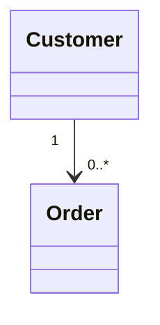

Meaning: *one Customer can have zero or many Orders.*

---

## 2. Why Multiplicity Matters

Without multiplicity:

```text
classDiagram
    Customer --> Order
```


We know `Customer → Order`, but we don't know whether the relationship is `1:1`, `1:many`, `0..1:1`, or `many:many`.

Multiplicity makes the relationship precise.

---

## 3. Basic Multiplicity Notation

The most important multiplicities are:

| Notation | Meaning |
|---|---|
| `1` | Exactly one |
| `0..1` | Zero or one |
| `*` | Zero or many |
| `0..*` | Zero or many |
| `1..*` | One or many |
| `2..5` | Between 2 and 5 |

For LLD, the most commonly used are: `1`, `0..1`, `0..*`, `1..*`.

---

## 4. Exactly One — `1`

`1` means **exactly one.**

Example: *every Order belongs to exactly one Customer.*

```text
classDiagram
    Customer "1" --> "0..*" Order
```


The relationship can be read as:

```text
Customer → 0..* Orders
Order    → 1 Customer
```

Therefore: a customer can have zero or many orders, and each order is associated with exactly one customer.

---

## 5. Zero or One — `0..1`

`0..1` means **zero or one.**

Example: *a User may have zero or one Profile.*

```text
classDiagram
    User "1" --> "0..1" Profile
```

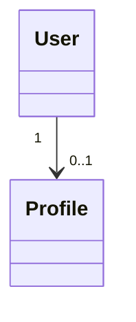

Meaning: `User → 0..1 Profile`. The user may have 0 profiles or 1 profile, but not more than one.

---

## 6. Zero or Many — `0..*`

`0..*` means **zero or many.**

Example: *a Customer can have zero or many Orders.*

```text
classDiagram
    Customer "1" --> "0..*" Order
```


Conceptually:

```text
Customer
   │
   ├── Order
   ├── Order
   ├── Order
   └── ...
```

The `*` represents an unbounded quantity. Therefore `0..*` means *zero or more.*

---

## 7. One or Many — `1..*`

`1..*` means **one or many.**

Example: *an Order must contain at least one OrderItem.*

```text
classDiagram
    Order "1" -- "1..*" OrderItem
```

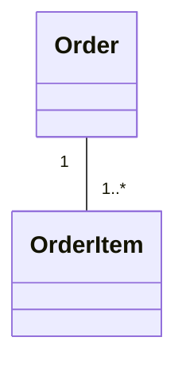

Conceptually:

```text
Order
 ├── OrderItem
 ├── OrderItem
 └── ...
```

At least one `OrderItem` must exist according to the model.

Important difference:

```text
0..* → Zero or more
1..* → One or more
```

---

## 8. Multiplicity is Written at Association Ends

This is one of the most important UML concepts.

```text
classDiagram
    Customer "1" --> "0..*" Order
```


The `"1"` is placed near the `Customer` end. The `"0..*"` is placed near the `Order` end. **The multiplicity belongs to an association end.**

Do not simply read `Customer "1"` as *"Customer has one."* Instead, interpret the multiplicity based on the opposite class.

---

## 9. How to Read Multiplicity

```text
classDiagram
    Customer "1" --> "0..*" Order
```


Read it as: *a Customer is associated with zero or many Orders,* and *each Order is associated with exactly one Customer.*

```text
Customer → 0..* Orders
Order    → 1 Customer
```

A useful mental rule: **look at the multiplicity written near the opposite class to determine how many of that class can be associated.**

---

## 10. One-to-One

Suppose: *each User has exactly one Profile, and each Profile belongs to exactly one User.*

```text
classDiagram
    User "1" -- "1" Profile
```

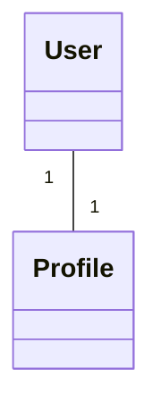

Conceptually: `User "1" ───────── "1" Profile`. This represents `1 : 1`.

---

## 11. One-to-Many

A common relationship: `Customer → Orders`.

```text
classDiagram
    Customer "1" -- "0..*" Order
```

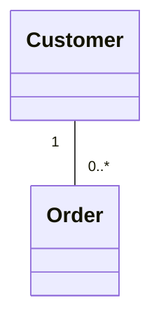

This represents a one-to-many relationship:

```text
Customer → 0..* Orders
Order    → 1 Customer
```

---

## 12. Many-to-Many

Suppose: *a Student can enroll in many Courses, and a Course can have many Students.*

```text
classDiagram
    Student "0..*" -- "0..*" Course
```

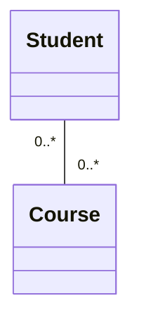

Conceptually: `Student "0..*" ───── "0..*" Course`. This represents **many-to-many.**

---

## 13. One-to-Zero-or-One

Suppose: *a User can have zero or one Address, and an Address belongs to exactly one User.*

```text
classDiagram
    User "1" -- "0..1" Address
```

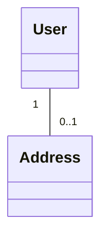

Meaning:

```text
User    → 0..1 Address
Address → 1 User
```

---

## 14. Multiplicity with Aggregation

Multiplicity can be combined with aggregation.

Example: *a Team can have zero or many Players.*

```text
classDiagram
    Team "1" o-- "0..*" Player
```

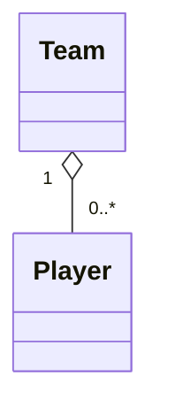

Conceptually: `Team "1" ◇──────── "0..*" Player`. This communicates two separate concepts: `◇` → aggregation, and `0..*` → multiplicity.

---

## 15. Multiplicity with Composition

Multiplicity can also be combined with composition.

Example: *an Order contains one or more OrderItems.*

```text
classDiagram
    Order "1" *-- "1..*" OrderItem
```

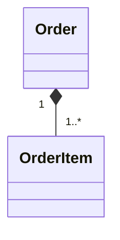

Conceptually: `Order "1" ◆──────── "1..*" OrderItem`. This communicates: `◆` → composition, and `1..*` → one or more parts.

---

## 16. Multiplicity vs. Cardinality

You'll often hear both **multiplicity** and **cardinality**. In practical LLD discussions, people often use these terms interchangeably when discussing relationship counts.

For UML specifically, **multiplicity** is the more precise UML term.

```text
Multiplicity → How many instances can participate?
```

---

## 17. Range-Based Multiplicity

Multiplicity can specify a range.

`2..5` means *between 2 and 5.*

```text
classDiagram
    Team "1" -- "2..5" Coach
```

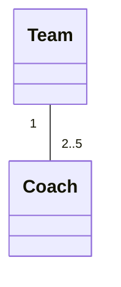

This means a `Team` is associated with between 2 and 5 `Coach` objects according to the model.

Another example: `3..*` means *at least 3, with no specified upper limit.*

---

## 18. Multiplicity with Relationship Labels

Multiplicity can be combined with relationship labels.

```text
classDiagram
    Customer "1" --> "0..*" Order : places
```


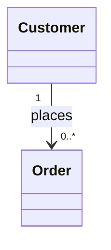

This relationship communicates three different things:

```text
places   → Relationship meaning
-->      → Navigability
1 / 0..* → Multiplicity
```

Therefore, don't treat the entire line as one piece of information — each part communicates something different.

---

## 19. Relationship Information

A UML relationship can communicate several dimensions.

```text
classDiagram
    Customer "1" --> "0..*" Order : places
```


Break it down:

```text
Customer
   │
   ├── Relationship meaning → places
   │
   ├── Navigability → -->
   │
   └── Multiplicity → 1 / 0..*
```

So:

```text
Relationship label → What does the relationship mean?
Navigability        → Which direction can we navigate?
Multiplicity         → How many instances can participate?
```

---

## 20. Common Multiplicity Notations

**Exactly one** — `1` — meaning: exactly one.

**Zero or one** — `0..1` — meaning: zero or one.

**Zero or many** — `0..*` — meaning: zero or many.

**One or many** — `1..*` — meaning: one or many.

**Fixed range** — `2..5` — meaning: between 2 and 5.

---

## 21. Practice Questions

**Practice 1**

Model: *a Customer can have zero or many Orders, and each Order belongs to exactly one Customer.*

**Solution**

```text
classDiagram
    Customer "1" -- "0..*" Order
```


Interpretation: `Customer → 0..* Orders`, `Order → 1 Customer`.

**Practice 2**

Model: *a User can have zero or one Profile.*

**Solution**

```text
classDiagram
    User "1" -- "0..1" Profile
```


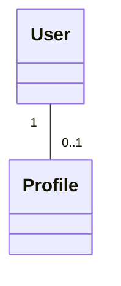

**Practice 3**

Model: *an Order must contain at least one OrderItem.*

**Solution**

```text
classDiagram
    Order "1" -- "1..*" OrderItem
```


The `1..*` means *one or more.*

**Practice 4**

Model: *a Student can enroll in many Courses, and a Course can have many Students.*

**Solution**

```text
classDiagram
    Student "0..*" -- "0..*" Course
```

```mermaid
classDiagram
    Student "0..*" -- "0..*" Course
```

This represents a many-to-many relationship.

**Practice 5**

What does this mean?

```text
classDiagram
    Company "1" -- "0..*" Employee
```


```mermaid
classDiagram
    Company "1" -- "0..*" Employee
```

**Solution**

```text
One Company    → Zero or many Employees
Each Employee  → Exactly one Company
```

---

## 22. Common Mistakes

**Mistake 1 — Reading the number next to a class as that class's count**

Don't automatically read `Customer "1" ───── "0..*" Order` as *"Customer has 1."* Instead, interpret multiplicity at each association end.

**Mistake 2 — Confusing `0..*` and `1..*`**

```text
0..* → Zero or more
1..* → One or more
```

The difference is whether zero is allowed.

**Mistake 3 — Thinking `*` means exactly many**

It doesn't. `*` means an unbounded number. In practical UML usage, `*` is commonly equivalent to `0..*`.

**Mistake 4 — Confusing multiplicity with navigability**

`-->` means navigability/direction. `0..*` means quantity/multiplicity. They are completely different concepts.

---

## 23. Mermaid Multiplicity Cheat Sheet

**One-to-one**

```text
A "1" -- "1" B
```

**One-to-many**

```text
A "1" -- "0..*" B
```

**One-to-zero-or-one**

```text
A "1" -- "0..1" B
```

**One-to-one-or-many**

```text
A "1" -- "1..*" B
```

**Many-to-many**

```text
A "0..*" -- "0..*" B
```

**Fixed range**

```text
A "1" -- "2..5" B
```

**Aggregation + multiplicity**

```text
A "1" o-- "0..*" B
```

**Composition + multiplicity**

```text
A "1" *-- "1..*" B
```

---

## 24. Quick Revision

```text
1       → Exactly one
0..1    → Zero or one
0..*    → Zero or many
1..*    → One or many
2..5    → Between 2 and 5
```

The four most important values: `1`, `0..1`, `0..*`, `1..*`.

---

## 25. Final Mental Model

Whenever you see:

```text
classDiagram
    A "1" -- "0..*" B
```

```mermaid
classDiagram
    A "1" -- "0..*" B
```

Think: `A "1" ───────── "0..*" B`. Then ask: *what does each association end allow?*

The result:

```text
A → 0..* B
B → 1 A
```

The key concept: `Multiplicity → How many instances can participate?`

---

## 26. Relationship Information Summary

A UML relationship can communicate multiple dimensions:

```text
                  Relationship
                       │
        ┌──────────────┼──────────────┐
        │              │              │
    Relationship    Navigation   Multiplicity
       Meaning        Direction       Count
        │              │              │
     "places"          -->           0..*
```

```text
classDiagram
    Customer "1" --> "0..*" Order : places
```

```mermaid
classDiagram
    Customer "1" --> "0..*" Order : places
```

Contains:

```text
places   → Relationship meaning
-->      → Navigability
1 / 0..* → Multiplicity
```

This separation is extremely useful when reading LLD UML diagrams.

---

## 27. Most Important Mermaid Syntax

```text
A "1" -- "1" B
A "1" -- "0..1" B
A "1" -- "0..*" B
A "1" -- "1..*" B
A "0..*" -- "0..*" B
A "1" o-- "0..*" B
A "1" *-- "1..*" B
```

The core idea: `"1"`, `"0..1"`, `"0..*"`, `"1..*"` are multiplicity values placed at association ends.

---

## 28. Key Takeaways

1. Multiplicity tells us how many instances can participate in a relationship.
2. Multiplicity is written at association ends.
3. `1` means exactly one.
4. `0..1` means zero or one.
5. `0..*` means zero or many.
6. `1..*` means one or many.
7. `*` represents an unbounded quantity.
8. Multiplicity can be combined with association, aggregation, composition, and navigability.
9. `-->` represents navigation; it does not represent quantity.
10. `o--` represents aggregation.
11. `*--` represents composition.
12. Multiplicity is the UML concept used to express how many instances can participate in a relationship.