# UML Association vs. Dependency

## 1. Overview

Association and Dependency are two different UML relationships. They can both indicate that two elements are connected, but they communicate different meanings.

**Association** — a structural relationship between two UML elements.
**Dependency** — one UML element uses or depends on another UML element.

The simplest way to remember:

| Relationship | Meaning |
|---|---|
| Association | A is structurally related to B |
| Dependency | A uses or depends on B |

---

## 2. Association

Association represents a structural relationship between two UML elements, usually classes. The basic UML representation is a solid line.

```text
classDiagram
    Customer -- Order
```

```text
classDiagram
    Customer -- Order
```

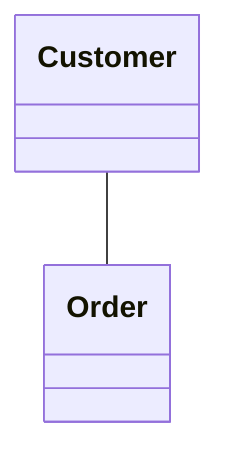

This means: *Customer is associated with Order.* An association by itself does not necessarily tell us why the classes are related.

---

## 3. Association with a Relationship Label

A relationship can have a label describing its meaning.

```text
classDiagram
    Customer -- Order : places
```

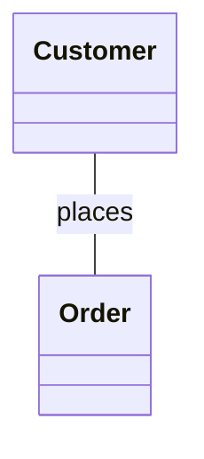

Here, `Customer -- Order` represents the association, and `places` describes the meaning of the relationship. The label is useful when the relationship is not obvious from the class names.

---

## 4. Directed / Navigable Association

An association can have a direction.

```text
classDiagram
    Customer --> Order : places
```

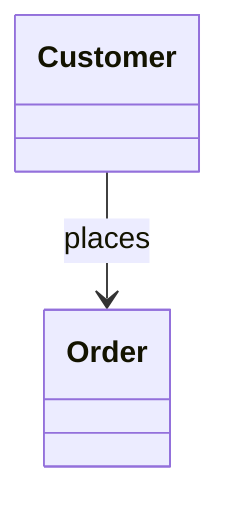

Conceptually: `Customer ─────────> Order`. The arrow indicates navigability — it tells us that navigation is modeled from `Customer` toward `Order`.

---

## 5. Association Without Direction

```text
classDiagram
    Customer -- Order
```


This represents an association without explicitly showing navigability in either direction.

---

## 6. Bidirectional Association

Mermaid can also represent a bidirectional association.

```text
classDiagram
    Customer <--> Order
```

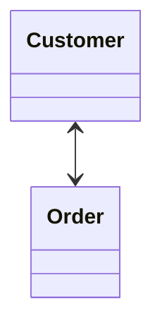

Conceptually: `Customer <────────> Order`. This communicates navigation in both directions.

---

## 7. Association with Multiplicity

Association can be combined with multiplicity.

```text
classDiagram
    Customer "1" --> "0..*" Order : places
```

```text
classDiagram
    Customer "1" --> "0..*" Order : places
```

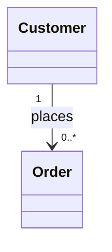

This communicates multiple pieces of information:

```text
Customer → 1 Customer
Order    → 0..* Orders
```

And:

```text
-->    = navigability
1      = multiplicity
0..*   = multiplicity
places = relationship meaning
```

---

## 8. Dependency

Dependency represents a uses/depends-on relationship. It is represented by a dashed line with an open arrow.

```text
classDiagram
    OrderService ..> PaymentService
```

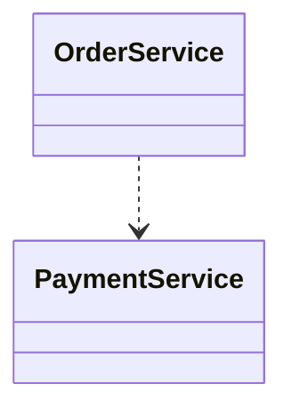

Conceptually: `OrderService - - - - - > PaymentService`. Read this as: *OrderService depends on PaymentService.*

---

## 9. Dependency with a Label

A dependency can have a label.

```text
classDiagram
    OrderService ..> PaymentService : uses
```

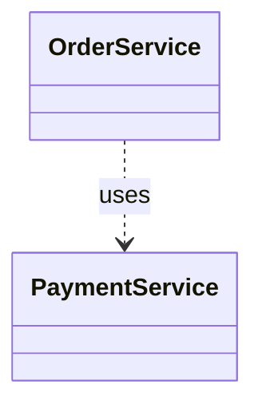

The label makes the dependency meaning explicit:

```text
OrderService - - - - - > PaymentService
                         uses
```

---

## 10. Association vs. Dependency

The most important comparison:

| Feature | Association | Dependency |
|---|---|---|
| Meaning | Structural relationship | Uses / depends on |
| Line | Solid | Dashed |
| Mermaid | `--` | `..>` |
| Directed form | `-->` | `..>` |
| Arrow | Can indicate navigability | Points toward dependency |
| Typical wording | related to / has relationship with | uses / needs / depends on |

---

## 11. Visual Difference

**Association**

```text
classDiagram
    Customer --> Order : places
```

```text
classDiagram
    Customer --> Order : places
```

Visual idea: `Customer ─────────> Order` — solid line.

**Dependency**


Visual idea: `OrderService - - - - - > PaymentService` — dashed line.

---

## 12. Side-by-Side Example

```text
classDiagram
    Customer --> Order : places
    OrderService ..> PaymentService : uses
```

```text
classDiagram
    Customer --> Order : places
    OrderService ..> PaymentService : uses
```

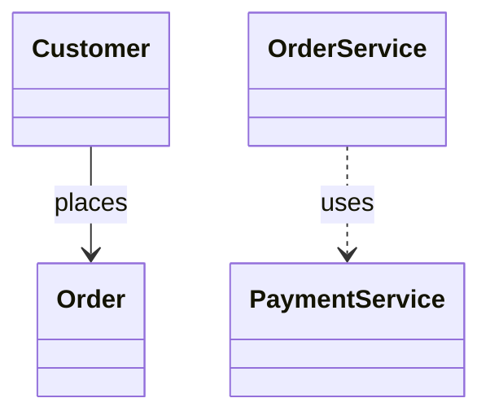

The two relationships mean different things.

**Customer → Order:** `Customer ─────────> Order` — this is an **association.** The classes have a structural relationship.

**OrderService → PaymentService:** `OrderService - - - - - > PaymentService` — this is a **dependency.** `OrderService` uses `PaymentService`.

---

## 13. Association Does Not Automatically Mean Ownership

Association is a general structural relationship.

```text
classDiagram
    Customer -- Order
```


This does **not** automatically mean *Customer owns Order*, *Customer controls Order's lifecycle*, *Order cannot exist without Customer*, or *Customer creates Order*.

Those meanings require additional UML relationships or constraints. For example, composition explicitly communicates a strong whole-part relationship:

```text
classDiagram
    Order *-- OrderItem
```

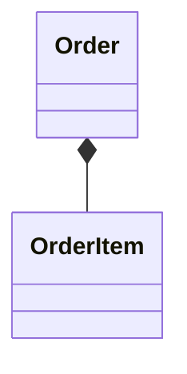

Composition is different from ordinary association.

---

## 14. Dependency Does Not Automatically Mean Association

```text
classDiagram
    OrderService ..> PaymentService : uses
```


The diagram is specifically communicating a dependency. It does not automatically mean that `OrderService` and `PaymentService` have a persistent structural association.

The relationship should be chosen based on the semantics you want the diagram to communicate.

---

## 15. Association vs. Navigability

These concepts should not be confused.

**Association**

```text
classDiagram
    Customer -- Order
```


Means: *Customer is associated with Order.*

**Navigable association**

```text
classDiagram
    Customer --> Order
```

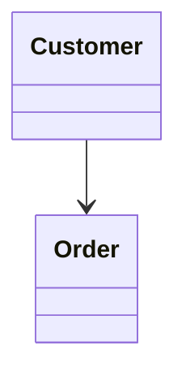

Means: *Customer has a navigable relationship toward Order.*

**Dependency**

```text
classDiagram
    Customer ..> Order
```

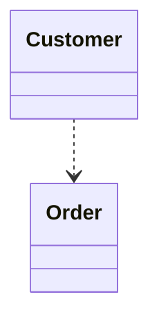

Means: *Customer depends on / uses Order.*

Therefore:

```text
--   → Association
-->  → Directed / navigable association
..>  → Dependency
```

---

## 16. Relationship Labels vs. Arrows

```text
classDiagram
    Customer --> Order : places
```


There are three separate pieces of information:

```text
-->      → Direction / navigability
places   → Meaning of the relationship
Customer, Order → Classes participating in the relationship
```

The arrow and relationship label are not the same thing.

---

## 17. Association vs. Dependency vs. Composition

These three relationships are frequently confused.

```text
classDiagram
    Customer --> Order : places
    OrderService ..> PaymentService : uses
    Order *-- OrderItem : contains
```

```text
classDiagram
    Customer --> Order : places
    OrderService ..> PaymentService : uses
    Order *-- OrderItem : contains
```

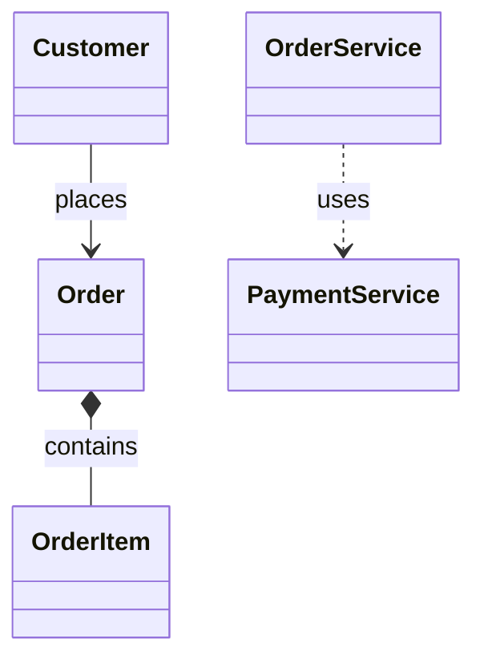

They communicate different concepts:

```text
Customer --> Order              → Association, "related to"
OrderService ..> PaymentService → Dependency, "uses"
Order *-- OrderItem             → Composition, "strong whole-part relationship"
```

---

## 18. Relationship Decision Rule

When deciding between association and dependency, ask:

**Question 1 — are the two elements structurally related?** If yes, consider **association.**

```text
classDiagram
    Customer -- Order
```


**Question 2 — does one element simply use or depend on another?** If yes, consider **dependency.**

```text
classDiagram
    OrderService ..> PaymentService
```


**Question 3 — is it specifically a whole-part relationship?** If yes, consider **aggregation** or **composition.**

```text
classDiagram
    Order *-- OrderItem
```

```mermaid
classDiagram
    Order *-- OrderItem
```

---

## 19. Common Mistake — Using Association for Dependency

Incorrect if the intended meaning is specifically dependency:

```text
classDiagram
    OrderService --> PaymentService
```

```mermaid
classDiagram
    OrderService --> PaymentService
```

This is a directed association. If the intended meaning is *OrderService uses PaymentService*, then dependency is more appropriate:

```text
classDiagram
    OrderService ..> PaymentService : uses
```

```mermaid
classDiagram
    OrderService ..> PaymentService : uses
```

---

## 20. Common Mistake — Confusing Dependency with Navigability

These are different:

```text
classDiagram
    Customer --> Order
```

```mermaid
classDiagram
    Customer --> Order
```

This represents a directed/navigable association. Whereas:

```text
classDiagram
    Customer ..> Order
```

```mermaid
classDiagram
    Customer ..> Order
```

represents dependency. Remember: `-->` = directed association, `..>` = dependency.

---

## 21. Common Mistake — Treating Every Connection as Association

UML provides different relationship types because each relationship communicates different semantics. Common relationships: Association, Dependency, Generalization, Realization, Aggregation, Composition.

Do not automatically use association just because two classes are connected.

---

## 22. Association with Multiplicity

A common LLD example:

```text
classDiagram
    Customer "1" --> "0..*" Order : places
```

```mermaid
classDiagram
    Customer "1" --> "0..*" Order : places
```

Interpretation:

```text
1 Customer ──── places ────> 0..* Orders
```

Here:

```text
Association → relationship
-->         → navigability
1 / 0..*    → multiplicity
places      → relationship meaning
```

---

## 23. Multiple Dependencies

One class can depend on several other elements.

```text
classDiagram
    class OrderService
    class PaymentService
    class InventoryService
    class NotificationService

    OrderService ..> PaymentService : uses
    OrderService ..> InventoryService : uses
    OrderService ..> NotificationService : uses
```

```text
classDiagram
    class OrderService
    class PaymentService
    class InventoryService
    class NotificationService

    OrderService ..> PaymentService : uses
    OrderService ..> InventoryService : uses
    OrderService ..> NotificationService : uses
```

```mermaid
classDiagram
    class OrderService
    class PaymentService
    class InventoryService
    class NotificationService

    OrderService ..> PaymentService : uses
    OrderService ..> InventoryService : uses
    OrderService ..> NotificationService : uses
```

This clearly communicates that `OrderService` depends on three other elements.

---

## 24. Association and Dependency Together

A more realistic UML model can contain both.

```text
classDiagram
    Customer "1" --> "0..*" Order : places

    OrderService ..> PaymentService : uses
    OrderService ..> InventoryService : uses
    Order "1" *-- "1..*" OrderItem : contains
```

```text
classDiagram
    Customer "1" --> "0..*" Order : places

    OrderService ..> PaymentService : uses
    OrderService ..> InventoryService : uses
    Order "1" *-- "1..*" OrderItem : contains
```

```mermaid
classDiagram
    Customer "1" --> "0..*" Order : places

    OrderService ..> PaymentService : uses
    OrderService ..> InventoryService : uses
    Order "1" *-- "1..*" OrderItem : contains
```

This diagram contains:

```text
Customer → Order                → Association
OrderService ..> PaymentService → Dependency
OrderService ..> InventoryService → Dependency
Order *-- OrderItem             → Composition
```

---

## 25. Practice Questions

**Practice 1**

A Customer is related to multiple Orders. Use association with multiplicity.

**Solution**

```text
classDiagram
    Customer "1" --> "0..*" Order : places
```

```mermaid
classDiagram
    Customer "1" --> "0..*" Order : places
```

**Practice 2**

OrderService uses PaymentService. What relationship should be used?

**Solution**

```text
classDiagram
    OrderService ..> PaymentService : uses
```

```mermaid
classDiagram
    OrderService ..> PaymentService : uses
```

**Practice 3**

Order strongly contains OrderItems. What relationship should be used?

**Solution**

```text
classDiagram
    Order "1" *-- "1..*" OrderItem : contains
```

```mermaid
classDiagram
    Order "1" *-- "1..*" OrderItem : contains
```

This is composition, not dependency.

**Practice 4**

A Teacher teaches multiple Students.

**Solution**

```text
classDiagram
    Teacher "1" --> "0..*" Student : teaches
```

```mermaid
classDiagram
    Teacher "1" --> "0..*" Student : teaches
```

This is an association with navigability and multiplicity.

**Practice 5**

NotificationService uses EmailService.

**Solution**

```text
classDiagram
    NotificationService ..> EmailService : uses
```

```mermaid
classDiagram
    NotificationService ..> EmailService : uses
```

This is a dependency.

---

## 26. UML Relationship Cheat Sheet

| UML Relationship | Mermaid | Meaning |
|---|---|---|
| Association | `A -- B` | A is related to B |
| Directed Association | `A --> B` | A navigates toward B |
| Bidirectional Association | `A <--> B` | Navigation in both directions |
| Dependency | `A ..> B` | A uses/depends on B |
| Generalization | `A <\|-- B` | B is a specialized A |
| Realization | `A <\|.. B` | B realizes A |
| Aggregation | `A o-- B` | A is a whole containing independent B |
| Composition | `A *-- B` | A strongly contains B |

---

## 27. Most Important Visual Rules

Remember the line styles:

```text
Solid line  → Association
Dashed line → Dependency
```

Arrowheads:

```text
-->   → Directed / navigable association
..>   → Dependency
<|--  → Generalization
<|..  → Realization
```

Diamonds:

```text
o--   → Aggregation
*--   → Composition
```

---

## 28. Quick Mental Model

Think about the relationship using these questions:

```text
Are A and B structurally related?
        │
        └── Yes → Association

Does A use or depend on B?
        │
        └── Yes → Dependency

Is A a whole containing B?
        │
        ├── Weak whole-part   → Aggregation
        │
        └── Strong whole-part → Composition

Is B a specialized form of A?
        │
        └── Yes → Generalization

Does B fulfill A's contract?
        │
        └── Yes → Realization
```

---

## 29. Key Takeaways

1. Association represents a structural relationship.
2. Association uses a solid line.
3. `-->` represents a directed/navigable association.
4. Dependency represents a uses/depends-on relationship.
5. Dependency uses a dashed line with an open arrow.
6. `..>` represents dependency in Mermaid.
7. Navigability and dependency are different concepts.
8. Association does not automatically mean ownership.
9. Dependency does not automatically mean persistent structural association.
10. Use relationship semantics rather than simply connecting every class with a generic line.

---

## 30. Final Cheat Sheet

```text
classDiagram

    %% Association
    Customer -- Order
    %% Directed / Navigable Association
    Customer --> Order
    %% Bidirectional Association
    Customer <--> Order
    %% Association with Label
    Customer --> Order : places
    %% Dependency
    OrderService ..> PaymentService
    %% Dependency with Label
    OrderService ..> PaymentService : uses
    %% Generalization
    Vehicle <|-- Car
    %% Realization
    PaymentService <|.. UPIPayment
    %% Aggregation
    Team o-- Player
    %% Composition
    Order *-- OrderItem
```

```mermaid
classDiagram

    %% Association
    Customer -- Order
    %% Directed / Navigable Association
    Customer --> Order
    %% Bidirectional Association
    Customer <--> Order
    %% Association with Label
    Customer --> Order : places
    %% Dependency
    OrderService ..> PaymentService
    %% Dependency with Label
    OrderService ..> PaymentService : uses
    %% Generalization
    Vehicle <|-- Car
    %% Realization
    PaymentService <|.. UPIPayment
    %% Aggregation
    Team o-- Player
    %% Composition
    Order *-- OrderItem
```

---

## Final Rule to Remember

```text
Association:  A ───────── B       "A is related to B"
Dependency:   A - - - - -> B      "A uses/depends on B"
```

The key visual distinction:

```text
SOLID LINE  = Association
DASHED LINE = Dependency
```