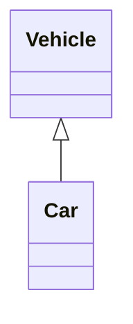
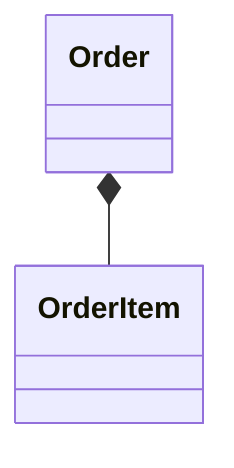
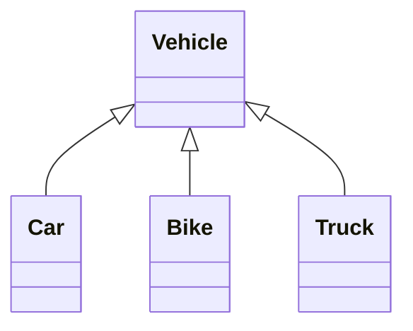
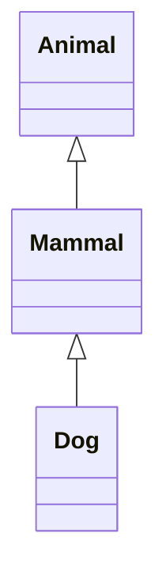
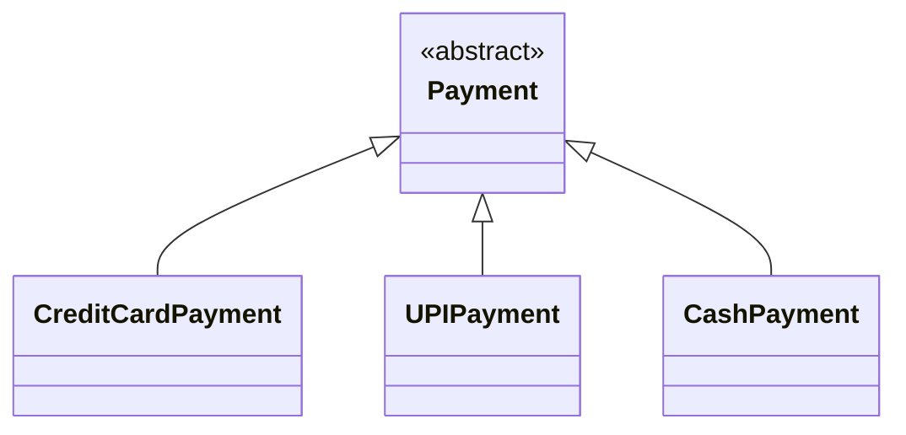
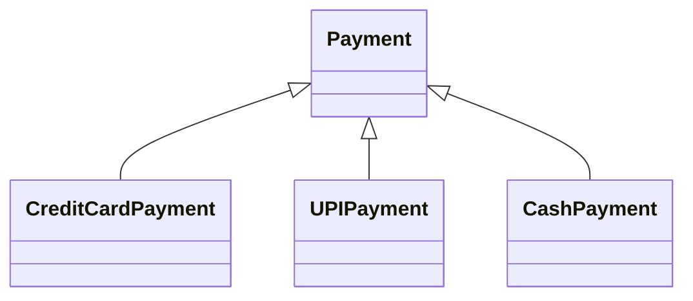
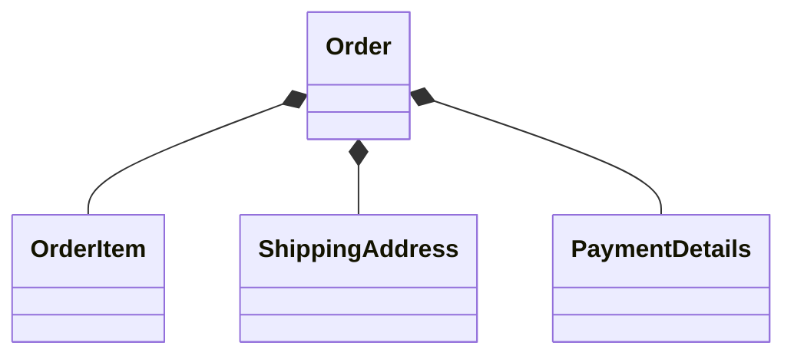
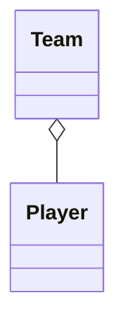

# UML Inheritance vs. Composition

## 1. Overview

Inheritance and Composition are two different UML modeling relationships. They communicate fundamentally different meanings.

**Inheritance** — IS-A relationship.

Example: `Car IS-A Vehicle`

```text
classDiagram
    Vehicle <|-- Car
```



**Composition** — HAS-A / strong whole-part relationship.

Example: `Order contains OrderItem`

```text
classDiagram
    Order *-- OrderItem
```



The key idea:

```text
Inheritance  → IS-A
Composition  → HAS-A / strong whole-part
```

```text
classDiagram
    Order *-- OrderItem
```


The key idea:

```text
Inheritance  → IS-A
Composition  → HAS-A / strong whole-part
```

---

## 2. Inheritance in UML

In UML, what we commonly call inheritance is represented using **Generalization**. Generalization represents a relationship where one classifier is a specialization of another.

The notation is a solid line + hollow triangle.

```text
classDiagram
    Vehicle <|-- Car
```

```text
classDiagram
    Vehicle <|-- Car
```


Conceptually: `Car ─────────▷ Vehicle`. The hollow triangle points toward the general/base class.

---

## 3. Reading a Generalization Relationship

```text
classDiagram
    Vehicle <|-- Car
```


Read it as: `Car IS-A Vehicle`.

```text
Vehicle = General classifier
Car     = Specialized classifier
```

The triangle points toward `Vehicle`.

---

## 4. Multiple Specialized Classes

A general class can have multiple specialized classes.

```text
classDiagram
    Vehicle <|-- Car
    Vehicle <|-- Bike
    Vehicle <|-- Truck
```

```text
classDiagram
    Vehicle <|-- Car
    Vehicle <|-- Bike
    Vehicle <|-- Truck
```



Conceptually:

```text
              Vehicle
                 △
          ┌──────┼──────┐
          │      │      │
         Car    Bike   Truck
```

Each child represents a specialization of `Vehicle`.

---

## 5. Multi-Level Generalization

Generalization can form multiple levels.

```text
classDiagram
    Animal <|-- Mammal
    Mammal <|-- Dog
```

```text
classDiagram
    Animal <|-- Mammal
    Mammal <|-- Dog



This represents `Dog IS-A Mammal` and `Mammal IS-A Animal`.

```text
Animal
  △
Mammal
  △
 Dog
```

---

## 6. Abstract Class with Generalization

Generalization is commonly used with abstract classes.

```text
classDiagram
    class Payment {
        <<abstract>>
    }

    class CreditCardPayment
    class UPIPayment
    class CashPayment
    Payment <|-- CreditCardPayment
    Payment <|-- UPIPayment
    Payment <|-- CashPayment
```

```text
classDiagram
    class Payment {
        <<abstract>>
    }

    class CreditCardPayment
    class UPIPayment
    class CashPayment
    Payment <|-- CreditCardPayment
    Payment <|-- UPIPayment
    Payment <|-- CashPayment
```



Conceptually:

```text
                 Payment
               «abstract»
                   △
        ┌──────────┼──────────┐
        │          │          │
   CreditCard      UPI        Cash
```

The `<<abstract>>` stereotype indicates that `Payment` is abstract. The `<|--` relationship represents generalization.

---

## 7. Composition in UML

Composition represents a strong whole-part relationship. The notation is a solid line + filled diamond.

```text
classDiagram
    Order *-- OrderItem
```

```text
classDiagram
    Order *-- OrderItem
```


Conceptually: `Order ◆──────── OrderItem`. The filled diamond represents the whole.

---

## 8. Reading a Composition Relationship

```text
classDiagram
    Order *-- OrderItem
```


Read it as: *Order contains OrderItem*, or *Order is composed of OrderItems.*

The important idea is that `OrderItem` is modeled as a strong part of `Order`.

---

## 9. Diamond Placement

The placement of the composition diamond is extremely important.

**Correct:**

```text
classDiagram
    Order *-- OrderItem
```


The diamond is next to `Order`, because `Order` is the whole.

**Rule: the composition diamond is placed at the whole side.**

---

## 10. Generalization Triangle Placement

The same concept applies to the generalization triangle.

```text
classDiagram
    Vehicle <|-- Car
```


The triangle points toward `Vehicle`, because `Vehicle` is the general classifier.

**Rule: the hollow triangle points toward the general/base classifier.**

---

## 11. Inheritance vs. Composition

The most important comparison.

**Inheritance:**

```text
classDiagram
    Vehicle <|-- Car
```


Meaning: `Car IS-A Vehicle`.

**Composition:**

```text
classDiagram
    Order *-- OrderItem
```


Meaning: `Order HAS / CONTAINS OrderItem`.

```text
<|--  → Generalization / Inheritance
*--   → Composition
```

---

## 12. Why the Difference Matters in UML

When designing an LLD class diagram, don't simply ask *"how are these classes connected?"* Instead ask: *"what semantic relationship should the diagram communicate?"*

For `Car is a Vehicle`, use generalization:

```text
classDiagram
    Vehicle <|-- Car
```


But for `Order contains OrderItem`, use composition:

```text
classDiagram
    Order *-- OrderItem
```


These are fundamentally different relationships.

---

## 13. Generalization Means Specialization

Generalization represents a hierarchy.

```text
classDiagram
    Payment <|-- CreditCardPayment
    Payment <|-- UPIPayment
    Payment <|-- CashPayment
```

```text
classDiagram
    Payment <|-- CreditCardPayment
    Payment <|-- UPIPayment
    Payment <|-- CashPayment
```



The diagram communicates: `CreditCardPayment IS-A Payment`, `UPIPayment IS-A Payment`, `CashPayment IS-A Payment`.

The relationship is about classification and specialization.

---

## 14. Composition Means Whole-Part

Composition represents a whole containing parts.

```text
classDiagram
    Order *-- OrderItem
    Order *-- ShippingAddress
    Order *-- PaymentDetails
```

```text
classDiagram
    Order *-- OrderItem
    Order *-- ShippingAddress
    Order *-- PaymentDetails
```



Conceptually:

```text
                    Order
                 ◆────┼────◆
                 │    │    │
           OrderItem  │  PaymentDetails
                      │
               ShippingAddress
```

The relationships represent strong whole-part semantics.

---

## 15. Composition vs. Aggregation

Both aggregation and composition represent whole-part relationships — the symbols are different.

**Aggregation**

```text
classDiagram
    Team o-- Player
```



Symbol: `◇` — Mermaid: `o--`

**Composition**

```text
classDiagram
    Order *-- OrderItem
```


Symbol: `◆` — Mermaid: `*--`

**Comparison:**

| Relationship | Symbol | Meaning |
|---|---|---|
| Aggregation | `◇` | Weaker whole-part relationship |
| Composition | `◆` | Strong whole-part relationship |

---

## 16. Inheritance Is Not Composition

```text
classDiagram
    Vehicle <|-- Car
```

```mermaid
classDiagram
    Vehicle <|-- Car
```

This means `Car IS-A Vehicle`.

Now consider:

```text
classDiagram
    Vehicle *-- Car
```

```mermaid
classDiagram
    Vehicle *-- Car
```

This means `Vehicle contains Car`. These are completely different UML semantics.

```text
<|-- ≠ *--
```

---

## 17. Composition Is Not Ordinary Association

```text
classDiagram
    Order -- OrderItem
```

```mermaid
classDiagram
    Order -- OrderItem
```

This represents a general association. Now:

```text
classDiagram
    Order *-- OrderItem
```

```mermaid
classDiagram
    Order *-- OrderItem
```

This represents composition.

```text
--   → Association
*--  → Composition
```

Composition adds explicit whole-part semantics.

---

## 18. Inheritance vs. Association

**Inheritance:**

```text
classDiagram
    Vehicle <|-- Car
```

```mermaid
classDiagram
    Vehicle <|-- Car
```

Means: `Car IS-A Vehicle`.

**Association:**

```text
classDiagram
    Customer -- Order

```mermaid
classDiagram
    Customer -- Order
```

Means: `Customer is related to Order`.

They should not be treated as interchangeable.

---

## 19. Inheritance vs. Composition vs. Association

A useful comparison:

```text
classDiagram
    Vehicle <|-- Car
    Order *-- OrderItem
    Customer -- Order
```

```text
classDiagram
    Vehicle <|-- Car
    Order *-- OrderItem
    Customer -- Order
```

```mermaid
classDiagram
    Vehicle <|-- Car
    Order *-- OrderItem
    Customer -- Order
```

Interpretation:

```text
Car      IS-A            Vehicle
Order    CONTAINS        OrderItem
Customer IS-RELATED-TO   Order
```

| Relationship | Mermaid | Meaning |
|---|---|---|
| Generalization | `A <\|-- B` | B is-a A |
| Composition | `A *-- B` | Strong whole-part |
| Association | `A -- B` | Structural relationship |

---

## 20. Real-World LLD Example

Consider an e-commerce system. We might model payment types using generalization:

```text
classDiagram
    Payment <|-- CreditCardPayment
    Payment <|-- UPIPayment
    Payment <|-- CashPayment
```

```mermaid
classDiagram
    Payment <|-- CreditCardPayment
    Payment <|-- UPIPayment
    Payment <|-- CashPayment
```

And order structure using composition:

```text
classDiagram
    Order *-- OrderItem
    Order *-- ShippingAddress
```

```mermaid
classDiagram
    Order *-- OrderItem
    Order *-- ShippingAddress
```

Together:

```text
classDiagram
    Payment <|-- CreditCardPayment
    Payment <|-- UPIPayment
    Payment <|-- CashPayment

    Order *-- OrderItem
    Order *-- ShippingAddress
```

```text
classDiagram
    Payment <|-- CreditCardPayment
    Payment <|-- UPIPayment
    Payment <|-- CashPayment

    Order *-- OrderItem
    Order *-- ShippingAddress
```

```mermaid
classDiagram
    Payment <|-- CreditCardPayment
    Payment <|-- UPIPayment
    Payment <|-- CashPayment

    Order *-- OrderItem
    Order *-- ShippingAddress
```

The diagram contains two different semantic relationships:

```text
Payment hierarchy → Generalization
Order structure   → Composition
```

---

## 21. How to Decide

When choosing between inheritance and composition, ask:

**Question 1 — is B a specialized type of A?** If yes: **generalization.**

```text
classDiagram
    A <|-- B
```

```mermaid
classDiagram
    A <|-- B
```

Think: `B IS-A A`.

**Question 2 — is B a strongly contained part of A?** If yes: **composition.**

```text
classDiagram
    A *-- B
```

```mermaid
classDiagram
    A *-- B
```

Think: `A HAS B`.

**Question 3 — is B simply related to A without specialization or strong whole-part semantics?** Consider **association.**

```text
classDiagram
    A -- B
```

```mermaid
classDiagram
    A -- B
```

---

## 22. Decision Tree

```text
Relationship between A and B
             │
             ▼
       Is B a type of A?
          /       \
        YES        NO
         │          │
         ▼          ▼
  Generalization   Is B a strong
       <|--        part of A?
                     /   \
                   YES    NO
                    │      │
                    ▼      ▼
               Composition Association
                   *--        --
```

---

## 23. Common Mistake — Using Inheritance for Everything

Not every relationship should be represented using generalization.

Incorrect if the intended meaning is simply *A is related to B*. Don't automatically use:

```text
classDiagram
    A <|-- B
```

```mermaid
classDiagram
    A <|-- B
```

Generalization should communicate `B IS-A A`.

---

## 24. Common Mistake — Using Composition for Inheritance

Suppose `Car IS-A Vehicle`.

**Incorrect:**

```text
classDiagram
    Vehicle *-- Car
```

```mermaid
classDiagram
    Vehicle *-- Car
```

**Correct:**

```text
classDiagram
    Vehicle <|-- Car
```

```mermaid
classDiagram
    Vehicle <|-- Car
```

Because the relationship is specialization, not whole-part.

---

## 25. Common Mistake — Reversing the Composition Diamond

**Correct:**

```text
classDiagram
    Order *-- OrderItem
```

```mermaid
classDiagram
    Order *-- OrderItem
```

**Incorrect interpretation:**

```text
classDiagram
    OrderItem *-- Order
```

```mermaid
classDiagram
    OrderItem *-- Order
```

Remember: the filled diamond is placed at the whole side.

---

## 26. Common Mistake — Confusing Aggregation and Composition

**Aggregation:**

```text
classDiagram
    Team o-- Player
```

```mermaid
classDiagram
    Team o-- Player
```

**Composition:**

```text
classDiagram
    Order *-- OrderItem
```

```mermaid
classDiagram
    Order *-- OrderItem
```

Remember: `◇` = Aggregation, `◆` = Composition.

---

## 27. Practice

**Practice 1**

*Car is a specialized type of Vehicle.*

**Solution**

```text
classDiagram
    Vehicle <|-- Car
```

```mermaid
classDiagram
    Vehicle <|-- Car
```

Relationship: **Generalization.**

**Practice 2**

*An Order contains multiple OrderItems as strongly owned parts.*

**Solution**

```text
classDiagram
    Order "1" *-- "1..*" OrderItem : contains
```

```mermaid
classDiagram
    Order "1" *-- "1..*" OrderItem : contains
```

Relationship: **Composition.**

**Practice 3**

*Payment has three specialized payment types: CreditCardPayment, UPIPayment, CashPayment.*

**Solution**

```text
classDiagram
    Payment <|-- CreditCardPayment
    Payment <|-- UPIPayment
    Payment <|-- CashPayment
```

```mermaid
classDiagram
    Payment <|-- CreditCardPayment
    Payment <|-- UPIPayment
    Payment <|-- CashPayment
```

Relationship: **Generalization.**

**Practice 4**

*A House contains Rooms as strong whole-part components.*

**Solution**

```text
classDiagram
    House *-- Room
```

```mermaid
classDiagram
    House *-- Room
```

Relationship: **Composition.**

**Practice 5**

*A Company is related to Employees, but the relationship is not being modeled as specialization or strong whole-part.*

**Solution**

```text
classDiagram
    Company -- Employee
```

```mermaid
classDiagram
    Company -- Employee
```

Relationship: **Association.**

---

## 28. UML Relationship Cheat Sheet

| UML Relationship | Mermaid | Meaning |
|---|---|---|
| Generalization | `A <\|-- B` | B is-a A |
| Realization | `A <\|.. B` | B realizes A |
| Association | `A -- B` | Structural relationship |
| Dependency | `A ..> B` | Uses / depends on |
| Aggregation | `A o-- B` | Whole-part relationship |
| Composition | `A *-- B` | Strong whole-part relationship |

---

## 29. Visual Memory

**Generalization** — `<|--` — solid line + hollow triangle — meaning: **IS-A**

**Composition** — `*--` — solid line + filled diamond — meaning: **HAS-A / strong whole-part**

**Aggregation** — `o--` — solid line + hollow diamond — meaning: **HAS-A / weaker whole-part**

---

## 30. Complete Relationship Example

```text
classDiagram

    %% Generalization
    Vehicle <|-- Car
    %% Composition
    Order *-- OrderItem
    %% Aggregation
    Team o-- Player
    %% Association
    Customer -- Order
    %% Dependency
    OrderService ..> PaymentService
```

```mermaid
classDiagram

    %% Generalization
    Vehicle <|-- Car
    %% Composition
    Order *-- OrderItem
    %% Aggregation
    Team o-- Player
    %% Association
    Customer -- Order
    %% Dependency
    OrderService ..> PaymentService
```

This single diagram demonstrates five important UML relationships:

```text
Vehicle <|-- Car                → Generalization
Order *-- OrderItem             → Composition
Team o-- Player                 → Aggregation
Customer -- Order                → Association
OrderService ..> PaymentService → Dependency
```

---

## 31. Final Mental Model

```text
IS-A                     → Generalization  <|--
STRONG HAS-A / PART-OF   → Composition     *--
WEAKER HAS-A / PART-OF   → Aggregation     o--
RELATED-TO               → Association     --
USES                     → Dependency      ..>
```

---

## 32. Key Takeaways

1. Inheritance in UML is represented by Generalization.
2. Generalization uses a solid line with a hollow triangle.
3. Mermaid notation: `A <|-- B`
4. The hollow triangle points toward the general/base classifier.
5. Generalization represents an IS-A / specialization relationship.
6. Composition represents a strong whole-part relationship.
7. Composition uses a solid line with a filled diamond.
8. Mermaid notation: `A *-- B`
9. The filled diamond is placed at the whole side.
10. The easiest distinction: `Generalization → IS-A`, `Composition → HAS-A / strong part-of`.
11. Association is a generic structural relationship: `A -- B`
12. Aggregation is represented using a hollow diamond: `A o-- B`

---

## 33. Final Mermaid Cheat Sheet

```text
classDiagram

    %% Generalization / Inheritance
    Vehicle <|-- Car
    %% Composition
    Order *-- OrderItem
    %% Aggregation
    Team o-- Player
    %% Association
    Customer -- Order
    %% Directed Association
    Customer --> Order
    %% Dependency
    OrderService ..> PaymentService
    %% Realization
    PaymentService <|.. UPIPayment
```

```mermaid
classDiagram

    %% Generalization / Inheritance
    Vehicle <|-- Car
    %% Composition
    Order *-- OrderItem
    %% Aggregation
    Team o-- Player
    %% Association
    Customer -- Order
    %% Directed Association
    Customer --> Order
    %% Dependency
    OrderService ..> PaymentService
    %% Realization
    PaymentService <|.. UPIPayment
```

---

## 34. One-Line Memory Trick

```text
<|--  → IS-A
*--   → STRONG HAS-A
o--   → WEAKER HAS-A
--    → RELATED-TO
..>   → USES
```

The two symbols most important for this step:

```text
<|--  Generalization / Inheritance
*--   Composition
```