# UML Relationship Notation Summary

## 1. Overview

This document is a reference guide for the major UML relationships used during LLD modeling.

The goal is to recognize a UML relationship by: line style, arrowhead, diamond, direction, meaning, and Mermaid syntax.

The most important relationships covered are:

1. Association
2. Dependency
3. Generalization
4. Realization
5. Aggregation
6. Composition
7. Navigability

Navigability is a property/direction of an association rather than a separate relationship type.

---

## 2. The Seven Important UML Relationships

```text
Association
Dependency
Generalization
Realization
Aggregation
Composition
Navigability
```

The first six are relationship types. Navigability describes the direction in which an association can be navigated.

---

## 3. Association

**Meaning:** association represents a structural relationship between two UML elements, usually classes.

**Basic Mermaid**

```text
classDiagram
    Customer -- Order
```

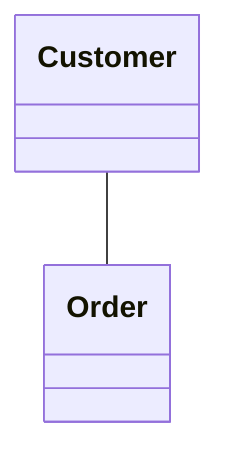

Visual representation: `Customer ───────── Order`

**Directed association**

```text
classDiagram
    Customer --> Order
```

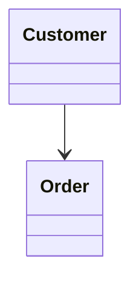

Visual representation: `Customer ─────────> Order`. The arrow indicates navigability toward `Order`.

**Association with label**

```text
classDiagram
    Customer --> Order : places
```

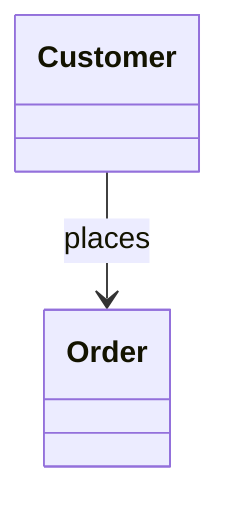

Here: `-->` = direction/navigability, `places` = relationship meaning.

---

## 4. Dependency

**Meaning:** dependency represents a relationship where one element uses or depends on another.

```text
classDiagram
    OrderService ..> PaymentService
```

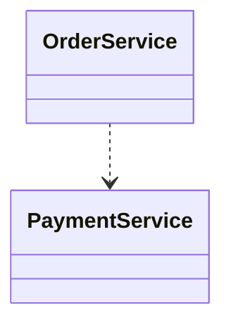

Visual representation: `OrderService - - - - - > PaymentService`

**Dependency with label**

```text
classDiagram
    OrderService ..> PaymentService : uses
```

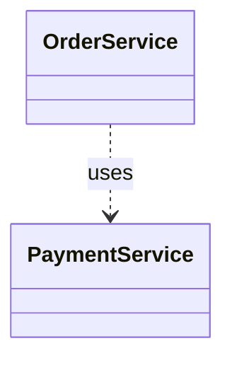

Remember: `..>` = Dependency. The line is dashed.

---

## 5. Generalization

Generalization represents what is commonly called inheritance.

**Meaning:** a specialized classifier is a type of a more general classifier.

```text
classDiagram
    Vehicle <|-- Car
```

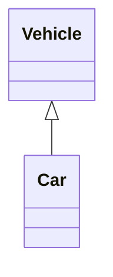

Visual representation: `Car ─────────▷ Vehicle`. The hollow triangle points toward the general/base classifier.

Read it as: `Car IS-A Vehicle`.

**Mermaid syntax:** `<|--`

---

## 6. Realization

Realization commonly represents a class fulfilling an interface contract.

```text
classDiagram
    class PaymentService {
        <<interface>>
    }

    class UPIPayment
    PaymentService <|.. UPIPayment
```

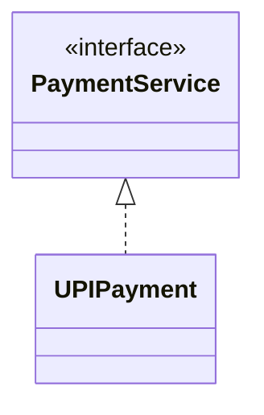

Visual representation: `UPIPayment - - - -▷ PaymentService`

Remember: `<|..` = Realization. The line is dashed and the triangle is hollow.

---

## 7. Aggregation

Aggregation represents a whole-part relationship where the part is modeled as independently existing from the whole.

```text
classDiagram
    Team o-- Player
```

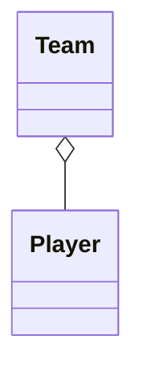

Visual representation: `Team ◇──────── Player`. The hollow diamond is placed at the whole side.

Remember: `o--` = Aggregation.

---

## 8. Composition

Composition represents a strong whole-part relationship.

```text
classDiagram
    Order *-- OrderItem
```

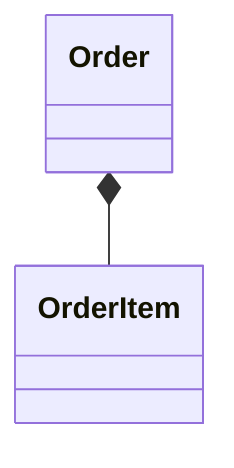

Visual representation: `Order ◆──────── OrderItem`. The filled diamond is placed at the whole side.

Remember: `*--` = Composition.

---

## 9. Navigability

Navigability describes the direction in which an association can be navigated.

**Unidirectional association**

```text
classDiagram
    Customer --> Order
```


Visual: `Customer ─────────> Order`

**Bidirectional association**

```text
classDiagram
    Customer <--> Order
```

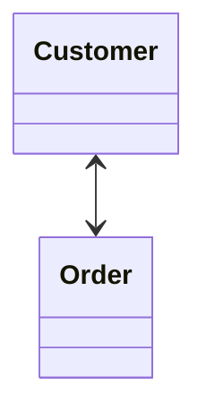

Visual: `Customer <────────> Order`

Remember: `-->` = navigation toward the target, `<-->` = navigation in both directions.

---

## 10. Complete Relationship Cheat Sheet

| Relationship | Mermaid | Visual Meaning |
|---|---|---|
| Association | `A -- B` | Solid line |
| Directed Association | `A --> B` | Solid line + arrow |
| Dependency | `A ..> B` | Dashed line + arrow |
| Generalization | `A <\|-- B` | Solid line + hollow triangle |
| Realization | `A <\|.. B` | Dashed line + hollow triangle |
| Aggregation | `A o-- B` | Solid line + hollow diamond |
| Composition | `A *-- B` | Solid line + filled diamond |

---

## 11. Visual Classification

**Solid line relationships**

```text
A ───────── B      → Association
A ─────────> B     → Directed association / navigability
A ─────────▷ B     → Generalization
A ◇──────── B      → Aggregation
A ◆──────── B      → Composition
```

**Dashed line relationships**

```text
A - - - - - > B    → Dependency
A - - - - -▷ B     → Realization
```

---

## 12. Triangle Difference

Two important UML relationships use a hollow triangle.

**Generalization**

```text
classDiagram
    Vehicle <|-- Car
```


Solid line + hollow triangle.

**Realization**

```text
classDiagram
    PaymentService <|.. UPIPayment
```

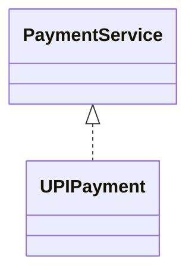

Dashed line + hollow triangle.

Therefore: `<|--` = Generalization, `<|..` = Realization. The line style tells us which relationship it is.

---

## 13. Diamond Difference

Two relationships use diamonds.

**Aggregation**

```text
classDiagram
    Team o-- Player
```


`◇` = hollow diamond.

**Composition**

```text
classDiagram
    Order *-- OrderItem
```


`◆` = filled diamond.

Therefore: `o--` = Aggregation, `*--` = Composition.

---

## 14. Association vs. Dependency

These are commonly confused.

**Association**

```text
classDiagram
    Customer --> Order
```


Solid line. Meaning: structural relationship.

**Dependency**

```text
classDiagram
    OrderService ..> PaymentService
```


Dashed line. Meaning: uses/depends on.

```text
Solid  → structural relationship
Dashed → dependency / usage
```

---

## 15. Generalization vs. Realization

**Generalization**

```text
classDiagram
    Vehicle <|-- Car
```


Meaning: `Car IS-A Vehicle`.

**Realization**

```text
classDiagram
    PaymentService <|.. UPIPayment
```


Meaning: `UPIPayment fulfills PaymentService contract`.

Visual distinction:

```text
Generalization → solid line + hollow triangle
Realization    → dashed line + hollow triangle
```

---

## 16. Aggregation vs. Composition

Both represent whole-part relationships.

**Aggregation**

```text
classDiagram
    Team o-- Player
```


`◇` = hollow diamond.

**Composition**

```mermaid
classDiagram
    Order *-- OrderItem
```

```text
classDiagram
    Order *-- OrderItem
```

`◆` = filled diamond.

```text
◇ → Aggregation
◆ → Composition
```

---

## 17. Direction Rules

Direction is important when reading UML.

**Association**

```text
classDiagram
    A --> B
```

```mermaid
classDiagram
    A --> B
```

The arrow points toward the navigable target.

**Dependency**

```text
classDiagram
    A ..> B
```

```mermaid
classDiagram
    A ..> B
```

The arrow points toward the element being depended upon.

**Generalization**

```text
classDiagram
    A <|-- B
```

```mermaid
classDiagram
    A <|-- B
```

The hollow triangle points toward the general/base classifier. Read: `B IS-A A`.

**Realization**

```text
classDiagram
    A <|.. B
```

```mermaid
classDiagram
    A <|.. B
```

The hollow triangle points toward the classifier/interface being realized.

**Aggregation**

```text
classDiagram
    A o-- B
```

```mermaid
classDiagram
    A o-- B
```

The hollow diamond is placed at the whole side.

**Composition**

```text
classDiagram
    A *-- B
```

```mermaid
classDiagram
    A *-- B
```

The filled diamond is placed at the whole side.

---

## 18. Relationship + Multiplicity

Relationships can be combined with multiplicity.

**Association**

```text
classDiagram
    Customer "1" --> "0..*" Order : places
```

```mermaid
classDiagram
    Customer "1" --> "0..*" Order : places
```

**Aggregation**

```text
classDiagram
    Team "1" o-- "0..*" Player
```

```mermaid
classDiagram
    Team "1" o-- "0..*" Player
```

**Composition**

```text
classDiagram
    Order "1" *-- "1..*" OrderItem
```

```mermaid
classDiagram
    Order "1" *-- "1..*" OrderItem
```

Multiplicity tells us *how many instances can participate?* The relationship type tells us *what kind of relationship exists?*

---

## 19. Relationship + Label

Relationships can contain labels.

```text
classDiagram
    Customer --> Order : places
    OrderService ..> PaymentService : uses
    Order *-- OrderItem : contains
```

```text
classDiagram
    Customer --> Order : places
    OrderService ..> PaymentService : uses
    Order *-- OrderItem : contains
```

```mermaid
classDiagram
    Customer --> Order : places
    OrderService ..> PaymentService : uses
    Order *-- OrderItem : contains
```

The labels `places`, `uses`, `contains` describe the meaning of the relationships. The symbols communicate the UML relationship type.

---

## 20. Complete Relationship Diagram

The following diagram demonstrates the major relationships:

```text
classDiagram

    %% Generalization
    Vehicle <|-- Car
    %% Realization
    PaymentService <|.. UPIPayment
    %% Association
    Customer -- Order
    %% Directed Association
    Customer --> Order
    %% Dependency
    OrderService ..> PaymentService
    %% Aggregation
    Team o-- Player
    %% Composition
    Order *-- OrderItem
```

```mermaid
classDiagram

    %% Generalization
    Vehicle <|-- Car
    %% Realization
    PaymentService <|.. UPIPayment
    %% Association
    Customer -- Order
    %% Directed Association
    Customer --> Order
    %% Dependency
    OrderService ..> PaymentService
    %% Aggregation
    Team o-- Player
    %% Composition
    Order *-- OrderItem
```

---

## 21. Semantic Decision Guide

Instead of memorizing symbols alone, ask what the relationship means.

**Structural relationship** — are A and B structurally related? → **Association** → `A -- B`

**Usage relationship** — does A use or depend on B? → **Dependency** → `A ..> B`

**Specialization** — is B a specialized type of A? → **Generalization** → `A <|-- B`

**Contract fulfillment** — does B fulfill the contract defined by A? → **Realization** → `A <|.. B`

**Whole-part** — is B a part of A?
- Aggregation → `A o-- B`
- Composition → `A *-- B`

---

## 22. Complete LLD Example

```text
classDiagram

    class Payment {
        <<abstract>>
    }
    class CreditCardPayment
    class UPIPayment
    class PaymentService {
        <<interface>>
    }
    class Order
    class OrderItem
    class Customer
    class OrderService

    %% Generalization
    Payment <|-- CreditCardPayment
    Payment <|-- UPIPayment
    %% Realization
    PaymentService <|.. OrderService
    %% Association
    Customer "1" --> "0..*" Order : places
    %% Composition
    Order "1" *-- "1..*" OrderItem : contains
    %% Dependency
    OrderService ..> PaymentService : uses
```

```mermaid
classDiagram

    class Payment {
        <<abstract>>
    }
    class CreditCardPayment
    class UPIPayment
    class PaymentService {
        <<interface>>
    }
    class Order
    class OrderItem
    class Customer
    class OrderService

    %% Generalization
    Payment <|-- CreditCardPayment
    Payment <|-- UPIPayment
    %% Realization
    PaymentService <|.. OrderService
    %% Association
    Customer "1" --> "0..*" Order : places
    %% Composition
    Order "1" *-- "1..*" OrderItem : contains
    %% Dependency
    OrderService ..> PaymentService : uses
```

This demonstrates:

```text
Payment <|-- CreditCardPayment      → Generalization
PaymentService <|.. OrderService    → Realization
Customer --> Order                  → Association
Order *-- OrderItem                 → Composition
OrderService ..> PaymentService     → Dependency
```

---

## 23. What Each Symbol Answers

| Symbol | Question It Answers |
|---|---|
| `--` | Are these elements structurally related? |
| `-->` | Can we navigate toward the target? |
| `..>` | Does one element use/depend on another? |
| `<\|--` | Is B a specialized type of A? |
| `<\|..` | Does B fulfill A's contract? |
| `o--` | Is this a whole-part relationship with independent parts? |
| `*--` | Is this a strong whole-part relationship? |

---

## 24. Quick Recognition Test

```text
A ───────── B        → Association
A ─────────> B       → Directed Association / Navigability
A - - - - - > B      → Dependency
A ─────────▷ B       → Generalization
A - - - - -▷ B       → Realization
A ◇──────── B        → Aggregation
A ◆──────── B        → Composition
```

---

## 25. Mermaid Relationship Cheat Sheet

```text
classDiagram

    %% Association
    A -- B
    %% Directed Association
    A --> B
    %% Bidirectional Association
    A <--> B
    %% Dependency
    A ..> B
    %% Generalization
    A <|-- B
    %% Realization
    A <|.. B
    %% Aggregation
    A o-- B
    %% Composition
    A *-- B
```

```mermaid
classDiagram

    %% Association
    A -- B
    %% Directed Association
    A --> B
    %% Bidirectional Association
    A <--> B
    %% Dependency
    A ..> B
    %% Generalization
    A <|-- B
    %% Realization
    A <|.. B
    %% Aggregation
    A o-- B
    %% Composition
    A *-- B
```

---

## 26. Relationship Notation Table

| Mermaid Syntax | UML Relationship | Line | Special Symbol |
|---|---|---|---|
| `A -- B` | Association | Solid | None |
| `A --> B` | Directed Association | Solid | Arrow |
| `A <--> B` | Bidirectional Association | Solid | Arrows |
| `A ..> B` | Dependency | Dashed | Arrow |
| `A <\|-- B` | Generalization | Solid | Hollow triangle |
| `A <\|.. B` | Realization | Dashed | Hollow triangle |
| `A o-- B` | Aggregation | Solid | Hollow diamond |
| `A *-- B` | Composition | Solid | Filled diamond |

---

## 27. Practice

**Practice 1**

Identify the relationship:

```text
classDiagram
    Customer -- Order
```

```mermaid
classDiagram
    Customer -- Order
```

**Solution:** **Association.** Reason: solid line without a special endpoint.

**Practice 2**

Identify the relationship:

```text
classDiagram
    OrderService ..> PaymentService
```

```mermaid
classDiagram
    OrderService ..> PaymentService
```

**Solution:** **Dependency.** Reason: dashed line + open arrow.

**Practice 3**

Identify the relationship:

```text
classDiagram
    Vehicle <|-- Car
```

```mermaid
classDiagram
    Vehicle <|-- Car
```

**Solution:** **Generalization.** Reason: solid line + hollow triangle.

**Practice 4**

Identify the relationship:

```text
classDiagram
    PaymentService <|.. UPIPayment
```

```mermaid
classDiagram
    PaymentService <|.. UPIPayment
```

**Solution:** **Realization.** Reason: dashed line + hollow triangle.

**Practice 5**

Identify the relationship:

```text
classDiagram
    Team o-- Player
```

```mermaid
classDiagram
    Team o-- Player
```

**Solution:** **Aggregation.** Reason: hollow diamond.

**Practice 6**

Identify the relationship:

```text
classDiagram
    Order *-- OrderItem
```

```mermaid
classDiagram
    Order *-- OrderItem
```

**Solution:** **Composition.** Reason: filled diamond.

**Practice 7**

What does this represent?

```text
classDiagram
    Customer "1" --> "0..*" Order : places
```

```mermaid
classDiagram
    Customer "1" --> "0..*" Order : places
```

**Solution:** it combines four pieces of UML information:

```text
Association       → --
Navigability       → Customer → Order
Multiplicity       → 1 and 0..*
Relationship label → places
```

---

## 28. Final Mental Model

```text
                     UML RELATIONSHIPS
                            │
        ┌───────────────────┼───────────────────┐
        │                   │                   │
   Structural            Usage              Hierarchy
        │                   │                   │
 Association           Dependency         Generalization
   -- / -->                ..>                 <|--
                                             Realization
                                                <|..
        │
        └──────────── Whole-Part ───────────────┐
                                                  │
                                          Aggregation
                                             o--
                                                  │
                                          Composition
                                             *--
```

---

## 29. One-Line Memory Trick

```text
<|--  → IS-A
<|..  → REALIZES
--    → RELATED-TO
-->   → NAVIGATES
..>   → USES
o--   → AGGREGATES
*--   → COMPOSES
```

---

## 30. Final Cheat Sheet

```text
┌──────────────────────────────────────────────┐
│          UML RELATIONSHIP CHEAT SHEET         │
├──────────────────────────────────────────────┤
│                                                │
│ A ───────── B                                 │
│ Association                                   │
│                                                │
│ A ─────────> B                                │
│ Directed Association / Navigability           │
│                                                │
│ A - - - - - > B                               │
│ Dependency                                    │
│                                                │
│ A ─────────▷ B                                │
│ Generalization                                │
│                                                │
│ A - - - - -▷ B                                │
│ Realization                                   │
│                                                │
│ A ◇──────── B                                 │
│ Aggregation                                   │
│                                                │
│ A ◆──────── B                                 │
│ Composition                                   │
│                                                │
└──────────────────────────────────────────────┘
```

---

## 31. Key Takeaways

1. Association → structural relationship.
2. Directed Association → association with navigability.
3. Dependency → uses / depends on.
4. Generalization → IS-A / specialization.
5. Realization → fulfills a contract.
6. Aggregation → whole-part with hollow diamond.
7. Composition → strong whole-part with filled diamond.
8. Solid and dashed lines are important visual clues.
9. Hollow and filled endpoint symbols carry different meanings.
10. The direction of triangles and diamonds matters.
11. Multiplicity can be combined with relationships.
12. Relationship labels explain the meaning of a relationship.
