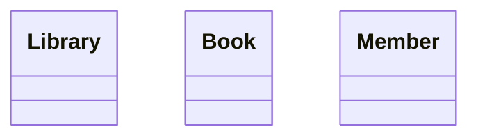
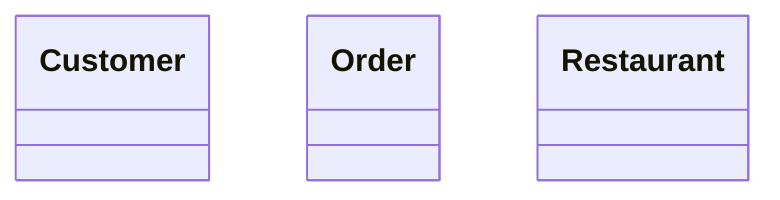
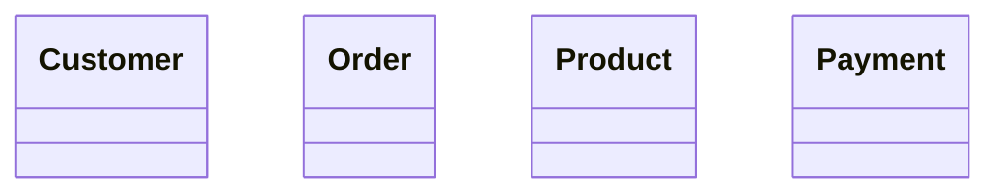
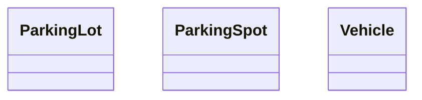
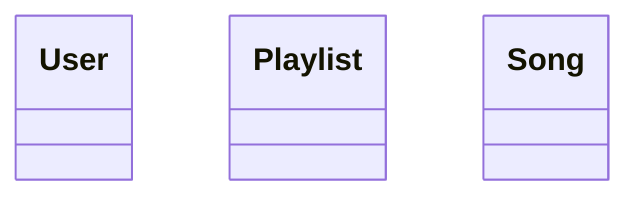
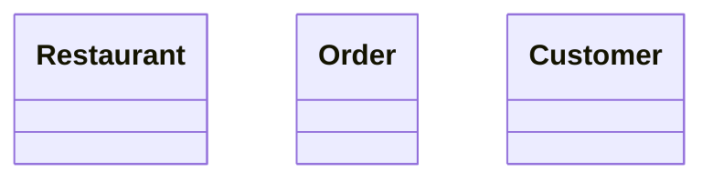
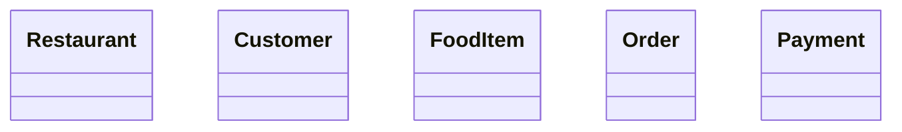
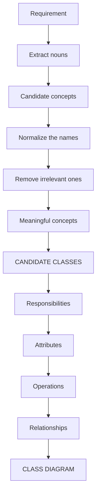

# Identifying Classes from Requirements

*A guide to extracting candidate UML classes from natural-language requirements during LLD (Low-Level Design) modeling.*

---

## 1. Overview

One of the first and most important steps in LLD class-diagram modeling is identifying classes from a natural-language requirement.

A requirement is usually written as plain English. For example:

> A customer can place multiple orders. Each order contains multiple products.

Our job is to transform this requirement into candidate UML classes.

**The basic flow:**

```
Requirement
  → Extract candidate nouns
  → Identify meaningful domain concepts
  → Remove irrelevant nouns
  → Candidate Classes
  → UML Class Diagram
```

---

## 2. Why Class Identification Matters

Before drawing relationships, attributes, or methods, we need to answer one question:

> **What are the important concepts in the system?**

For example, given:

> A customer places orders and each order contains products.

Potential classes:

- `Customer`
- `Order`
- `Product`

These classes become the foundation of the class diagram. If the classes are identified incorrectly, the rest of the design can also become incorrect.

---

## 3. Start With the Requirement

Consider:

> A customer can place multiple orders. Each order contains multiple products.

The first step is **not** to immediately draw a complete UML diagram. Instead, read the requirement and identify the important nouns.

| Step | Result |
|---|---|
| Candidate nouns | Customer, Orders, Order, Products, Product |
| Normalize plurals | Orders → Order, Products → Product |
| **Candidate classes** | **Customer, Order, Product** |

---

## 4. Nouns → Candidate Classes

**Heuristic:** Nouns in the requirement are potential classes.

**Example:**

> A library has books and members. Members can borrow books.

| Step | Result |
|---|---|
| Candidate nouns | Library, Books, Members, Books |
| Normalized | Library, Book, Member |



---

## 5. Not Every Noun Becomes a Class

This is **extremely important.** Noun extraction gives us candidate classes, not final classes.

**Example:**

> A customer places an order using a mobile application.

Candidate nouns: `Customer`, `Order`, `Mobile Application`

We should not automatically create three classes. Ask:

> Is this noun an important domain concept that needs to be represented in the model?

Likely candidates: `Customer`, `Order` — the mobile application is likely outside the domain model being designed.

**Rule of thumb:** Noun ≠ Automatically Class

```
Noun → Candidate → Evaluate its modeling importance → Class or discard
```

---

## 6. Meaningful Domain Concepts

A good candidate class usually represents something meaningful in the problem domain.

**Example:**

> A food delivery system allows customers to place orders from restaurants.

| Candidate nouns | Meaningful domain concepts |
|---|---|
| Food Delivery System, Customer, Orders, Restaurants | Customer, Order, Restaurant |



---

## 7. Ignore Irrelevant Nouns

Some nouns appear in requirements but do not belong in the class model.

**Example:**

> The customer uses the application to place an order.

Candidate nouns: `Customer`, `Application`, `Order`

Depending on scope, `Application` may not be a domain class. If the question is specifically about order management, `Customer` and `Order` may be sufficient.

**Principle:** Model the concepts relevant to the system/problem being designed.

---

## 8. Singular vs. Plural

Requirements commonly contain plural nouns, but a UML class normally represents the **concept/type**, not the collection.

| Plural | Singular (class name) |
|---|---|
| Orders | Order |
| Products | Product |
| Employees | Employee |
| Payments | Payment |
| Vehicles | Vehicle |
| Books | Book |

---

## 9. Worked Examples

### Example A — Library System

> A library contains books. Members can borrow books and return them.

Nouns → `Library, Books, Members, Books` → Normalized → `Library, Book, Member`


At this stage we are **only** identifying classes — not attributes, methods, multiplicity, association, aggregation, or composition. Those come later.

### Example B — E-Commerce

> A customer places an order. An order contains products and payment is made for the order.

Nouns → `Customer, Order, Products, Payment, Order` → Normalized → `Customer, Order, Product, Payment`



### Example C — Parking Lot

> A parking lot contains parking spots. Vehicles enter the parking lot and are assigned available spots.

Nouns → `Parking Lot, Parking Spots, Vehicles` → Normalized → `ParkingLot, ParkingSpot, Vehicle`



Again — relationships are not yet decided at this stage.

---

## 10. Candidate Class Identification Process

Use this process during an LLD interview:

```
Requirement
  → Read carefully
  → Extract nouns
  → Normalize singular/plural
  → Remove duplicates
  → Remove irrelevant concepts
  → Identify meaningful domain concepts
  → Candidate Classes
```

**Example:**

> "A customer places multiple orders."

Nouns: `Customer, Orders` → Normalize: `Customer, Order` → Candidate classes: `Customer, Order`

---

## 11. Candidate Class vs. Final Class

Starting point (candidates): `Customer, Order, Product, Payment`

After analysis, we may discover that:

- Some candidates are irrelevant
- Some should be represented as **attributes**
- Some should be represented as **enums**
- Some should be **merged**
- Some require **additional classes**

```
Candidate Classes → Analysis → Refined Classes → Final Class Diagram
```

---

## 12. Two Common Misconceptions

### A candidate class ≠ a database entity

A class diagram may contain both domain data and behavior:

```
OrderService, PaymentService, NotificationService   ← behavior
Order, Customer                                       ← domain data
```

Class identification is broader than database entity identification.

### A candidate class ≠ a Java class

The purpose of this step is **UML modeling** — identifying meaningful concepts in the design. The implementation language comes later.

```
Requirement → UML Model → Design Decisions → Implementation
```

A UML class represents a concept in the design, not merely a Java file.

---

## 13. Identifying Classes Using Domain Language

Ask during an interview:

> "What are the important objects or concepts the requirement talks about?"

**Example:**

> "Users can create playlists containing songs."

Important concepts: `User, Playlist, Song`



**Avoid implementation-first thinking.** Don't ask *"What Java classes should I create?"* — ask *"What concepts exist in this problem domain?"*, then *"Which concepts need to be represented in the UML model?"*

---

## 14. Common Mistakes

| # | Mistake | Correction |
|---|---|---|
| 1 | Every noun automatically becomes a class | Noun → Candidate → Evaluate → Class or discard |
| 2 | Creating classes for plural nouns (`Orders`, `Products`, `Users`) | Normalize to singular (`Order`, `Product`, `User`) |
| 3 | Modeling irrelevant concepts (`Application`, `Screen`, `Button`, `Browser`, `Request`, `Response`) | Depends on scope — not all belong in the domain model |
| 4 | Starting relationships too early (`Customer → Order`, `Order *– OrderItem`) | First establish what classes exist, then identify responsibilities and relationships |
| 5 | Thinking only about database tables | A class diagram may include domain classes, services, interfaces, abstract classes, enums, supporting classes, and value objects |

---

## 15. Interview Technique

During an LLD interview, say explicitly:

> "I'll first extract the important domain concepts from the requirements and identify candidate classes. Then I'll refine them based on responsibilities and relationships."

Then work through the requirement step by step — this makes your modeling process clear to the interviewer.

---

## 16. Practice Questions

### Q1 — Playlist System

> A user can create multiple playlists. Each playlist contains multiple songs.

**Solution:** Nouns → `User, Playlists, Songs, Playlist, Song` → Candidate classes → `User, Playlist, Song`


### Q2 — Restaurant Orders

> A restaurant receives food orders from customers.

**Solution:** Candidate nouns → `Restaurant, Food, Orders, Customers` → Meaningful concepts → `Restaurant, Order, Customer`



### Q3 — Parking Lot

> A parking lot contains parking spots and vehicles are assigned available spots.

**Solution:** Candidate classes → `ParkingLot, ParkingSpot, Vehicle`


### Q4 — Mobile Application

> A customer uses a mobile application to purchase products. Should `MobileApplication` automatically become a class?

**Solution:** No. It's a candidate noun, but a noun does not automatically become a class — first determine relevance to the model's scope. Likely candidates: `Customer, Product` (potentially `Order, Payment` depending on the full requirements).

### Q5 — Food Delivery Platform

> A food delivery platform has restaurants. Customers browse restaurants, add food items to an order, and make payments.

**Solution:** Important nouns → `Food Delivery Platform, Restaurants, Customers, Food Items, Order, Payments` → Likely domain classes → `Restaurant, Customer, FoodItem, Order, Payment`



*Note: `Food Delivery Platform` itself may or may not need to be modeled as a class, depending on scope.*

---

## 17. The Core Heuristic

```
NOUNS → Candidate Classes
```

But never stop there:

```
Noun
 → Candidate
 → Is it meaningful?
 → Is it relevant to the scope?
 → Does it represent a concept we need to model?
 → Candidate Class
```

---

## 18. Class Identification Checklist

- [ ] Read the entire requirement first
- [ ] Extract important nouns
- [ ] Convert plural nouns to singular concepts
- [ ] Remove duplicates
- [ ] Identify meaningful domain concepts
- [ ] Remove irrelevant concepts
- [ ] Don't automatically convert every noun into a class
- [ ] Don't confuse classes with database tables
- [ ] Don't start designing relationships prematurely
- [ ] Keep candidate classes open to refinement

---

## 19. Key Takeaways

1. **Nouns are candidate classes.**
2. **Not every noun becomes a class.**
3. **Candidate classes must be evaluated based on domain relevance.**
4. **Singular concepts are generally used as class names.**
5. **Class identification happens before detailed relationship modeling.**
6. **UML modeling should begin from the problem domain, not from implementation.**

---

## 20. Complete Mental Model



This step establishes the foundation for everything that follows in class-diagram modeling.