# Identifying Responsibilities

*A guide to assigning responsibilities to candidate classes during LLD (Low-Level Design) modeling.*

---

## 1. Overview

After identifying candidate classes from a requirement, the next step in UML class-diagram modeling is identifying the **responsibilities** of those classes.

A responsibility describes something a class is expected to:

- Know
- Do
- Manage
- Calculate
- Validate
- Coordinate

**The basic flow:**

```
Requirement
  → Candidate Classes
  → Responsibilities
  → Attributes
  → Operations
  → Relationships
```

---

## 2. What Is a Responsibility?

A responsibility is something that a class is responsible for **knowing** or **doing**.

```
Responsibility
├── Knows something → Information / State
└── Does something   → Behavior
```

**Example:**

> An order calculates its total amount.

```
Order
└── calculate total amount
```

The UML operation can later represent this as:

```
calculateTotal()
```

---

## 3. Responsibilities from Requirements

A useful first heuristic is to look for **verbs** in the requirement.

**Example:**

> A customer places an order, cancels an order, and views order details.

| Nouns | Verbs |
|---|---|
| Customer, Order | places, cancels, views |

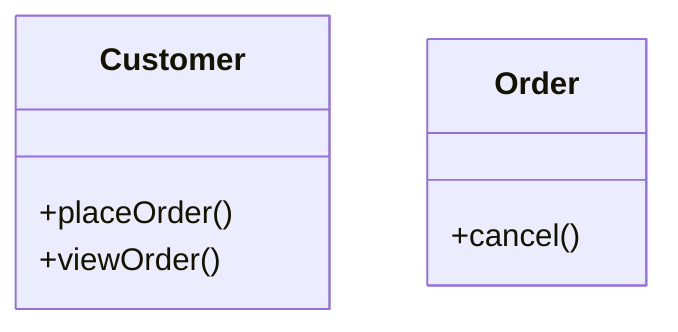

**The important mapping:**

```
Nouns → Candidate Classes
Verbs → Candidate Responsibilities
```

This is a heuristic, not an absolute rule.

---

## 4. Responsibility Belongs to the Appropriate Class

**Example:**

> An order calculates its total amount.

The natural responsibility is:

```
Order
└── calculate total
```

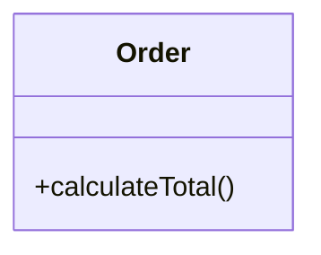

The responsibility belongs close to the concept that naturally owns the information required for the operation.

---

## 5. Responsibility Should Be Close to Relevant Information

Consider an order containing: `items`, `quantities`, `prices`.

**Requirement:** Calculate the total amount of the order.

`Order` has the relevant conceptual information, so:

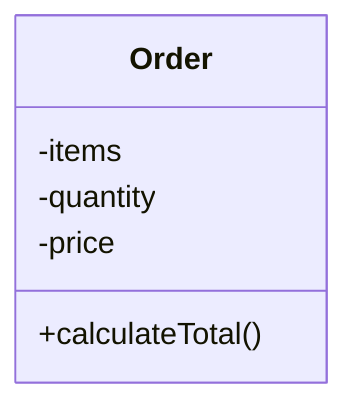

> **Key principle:** A responsibility should generally be assigned to the class that has the information needed to perform it, or that conceptually owns the behavior.

---

## 6. Responsibility vs. Operation

These concepts are related but distinct.

| Concept | Description |
|---|---|
| **Responsibility** | A conceptual statement — `Order → calculate the total amount` |
| **Operation** | The UML representation of the behavior — `calculateTotal()` |

```
Responsibility → Conceptual behavior → UML Operation
```

During early modeling, think about responsibilities first, then represent important behaviors as UML operations.

---

## 7. Worked Examples

### Example A — Bank Account

> A bank account can deposit money, withdraw money, and provide the current balance.

```
BankAccount
├── deposit money
├── withdraw money
└── provide current balance
```

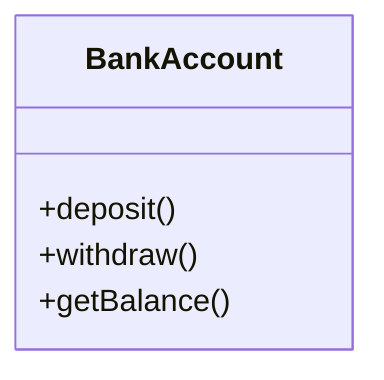

### Example B — Shopping Cart

> A shopping cart contains products and calculates the total price.

```
ShoppingCart
├── contain products
└── calculate total price
```

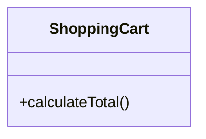

*The "contain products" responsibility will later influence attributes and relationships — e.g. `ShoppingCart *-- Product`. That relationship decision comes later.*

### Example C — Parking Lot

> A parking lot manages parking spots and assigns an available spot to a vehicle.

```
ParkingLot
├── manage parking spots
└── assign an available spot
```

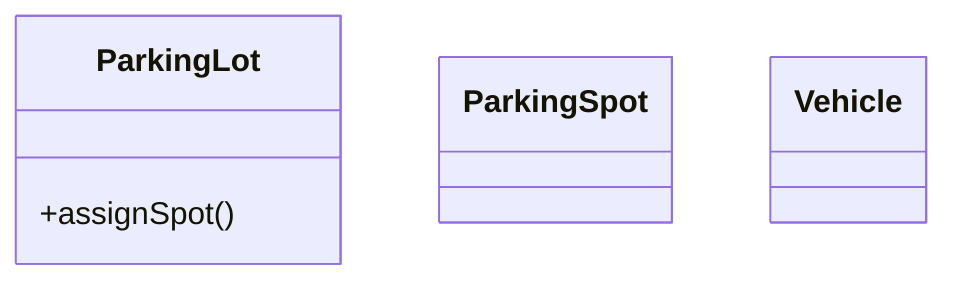

---

## 8. Responsibility Assignment

The key question is: **Which class naturally owns this responsibility?**

**Example:** Calculate an order's total.

Possible candidates: `Customer`, `Order`, `Payment`, `OrderService`

Ask: *Which concept naturally owns the order's total?* → **`Order`**

```
Order → calculateTotal()
```

The goal is **not** to mechanically assign responsibilities based on verbs — it's to place responsibilities where they make conceptual sense.

---

## 9. Information Needed for a Responsibility

Ask: **What information is required to perform this responsibility?**

**Example:** Calculate the total price of an order → relevant information: `items`, `quantity`, `price` → owner: `Order`

```
Order
└── calculateTotal()
```

This prevents responsibilities from being placed arbitrarily.

---

## 10. Responsibility and Data Together

A strong class model keeps related information and behavior conceptually close.

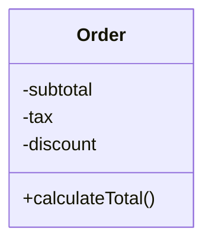

```
Relevant Data + Relevant Behavior → Meaningful Class
```

This is a core idea behind good object-oriented modeling.

---

## 11. Avoiding Responsibility Overload

A class should not automatically receive every responsibility in the system.

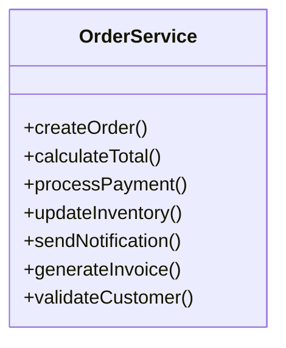

This class concentrates order creation, calculation, payment, inventory, notification, invoicing, and validation — a sign that responsibilities need to be **distributed** among multiple concepts.

---

## 12. Distributing Responsibilities

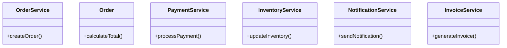

The exact decomposition depends on requirements, but the principle holds:

> **Avoid concentrating unrelated responsibilities in one class.**

---

## 13. Responsibility Does Not Automatically Mean Method

Not every responsibility becomes a UML operation.

**Example:** "An order contains items" is a conceptual characteristic that may primarily influence a **relationship and multiplicity**, rather than becoming `Order.containsItems()`. It may instead be modeled as composition:

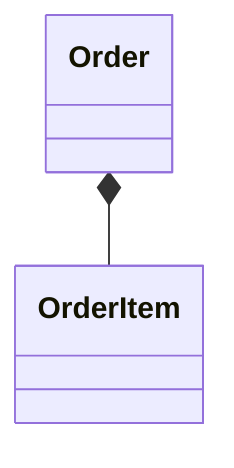

```
Responsibility → May become:
  ├── Attribute
  ├── Operation
  ├── Relationship
  └── Combination of these
```

---

## 14. Responsibilities and UML Operations

When a responsibility represents behavior, it often becomes an operation.

| Responsibility | UML |
|---|---|
| "Cancel an order." | `Order.cancel()` |
| "Calculate total." | `Order.calculateTotal()` |

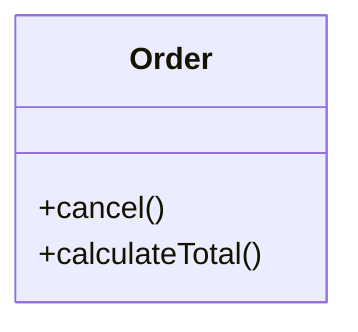

---

## 15. Responsibility and Relationships

Some responsibilities reveal relationships between classes.

> A customer places orders.

```
Customer
└── place order
```

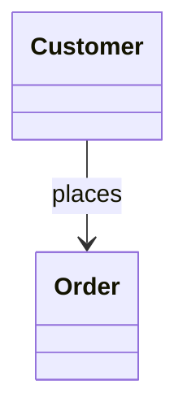

```
Requirement → Responsibility → Possible Relationship
```

The relationship should still be evaluated independently.

---

## 16. Responsibility and Multiplicity

> A customer can place multiple orders.

```
Customer
└── place orders
```

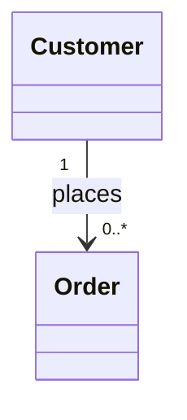

This communicates: **Customer → places → 0..\* Orders**, showing how modeling concepts gradually build on each other.

---

## 17. Responsibility Identification Process

```
Requirement
  → Identify candidate classes
  → Identify important actions / behaviors
  → Ask who naturally owns each behavior
  → Consider required information
  → Assign responsibility
  → Represent behavior as UML operations when appropriate
  → Refine relationships if required
```

---

## 18. Worked Example — E-Commerce

> A customer places an order. The order contains products and calculates the total amount. Payment is processed for the order.

**Candidate classes:** `Customer`, `Order`, `Product`, `Payment`

| Class | Responsibilities |
|---|---|
| Customer | place order |
| Order | contain products; calculate total |
| Product | provide product information |
| Payment | process payment |

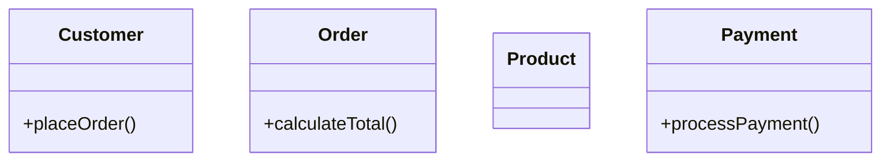

*This is still a partial model — relationships will be refined separately.*

---

## 19. Nouns vs. Verbs

```
Nouns → Candidate Classes
Verbs → Candidate Responsibilities
```

**Example:** "A customer creates an order and cancels the order."

- Nouns: `Customer`, `Order`
- Verbs: `creates`, `cancels`

```
Customer → create order
Order    → cancel
```

---

## 20. But Don't Blindly Follow Verbs

Natural-language requirements can be misleading.

> The system processes payments.

The verb `processes` does **not** mean a class called `System` must own `System.processPayment()`.

Instead ask: *What domain concept is responsible for payment processing?* Depending on the design: `Payment`, `PaymentService`, or `PaymentProcessor` could be candidates.

> **Verbs help discover responsibilities, but they don't automatically determine class ownership.**

---

## 21. Responsibility Distribution

```
System
├── Customer  → customer-related responsibilities
├── Order     → order-related responsibilities
├── Payment   → payment-related responsibilities
└── Inventory → inventory-related responsibilities
```

The goal is to create meaningful responsibility boundaries.

---

## 22. Common Mistakes

| # | Mistake | Why it's a problem |
|---|---|---|
| 1 | Putting everything in one class (`OrderService` handling payment, inventory, notification, invoice, customer, order) | Indicates responsibility overload |
| 2 | Assigning behavior based only on the verb (e.g. `calculate`) | Doesn't tell us which class should own it — ask who owns the relevant information |
| 3 | Making every responsibility a method | Some responsibilities influence attributes, relationships, multiplicity, or constraints instead |
| 4 | Mixing responsibility identification with implementation | Focus on *what* a class should be responsible for, not *how* to implement it in Java |
| 5 | Ignoring conceptual ownership | Always ask: does this responsibility naturally belong to this class? |

---

## 23. Interview Approach

During an LLD interview, explain your reasoning like this:

> "I'll identify the main responsibilities of each candidate class. For each behavior, I'll assign it to the class that conceptually owns the required information or responsibility. Then I'll represent the important behaviors as UML operations and refine the relationships."

This shows you're modeling based on responsibilities, not mechanically creating classes and methods.

---

## 24. Practice Questions

### Q1 — Bank Account

> A bank account can deposit money, withdraw money, and provide its current balance.

**Solution:**

```
BankAccount
├── deposit money
├── withdraw money
└── provide current balance
```


### Q2 — Shopping Cart

> A shopping cart contains products and calculates the total price.

**Solution:**

```
ShoppingCart
├── contain products
└── calculate total price
```


*"Contain products" will later be represented through the appropriate relationship/modeling decision.*

### Q3 — Parking Lot

> A parking lot manages parking spots and assigns available spots to vehicles.

**Solution:**

```
ParkingLot
├── manage parking spots
└── assign available spots
```

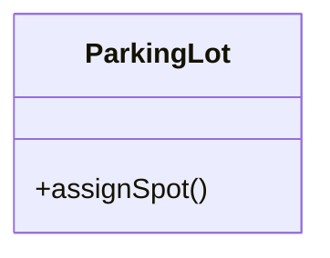

### Q4 — Order

> An order calculates its total amount and can be cancelled.

**Solution:**

```
Order
├── calculate total amount
└── cancel order
```

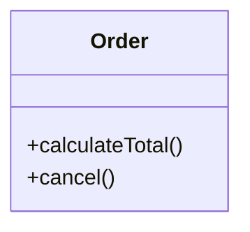

---

## 25. Practice — Responsibility Assignment

> A customer places orders. Orders contain products. Payments are processed for orders.

**Potential classes:** `Customer`, `Order`, `Product`, `Payment`

**Question:** Which class should naturally own the responsibility of calculating the order total?

**Solution:** The natural owner is **`Order`**, because the responsibility concerns the order's total.

```
Order.calculateTotal()
```

---

## 26. Practice — Avoiding a God Class

```
OrderService
├── calculate order total
├── process payment
├── update inventory
└── send notification
```

**Question:** What should we question about this design?

**Solution:** The class has several unrelated responsibilities. A potential conceptual distribution:

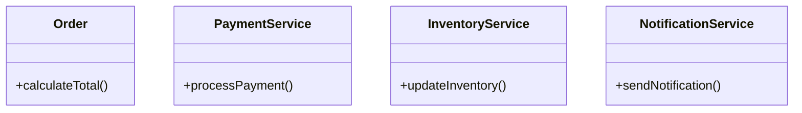

The exact design depends on requirements, but the key lesson is **responsibility separation**.

---

## 27. Responsibility Identification Checklist

- [ ] Identify candidate classes first
- [ ] Look for important actions and behaviors
- [ ] Use verbs as a starting heuristic
- [ ] Ask which class naturally owns each responsibility
- [ ] Ask what information is required
- [ ] Keep related information and behavior conceptually close
- [ ] Avoid concentrating unrelated responsibilities in one class
- [ ] Don't turn every responsibility into a method automatically
- [ ] Consider whether the responsibility implies an attribute or relationship instead
- [ ] Keep implementation details out of this modeling step

---

## 28. Core Mental Model

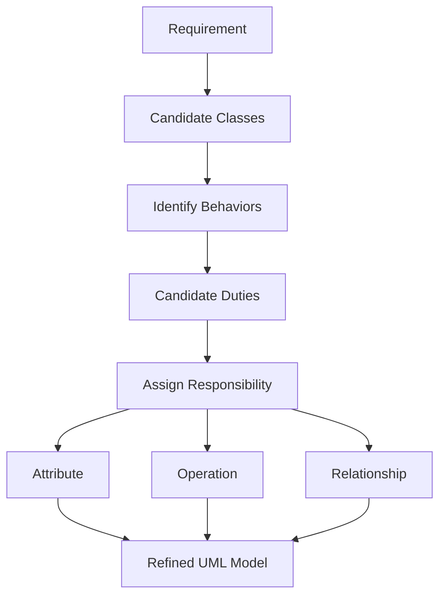

---

## 29. Key Takeaways

1. **Nouns help identify candidate classes.**
2. **Verbs help identify candidate responsibilities.**
3. **A responsibility should be assigned to the class that conceptually owns it.**
4. **Relevant information should generally remain close to the behavior that operates on it.**
5. **Not every responsibility becomes an operation.**
6. **Responsibilities may lead to attributes, operations, relationships, or a combination of them.**
7. **Avoid putting unrelated responsibilities into one class.**
8. **Responsibility identification is about UML modeling, not Java implementation.**