# Identifying Attributes from Requirements

## Table of Contents

1. [Overview](#1-overview)
2. [What Is an Attribute?](#2-what-is-an-attribute)
3. [Attribute Identification Flow](#3-attribute-identification-flow)
4. [Worked Example: Customer](#4-worked-example-customer)
5. [Attribute Syntax](#5-attribute-syntax)
6. [Attribute Visibility](#6-attribute-visibility)
7. [Attribute Types Matter](#7-attribute-types-matter)
8. [Don't Add Attributes Without Requirement Support](#8-dont-add-attributes-without-requirement-support)
9. [Attribute vs. Class](#9-attribute-vs-class)
10. [When Should Something Become a Class?](#10-when-should-something-become-a-class)
11. [Attribute vs. Enum](#11-attribute-vs-enum)
12. [Recognizing Enumeration Candidates](#12-recognizing-enumeration-candidates)
13. [Attribute vs. Derived Property](#13-attribute-vs-derived-property)
14. [Why Derived Properties Matter](#14-why-derived-properties-matter)
15. [Attributes and Responsibilities Are Connected](#15-attributes-and-responsibilities-are-connected)
16. [Avoid Duplicate Information](#16-avoid-duplicate-information)
17. [Worked Example: User](#17-worked-example-user)
18. [Worked Example: Product](#18-worked-example-product)
19. [Worked Example: Order](#19-worked-example-order)
20. [Decision Tree](#20-decision-tree)
21. [Attribute Identification Checklist](#21-attribute-identification-checklist)
22. [Practice Questions](#22-practice-questions)
23. [Common Mistakes](#23-common-mistakes)
24. [Mental Model Summary](#24-mental-model-summary)
25. [UML Syntax Cheat Sheet](#25-uml-syntax-cheat-sheet)
26. [Key Takeaways](#26-key-takeaways)
27. [Final Interview Heuristic](#27-final-interview-heuristic)

---

## 1. Overview

When designing a UML class diagram from requirements, identifying classes is only the first step. Once candidate classes are known, the next question is:

> **What information does each class need to know?**

That information becomes the **attributes** of the class.

**Example**

> A customer has an ID, name, email, and phone number.

The candidate class is `Customer`, and the information it needs to know becomes:

- `id`
- `name`
- `email`
- `phoneNumber`

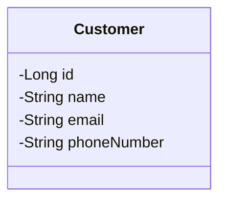

---

## 2. What Is an Attribute?

An **attribute** represents information or state associated with a class.

> **Attribute = something the class needs to know about itself or maintain as state.**

| Class | Possible Attributes |
|---|---|
| Customer | id, name, email |
| Product | id, name, price |
| Order | id, createdAt, status |
| BankAccount | accountNumber, balance |
| Vehicle | registrationNumber, model |

An attribute answers the question:

> *"What information does this class need to know?"*

---

## 3. Attribute Identification Flow

```text
Requirement
   ↓
Identify Class
   ↓
What does this class need to know?
   ↓
Candidate Attributes
   ↓
Remove Irrelevant Information
   ↓
Choose Appropriate Representation
   ↓
UML Attributes
```

This process prevents randomly adding fields to a class.

---

## 4. Worked Example: Customer

**Requirement**

> A customer has an ID, name, email address, and phone number.

**Step 1 — Identify the Class**

`Customer`

**Step 2 — Ask What It Needs to Know**

- ID
- name
- email
- phone number

**Step 3 — Model the Attributes**


---

## 5. Attribute Syntax

A UML attribute generally follows:

```text
visibility name : type
```

**Formal form**

```text
- id : Long
- name : String
- price : double
```

**Compact form (common in Mermaid)**

```text
-Long id
-String name
-double price
```

Both communicate the same idea.

---

## 6. Attribute Visibility

| Symbol | Visibility |
|---|---|
| `+` | Public |
| `-` | Private |
| `#` | Protected |
| `~` | Package |

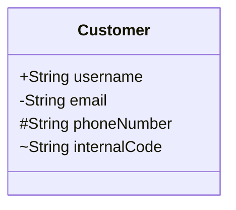

For domain models, attributes are commonly represented as private:

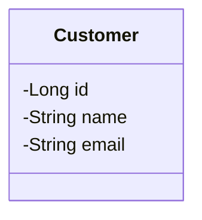

> **Note:** Understanding what the attribute represents is the important modeling decision. Visibility is secondary.

---

## 7. Attribute Types Matter

Don't only identify an attribute's name — also consider **what kind of information it is**.

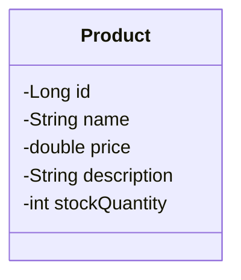

| Attribute | Type |
|---|---|
| id | `Long` |
| name | `String` |
| price | `double` |
| description | `String` |
| stockQuantity | `int` |

The exact programming-language type matters less at this stage than choosing a meaningful representation.

---

## 8. Don't Add Attributes Without Requirement Support

A common mistake is adding attributes simply because they seem useful.

**Requirement**

> A product has a name, price, and description.

**Correct model**

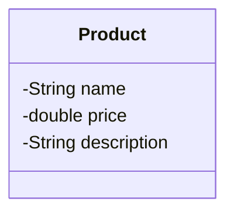

**Do not automatically add:**

`createdAt` · `updatedAt` · `manufacturer` · `discount` · `rating` · `color` · `weight` · `sku`

> **Rule:** Model what the requirements need, not everything the real-world object could possibly contain.

---

## 9. Attribute vs. Class

One of the most important modeling decisions: should this stay an attribute, or become its own class?

**Requirement**

> A customer has an address.

A simple representation:

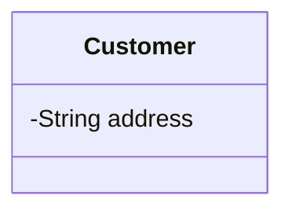

**But if the requirement says:**

> A customer's address contains street, city, state, country, and postal code.

...then `Address` is becoming a meaningful concept. Instead of cramming all fields into `Customer`:

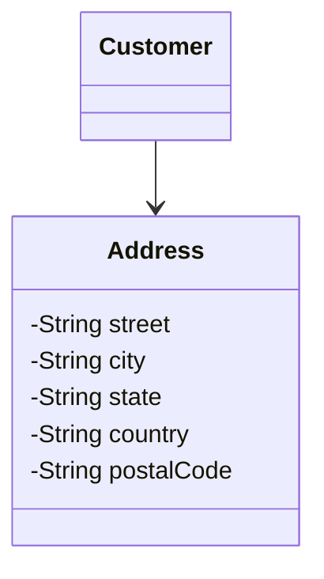

**The key question:**

> Is this just a simple piece of information, or is it becoming a meaningful concept with its own structure or behavior?

---

## 10. When Should Something Become a Class?

A concept is a good candidate for its own class when it:

- contains multiple pieces of information
- has its own behavior
- has an important identity
- participates in relationships
- appears as a meaningful domain concept
- needs to be modeled independently

**Simple concept**

```text
Customer
-String email
```

**More complex concept**

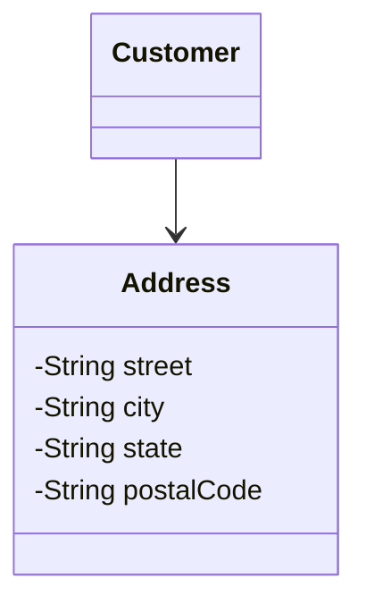

> The goal is not to create classes for everything — the goal is to identify meaningful domain concepts.

---

## 11. Attribute vs. Enum

**Requirement**

> An order can be pending, confirmed, shipped, delivered, or cancelled.

A naive `String` representation:

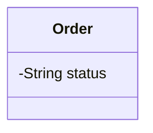

Since the values form a fixed set, an **enumeration** is usually a better fit:

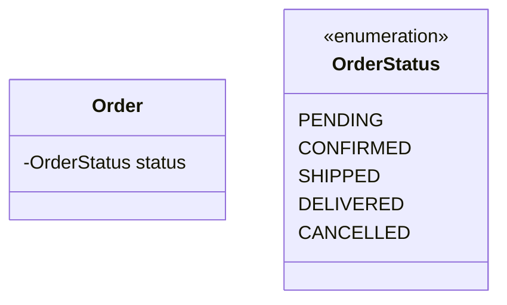

This communicates the domain model much more clearly.

---

## 12. Recognizing Enumeration Candidates

Look for requirement phrases such as:

- "can be one of"
- "possible values are"
- "status can be"
- "type can be"
- "category can be"
- "state can be"

**Requirement**

> Payment can be CASH, CARD, or UPI.

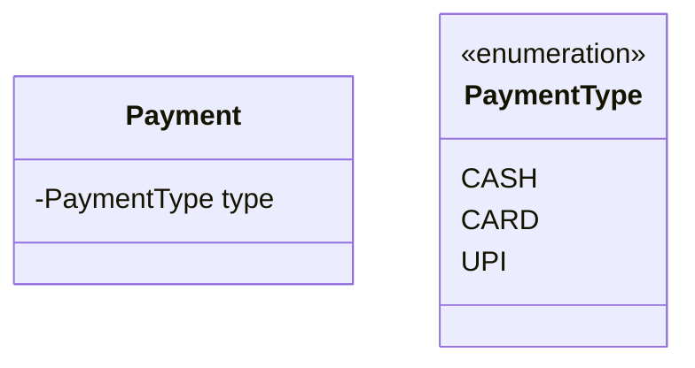

The exact decision still depends on the requirements.

---

## 13. Attribute vs. Derived Property

Some information doesn't need to be stored independently because it can be **calculated** from other information.

**Requirement**

> An order's total amount is calculated using subtotal, tax, and discount.


The `/` indicates that `totalAmount` is a **derived property**:

```text
totalAmount = subtotal + tax - discount
```

The important point isn't the exact calculation — it's that the value is *derived* rather than independently stored.

---

## 14. Why Derived Properties Matter

**Without the `/` marker:**

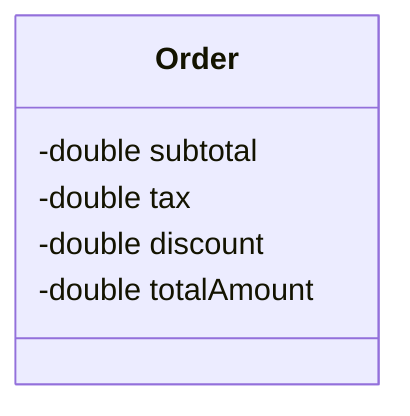

This might imply all four values are independently maintained.

**With the `/` marker:**


This correctly communicates that `totalAmount` is calculated, making the model more expressive.

---

## 15. Attributes and Responsibilities Are Connected

- **Responsibilities** describe what a class needs to know or do.
- **Attributes** describe the information the class needs to know.

```text
Responsibility
   ↓
What information is required?
   ↓
Attributes
```

**Requirement**

> An order calculates its total amount.

Responsibility: `calculate total amount`

To fulfill it, the order needs:

- subtotal
- tax
- discount


This is why identifying responsibilities first helps with attribute identification.

---

## 16. Avoid Duplicate Information

A common modeling problem: storing information already represented elsewhere in the model.

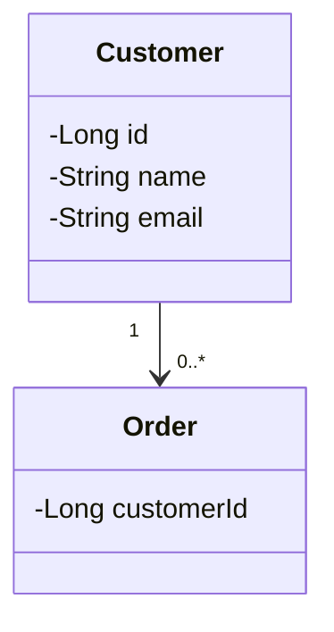

If the relationship already tells us an `Order` belongs to a `Customer`, consider whether a separate `customerId` attribute is necessary in the *conceptual* UML model — the relationship itself already communicates that association.

> **Lesson:** Don't duplicate domain information unnecessarily. (In implementation/database design, an ID/FK may still be needed — conceptual UML and database representation aren't always identical.)

---

## 17. Worked Example: User

**Requirement**

> A user has an ID, username, email address, date of birth, and account status.

**Step 1 — Identify the Class:** `User`

**Step 2 — Extract Information:** ID, username, email, date of birth, account status

**Step 3 — Check Special Concepts:** `accountStatus` has a fixed set of values (`ACTIVE`, `INACTIVE`, `BLOCKED`) → candidate for an enumeration.

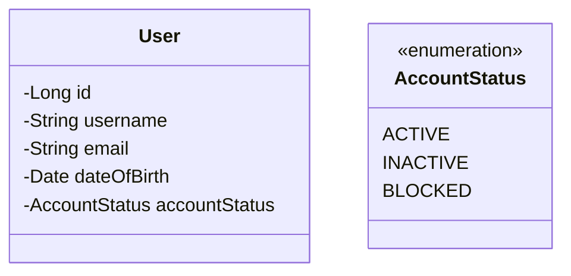

---

## 18. Worked Example: Product

**Requirement**

> A product has a name, price, description, and stock quantity.

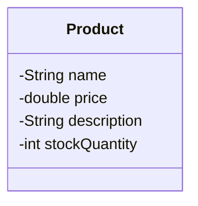

Nothing else should be added unless the requirements justify it.

---

## 19. Worked Example: Order

**Requirement**

> An order has an ID, creation date, status, and total amount.

Candidate attributes: `id`, `createdAt`, `status`, `totalAmount`

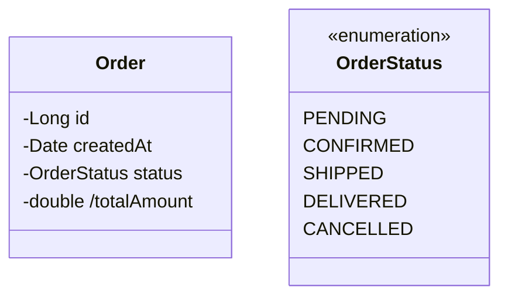

Whether `totalAmount` should be derived depends on the actual requirements.

---

## 20. Decision Tree

```text
Is this information associated with the class?
 │
 Yes
 ↓
Is it simple information?
 ├── Yes → Attribute
 └── No  → Could be a Class
              │
              ↓
        Is it a fixed set of values?
          ├── Yes → Enum
          └── No  → Attribute
                       │
                       ↓
             Is it calculated from other information?
               ├── Yes → Derived Property
               └── No  → Normal Attribute
```

This is a modeling **heuristic**, not a rigid rule.

---

## 21. Attribute Identification Checklist

1. What does this class need to know?
2. Is this information actually required by the requirements?
3. What is the appropriate representation?
4. Is this really an attribute, or should it be another class?
5. Is this a fixed set of values that should be an enumeration?
6. Is this value derived from other information?
7. Am I duplicating information already represented by a relationship?
8. Am I adding unnecessary implementation details?

---

## 22. Practice Questions

### Q1 — Library Member

**Requirement:** A library member has a member ID, name, email, and phone number.

<details>
<summary>Solution</summary>

Candidate class: `LibraryMember`

```mermaid
classDiagram
class LibraryMember {
  -Long memberId
  -String name
  -String email
  -String phoneNumber
}
```
</details>

### Q2 — Product

**Requirement:** A product has a name, price, description, and available stock quantity.

<details>
<summary>Solution</summary>

```mermaid
classDiagram
class Product {
  -String name
  -double price
  -String description
  -int stockQuantity
}
```
</details>

### Q3 — Order Status

**Requirement:** An order has an order ID, creation time, status, and total amount. Status can be `PENDING`, `CONFIRMED`, `SHIPPED`, `DELIVERED`, or `CANCELLED`.

<details>
<summary>Solution</summary>

`status` is a fixed set of values, so an enumeration is appropriate.

```mermaid
classDiagram
class Order {
  -Long orderId
  -Date createdAt
  -OrderStatus status
  -double totalAmount
}
class OrderStatus {
  <<enumeration>>
  PENDING
  CONFIRMED
  SHIPPED
  DELIVERED
  CANCELLED
}
```
</details>

### Q4 — Customer Address

**Requirement:** A customer has an address containing street, city, state, country, and postal code. Should all five pieces necessarily be attributes of `Customer`?

<details>
<summary>Solution</summary>

Not necessarily — `Address` is a meaningful concept with multiple properties.

```mermaid
classDiagram
class Customer
class Address {
  -String street
  -String city
  -String state
  -String country
  -String postalCode
}
Customer --> Address
```

The key decision is recognizing that `Address` has become a meaningful concept.
</details>

### Q5 — Derived Total

**Requirement:** An order's total is calculated from subtotal, tax, and discount. How could UML represent this?

<details>
<summary>Solution</summary>

`total` can be represented as a derived property:

```mermaid
classDiagram
class Order {
  -double subtotal
  -double tax
  -double discount
  -double /total
}
```

The `/` communicates that the property is derived.
</details>

### Q6 — Vehicle Fuel Type

**Requirement:** A vehicle has a registration number, model, and fuel type. Fuel type can be `PETROL`, `DIESEL`, `ELECTRIC`, or `HYBRID`.

<details>
<summary>Solution</summary>

`fuelType` has a fixed set of values, so an enumeration is appropriate.

```mermaid
classDiagram
class Vehicle {
  -String registrationNumber
  -String model
  -FuelType fuelType
}
class FuelType {
  <<enumeration>>
  PETROL
  DIESEL
  ELECTRIC
  HYBRID
}
```
</details>

---

## 23. Common Mistakes

| # | Mistake | Why It's a Problem |
|---|---|---|
| 1 | **Adding every noun as an attribute** | First determine whether it's an attribute, a class, an enum, a relationship, or irrelevant to the model. |
| 2 | **Adding attributes that were never required** | Avoid inventing fields just because they seem realistic — the model should reflect the requirements' scope. |
| 3 | **Treating complex concepts as strings** | e.g. `-String address` may be insufficient if the address has meaningful internal structure. Consider a separate `Address` class. |
| 4 | **Using strings for fixed values** | e.g. `-String status` loses domain information when valid values are explicitly fixed. Consider an enumeration. |
| 5 | **Ignoring derived information** | If a property is calculated from others, represent it as derived (e.g. `/double totalAmount`). |
| 6 | **Duplicating relationships as attributes** | If a relationship already communicates an association, don't also add a redundant attribute for the same concept. |

---

## 24. Mental Model Summary

```text
Class
  ↓
What does it need to know?
  ↓
Candidate information
  ↓
Is it actually required?
  ↓
Simple information? ──────────────► Attribute

If not:
  ↓
Meaningful complex concept? ──────► Class
Fixed set of values?        ──────► Enumeration
Calculated value?           ──────► Derived Property
```

---

## 25. UML Syntax Cheat Sheet

| Concept | Syntax |
|---|---|
| Basic attribute | `-String name` |
| Attribute with type | `-double price` |
| Public attribute | `+String name` |
| Protected attribute | `#String name` |
| Package visibility | `~String name` |
| Derived attribute | `-double /totalAmount` |

**Enumeration**

```mermaid
classDiagram
class Status {
  <<enumeration>>
  ACTIVE
  INACTIVE
}
```

---

## 26. Key Takeaways

1. An attribute represents information or state associated with a class.
2. Ask *"What does this class need to know?"*
3. Do not automatically convert every noun into an attribute.
4. Only model information relevant to the requirements and scope.
5. Choose an appropriate representation for each concept.
6. A complex concept may deserve its own class.
7. A fixed set of values may be better represented as an enumeration.
8. A calculated value can be represented as a derived property.
9. Avoid unnecessary duplication.
10. Responsibilities and attributes are closely connected.
11. UML modeling should focus on the domain rather than implementation details.
12. The goal is not the maximum number of attributes — it's a meaningful model.

---

## 27. Final Interview Heuristic

When asked to design a class diagram from requirements, start with:

> *"What does this class need to know?"*

Then evaluate each piece of information:

```text
Simple information?        → Attribute
Meaningful complex concept? → Class
Fixed set of values?        → Enum
Calculated information?     → Derived Property
```

This gives a systematic way to move from requirements to meaningful UML attributes.