# Identifying Operations from Requirements

## Table of Contents

1. [Overview](#1-overview)
2. [What Is an Operation?](#2-what-is-an-operation)
3. [Attribute vs. Operation](#3-attribute-vs-operation)
4. [Where Do Operations Come From?](#4-where-do-operations-come-from)
5. [Operation Identification Flow](#5-operation-identification-flow)
6. [Responsibility vs. Operation](#6-responsibility-vs-operation)
7. [Finding Operations from Requirements](#7-finding-operations-from-requirements)
8. [UML Operation Syntax](#8-uml-operation-syntax)
9. [Operation Visibility](#9-operation-visibility)
10. [Parameters](#10-parameters)
11. [Multiple Parameters](#11-multiple-parameters)
12. [Return Types](#12-return-types)
13. [Operations Without a Meaningful Result](#13-operations-without-a-meaningful-result)
14. [Assigning an Operation to the Correct Class](#14-assigning-an-operation-to-the-correct-class)
15. [Information Expert Heuristic](#15-information-expert-heuristic)
16. [Avoid Putting Everything in One Class](#16-avoid-putting-everything-in-one-class)
17. [Don't Automatically Add Getters and Setters](#17-dont-automatically-add-getters-and-setters)
18. [Domain Operations vs. Technical Operations](#18-domain-operations-vs-technical-operations)
19. [Worked Example: Shopping Cart](#19-worked-example-shopping-cart)
20. [Worked Example: Parking Lot](#20-worked-example-parking-lot)
21. [Worked Example: Online Shopping](#21-worked-example-online-shopping)
22. [Operation Naming](#22-operation-naming)
23. [Don't Over-Model Operations](#23-dont-over-model-operations)
24. [Attributes and Operations Work Together](#24-attributes-and-operations-work-together)
25. [Operation Identification Workflow for Interviews](#25-operation-identification-workflow-for-interviews)
26. [Practice Questions](#26-practice-questions)
27. [Common Mistakes](#27-common-mistakes)
28. [Mental Model Summary](#28-mental-model-summary)
29. [Complete Modeling Flow So Far](#29-complete-modeling-flow-so-far)
30. [Key Takeaways](#30-key-takeaways)
31. [Final Interview Heuristic](#31-final-interview-heuristic)

---

## 1. Overview

After identifying **classes**, **responsibilities**, and **attributes**, the next step is to identify the **operations** of those classes.

> An operation represents behavior that a class can perform.

```text
Attribute  → What the class knows
Operation  → What the class does
```

**Requirement**

> A customer can place an order and cancel an order.

Candidate operations:

```text
placeOrder()
cancelOrder()
```

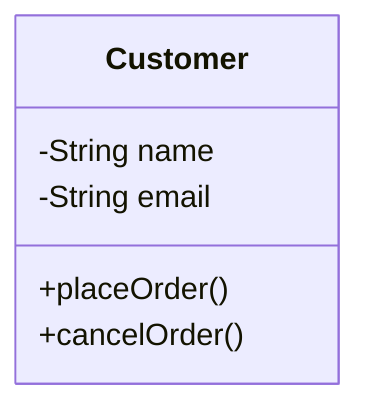

---

## 2. What Is an Operation?

An **operation** represents behavior that a class can perform.

| Class | Example Behavior |
|---|---|
| Customer | place an order |
| Order | calculate total |
| BankAccount | deposit money |
| ParkingLot | find an available spot |
| ShoppingCart | add a product |

An operation answers the question:

> *"What can this class do?"*

---

## 3. Attribute vs. Operation

This distinction is fundamental.

**Attribute** — represents information or state:

```text
Customer
- name
- email
- phoneNumber
```

**Operation** — represents behavior:

```text
Customer
+ placeOrder()
+ changeEmail()
```

```text
Class
├── Attributes → What it knows
└── Operations → What it does
```

---

## 4. Where Do Operations Come From?

Operations are usually discovered from **behavioral statements** in requirements.

**Requirement**

> A customer can place an order and cancel an order.

Behavioral words: `place`, `cancel` → candidate operations: `placeOrder()`, `cancelOrder()`

**Requirement**

> A bank account allows money to be deposited and withdrawn.

Candidate operations: `deposit()`, `withdraw()`

```text
Nouns → Candidate Classes
Verbs → Candidate Responsibilities / Operations
```

> **Important:** A verb does not automatically become an operation. It must first be evaluated as meaningful behavior and assigned to the appropriate class.

---

## 5. Operation Identification Flow

```text
Requirement
   ↓
Identify Classes
   ↓
Identify Responsibilities
   ↓
Find Behavioral Statements
   ↓
Identify Candidate Operations
   ↓
Ask "Who owns this behavior?"
   ↓
Assign Operation
   ↓
Determine Parameters
   ↓
Determine Return Type
   ↓
Refine UML
```

This gives a systematic approach instead of randomly adding methods.

---

## 6. Responsibility vs. Operation

Related, but not identical.

**Responsibility** — a conceptual duty of a class:

```text
Order
responsibility: calculate total
```

**Operation** — the UML representation of that behavior:

```text
calculateTotal()
```

```text
Responsibility → Behavior → Operation
```

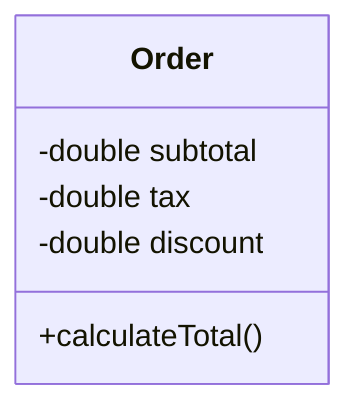

Responsibility: *Calculate the order total.* Operation: `calculateTotal()`

---

## 7. Finding Operations from Requirements

**Requirement**

> A bank account allows a customer to deposit money, withdraw money, and check the current balance.

**Step 1 — Identify the Class:** `BankAccount`

**Step 2 — Identify Behaviors:** deposit, withdraw, check balance

**Step 3 — Convert to Candidate Operations:** `deposit()`, `withdraw()`, `getBalance()`

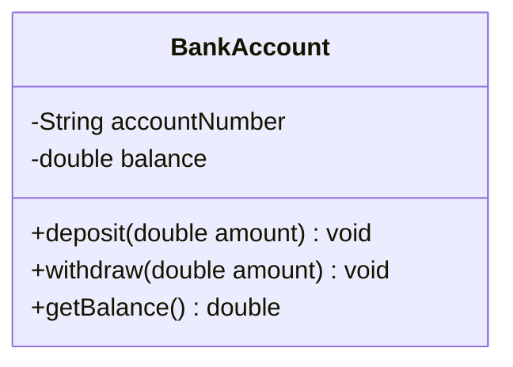

The operations correspond directly to meaningful behavior from the requirement.

---

## 8. UML Operation Syntax

```text
visibility operationName(parameters) : returnType
```

**Examples**

```text
+deposit(double amount) : void
+calculateTotal() : double
```

| Component | Example |
|---|---|
| Visibility | `+` |
| Operation name | `deposit` |
| Parameters | `(double amount)` |
| Return type | `void` |

---

## 9. Operation Visibility

| Symbol | Visibility |
|---|---|
| `+` | Public |
| `-` | Private |
| `#` | Protected |
| `~` | Package |

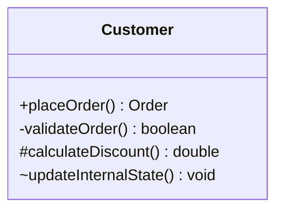

> For conceptual LLD modeling, the most important thing is usually the behavior itself and its ownership — not visibility.

---

## 10. Parameters

An operation may need information to perform its responsibility.

**Requirement**

> A customer can change their email address.

The operation needs the new email address:

```text
changeEmail(String email)
```

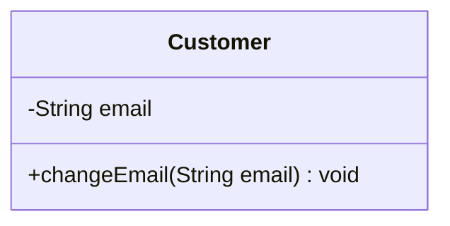

The parameter communicates that the operation requires a new email value.

---

## 11. Multiple Parameters

Some operations require more than one piece of information.

**Requirement**

> An order allows a product to be added with a quantity.

```text
addProduct(Product product, int quantity)
```

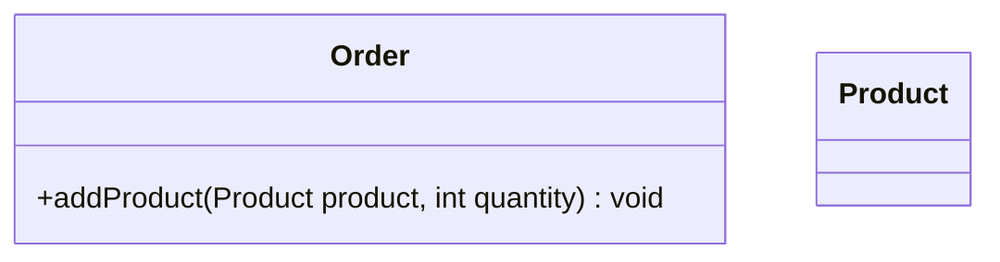

Parameters should represent the information required by the behavior.

---

## 12. Return Types

Some operations produce a result.

**Requirement**

> An order calculates its total amount.

```text
calculateTotal() : double
```

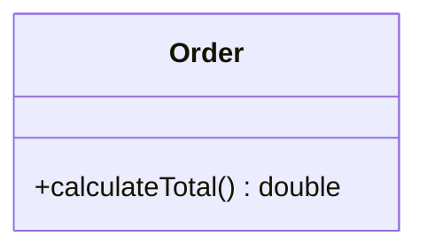

**Requirement**

> A parking lot finds an available parking spot.

```text
findAvailableSpot() : ParkingSpot
```

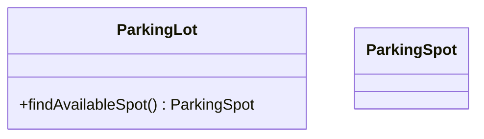

---

## 13. Operations Without a Meaningful Result

Some operations simply perform an action.

**Requirement**

> A customer updates their profile.

```text
updateProfile()
```

Or with specific values required:

```text
updateProfile(String name, String email)
```

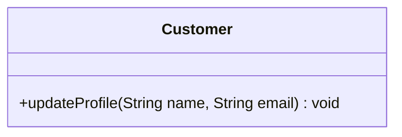

The exact representation depends on how detailed the UML model needs to be.

---

## 14. Assigning an Operation to the Correct Class

One of the most important modeling decisions.

**Requirement**

> A customer places an order.

Candidate classes: `Customer`, `Order`, `Product`

The requirement explicitly describes the customer performing the action:

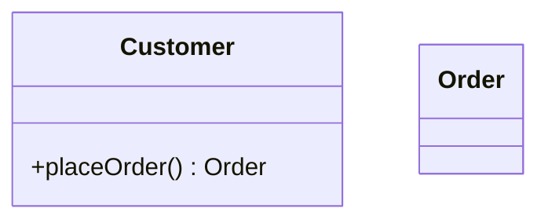

**Requirement**

> An order calculates its total.

That responsibility naturally belongs to `Order`:


> **Key question:** Which class naturally owns this behavior?

---

## 15. Information Expert Heuristic

> Give a responsibility to the class that has the information needed to perform it.

**Requirement**

> An order calculates the total price of its items.

The order has access to its items and their relevant information, so:

```text
Order → calculateTotal()
```

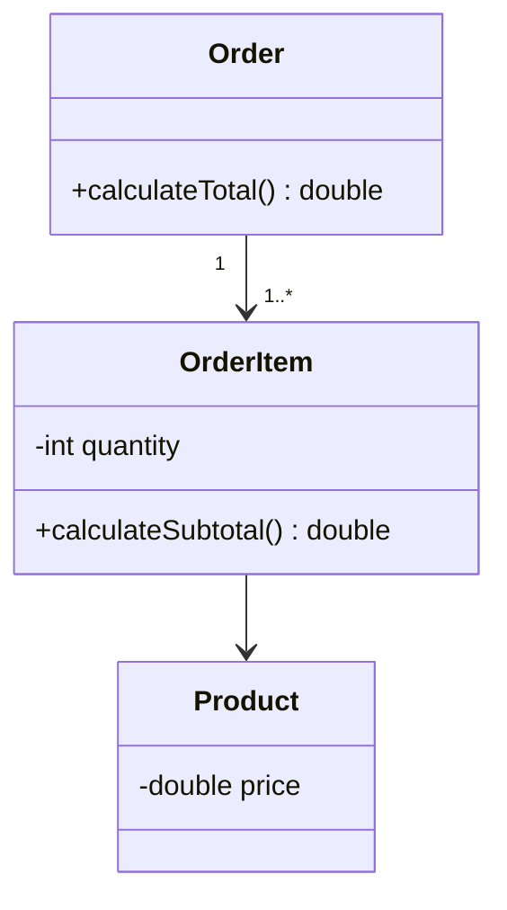

> **Principle:** Put behavior close to the information required for that behavior.

---

## 16. Avoid Putting Everything in One Class

A common modeling problem: one class performing unrelated responsibilities.

```text
Order
createCustomer()
createProduct()
sendEmail()
processPayment()
calculateTax()
generateInvoice()
reserveParkingSpot()
```

This is a sign that responsibilities aren't being distributed properly. Identify the natural owner of each behavior instead:

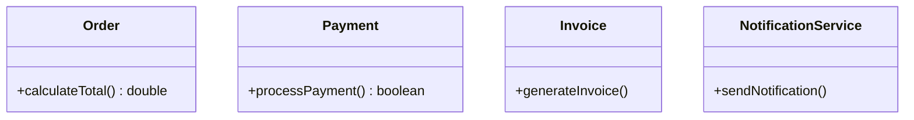

> **Principle:** Keep responsibilities close to the concept that owns them.

---

## 17. Don't Automatically Add Getters and Setters

**Requirement**

> A customer has a name and email.

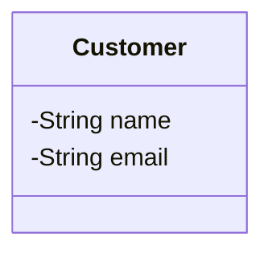

We don't necessarily need `getName()`, `setName()`, `getEmail()`, `setEmail()` — these are often implementation-level details rather than meaningful domain behavior.

**But if the requirement says:**

> A customer can change their email address.

...then a meaningful operation appears:


| Type | Nature |
|---|---|
| Getter/setter | Often technical access |
| `changeEmail()` | Meaningful domain behavior |

---

## 18. Domain Operations vs. Technical Operations

**Technical/persistence-related:**

```text
save()
delete()
find()
update()
```

**Domain behavior:**

```text
placeOrder()
cancelOrder()
calculateTotal()
reserveSpot()
processPayment()
```

> When designing conceptual UML, prioritize **what the domain does** rather than what the persistence layer or framework does.

---

## 19. Worked Example: Shopping Cart

**Requirement**

> A shopping cart allows users to add products, remove products, update quantities, and calculate the total.

Candidate class: `ShoppingCart`

Candidate operations: `addProduct()`, `removeProduct()`, `updateQuantity()`, `calculateTotal()`

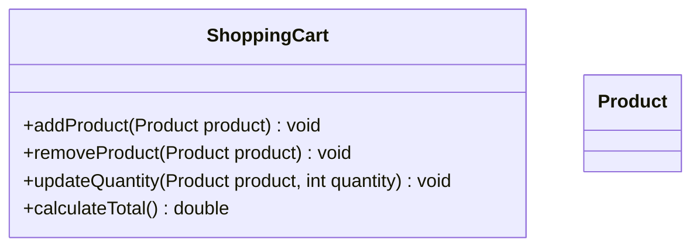

These operations are derived from meaningful behavioral requirements.

---

## 20. Worked Example: Parking Lot

**Requirement**

> A parking lot can find an available parking spot, assign a vehicle to a spot, and release a spot when the vehicle leaves.

Candidate operations: `findAvailableSpot()`, `assignSpot()`, `releaseSpot()`

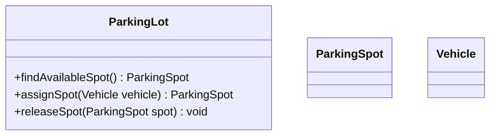

The operation names communicate the behavior clearly.

---

## 21. Worked Example: Online Shopping

**Requirement**

> A customer can add products to a cart. The cart can calculate the total. The customer can place an order.

**Candidate classes:** `Customer`, `Product`, `ShoppingCart`, `Order`

**Candidate behaviors:**

```text
Customer
→ add product to cart
→ place order

ShoppingCart
→ calculate total
```

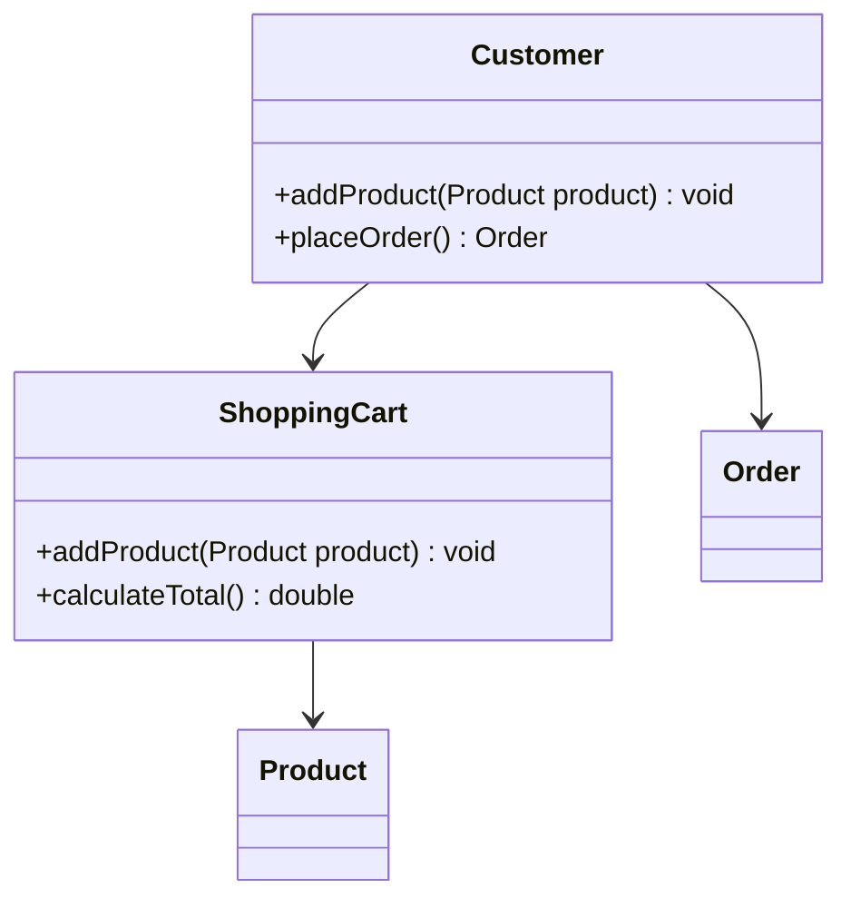

The reasoning chain:

```text
Requirement → Behavior → Responsibility → Operation → Owner
```

---

## 22. Operation Naming

**Prefer clear, behavior-communicating names:**

```text
placeOrder()
cancelOrder()
calculateTotal()
reserveSpot()
releaseSpot()
processPayment()
changeEmail()
addProduct()
removeProduct()
```

**Avoid vague names** (unless the domain requirements actually define such behavior):

```text
doSomething()
process()
handle()
execute()
perform()
```

> A good operation name should answer: *What behavior is being performed?*

---

## 23. Don't Over-Model Operations

**Requirement**

> A customer has a name and email.

Don't automatically create `getName()`, `setName()`, `getEmail()`, `setEmail()`. The model can simply be:


**Now suppose the requirement says:**

> A customer can change their email address.

Then `changeEmail()` becomes meaningful:

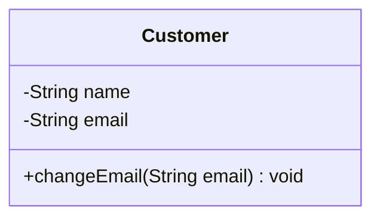

The operation exists because the requirement describes meaningful behavior.

---

## 24. Attributes and Operations Work Together

Attributes represent information; operations use, calculate, or modify that information.

```mermaid
classDiagram
class BankAccount {
  -double balance
  +deposit(double amount) void
  +withdraw(double amount) void
  +getBalance() double
}
```

```text
              balance
                 │
        ┌────────┴────────┐
        │                 │
    deposit()          withdraw()
        │                 │
        └────────┬────────┘
                  ↓
             getBalance()
```

The UML idea is that operations represent behavior associated with the class's state.

---

## 25. Operation Identification Workflow for Interviews

1. Read the requirement
2. Identify candidate classes
3. Identify responsibilities
4. Look for behavioral statements
5. Extract candidate operations
6. Ask *"Who owns this behavior?"*
7. Assign the operation
8. Identify required parameters
9. Identify meaningful return type
10. Refine the UML

---

## 26. Practice Questions

### Q1 — Bank Account

**Requirement:** A bank account allows money to be deposited and withdrawn. The current balance can also be checked.

<details>
<summary>Solution</summary>

```mermaid
classDiagram
class BankAccount {
  +deposit(double amount) void
  +withdraw(double amount) void
  +getBalance() double
}
```

Reasoning: `deposit` and `withdraw` are behaviors; "check balance" is a behavior that returns the balance.
</details>

### Q2 — Shopping Cart

**Requirement:** A shopping cart allows users to add products, remove products, and calculate the total price.

<details>
<summary>Solution</summary>

```mermaid
classDiagram
class ShoppingCart {
  +addProduct(Product product) void
  +removeProduct(Product product) void
  +calculateTotal() double
}
class Product
```
</details>

### Q3 — Parking Lot

**Requirement:** A parking lot can find an available parking spot and release a parking spot when a vehicle leaves.

<details>
<summary>Solution</summary>

```mermaid
classDiagram
class ParkingLot {
  +findAvailableSpot() ParkingSpot
  +releaseSpot(ParkingSpot spot) void
}
class ParkingSpot
```

Notice that `findAvailableSpot()` returns a meaningful domain object (`ParkingSpot`).
</details>

### Q4 — Order Cancellation

**Requirement:** An order can be cancelled before it is shipped. Identify the candidate operation.

<details>
<summary>Solution</summary>

```mermaid
classDiagram
class Order {
  +cancel() void
}
```

The exact operation name can depend on domain terminology.
</details>

### Q5 — Customer Phone Number

**Requirement:** A customer can change their phone number.

<details>
<summary>Solution</summary>

```mermaid
classDiagram
class Customer {
  -String phoneNumber
  +changePhoneNumber(String phoneNumber) void
}
```

The behavior naturally belongs to `Customer` because the customer owns the information being changed.
</details>

### Q6 — Order Total from Items

**Requirement:** An order calculates its total from its order items. Which class should naturally own the operation?

<details>
<summary>Solution</summary>

`Order` is the natural owner of the overall calculation:

```mermaid
classDiagram
class Order {
  +calculateTotal() double
}
class OrderItem {
  +calculateSubtotal() double
}
Order "1" --> "1..*" OrderItem
```

`Order` → overall total; `OrderItem` → individual item subtotal. Behavior is distributed across related classes.
</details>

---

## 27. Common Mistakes

| # | Mistake | Why It's a Problem |
|---|---|---|
| 1 | **Every verb becomes a method** | Ask: is this meaningful behavior? Who owns it? What information does it need? |
| 2 | **Putting everything in one class** | Distribute responsibilities according to domain ownership and available information. |
| 3 | **Adding every getter and setter** | Don't clutter a conceptual UML diagram with implementation boilerplate unless relevant to the design. |
| 4 | **Ignoring parameters** | Ask: what information does this operation need? e.g. `addProduct()` → `addProduct(Product product)`. |
| 5 | **Ignoring return values** | Ask: does this operation produce a meaningful result? e.g. `findAvailableSpot() → ParkingSpot`. |
| 6 | **Modeling technical details too early** | Don't jump to Repository / DAO / SQL / Controller / Service / CRUD before understanding the domain model. |

---

## 28. Mental Model Summary

```text
Class
  ↓
What does it need to know? → Attributes

Class
  ↓
What does it need to do? → Responsibilities → Operations
```

Then refine each operation:

```text
Operation
  ↓
Who owns it?
  ↓
What parameters does it need?
  ↓
What does it return?
```

---

## 29. Complete Modeling Flow So Far

```text
Requirement
   ↓
Candidate Classes
   ↓
Responsibilities
   ↓
Attributes
   ↓
Operations
```

| Question | Yields |
|---|---|
| Nouns | Classes |
| "What does it need to know?" | Attributes |
| "What does it need to do?" | Responsibilities |
| "How is that behavior represented?" | Operations |

This becomes the foundation for the next step: **relationships**.

---

## 30. Key Takeaways

1. An operation represents behavior that a class can perform.
2. Attributes describe what a class knows.
3. Operations describe what a class does.
4. Verbs in requirements are useful candidates for discovering behavior.
5. A verb does not automatically become a method.
6. First identify the responsibility, then model the operation.
7. Assign behavior to the class that naturally owns the responsibility.
8. The information-expert heuristic can help identify the appropriate owner.
9. Parameters represent information required by an operation.
10. Return types represent meaningful results.
11. Avoid unnecessary getters and setters in conceptual UML.
12. Avoid putting unrelated behavior into one class.
13. Prefer meaningful domain behavior over technical implementation details.
14. Operation names should clearly communicate the behavior.
15. Attributes and operations should make sense together as part of the class's responsibilities.

---

## 31. Final Interview Heuristic

When identifying operations, ask:

> *"What does this class need to do?"*

```text
What responsibility does that represent?
   ↓
Which class naturally owns it?
   ↓
What information does it need?
   ↓
What parameters are required?
   ↓
Does it produce a result?
   ↓
What is the return type?
   ↓
What should the operation be called?
```

The most important question is:

> **"What should this class be responsible for doing, and why does this class naturally own that behavior?"**