# Identifying Relationships from Requirements

## Overview

A UML class diagram is not only about identifying classes — we also need to understand **how those classes connect to each other**. For example:

- A **Customer** places an **Order**
- An **Order** contains **OrderItems**
- An **OrderItem** refers to a **Product**
- A **Car** *is a type of* **Vehicle**
- A **PaymentProcessor** implementation *implements* a payment contract
- An **OrderService** *uses* a **PaymentProcessor**

These statements describe relationships between concepts. This guide walks through how to identify those relationships directly from requirements.

---

## 1. What Is a Relationship?

A relationship describes how two UML elements are connected. For example:

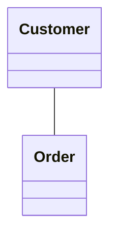

This tells us that `Customer` and `Order` have a structural relationship. The relationship itself matters because it tells us something about the domain model.

---

## 2. Why Relationship Identification Matters

Suppose we have these classes: `Customer`, `Order`, `Product`, `Payment`.

Simply identifying the classes is not enough — we also need to determine:

- Which classes are connected?
- Why are they connected?
- What kind of relationship exists?
- Which direction should the relationship have?
- What is the multiplicity?
- Is there a whole–part relationship?
- Does one class depend on another?
- Is one class a specialized version of another?

This is what turns a list of classes into a meaningful UML model.

---

## 3. Relationship Identification Flow

```
Requirement
     ↓
Identify Classes
     ↓
Find Statements Connecting Classes
     ↓
Identify Relationship Type
     ↓
Determine Direction / Navigability
     ↓
Determine Multiplicity
     ↓
Add Relationship Label / Role if Useful
```

**Example requirement:**
> A customer can place multiple orders. Each order contains multiple products.

1. Identify the classes: `Customer`, `Order`, `Product`
2. Identify connections: `Customer → Order`, `Order → Product`
3. Determine the relationship types.

---

## 4. Main UML Relationship Types

| Relationship | Meaning |
|---|---|
| **Association** | Structural connection between concepts |
| **Generalization** | One concept is a specialized type of another |
| **Realization** | A class implements an interface/contract |
| **Dependency** | One element uses another |
| **Aggregation** | Weak whole-part relationship |
| **Composition** | Strong whole-part relationship |

The notation was already covered in *UML Fundamentals*. Here the focus is: **how do we discover these relationships from requirements?**

---

## 5. Association

Association represents a structural relationship between two concepts.

> **Requirement:** A customer can place orders.

We have `Customer` and `Order`, structurally connected:


Described as: *Customer places Order*, or *Customer is associated with Order*.

---

## 6. Directed Association

Sometimes the requirement tells us that one class needs to navigate toward another.

> **Requirement:** An order references its customer.

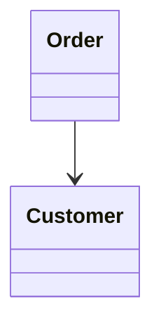

The arrow indicates navigability from `Order → Customer`. Direction should not be added randomly — ask: **which concept needs to know or navigate to the other?**

---

## 7. Generalization

Generalization represents an **is-a** relationship.

> **Requirement:** A car is a vehicle.

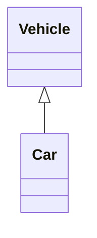

Meaning: *Car is a Vehicle*. The key question: **is one concept genuinely a specialized type of another?**

---

## 8. Do Not Confuse Similarity With Generalization

Consider `Car` and `Engine`. A car *has* an engine, but "Car is an Engine" is false — so this is **not** generalization. It's a structural relationship instead:

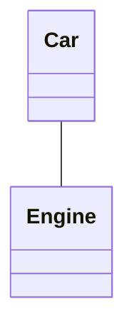

**Test:** Can I naturally say *"X is a Y"*? If yes, generalization may be appropriate. If not, don't use inheritance just because the concepts are related.

---

## 9. Realization

Realization is used when a class implements a contract/interface.

> **Requirement:** The credit card payment processor implements the PaymentProcessor contract.

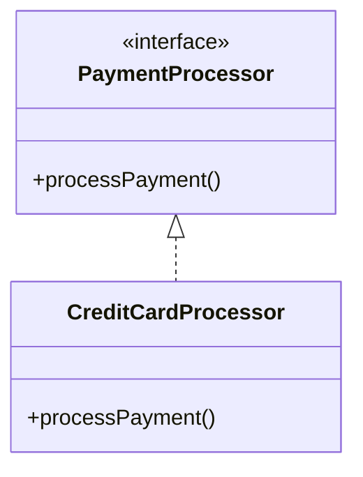

Meaning: *CreditCardProcessor implements PaymentProcessor*. The clue to look for is the word **"implements"** or an equivalent statement describing fulfillment of a contract.

---

## 10. Dependency

Dependency represents a usage relationship.

> **Requirement:** OrderService uses PaymentProcessor to process payments.

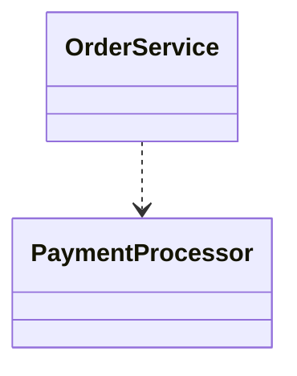

Meaning: *OrderService depends on PaymentProcessor*. This relationship is weaker than a permanent structural association.

---

## 11. Recognizing Dependency From Requirements

Typical clues:

- uses
- calls
- invokes
- depends on
- requires
- uses temporarily

> **Requirement:** ReportGenerator uses PdfExporter to generate a report.

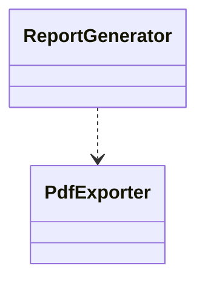

**Ask:** Is this class mainly using another class to perform some work? If yes, dependency may be appropriate.

---

## 12. Aggregation

Aggregation represents a whole–part relationship where the part can conceptually exist independently of the whole.

> **Requirement:** A university has departments.

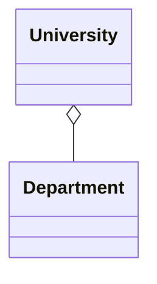

The `Department` is not necessarily conceptually dependent on the lifetime of a particular `University`.

---

## 13. Composition

Composition represents a **stronger** whole–part relationship — the part's lifecycle is tied to the whole.

> **Requirement:** An order contains order items.

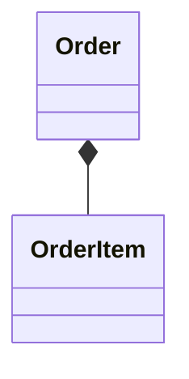

The order item exists as part of the order in the modeled lifecycle.

---

## 14. Aggregation vs. Composition

This is one of the most important distinctions to get right.

| | Aggregation | Composition |
|---|---|---|
| **Notation** | Whole ◇── Part | Whole ◆── Part |
| **Lifecycle** | Part can exist independently | Part strongly belongs to the whole |
| **Example** | `University ◇── Department` | `Order ◆── OrderItem` |

**Key question:** Is the part's lifecycle strongly owned by the whole?
- **Yes** → composition may be appropriate
- **No** → aggregation, or ordinary association, is more suitable

---

## 15. Important Warning: "Has" Does Not Automatically Mean Composition

> **Requirement:** A company has employees.

It would be **incorrect** to automatically conclude `Company *-- Employee`, because employees can exist independently of a particular company.

> ⚠️ The word **"has"** is only a clue — it is not a UML rule. The correct modeling decision requires semantic reasoning.

---

## 16. Relationship Keywords Are Clues, Not Rules

| Requirement phrase | Possible relationship |
|---|---|
| has | Association / aggregation / composition |
| contains | Association / composition |
| consists of | Aggregation / composition |
| uses | Dependency |
| calls | Dependency |
| implements | Realization |
| is a | Generalization |
| type of | Generalization |
| belongs to | Association / composition |
| owns | Potential composition |
| references | Association / dependency |

These words should **never** be treated as automatic rules. For example, "Order has Customer" does not automatically mean composition — we need to understand the domain semantics.

---

## 17. Association vs. Operation

> **Requirement:** A customer places an order.

The verb **"places"** represents *behavior*, which may become an operation:

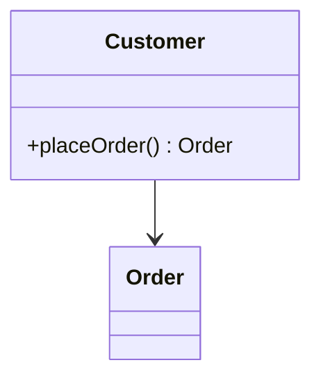

Two different things are happening here:

- **Operation** — `placeOrder()` — represents behavior
- **Relationship** — `Customer → Order` — represents a structural connection

A verb can help identify an operation, while the concepts connected by that behavior can reveal a relationship.

---

## 18. Association vs. Attribute

> **Requirement:** An order belongs to a customer.


At the conceptual UML level, we don't necessarily need to think in terms of a field like `Order.customer` — the relationship itself communicates the domain connection. Implementation details such as fields can be derived later.

---

## 19. Worked Example: E-Commerce Domain

> **Requirement:** A customer can place multiple orders. An order contains multiple order items. Each order item refers to a product.

**Classes:** `Customer`, `Order`, `OrderItem`, `Product`

| Pair | Reasoning | Relationship |
|---|---|---|
| Customer → Order | Customer places Order | Association |
| Order → OrderItem | Order contains OrderItems; strong lifecycle | Composition |
| OrderItem → Product | An order item refers to a product | Association |

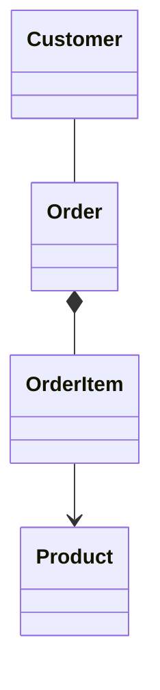

*Note: multiplicity is intentionally left out here — that's covered in the next step of this learning sequence.*

---

## 20. Relationship Identification Decision Tree

```
Are these concepts connected?
        |
       Yes
        ↓
Is one a specialized type of the other?
        |
      Yes → Generalization
        |
       No
        ↓
Is one implementing a contract/interface?
        |
      Yes → Realization
        |
       No
        ↓
Is one mainly using the other?
        |
      Yes → Dependency
        |
       No
        ↓
Is there a structural relationship?
        |
      Yes → Association
        |
        ↓
Is it a whole-part relationship?
        |
      Yes
        ↓
Does the part's lifecycle belong strongly to the whole?
      /   \
    Yes    No
     ↓      ↓
Composition Aggregation
```

A useful interview-time reasoning framework.

---

## 21. Relationship Identification in an Interview

> **Requirement:** A user can create multiple playlists. A playlist contains multiple songs. A song can belong to multiple playlists.

Don't immediately start drawing — think step by step:

1. **Identify classes:** `User`, `Playlist`, `Song`
2. **Identify connections:** `User ↔ Playlist`, `Playlist ↔ Song`
3. **Ask what kind of relationship exists:**
   - *User creates Playlist* → structural association
   - *Playlist contains Song* → whole-part, but carefully confirm lifecycle semantics before choosing composition
4. **Determine direction:** who needs to know whom?
5. **Determine multiplicity:** how many? (modeled separately)

---

## 22. Important Modeling Nuance

Do not mechanically apply relationship types.

- *A company has employees* → probably `Company -- Employee`, **not** automatically `Company *-- Employee`
- *An order contains products* → could mean different things depending on the domain model

The correct UML relationship depends on:

- ownership
- lifecycle
- independence
- domain semantics
- navigability
- responsibilities

**UML modeling is about understanding meaning, not simply matching keywords.**

---

## 23. Relationship Type Comparison

| Type | Core Question |
|---|---|
| Association | Are these concepts structurally connected? |
| Generalization | Is one a specialized type of another? |
| Realization | Does one implement a contract? |
| Dependency | Does one use another? |
| Aggregation | Is there a weak whole-part relationship? |
| Composition | Is there a strong whole-part lifecycle relationship? |

Mental shortcut:

```
Is-a?          → Generalization
Implements?    → Realization
Uses?          → Dependency
Connected?     → Association
Whole-part?    → Aggregation / Composition
```

---

## 24. Complete Worked Example

> **Requirement:** A customer can place multiple orders. Each order contains order items. Each order item references a product. A credit card processor implements the payment processor interface. The order service uses the payment processor to process payments.

**Classes:** `Customer`, `Order`, `OrderItem`, `Product`, `PaymentProcessor`, `CreditCardProcessor`, `OrderService`

| Pair | Statement | Relationship |
|---|---|---|
| Customer ↔ Order | Customer places Order | Association |
| Order ↔ OrderItem | Order contains OrderItem, lifecycle-bound | Composition |
| OrderItem ↔ Product | OrderItem references Product | Association / directed association |
| CreditCardProcessor ↔ PaymentProcessor | CreditCardProcessor implements PaymentProcessor | Realization |
| OrderService ↔ PaymentProcessor | OrderService uses PaymentProcessor | Dependency |

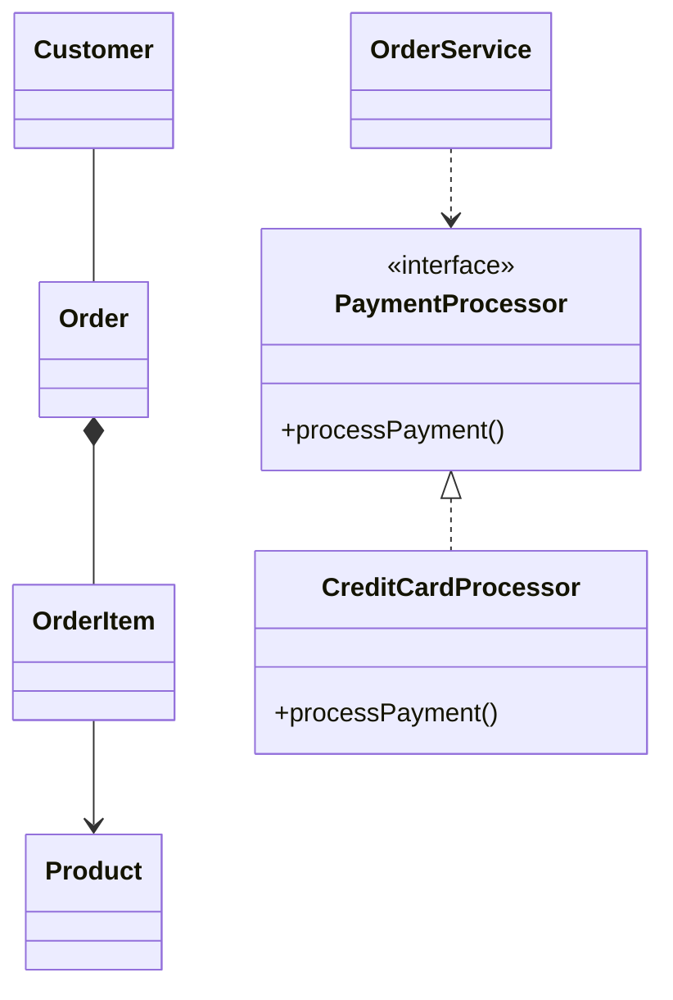

This is a good example of identifying multiple UML relationship types from natural-language requirements.

---

## 25. Practice Questions

<details>
<summary><strong>Q1.</strong> "A customer can place orders." What relationship exists between Customer and Order?</summary>

**Answer: Association**


*Reason: The two concepts are structurally connected.*
</details>

<details>
<summary><strong>Q2.</strong> "A car is a type of vehicle." What relationship exists?</summary>

**Answer: Generalization**


*Reason: "Car is a Vehicle" — an is-a relationship.*
</details>

<details>
<summary><strong>Q3.</strong> "A payment service uses a payment gateway." What relationship exists?</summary>

**Answer: Dependency**

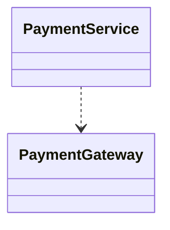

*Reason: The payment service uses the payment gateway to perform some work.*
</details>

<details>
<summary><strong>Q4.</strong> "StripePaymentProcessor implements PaymentProcessor." What relationship exists?</summary>

**Answer: Realization**

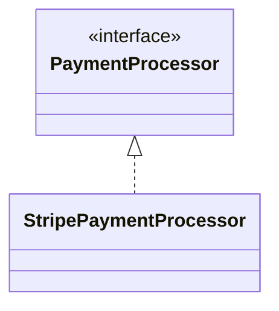

*Reason: The concrete class implements the interface contract.*
</details>

<details>
<summary><strong>Q5.</strong> "An order contains order items. Order items are created as part of the order and are not independently managed outside that order." What relationship is appropriate?</summary>

**Answer: Composition**


*Reason: The requirement explicitly establishes a strong lifecycle relationship.*
</details>

<details>
<summary><strong>Q6.</strong> "A university has departments. Departments can exist conceptually independently of a particular university." What relationship could be modeled?</summary>

**Answer: Aggregation**


*Reason: Whole-part relationship, but the part is not strongly lifecycle-dependent on the whole.*
</details>

<details>
<summary><strong>Q7.</strong> "A company employs employees. Employees can exist independently of the company." Should this automatically be composition?</summary>

**Answer: No.**

Do not infer composition merely from "company has employees." A normal association is often sufficient:

```mermaid
classDiagram
    Company -- Employee
```

*Reason: The employee's lifecycle does not depend on the company.*
</details>

<details>
<summary><strong>Q8.</strong> "A shopping cart contains products." Should we automatically use composition?</summary>

**Answer: No.**

"Contains" is only a clue — we need to understand lifecycle and ownership semantics. Depending on the domain model:

```mermaid
classDiagram
    ShoppingCart -- Product
```

*Lesson: Never select composition only because the requirement contains the word "contains."*
</details>

<details>
<summary><strong>Q9.</strong> "A manager approves an expense report." What should we identify first?</summary>

**Answer:**

The verb **"approves"** suggests a behavior/responsibility — likely an operation such as `approveExpenseReport()` on `Manager`, possibly alongside a structural relationship between `Manager` and `ExpenseReport`.

*Key point: Behavior and structural relationship are different modeling concerns.*
</details>

<details>
<summary><strong>Q10.</strong> "A vehicle has an engine." Should Vehicle inherit from Engine?</summary>

**Answer: No.**

"Vehicle has Engine" ≠ "Vehicle is Engine," so generalization is incorrect. A structural relationship is more appropriate:

```mermaid
classDiagram
    Vehicle -- Engine
```
</details>

---

## 26. Common Mistakes

| # | Mistake | Correct Approach |
|---|---|---|
| 1 | Every noun becomes a class | First determine whether the concept is meaningful within the system scope |
| 2 | Every "has" means composition | `has` → investigate semantics, don't assume |
| 3 | Every "uses" means association | `uses` often suggests dependency — ask if it's structural or temporary |
| 4 | Using inheritance for similarity | Ask: is A genuinely a specialized type of B? |
| 5 | Ignoring lifecycle | Aggregation and composition require thinking about lifecycle and ownership |
| 6 | Mixing relationship and implementation details | At the conceptual level, focus on concepts and relationships — not fields, IDs, repositories, ORM mappings, getters/setters |
| 7 | Adding every possible relationship | More relationships ≠ a better diagram — keep it meaningful |

---

## 27. Relationship Identification Checklist

1. **What** classes/concepts are involved?
2. **What** connects them?
3. Is it **"is-a"**? → Generalization
4. Is it **"implements"**? → Realization
5. Is one concept **using** another? → Dependency
6. Are they **structurally connected**? → Association
7. Is it a **whole-part** relationship? → Aggregation / Composition
8. What is the **direction**?
9. **How many** objects are involved? *(multiplicity — determined in the next step)*

---

## 28. Interview Mental Model

```
Requirement
     ↓
Identify Classes
     ↓
Find Connections
     ↓
Ask "What kind of connection?"
     ↓
        ┌─────────────────────┐
        │                     │
       Is-a?              Implements?
        │                     │
 Generalization          Realization
        │
        ↓
     Uses?
        │
    Dependency
        │
        ↓
   Structural?
        │
    Association
        │
        ↓
    Whole-part?
        │
   ┌────┴────┐
   ↓         ↓
Composition Aggregation
```

This gives a systematic way to reason instead of guessing relationship types.

---

## 29. Key Takeaways

1. A relationship describes how UML elements are connected.
2. Relationship identification begins from requirements.
3. Do not automatically convert keywords into UML relationships.
4. **"is-a"** generally suggests generalization.
5. **"implements"** generally suggests realization.
6. **"uses"** often suggests dependency.
7. Structural connections are generally modeled using association.
8. Whole-part relationships require additional reasoning.
9. Composition represents strong ownership/lifecycle dependency.
10. Aggregation represents a weaker whole-part relationship.
11. "Has" does not automatically mean composition.
12. Similarity does not automatically mean inheritance.
13. Relationship direction represents navigability.
14. Multiplicity answers the question: *how many?*
15. Operations and relationships are different concepts.
16. A good UML model represents domain meaning rather than blindly following words from the requirement.

---

## 30. Final Mental Model

> Are these concepts connected?
> - **Is-a?** → Generalization
> - **Implements?** → Realization
> - **Uses?** → Dependency
> - **Structurally connected?** → Association
> - **Whole-part?** → Aggregation / Composition

The goal is not to memorize UML symbols. The goal is to look at a requirement and reason:

> *"What is the semantic relationship between these concepts?"*

Once that relationship is understood, selecting the appropriate UML notation becomes much easier.