# Choosing Multiplicity

## Overview

Multiplicity answers one of the most important questions in a UML class diagram:

> **How many instances of one class can be associated with one instance of another class?**

For example:

> A customer can place multiple orders.

We already know that `Customer` and `Order` have a relationship:

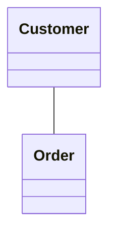

But this doesn't tell us **how many** orders a customer can have. Multiplicity adds that information:

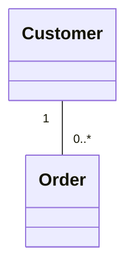

This means:

- One `Customer` can have **zero or more** `Orders`.
- One `Order` is associated with **exactly one** `Customer`.

The goal of this step is to learn how to **derive** multiplicity from requirements rather than guess it.

---

## 1. What Is Multiplicity?

Multiplicity specifies the number of instances that can participate in a relationship.


The relationship tells us `Customer` and `Order` are connected. The multiplicities tell us:

- `Customer` → `0..*` Orders
- `Order` → `1` Customer

Multiplicity therefore adds **business rules** to the relationship.

---

## 2. Why Multiplicity Matters

Without multiplicity:


we only know `Customer` and `Order` are related.

With multiplicity:


we know: *one customer can have zero or more orders*, and *one order belongs to exactly one customer*.

Multiplicity communicates important domain constraints.

---

## 3. Common Multiplicity Notations

| Multiplicity | Meaning |
|---|---|
| `1` | Exactly one |
| `0..1` | Zero or one |
| `0..*` | Zero or many |
| `1..*` | One or many |
| `*` | Many / zero or more |
| `2` | Exactly two |
| `2..5` | Between two and five |

The most commonly used values in LLD interviews are: **`1`**, **`0..1`**, **`0..*`**, **`1..*`**.

---

## 4. Multiplicity as Minimum and Maximum

A useful way to understand multiplicity is as `minimum..maximum`:

| Notation | Minimum | Maximum |
|---|---|---|
| `0..*` | 0 | unlimited |
| `1..*` | 1 | unlimited |
| `0..1` | 0 | 1 |
| `1` | 1 | 1 |

This makes multiplicity much easier to reason about.

---

## 5. `1` — Exactly One

Means **exactly one**.

> **Requirement:** Every order belongs to exactly one customer.


The `1` near `Customer` means: *one Order is associated with exactly one Customer.*

---

## 6. `0..*` — Zero or Many

Means **zero or more**.

> **Requirement:** A customer may have placed no orders yet, or may have placed many orders.


A customer can therefore have 0, 1, 10, or 100 orders — there's no upper limit specified.

---

## 7. `1..*` — One or Many

Means **at least one**.

> **Requirement:** Every order must contain at least one order item.

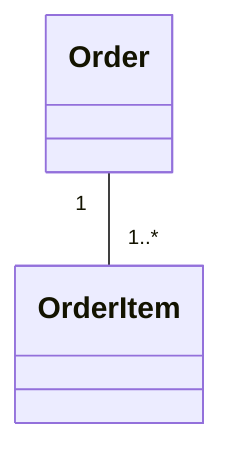

An order containing zero items would violate the stated requirement.

---

## 8. `0..1` — Zero or One

Means **optional, but at most one**.

> **Requirement:** A user may have one profile.

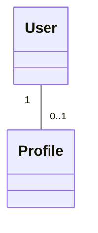

Possible: User A → Profile; User B → no Profile. **Not possible:** User C → Profile 1 *and* Profile 2 — that would violate the multiplicity.

---

## 9. `*` — Many

`*` is shorthand for `0..*` — **zero or more**.

> For clarity, it's often preferable to write `0..*` explicitly, since the minimum is then visible at a glance.

---

## 10. How to Read Multiplicity


The multiplicity near `Order` is `0..*` → *one Customer can be associated with zero or more Orders.*

The multiplicity near `Customer` is `1` → *one Order is associated with exactly one Customer.*

> ⚠️ This rule is extremely important.

**General rule:** For `A "x" -------- "y" B`, the multiplicity **near B** tells us *how many B objects can be associated with one A object.*

---

## 11. The "One Object" Technique

The easiest way to determine multiplicity is to ask:

> **For one object on this side, how many objects can exist on the other side?**

**Example:** `Customer -------- Order`

1. Ask: *For ONE Customer, how many Orders?* → Suppose the answer is `0..*`
2. Ask: *For ONE Order, how many Customers?* → Suppose the answer is `1`


This technique prevents many multiplicity mistakes.

---

## 12. One-to-Many Relationship

> **Requirement:** One department has many employees.

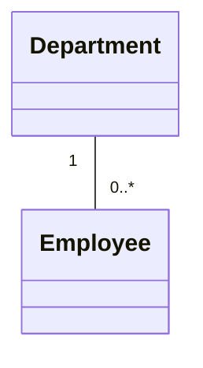

Read in both directions:

- One `Department` → `0..*` Employees
- One `Employee` → `1` Department *(assuming every employee belongs to exactly one department)*

---

## 13. One-to-One Relationship

> **Requirement:** Each person has at most one passport, and each passport belongs to exactly one person.

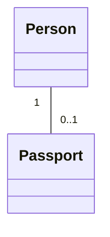

- `Person` → `0..1` Passport
- `Passport` → `1` Person

> Note: one-to-one does not necessarily mean `1` on **both** sides — the actual business rules determine the values.

---

## 14. Optional One-to-One

> **Requirement:** Every employee may have one ID card, but an employee might not have received it yet.

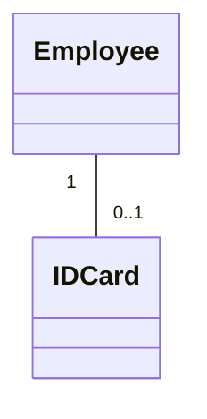

- `Employee` → `0..1` IDCard
- `IDCard` → `1` Employee

The employee's ID card is optional.

---

## 15. Many-to-Many Relationship

> **Requirement:** A student can enroll in multiple courses. A course can have multiple students.

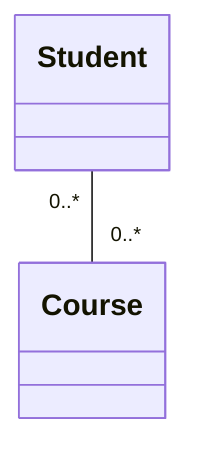

- One `Student` → `0..*` Courses
- One `Course` → `0..*` Students

This is a many-to-many relationship.

---

## 16. Many-to-Many With At Least One

> **Requirement:** Every student must enroll in at least one course, and every course must have at least one student.

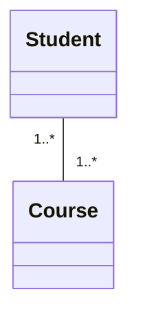

The lower bound changed from `0` to `1`, because zero is no longer allowed.

---

## 17. Multiplicity Comes From Requirements

Multiplicity should be **derived from the actual business requirements**.

> A customer can place orders.

This tells us there's a relationship `Customer → Order` — but does it tell us whether a customer can have zero orders? Not necessarily.

- If a customer can exist before placing an order: `Customer "1" -- "0..*" Order`
- If every customer must have at least one order: `Customer "1" -- "1..*" Order`

The requirement determines the answer.

---

## 18. Useful Requirement Clues

| Requirement phrase | Possible multiplicity |
|---|---|
| exactly one | `1` |
| one | `1` |
| at most one | `0..1` |
| optionally one | `0..1` |
| may have one | `0..1` |
| zero or more | `0..*` |
| many | `0..*` or `1..*`, depending on context |
| multiple | `0..*` or `1..*`, depending on context |
| at least one | `1..*` |
| one or more | `1..*` |
| between 2 and 5 | `2..5` |

> These are **clues, not automatic rules**. The complete requirement must be considered.

---

## 19. "Many" Does Not Automatically Mean `1..*`

> A customer can have many orders.

This does **not** necessarily mean `1..*` — the customer might have zero orders (e.g. a newly registered customer who hasn't purchased anything yet), in which case `0..*` is appropriate.

If the business rule instead says *"Every customer must have at least one order,"* then `1..*` is appropriate.

**Always ask: is zero allowed?**

---

## 20. Shopping Cart Example

> **Requirement:** A shopping cart can contain zero or more products.

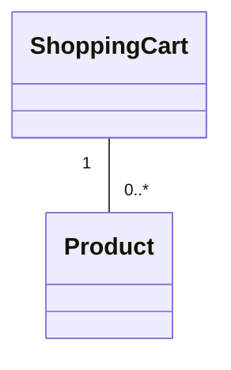

The cart can be empty (minimum = 0, maximum = unlimited), so `0..*` is appropriate.

---

## 21. Order and OrderItem Example

> **Requirement:** Every order must contain at least one order item.


The important value is `1..*`, because zero order items are not allowed.

---

## 22. Customer and Address Example

> **Requirement:** A customer may have one billing address.

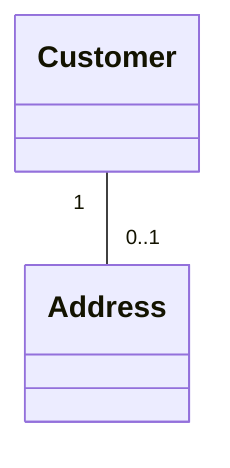

`Customer` → `0..1` Address. The customer may have no billing address yet, but per this requirement cannot have multiple billing addresses.

---

## 23. Teacher and Course Example

> **Requirement:** A teacher can teach multiple courses. Every course is taught by exactly one teacher.

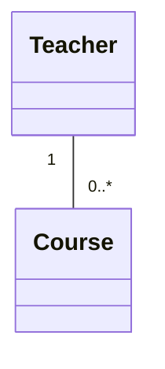

- `Teacher` → `0..*` Course
- `Course` → `1` Teacher

A classic one-to-many relationship.

---

## 24. Student and Course Example

> **Requirement:** A student can enroll in multiple courses. A course can have multiple students.

```mermaid
classDiagram
    Student "0..*" -- "0..*" Course
```

This is many-to-many. *(The database representation of many-to-many relationships is covered later, in UML-to-database mapping.)*

---

## 25. A Reliable Interview Process

1. **Pick one class** — e.g. `Customer`
2. **Ask:** *For one Customer, how many Orders can exist?* → e.g. `0..*`
3. **Reverse the question:** *For one Order, how many Customers can exist?* → e.g. `1`
4. **Draw both multiplicities:**

```mermaid
classDiagram
    Customer "1" -- "0..*" Order
```

This approach is much safer than trying to memorize relationship patterns.

---

## 26. Practice Questions

<details>
<summary><strong>Q1.</strong> "A company has multiple departments. Every department belongs to exactly one company." What is the multiplicity?</summary>

```mermaid
classDiagram
    Company "1" -- "0..*" Department
```

- One `Company` → `0..*` Departments
- One `Department` → exactly `1` Company
</details>

<details>
<summary><strong>Q2.</strong> "Every order must contain at least one item." What is the multiplicity between Order and OrderItem?</summary>

```mermaid
classDiagram
    Order "1" -- "1..*" OrderItem
```

The key value is `1..*`, because at least one item is required.
</details>

<details>
<summary><strong>Q3.</strong> "A user can optionally have a profile. A profile belongs to exactly one user."</summary>

```mermaid
classDiagram
    User "1" -- "0..1" Profile
```

- `User` → `0..1` Profile
- `Profile` → `1` User
</details>

<details>
<summary><strong>Q4.</strong> "A student can enroll in many courses. A course can have many students."</summary>

```mermaid
classDiagram
    Student "0..*" -- "0..*" Course
```

This is a many-to-many relationship.
</details>

<details>
<summary><strong>Q5.</strong> "Each employee has exactly one employee ID."</summary>

```mermaid
classDiagram
    Employee "1" -- "1" EmployeeId
```

Both sides have exactly one.
</details>

<details>
<summary><strong>Q6.</strong> "A customer can have at most one active subscription." What multiplicity should be used?</summary>

**Answer: `0..1`**

```mermaid
classDiagram
    Customer "1" -- "0..1" Subscription
```

"At most one" means minimum = 0, maximum = 1.
</details>

<details>
<summary><strong>Q7.</strong> "Every team must have at least one player."</summary>

```mermaid
classDiagram
    Team "1" -- "1..*" Player
```

"At least one" means minimum = 1, maximum = unlimited → `1..*`
</details>

---

## 27. Common Mistakes

| # | Mistake | Correction |
|---|---|---|
| 1 | Putting multiplicity on the wrong side | The multiplicity **near a class** tells you how many instances of *that* class associate with one instance of the *opposite* class — e.g. in `Customer "1" -- "0..*" Order`, the `0..*` sits next to `Order`, meaning one Customer can have zero or more Orders |
| 2 | Assuming every relationship is `0..*` | Always ask both directions — don't automatically assume many-to-many |
| 3 | Confusing `0..*` and `1..*` | Ask: *can zero exist?* If yes → `0..*`; if no → `1..*` |
| 4 | Using `1` for an optional relationship | If something may not exist, use `0..1` — `1` means exactly one |
| 5 | Treating "many" as automatically `1..*` | The word "many" doesn't tell you if zero is allowed — always check the business rule |

---

## 28. Multiplicity Cheat Sheet

| Notation | Meaning |
|---|---|
| `1` | Exactly one |
| `0..1` | Zero or one |
| `0..*` | Zero or many |
| `1..*` | One or many |
| `*` | Zero or many |
| `2` | Exactly two |
| `2..5` | Between two and five |

---

## 29. Minimum / Maximum Cheat Sheet

| Notation | Minimum | Maximum | Meaning |
|---|---|---|---|
| `1` | 1 | 1 | Exactly one |
| `0..1` | 0 | 1 | Optional, at most one |
| `0..*` | 0 | Unlimited | Zero or many |
| `1..*` | 1 | Unlimited | One or many |
| `2` | 2 | 2 | Exactly two |
| `2..5` | 2 | 5 | Between two and five |

---

## 30. Interview Cheat Sheet

When you see:

```
A –––– B
```

ask:

1. For ONE `A`, how many `B`?
2. For ONE `B`, how many `A`?
3. Is zero allowed?
4. Is there an upper limit?
5. Is the relationship optional or mandatory?

Then determine the appropriate range: `0..1`, `1`, `0..*`, `1..*`, or another.

---

## 31. Final Mental Model

Multiplicity can be reduced to **`minimum..maximum`**:

| Notation | Minimum | Maximum |
|---|---|---|
| `0..1` | 0 | 1 |
| `1` | 1 | 1 |
| `0..*` | 0 | unlimited |
| `1..*` | 1 | unlimited |

The most useful interview technique:

```
Take ONE object
     ↓
Ask how many objects can be associated with it
     ↓
Determine minimum
     ↓
Determine maximum
     ↓
Repeat in the opposite direction
```

The goal is **not** to memorize multiplicity values. The goal is to read a requirement and determine:

> *For one object, how many objects on the other side are allowed or required?*

Once you can answer that question in both directions, choosing multiplicity becomes straightforward.