# Identifying Interfaces from Requirements

## Overview

An interface in UML represents a **contract or capability** that one or more classes agree to provide.

When analyzing requirements, the goal is **not** to create an interface simply because the implementation language supports interfaces. Instead, we ask:

> **Is there a meaningful common capability or contract that multiple classes need to provide?**

If the answer is yes, an interface may be appropriate.

---

## 1. What Is an Interface?

An interface describes **what** a class promises to provide, without focusing on **how** that behavior is implemented.

For example:

- Credit card payment can process a payment.
- PayPal can process a payment.
- UPI can process a payment.

These implementations differ internally, but share a common capability: `processPayment()`. This can be represented with a `PaymentProcessor` interface:

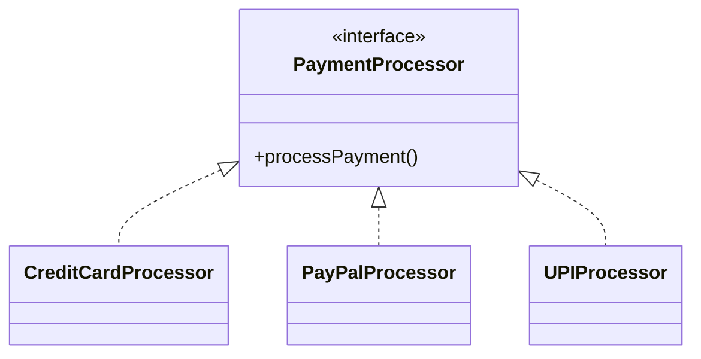

The interface represents the common contract; the concrete classes provide the implementations.

---

## 2. Interface = Contract / Capability

A useful mental model:

> **Interface → What can this object do?**

| Interface | Capability |
|---|---|
| `PaymentProcessor` | Can process payments |
| `NotificationSender` | Can send notifications |
| `Exporter` | Can export data |
| `Storage` | Can store and retrieve data |
| `Printable` | Can print |
| `Refundable` | Can process refunds |

The interface should represent something meaningful in the domain or design.

---

## 3. Interface vs. Generalization

This distinction is **extremely important**.

### Generalization — represents an **IS-A** relationship

> Car is a Vehicle.

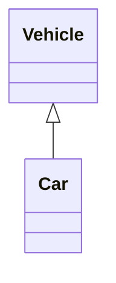

The relationship is based on specialization.

### Interface — generally represents a **CAN-DO / CONTRACT** relationship

> CreditCardProcessor can process payments. PayPalProcessor can process payments. UPIProcessor can process payments.


**Mental model:**

| | |
|---|---|
| Generalization | IS-A |
| Interface | CAN-DO / FOLLOWS-A-CONTRACT |

---

## 4. Identifying Interfaces from Requirements

The main question: **Do multiple classes need to provide the same meaningful capability?**

> **Requirement:** The system supports email, SMS, and push notifications. All notification mechanisms must be able to send a notification.

**Candidate classes:** `EmailNotification`, `SMSNotification`, `PushNotification`
**Common capability:** `send()`
**Candidate interface:** `NotificationSender`

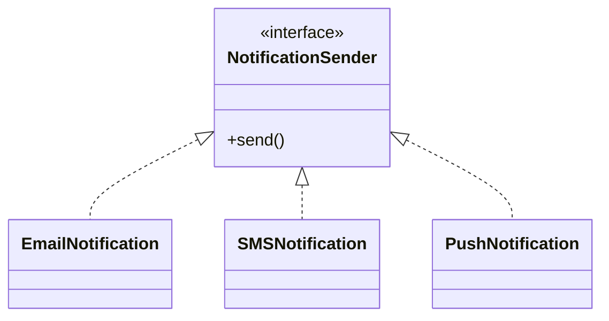

---

## 5. Interface Identification Process

```
Requirement
     ↓
Identify Candidate Classes
     ↓
Look for Common Capability
     ↓
Do Multiple Classes Need That Capability?
     ↓
Is There a Meaningful Contract?
     ↓
       Yes
        ↓
Candidate Interface
        ↓
Connect Implementations Using Realization
```

This prevents us from creating interfaces unnecessarily.

---

## 6. Step 1 — Identify Candidate Classes

> **Requirement:** The system supports credit card, PayPal, and UPI payments.

**Candidate classes:** `CreditCardProcessor`, `PayPalProcessor`, `UPIProcessor`

At this stage, do not immediately create an interface — first understand what these classes have in common.

---

## 7. Step 2 — Find Common Capabilities

**Ask:** What capability is common among these classes?

| Class | Capability |
|---|---|
| `CreditCardProcessor` | `processPayment()` |
| `PayPalProcessor` | `processPayment()` |
| `UPIProcessor` | `processPayment()` |

The common capability is `processPayment()` — this suggests a possible contract.

---

## 8. Step 3 — Determine Whether a Meaningful Contract Exists

The existence of similar methods alone is not always enough. Ask:

> Is this common capability meaningful enough to represent as a contract?

Concepts like `PaymentProcessor`, `NotificationSender`, `Storage`, and `Exporter` represent meaningful capabilities — so interfaces are reasonable candidates for them.

---

## 9. Payment Processor Example

> **Requirement:** The payment system supports credit card, PayPal, and UPI payments. Each payment mechanism must process payments.

**Candidate implementations:** `CreditCardProcessor`, `PayPalProcessor`, `UPIProcessor`
**Common contract:** `processPayment()`

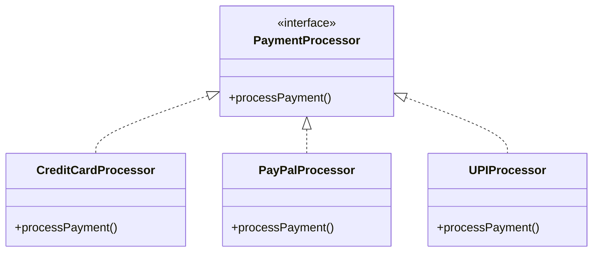

The dashed line with the hollow triangle represents **realization**.

---

## 10. Notification Example

> **Requirement:** The system can send notifications through email, SMS, or push notifications.

**Candidate implementations:** `EmailNotification`, `SMSNotification`, `PushNotification`
**Common capability:** `send()`
**Interface:** `NotificationSender`


The interface captures the common contract without describing implementation details.

---

## 11. Storage Example

> **Requirement:** The application can store data in MySQL, PostgreSQL, or MongoDB.

**Candidate implementations:** `MySQLStorage`, `PostgreSQLStorage`, `MongoDBStorage`
**Common capability:** `save()`, `find()`, `delete()`
**Candidate interface:** `Storage`

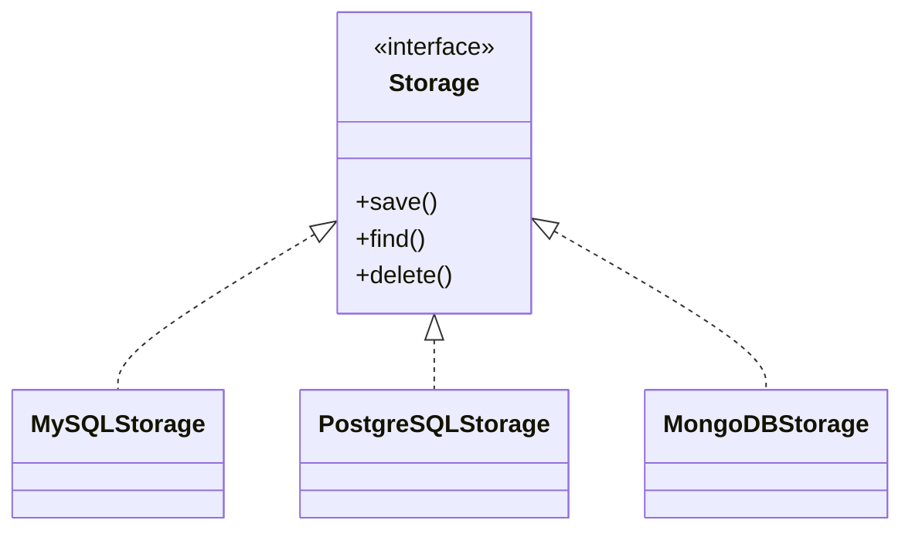

Again, the interface represents the common contract.

---

## 12. Capability-Based Thinking

A very useful way to identify interfaces is to think in terms of capabilities.

Instead of asking *"What classes look similar?"*, ask **"What capability does the system require?"**

> `PDFExporter`, `ExcelExporter`, `CSVExporter` → capability: `export()` → interface: `Exporter`

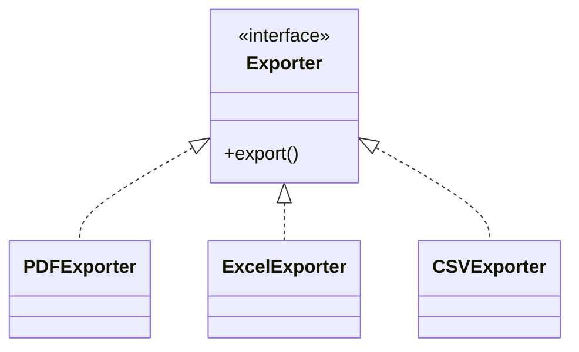

This is generally a better way to reason about interfaces.

---

## 13. Interface Represents a Contract, Not Shared State

An interface is primarily useful for representing a contract or capability. Consider `PaymentProcessor` — the important thing is `processPayment()`.

Different implementations may internally use completely different mechanisms:

- `CreditCardProcessor` → communicates with a card payment provider
- `PayPalProcessor` → communicates with PayPal
- `UPIProcessor` → communicates with a UPI provider

The implementation details differ; the contract (`processPayment()`) remains constant.

---

## 14. Multiple Interfaces

A class can satisfy multiple capabilities. For example, a smart printer may `print()` and `scan()`:

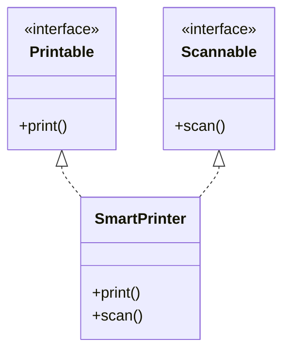

| | |
|---|---|
| `Printable` | One capability |
| `Scannable` | Another capability |
| `SmartPrinter` | Provides both capabilities |

This demonstrates that interfaces can represent separate responsibilities or capabilities.

---

## 15. Interface vs. Abstract Class

This distinction is studied in more detail elsewhere, but the basic UML distinction matters here.

### Interface — think:
- Contract
- Capability
- *What can it do?*

Example: `PaymentProcessor`

### Abstract Class — think:
- Common conceptual base
- Shared state
- Shared behavior
- Specialization

Example: `Vehicle`, with subclasses `Car`, `Truck`, `Motorcycle`

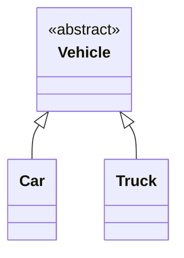

**Simple mental model:**

| Concept | Represents |
|---|---|
| Interface | CAN-DO / CONTRACT |
| Abstract Class | COMMON BASE / SHARED CONCEPT |
| Concrete Class | ACTUAL IMPLEMENTATION |

---

## 16. Do Not Create an Interface Automatically

A common mistake: *"Every class should have an interface."* That is **not** a UML modeling rule.

> **Requirement:** The system has one specific payment implementation.

If there's no meaningful abstraction, no alternate implementation, and no requirement for interchangeable implementations, an interface may not be necessary. Don't introduce `PaymentService` / `PaymentServiceImpl` merely because the programming language allows it — UML modeling should be driven by requirements and design needs.

---

## 17. One Implementation Does Not Automatically Mean No Interface

The opposite extreme is also incorrect. Suppose the current system has only `StripePaymentProcessor`, but the requirements explicitly state:

> The payment mechanism must be replaceable. Other payment providers may be added later.

Then an interface can still be a meaningful design element:

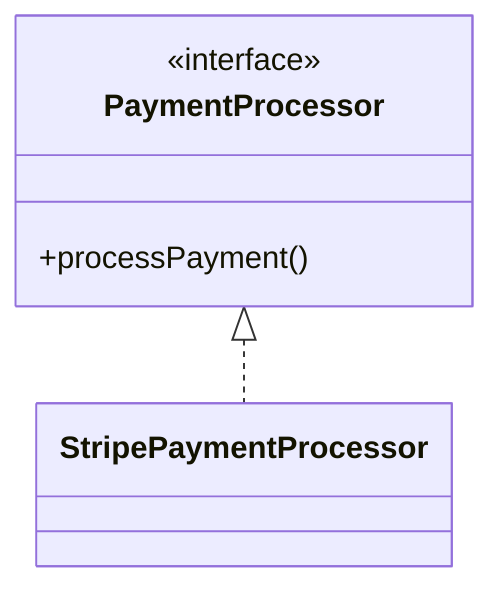

> Interface identification is based on the **required contract and design intent**, not simply the current number of implementations.

---

## 18. Do Not Create Interfaces Just Because Classes Have Similar Names

`Car`, `CarFactory`, `CarService` having related names does not mean an interface is required. Similarly, `OrderService`, `PaymentService`, `UserService` do not automatically imply `OrderServiceInterface`, `PaymentServiceInterface`, `UserServiceInterface`.

Look for an actual contract or capability.

---

## 19. Interface Identification Example

> **Requirement:** The application supports PDF, Excel, and CSV report exports. Each exporter should provide an export operation.

| Step | Result |
|---|---|
| 1. Candidate classes | `PDFExporter`, `ExcelExporter`, `CSVExporter` |
| 2. Common capability | `export()` |
| 3. Common contract | `Exporter` |


---

## 20. UML Interface Notation

An interface is identified using the stereotype `<<interface>>`:

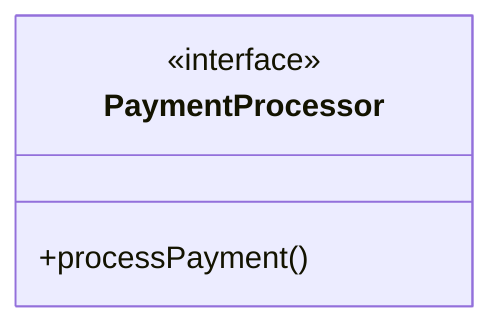

The stereotype explicitly tells us that `PaymentProcessor` is an interface.

---

## 21. Interface Realization

When a class implements an interface, UML uses **realization**. Mermaid notation: `Interface <|.. Implementation`

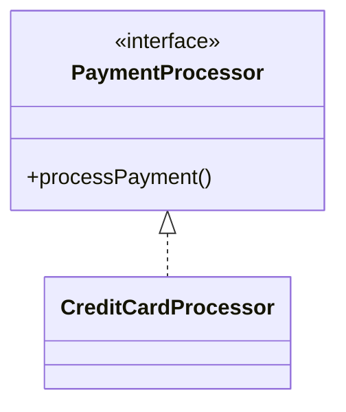

| Notation | Meaning |
|---|---|
| `<\|--` | Generalization |
| `<\|..` | Realization |

So: `Class → Class` = Generalization; `Interface → Class` = Realization.

---

## 22. Generalization vs. Realization

**Generalization:**


*Meaning: Car IS-A Vehicle*

**Realization:**


*Meaning: CreditCardProcessor fulfills the PaymentProcessor contract*

---

## 23. Interface Identification Decision Process

```
Do multiple classes provide
a common capability?
        |
       Yes
        ↓
Is that capability meaningful
as a contract?
        |
       Yes
        ↓
Can the implementations vary?
        |
    Yes / potentially
        ↓
Candidate Interface
```

If there is no meaningful common capability → **no interface needed.**

---

## 24. Common Requirement Clues

| Requirement clue | Possible modeling direction |
|---|---|
| Multiple mechanisms provide the same capability | Interface |
| Multiple providers support the same operation | Interface |
| Different implementations of the same contract | Interface |
| Can send through email/SMS/push | `NotificationSender` |
| Can process different payment methods | `PaymentProcessor` |
| Can export different formats | `Exporter` |
| Can store using different technologies | `Storage` |
| Can print/scan | `Printable` / `Scannable` |

> These are clues, not automatic rules — always validate the semantics of the requirement.

---

## 25. Interface Identification vs. Inheritance

> **Requirement:** `Car`, `Truck`, `Motorcycle` are all types of vehicles.

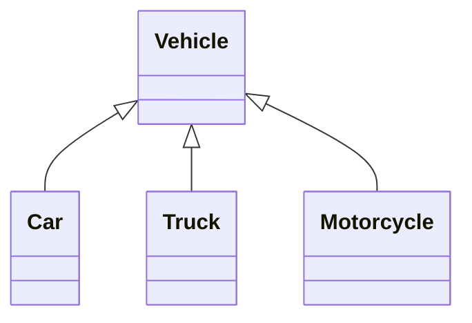
This is **generalization**.

> **Requirement:** `Car`, `Printer`, `Robot` — all of them can print.

The classes are unrelated conceptually, but share a capability:

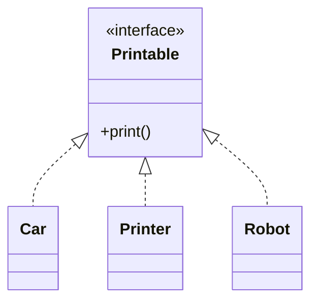

The second situation is a strong example of **capability-based interface modeling**.

---

## 26. Interface Identification Checklist

- [ ] Are there multiple classes involved?
- [ ] Do they provide the same capability?
- [ ] Is that capability meaningful?
- [ ] Is there a common contract?
- [ ] Can implementations differ?
- [ ] Should the implementations be interchangeable?
- [ ] Does the interface represent a useful domain/design concept?
- [ ] Am I creating the interface because of the requirement, or merely because the language supports interfaces?

If most answers point toward a common contract, an interface is a strong candidate.

---

## 27. Practice Questions

<details>
<summary><strong>Q1.</strong> "The application supports email, SMS, and push notifications. All notification mechanisms must send notifications." What interface would you identify?</summary>

**Candidate interface:** `NotificationSender` — operation: `send()`


</details>

<details>
<summary><strong>Q2.</strong> "A car is a type of vehicle." Should we create an interface?</summary>

**No.** This is an IS-A relationship. The appropriate UML relationship is generalization:


</details>

<details>
<summary><strong>Q3.</strong> "Credit card and PayPal payments both support the processPayment operation." What interface could be identified?</summary>

**Candidate interface:** `PaymentProcessor`

```mermaid
classDiagram
    class PaymentProcessor {
        <<interface>>
        +processPayment()
    }
    class CreditCardProcessor
    class PayPalProcessor
    PaymentProcessor <|.. CreditCardProcessor
    PaymentProcessor <|.. PayPalProcessor
```
</details>

<details>
<summary><strong>Q4.</strong> "The system currently has one fixed payment implementation. There is no requirement for multiple payment mechanisms, replacement, or a common contract." Should we automatically create an interface?</summary>

**No.** There isn't enough semantic justification for introducing an interface.

> Do not create an interface merely because the programming language supports interfaces.
</details>

<details>
<summary><strong>Q5.</strong> "A printer can print documents." Is that enough information to create a Printable interface?</summary>

**Not necessarily.** One class having one capability doesn't automatically require an interface.

However, if the requirement becomes *"Printers, PDF generators, and document previewers must all support printing,"* then a `Printable` interface becomes a meaningful candidate.
</details>

<details>
<summary><strong>Q6.</strong> "The system supports PDF, Excel, and CSV exports. All formats provide an export operation." Identify the interface.</summary>

**Candidate interface:** `Exporter`

```mermaid
classDiagram
    class Exporter {
        <<interface>>
        +export()
    }
    class PDFExporter
    class ExcelExporter
    class CSVExporter
    Exporter <|.. PDFExporter
    Exporter <|.. ExcelExporter
    Exporter <|.. CSVExporter
```
</details>

<details>
<summary><strong>Q7.</strong> Which relationship should be used for PaymentProcessor (interface) → CreditCardProcessor?</summary>

**Use realization:** `PaymentProcessor <|.. CreditCardProcessor`

**Not** `PaymentProcessor <|-- CreditCardProcessor`, because `<|--` represents generalization.
</details>

<details>
<summary><strong>Q8.</strong> Consider Vehicle/Car/Truck and PaymentProcessor/CreditCardProcessor/PayPalProcessor. Which relationship applies to each?</summary>

**First (generalization):**
```
Vehicle <|-- Car
Vehicle <|-- Truck
```

**Second (realization):**
```
PaymentProcessor <|.. CreditCardProcessor
PaymentProcessor <|.. PayPalProcessor
```
</details>

---

## 28. Common Mistakes

| # | Mistake | Correction |
|---|---|---|
| 1 | Interface for every class | Create an interface only when there's a meaningful contract or capability |
| 2 | Confusing interface with inheritance | IS-A → Generalization; CAN-DO / CONTRACT → Interface / Realization |
| 3 | Creating interfaces based only on similar names | Similar names don't establish a contract — focus on behavior and capability |
| 4 | Assuming multiple classes automatically require an interface | Ask: do they share a meaningful capability? |
| 5 | Assuming one implementation means no interface | One current implementation doesn't rule out an interface if requirements call for replaceability, interchangeability, or multiple providers |
| 6 | Modeling implementation details too early | Focus on *what capability does the system require*, not Java interfaces, DI, or framework annotations |

---

## 29. Interview Approach

When asked *"Identify interfaces from this requirement,"* a strong reasoning process is:

> First, I identify the candidate classes. Then I look for capabilities that are common across multiple classes. If multiple classes need to provide the same meaningful contract, I model that capability as an interface. The concrete classes then realize that interface.

This demonstrates that you're deriving the UML from the requirement rather than applying patterns mechanically.

---

## 30. Complete Example

Consider an e-commerce payment system.

> **Requirement:** The system supports credit card, PayPal, and UPI payments. The payment mechanism should be interchangeable. Each mechanism must process a payment.

| Step | Result |
|---|---|
| Candidate implementations | `CreditCardProcessor`, `PayPalProcessor`, `UPIProcessor` |
| Common capability | `processPayment()` |
| Contract | `PaymentProcessor` |

```mermaid
classDiagram
    class PaymentProcessor {
        <<interface>>
        +processPayment()
    }
    class CreditCardProcessor {
        +processPayment()
    }
    class PayPalProcessor {
        +processPayment()
    }
    class UPIProcessor {
        +processPayment()
    }
    PaymentProcessor <|.. CreditCardProcessor
    PaymentProcessor <|.. PayPalProcessor
    PaymentProcessor <|.. UPIProcessor
```

**The reasoning chain:**

```
Requirement
     ↓
Payment mechanisms
     ↓
CreditCard / PayPal / UPI
     ↓
Common capability
     ↓
processPayment()
     ↓
Meaningful contract
     ↓
PaymentProcessor interface
     ↓
Realization relationships
```

---

## 31. Important UML Syntax

| Concept | Syntax | Example |
|---|---|---|
| Interface | `<<interface>>` | `class PaymentProcessor { <<interface>> +processPayment() }` |
| Realization | `<\|..` | `PaymentProcessor <\|.. CreditCardProcessor` |
| Generalization | `<\|--` | `Vehicle <\|-- Car` |

---

## 32. Quick Comparison

| Concept | Main Question | UML Relationship |
|---|---|---|
| Generalization | Is-a? | `<\|--` |
| Interface | Can-do / contract? | `<\|..` |
| Association | Are they structurally connected? | `--` |
| Dependency | Does one use another? | `..>` |
| Aggregation | Whole-part, independent lifecycle? | `o--` |
| Composition | Whole-part, dependent lifecycle? | `*--` |

---

## 33. Final Mental Model

```
Requirement
     ↓
Identify Classes
     ↓
Identify Their Responsibilities
     ↓
Look for Common Capabilities
     ↓
Do Multiple Classes Provide That Capability?
     ↓
Is There a Meaningful Contract?
     ↓
       Yes
        ↓
Candidate Interface
        ↓
Concrete Classes Realize Interface
```

| Concept | Represents |
|---|---|
| Interface | Contract / Capability |
| Generalization | IS-A |
| Realization | Class fulfills an interface contract |

---

## 34. Key Takeaways

1. An interface represents a contract or capability.
2. Interfaces are identified from requirements, not from programming-language habits.
3. Look for multiple classes providing a common meaningful capability.
4. `<<interface>>` identifies an interface in UML.
5. `<|..` represents realization.
6. `<|--` represents generalization.
7. Generalization answers *"IS-A?"*
8. Interfaces answer *"CAN-DO / follows a contract?"*
9. A class can realize multiple interfaces.
10. Do not create interfaces automatically for every class.
11. One implementation does not automatically mean an interface is unnecessary.
12. Focus on capabilities and contracts, not language syntax.
13. Interface identification is a semantic modeling decision.
14. The goal is to create an interface only when it communicates something meaningful about the system design.