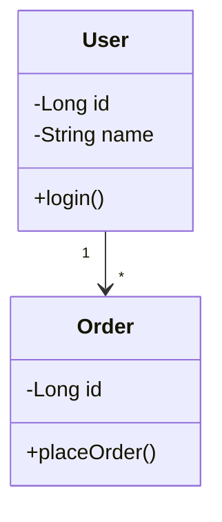

Mermaid Diagram Cheat Sheet

A practical Mermaid reference for UML, LLD, software architecture, backend design, and technical documentation.

⸻

1. Basic Mermaid Structure

Every Mermaid diagram starts with a diagram type.

flowchart TD
A --> B

General format:

diagramType
diagram definition

Common diagram types:

Diagram	Declaration	Main Usage
Flowchart	flowchart TD	Flow/process/architecture
Class	classDiagram	UML / LLD
Sequence	sequenceDiagram	API/service interactions
State	stateDiagram-v2	Object/system states
ER	erDiagram	Database relationships
Journey	journey	User journey
Git	gitGraph	Git workflow
Mindmap	mindmap	Brainstorming
Pie	pie	Simple proportions
Timeline	timeline	Chronological events
Requirement	requirementDiagram	Requirements
C4	C4Context	Architecture diagrams

For LLD, the most important ones are:

classDiagram
sequenceDiagram
stateDiagram-v2
flowchart
erDiagram

⸻

2. Flowchart

Basic

flowchart TD
A --> B
B --> C

TD means:

Top → Down

Other directions:

TD  Top to Bottom
TB  Top to Bottom
BT  Bottom to Top
LR  Left to Right
RL  Right to Left

Example:

flowchart LR
Client --> Controller
Controller --> Service
Service --> Repository
Repository --> Database

⸻

3. Flowchart Nodes

Rectangle

flowchart TD
A[User]

Rounded rectangle

flowchart TD
A(User)

Stadium

flowchart TD
A([Start])

Circle

flowchart TD
A((Process))

Diamond / Decision

flowchart TD
A{Is valid?}

Database

flowchart TD
A[(Database)]

Hexagon

flowchart TD
A{{Service}}

⸻

4. Flowchart Connections

Arrow

flowchart LR
A --> B

Line without arrow

flowchart LR
A --- B

Dotted arrow

flowchart LR
A -.-> B

Thick arrow

flowchart LR
A ==> B

Arrow with label

flowchart LR
A -->|request| B

or:

flowchart LR
A -- request --> B

Dotted connection with label

flowchart LR
A -. dependency .-> B

⸻

5. Flowchart Multiple Connections

flowchart TD
A --> B
A --> C
B --> D
C --> D

Useful for architecture:

flowchart LR
Client --> API
API --> Auth
API --> OrderService
OrderService --> PaymentService
OrderService --> OrderRepository
OrderRepository --> DB

⸻

6. Flowchart Subgraphs

Useful for grouping components.

flowchart TB
subgraph Backend
Controller --> Service
Service --> Repository
end
Client --> Controller
Repository --> Database

With a title:

flowchart TB
subgraph API Layer
Controller
end
subgraph Business Layer
Service
end
subgraph Data Layer
Repository
end
Controller --> Service
Service --> Repository

⸻

7. Flowchart Styling

Class definition

flowchart LR
A[Client]
B[Server]
classDef important font-weight:bold
class A important

For most documentation, avoid excessive styling. Let the diagram remain readable.

⸻

8. Class Diagram — Most Important for LLD

Declaration:

classDiagram

Basic class:

classDiagram
class User

⸻

9. Class Attributes

classDiagram
class User {
Long id
String name
String email
}

⸻

10. Class Methods

classDiagram
class User {
Long id
String name
login()
logout()
updateProfile()
}

⸻

11. Visibility

UML visibility:

+ public
- private
# protected
~ package

Example:

classDiagram
class User {
-Long id
-String name
#String email
+login()
+logout()
}

⸻

12. Method Parameters and Return Types

classDiagram
class PaymentService {
+pay(amount: double) boolean
+refund(paymentId: Long) void
}

Another style:

classDiagram
class User {
+getName() String
+setName(name: String) void
}

⸻

13. Static Members

classDiagram
class Configuration {
{static} +getInstance()
}

⸻

14. Abstract Class

classDiagram
class Animal {
<<abstract>>
+eat()
+makeSound()*
}

* is commonly used to indicate an abstract operation.

⸻

15. Interface

classDiagram
class PaymentService {
<<interface>>
+pay(amount: double)
}

⸻

16. Enum

classDiagram
class PaymentStatus {
<<enumeration>>
PENDING
SUCCESS
FAILED
REFUNDED
}

⸻

17. Relationships — Extremely Important

Association

classDiagram
User --> Order

Meaning:

User knows/uses Order

⸻

18. Association with Multiplicity

classDiagram
User "1" --> "*" Order

Meaning:

One User → Many Orders

Common multiplicities:

"1"
"0..1"
"*"
"0..*"
"1..*"
"2..5"

Examples:

classDiagram
User "1" --> "0..*" Order
Order "1" --> "1" Payment
Order "1" --> "0..1" Coupon

⸻

19. Inheritance / Generalization

classDiagram
Animal <|-- Dog
Animal <|-- Cat

Meaning:

Dog extends Animal
Cat extends Animal

Java:

class Dog extends Animal

⸻

20. Interface Realization

classDiagram
PaymentService <|.. CreditCardPayment
PaymentService <|.. PaypalPayment

Meaning:

CreditCardPayment implements PaymentService
PaypalPayment implements PaymentService

Java:

class CreditCardPayment implements PaymentService

⸻

21. Composition

classDiagram
Order *-- OrderItem

Meaning:

Order owns OrderItem

If the parent is destroyed, the child generally has no independent lifecycle.

Example:

classDiagram
House *-- Room

⸻

22. Aggregation

classDiagram
Department o-- Employee

Meaning:

Department contains Employees

But the Employee can exist independently.

⸻

23. Dependency

classDiagram
OrderService ..> PaymentService

Meaning:

OrderService depends on PaymentService

Typical Java example:

class OrderService {
void placeOrder(PaymentService paymentService) {
}
}

⸻

24. Common UML Relationship Cheat Sheet

Association       -->
Inheritance       <|--
Realization       <|..
Composition       *--
Aggregation       o--
Dependency        ..>

Quick memory:

<|--   extends
<|..   implements
*--    composition
o--    aggregation
-->    association
..>    dependency

⸻

25. Complete LLD Class Diagram Example

classDiagram
class PaymentService {
<<interface>>
+pay(amount: double) boolean
}
class CreditCardPayment {
+pay(amount: double) boolean
}
class UPIPayment {
+pay(amount: double) boolean
}
class OrderService {
-PaymentService paymentService
+placeOrder(order: Order) boolean
}
class Order {
-Long id
-double amount
+getAmount() double
}
PaymentService <|.. CreditCardPayment
PaymentService <|.. UPIPayment
OrderService --> PaymentService
OrderService --> Order

⸻

26. Sequence Diagram

Declaration:

sequenceDiagram

Basic:

sequenceDiagram
Client->>Server: Request
Server-->>Client: Response

⸻

27. Participants

sequenceDiagram
participant C as Client
participant S as Server
C->>S: Request
S-->>C: Response

This makes long names easier to read.

⸻

28. Actor

sequenceDiagram
actor User
participant System
User->>System: Login
System-->>User: Success

⸻

29. Message Types

Solid arrow:

sequenceDiagram
A->>B: Request

Dashed response:

sequenceDiagram
A->>B: Request
B-->>A: Response

Synchronous-style call:

sequenceDiagram
A->>B: Call

Asynchronous-style message:

sequenceDiagram
A-)B: Async message

⸻

30. Activation

sequenceDiagram
Client->>Server: Request
activate Server
Server->>Database: Query
Database-->>Server: Result
deactivate Server
Server-->>Client: Response

⸻

31. Notes

sequenceDiagram
Client->>Server: Request
Note right of Server: Validate request
Server-->>Client: Response

Left:

sequenceDiagram
Note left of Client: User action
Client->>Server: Request

Over participants:

sequenceDiagram
Note over Client,Server: Authentication flow

⸻

32. Loops

sequenceDiagram
Client->>Server: Request
loop Retry
Server->>Database: Query
Database-->>Server: Result
end
Server-->>Client: Response

⸻

33. Alternative / If-Else

sequenceDiagram
Client->>Server: Login
alt Valid credentials
Server-->>Client: Success
else Invalid credentials
Server-->>Client: Failure
end

⸻

34. Optional Flow

sequenceDiagram
Client->>Server: Request
opt Cache hit
Server-->>Client: Cached response
end

⸻

35. Parallel Execution

sequenceDiagram
par Fetch user
Service->>UserDB: Get user
UserDB-->>Service: User
and Fetch orders
Service->>OrderDB: Get orders
OrderDB-->>Service: Orders
end

⸻

36. Sequence Diagram — LLD Example

sequenceDiagram
actor User
participant Controller
participant OrderService
participant PaymentService
participant OrderRepository
User->>Controller: placeOrder(request)
Controller->>OrderService: placeOrder(request)
OrderService->>PaymentService: pay(amount)
alt Payment successful
PaymentService-->>OrderService: success
OrderService->>OrderRepository: save(order)
OrderRepository-->>OrderService: order
OrderService-->>Controller: success
Controller-->>User: 201 Created
else Payment failed
PaymentService-->>OrderService: failure
OrderService-->>Controller: failure
Controller-->>User: 400 Bad Request
end

⸻

37. State Diagram

Declaration:

stateDiagram-v2

Basic:

stateDiagram-v2
[*] --> Pending
Pending --> Processing
Processing --> Completed
Completed --> [*]

[*] represents the initial/final state.

⸻

38. State Transitions

stateDiagram-v2
Pending --> Processing : start
Processing --> Completed : success
Processing --> Failed : error

Format:

StateA --> StateB : event

⸻

39. Composite State

stateDiagram-v2
[*] --> Order
state Order {
[*] --> Created
Created --> Paid
Paid --> Shipped
Shipped --> Delivered
}
Order --> Cancelled

⸻

40. State Diagram — LLD Example

stateDiagram-v2
[*] --> Created
Created --> PaymentPending : checkout
PaymentPending --> Paid : payment success
PaymentPending --> PaymentFailed : payment failure
PaymentFailed --> PaymentPending : retry
Paid --> Shipped : dispatch
Shipped --> Delivered : delivery
Created --> Cancelled : cancel
PaymentPending --> Cancelled : cancel
Delivered --> [*]
Cancelled --> [*]

⸻

41. Entity Relationship Diagram

Declaration:

erDiagram

Basic:

erDiagram
USER ||--o{ ORDER : places

⸻

42. ER Diagram Cardinality

Common symbols:

||     exactly one
o|     zero or one
|{     one or many
o{     zero or many

Examples:

erDiagram
USER ||--o{ ORDER : places
ORDER ||--|{ ORDER_ITEM : contains
PRODUCT ||--o{ ORDER_ITEM : included_in

⸻

43. ER Diagram Attributes

erDiagram
USER {
bigint id PK
varchar name
varchar email UK
}
ORDER {
bigint id PK
bigint user_id FK
decimal amount
}
USER ||--o{ ORDER : places

Common key markers:

PK = Primary Key
FK = Foreign Key
UK = Unique Key

⸻

44. Complete ER Example

erDiagram
USER {
bigint id PK
varchar name
varchar email UK
}
ORDER {
bigint id PK
bigint user_id FK
decimal amount
varchar status
}
ORDER_ITEM {
bigint id PK
bigint order_id FK
bigint product_id FK
int quantity
}
PRODUCT {
bigint id PK
varchar name
decimal price
}
USER ||--o{ ORDER : places
ORDER ||--|{ ORDER_ITEM : contains
PRODUCT ||--o{ ORDER_ITEM : included_in

⸻

45. Git Graph

Useful when documenting Git workflows.

gitGraph
commit
commit
branch feature
checkout feature
commit
checkout main
merge feature
commit

⸻

46. Pie Chart

pie title Technology Usage
"Java" : 40
"JavaScript" : 30
"Python" : 20
"Other" : 10

Not particularly important for LLD, but useful for documentation.

⸻

47. Timeline

timeline
title Project Timeline
2024 : Project started
2025 : Major release
2026 : Migration

⸻

48. Mindmap

mindmap
root((LLD))
OOP
SOLID
Design Patterns
UML
Class Diagram
Sequence Diagram
Activity Diagram
Machine Coding

Useful for study notes.

⸻

49. Architecture Diagram Using Flowchart

For backend architecture, flowchart is often the easiest option.

flowchart LR
Client --> LoadBalancer
LoadBalancer --> API
API --> AuthService
API --> OrderService
OrderService --> PaymentService
OrderService --> OrderRepository
OrderRepository --> Database
PaymentService --> PaymentGateway

⸻

50. Backend Layered Architecture

flowchart TB
subgraph Presentation
Controller
end
subgraph Business
Service
end
subgraph Data
Repository
end
subgraph Storage
Database
end
Controller --> Service
Service --> Repository
Repository --> Database

⸻

51. Microservice Architecture

flowchart LR
Client --> API_Gateway
API_Gateway --> UserService
API_Gateway --> OrderService
API_Gateway --> PaymentService
UserService --> UserDB
OrderService --> OrderDB
PaymentService --> PaymentDB

⸻

52. Comments

Comments can be written using:

flowchart LR
%% This is a comment
A --> B

Use comments to explain complex sections of your diagram source.

⸻

53. IDs vs Display Text

This:

flowchart LR
UserService --> PaymentService

uses IDs as display names.

You can separate ID and display text:

flowchart LR
US[User Service] --> PS[Payment Service]

US and PS are IDs.

User Service and Payment Service are displayed labels.

This is very useful for large diagrams.

⸻

54. Special Characters / Quotes

When labels contain characters that can confuse Mermaid, use quotes where supported:

flowchart LR
A["POST /api/orders"] --> B["Order Service"]

For flowcharts, square brackets are also commonly used:

flowchart LR
A["User"]
B["Order Service"]

⸻

55. Line Breaks in Labels

For flowchart labels:

flowchart TD
A["User<br/>Service"]

This displays the label over multiple lines.

Use this sparingly.

⸻

56. Clickable Links

Mermaid can support links in certain diagram types/configurations.

Example:

flowchart LR
A[Google]
click A "https://google.com"

For documentation, don’t overuse clickable diagrams.

⸻

57. Useful Special Characters

Class Diagram

+ public
- private
# protected
~ package

Relationships

--> association
<|-- inheritance
<|.. realization
*-- composition
o-- aggregation
..> dependency

Flowchart

--> arrow
--- line
-.-> dotted
==> thick

⸻

58. UML Relationship Quick Reference

classDiagram
class A
class B
A --> B : association
A ..> B : dependency
A o-- B : aggregation
A *-- B : composition
A <|-- B : inheritance
A <|.. B : realization

Think:

A --> B      A uses/knows B
A ..> B      A depends on B
A o-- B      A aggregates B
A *-- B      A owns B
A <|-- B     B extends A
A <|.. B     B implements A

⸻

59. Recommended Diagram Type by Problem

Requirement	Use
Classes and relationships	classDiagram
Object interactions	sequenceDiagram
Object lifecycle	stateDiagram-v2
Business/process flow	flowchart
Database design	erDiagram
System architecture	flowchart
User journey	journey
Git workflow	gitGraph
Study topics	mindmap
Timeline	timeline

⸻

60. LLD Diagram Workflow

When solving an LLD problem, don’t automatically create every diagram.

A practical workflow is:

flowchart TD
A[Understand Requirements]
B[Identify Entities]
C[Identify Responsibilities]
D[Identify Relationships]
E[Create Class Diagram]
F[Create Sequence Diagram]
G[Implement Java Classes]
H[Review Design]
A --> B
B --> C
C --> D
D --> E
E --> F
F --> G
G --> H

Usually:

Class Diagram
↓
Sequence Diagram
↓
Java Implementation

is enough for many LLD exercises.

⸻

61. Complete LLD Example

Class Diagram

classDiagram
class PaymentService {
<<interface>>
+pay(amount: double) boolean
}
class CreditCardPayment {
+pay(amount: double) boolean
}
class UPIPayment {
+pay(amount: double) boolean
}
class OrderService {
-PaymentService paymentService
+placeOrder(order: Order) boolean
}
class Order {
-Long id
-double amount
+getAmount() double
}
PaymentService <|.. CreditCardPayment
PaymentService <|.. UPIPayment
OrderService --> PaymentService
OrderService --> Order

Sequence Diagram

sequenceDiagram
actor User
participant Controller
participant OrderService
participant PaymentService
participant Repository
User->>Controller: placeOrder(request)
Controller->>OrderService: placeOrder(request)
OrderService->>PaymentService: pay(amount)
alt Payment successful
PaymentService-->>OrderService: success
OrderService->>Repository: save(order)
Repository-->>OrderService: saved order
OrderService-->>Controller: success
Controller-->>User: 201 Created
else Payment failed
PaymentService-->>OrderService: failure
OrderService-->>Controller: failure
Controller-->>User: 400 Bad Request
end

⸻

62. Mermaid in README.md

The most common GitHub/Markdown format is:



Important:

```mermaid

not:

```text

The word mermaid tells the Markdown renderer to interpret the block as a Mermaid diagram.

⸻

63. VS Code Markdown Preview

Open the Markdown preview using:

⌘ + Shift + V

Or:

⌘ + K
then
V

Example:

# UML
```mermaid
classDiagram
    User --> Order
```

VS Code renders the Mermaid diagram in the Markdown preview.

⸻

64. Mermaid Best Practices

Keep diagrams readable

Prefer:

flowchart LR
Client --> Controller
Controller --> Service
Service --> Repository
Repository --> DB

instead of putting 30+ components into one diagram.

⸻

Use meaningful names

Prefer:

OrderService
PaymentService
OrderRepository

over:

A
B
C

⸻

Don’t over-document

For an LLD problem, you generally don’t need:

Class Diagram
+
Sequence Diagram
+
Activity Diagram
+
State Diagram
+
Component Diagram
+
Deployment Diagram

unless the problem actually requires them.

Start with:

Class Diagram
+
Sequence Diagram

and add another diagram only when it provides useful information.

⸻

65. Most Important Syntax to Memorize

If you remember nothing else, remember this.

Class Diagram

classDiagram
class A
class B
A --> B
A <|-- B
A <|.. B
A *-- B
A o-- B
A ..> B

Meaning:

-->   Association
<|--  Inheritance
<|..  Implementation
*--   Composition
o--   Aggregation
..>   Dependency

⸻

Sequence Diagram

sequenceDiagram
actor User
participant Service
User->>Service: Request
Service-->>User: Response
alt Condition
Service-->>User: Success
else
Service-->>User: Failure
end

⸻

State Diagram

stateDiagram-v2
[*] --> Created
Created --> Processing
Processing --> Completed
Processing --> Failed
Failed --> Processing
Completed --> [*]

⸻

Flowchart

flowchart LR
A[Client] --> B[Controller]
B --> C[Service]
C --> D[Repository]
D --> E[(Database)]

⸻

ER Diagram

erDiagram
USER ||--o{ ORDER : places
ORDER ||--|{ ORDER_ITEM : contains

⸻

66. Quick Decision Guide

When you ask yourself:

“Which Mermaid diagram should I use?”

Use this:

Do I want to show classes?
↓
classDiagram
Do I want to show interaction between objects?
↓
sequenceDiagram
Do I want to show lifecycle/state changes?
↓
stateDiagram-v2
Do I want to show a process or architecture?
↓
flowchart
Do I want to show database relationships?
↓
erDiagram

⸻

67. LLD Cheat Sheet

For Java LLD, these are the Mermaid constructs you will use most frequently:

classDiagram
class ClassName
class ClassName {
-privateField: Type
#protectedField: Type
+publicField: Type
+publicMethod()
-privateMethod()
}
Interface <|.. Implementation
Parent <|-- Child
ClassA --> ClassB
ClassA ..> ClassB
ClassA *-- ClassB
ClassA o-- ClassB
ClassA "1" --> "*" ClassB

And for interactions:

sequenceDiagram
actor User
participant Controller
participant Service
participant Repository
User->>Controller: request
Controller->>Service: method()
Service->>Repository: query()
Repository-->>Service: result
Service-->>Controller: response
Controller-->>User: response

⸻

68. Final 80–90% Reference

============================================================
MERMAID FOR LLD
============================================================
CLASS DIAGRAM
------------------------------------------------------------
classDiagram
class User {
-Long id
-String name
+login()
}
class Order {
-Long id
+placeOrder()
}
User "1" --> "*" Order
RELATIONSHIPS
------------------------------------------------------------
A --> B       Association
A <|-- B     Inheritance
A <|.. B     Realization / implements
A *-- B      Composition
A o-- B      Aggregation
A ..> B      Dependency
VISIBILITY
------------------------------------------------------------
+ public
- private
# protected
~ package
MULTIPLICITY
------------------------------------------------------------
"1"       exactly one
"0..1"    zero or one
"*"       many
"0..*"    zero or many
"1..*"    one or many
"2..5"    two to five
INTERFACE
------------------------------------------------------------
class PaymentService {
<<interface>>
+pay()
}
ABSTRACT CLASS
------------------------------------------------------------
class Animal {
<<abstract>>
+eat()
+makeSound()*
}
ENUM
------------------------------------------------------------
class Status {
<<enumeration>>
PENDING
SUCCESS
FAILED
}
SEQUENCE DIAGRAM
------------------------------------------------------------
sequenceDiagram
actor User
participant Controller
participant Service
User->>Controller: request
Controller->>Service: method()
Service-->>Controller: response
Controller-->>User: response
ALTERNATIVE
------------------------------------------------------------
alt Success
Service-->>User: Success
else Failure
Service-->>User: Failure
end
LOOP
------------------------------------------------------------
loop Retry
Service->>Repository: query()
end
PARALLEL
------------------------------------------------------------
par
Service->>UserDB: getUser()
and
Service->>OrderDB: getOrders()
end
STATE DIAGRAM
------------------------------------------------------------
stateDiagram-v2
[*] --> Created
Created --> Processing
Processing --> Completed
Processing --> Failed
Failed --> Processing
Completed --> [*]
FLOWCHART
------------------------------------------------------------
flowchart LR
Client --> Controller
Controller --> Service
Service --> Repository
Repository --> Database
DIRECTIONS
------------------------------------------------------------
TD   Top → Down
TB   Top → Bottom
BT   Bottom → Top
LR   Left → Right
RL   Right → Left
FLOWCHART SHAPES
------------------------------------------------------------
A[Rectangle]
A(Rounded)
A([Stadium])
A((Circle))
A{Decision}
A[(Database)]
A{{Hexagon}}
FLOWCHART CONNECTIONS
------------------------------------------------------------
A --> B       Arrow
A --- B       Line
A -.-> B      Dotted
A ==> B       Thick
A -->|text| B Label
SUBGRAPH
------------------------------------------------------------
subgraph Backend
Controller --> Service
Service --> Repository
end
ER DIAGRAM
------------------------------------------------------------
erDiagram
USER ||--o{ ORDER : places
ORDER ||--|{ ORDER_ITEM : contains
Cardinality:
||   exactly one
o|   zero or one
|{   one or many
o{   zero or many
README
------------------------------------------------------------
```mermaid
classDiagram
    class User

VS CODE PREVIEW

⌘ + Shift + V

or

⌘ + K → V

============================================================
LLD PRIORITY

1. classDiagram       ★★★★★
2. sequenceDiagram    ★★★★★
3. flowchart          ★★★★
4. stateDiagram-v2    ★★★
5. erDiagram          ★★★
6. gitGraph           ★
7. mindmap            ★

============================================================

---
# 69. Recommended Learning Order
For UML + Java LLD, learn Mermaid in this order:
```text
1. classDiagram
       ↓
2. Relationships
       ↓
3. Multiplicity
       ↓
4. sequenceDiagram
       ↓
5. stateDiagram-v2
       ↓
6. flowchart
       ↓
7. erDiagram
       ↓
8. Other Mermaid diagrams as needed

The Mermaid syntax is secondary.

The primary goal is understanding:

UML
 ↓
Design
 ↓
Relationships
 ↓
Responsibilities
 ↓
Interactions
 ↓
Java implementation

Once these concepts are clear, Mermaid becomes just the notation used to communicate your design.