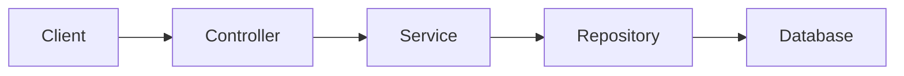
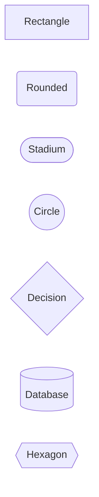
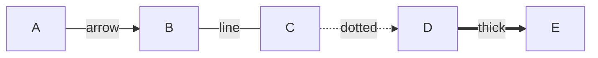
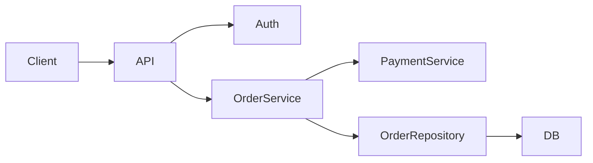
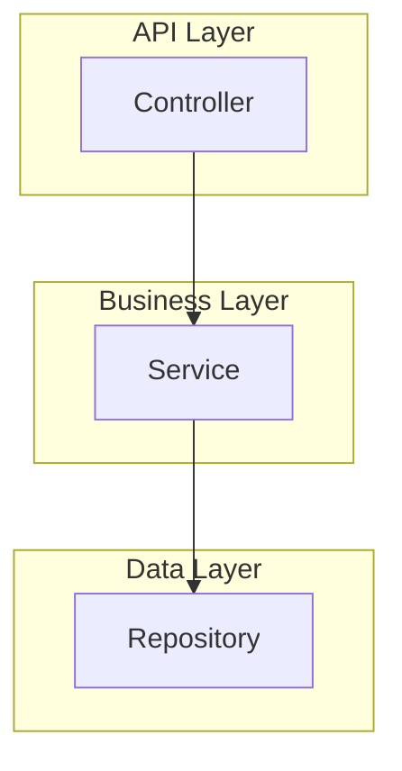
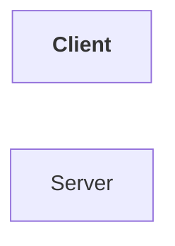
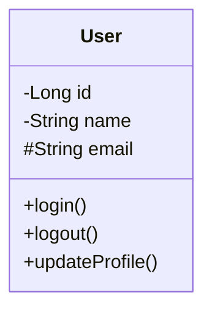
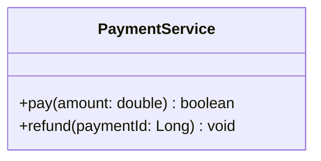

# Mermaid Diagram Guide

A README-style guide to writing Mermaid diagrams for UML, low-level design (LLD), architecture, and technical documentation. Every example shows **the code you write**, followed by **what it renders as**.

---

## Table of Contents

1. [How Mermaid Works](#1-how-mermaid-works)
2. [Flowcharts](#2-flowcharts)
3. [Class Diagrams](#3-class-diagrams)
4. [Class Relationships](#4-class-relationships)
5. [Sequence Diagrams](#5-sequence-diagrams)
6. [State Diagrams](#6-state-diagrams)
7. [Entity-Relationship Diagrams](#7-entity-relationship-diagrams)
8. [Other Diagram Types](#8-other-diagram-types)
9. [Architecture Diagrams](#9-architecture-diagrams)
10. [Syntax Tips](#10-syntax-tips)
11. [Embedding in Markdown](#11-embedding-in-markdown)
12. [Quick Reference](#12-quick-reference)

---

## 1. How Mermaid Works

To write a diagram, wrap it in a fenced code block labeled `mermaid`. Inside, you always start with a **diagram type**, then define the diagram body.

**How to write it:**
```

```

**What it renders as:**


### Diagram Types

| Diagram | Declaration | Main Use |
|---|---|---|
| Flowchart | `flowchart TD` | Flow / process / architecture |
| Class | `classDiagram` | UML / LLD |
| Sequence | `sequenceDiagram` | API / service interactions |
| State | `stateDiagram-v2` | Object / system states |
| Entity-Relationship | `erDiagram` | Database relationships |
| Journey | `journey` | User journey |
| Git | `gitGraph` | Git workflow |
| Mindmap | `mindmap` | Brainstorming |
| Pie | `pie` | Simple proportions |
| Timeline | `timeline` | Chronological events |

**For LLD work, focus on:** `classDiagram`, `sequenceDiagram`, `stateDiagram-v2`, `flowchart`, `erDiagram`

---

## 2. Flowcharts

### Writing Direction

To control which way the diagram flows, put a direction code after `flowchart`.

**How to write it:**
```

```

**What it renders as:**


| Code | Direction |
|---|---|
| `TD` / `TB` | Top → Bottom |
| `BT` | Bottom → Top |
| `LR` | Left → Right |
| `RL` | Right → Left |

### Writing Different Node Shapes

The brackets around a node name control its shape.

**How to write it:**
```

```

**What it renders as:**


### Writing Different Connection Styles

**How to write it:**
```

```

**What it renders as:**


### Writing a Diagram with Multiple Branches

**How to write it:**
```

```

**What it renders as:**


### Writing Subgraphs (Grouping Nodes)

To group related nodes visually, wrap them in `subgraph ... end`.

**How to write it:**
```

```

**What it renders as:**


### Writing Basic Styling

**How to write it:**
```

```

**What it renders as:**


> Keep styling minimal — readability matters more than decoration.

---

## 3. Class Diagrams

### Writing a Class with Fields and Methods

**How to write it:**
```

```

**What it renders as:**


**Visibility symbols:**

| Symbol | Meaning |
|---|---|
| `+` | Public |
| `-` | Private |
| `#` | Protected |
| `~` | Package |

### Writing Method Signatures with Types

**How to write it:**
```

```

**What it renders as:**


### Writing Static Members

**How to write it:**
```
```mermaid
classDiagram
    class Configuration {
        {static} +getInstance()
    }
```
```

**What it renders as:**
```mermaid
classDiagram
    class Configuration {
        {static} +getInstance()
    }
```

### Writing Abstract Classes and Interfaces

Use `<<abstract>>` or `<<interface>>` as the first line inside the class body. A trailing `*` marks an abstract method.

**How to write it:**
```
```mermaid
classDiagram
    class Animal {
        <<abstract>>
        +eat()
        +makeSound()*
    }
    class PaymentService {
        <<interface>>
        +pay(amount: double)
    }
```
```

**What it renders as:**
```mermaid
classDiagram
    class Animal {
        <<abstract>>
        +eat()
        +makeSound()*
    }
    class PaymentService {
        <<interface>>
        +pay(amount: double)
    }
```

### Writing an Enum

**How to write it:**
```
```mermaid
classDiagram
    class PaymentStatus {
        <<enumeration>>
        PENDING
        SUCCESS
        FAILED
        REFUNDED
    }
```
```

**What it renders as:**
```mermaid
classDiagram
    class PaymentStatus {
        <<enumeration>>
        PENDING
        SUCCESS
        FAILED
        REFUNDED
    }
```

---

## 4. Class Relationships

This is the syntax that most often trips people up — how you draw the line between two classes changes what it means.

| Relationship | Syntax | Meaning | Java Equivalent |
|---|---|---|---|
| Association | `A --> B` | A knows/uses B | field reference |
| Inheritance | `A <\|-- B` | B extends A | `class B extends A` |
| Realization | `A <\|.. B` | B implements A | `class B implements A` |
| Composition | `A *-- B` | A owns B (B can't exist without A) | strong ownership |
| Aggregation | `A o-- B` | A contains B (B exists independently) | weak ownership |
| Dependency | `A ..> B` | A depends on B (e.g., method param) | parameter/local use |

### Writing Each Relationship Type

**How to write it:**
```
```mermaid
classDiagram
    class A
    class B
    A --> B : association
    A ..> B : dependency
    A o-- B : aggregation
    A *-- B : composition
    A <|-- B : inheritance
    A <|.. B : realization
```
```

**What it renders as:**
```mermaid
classDiagram
    class A
    class B
    A --> B : association
    A ..> B : dependency
    A o-- B : aggregation
    A *-- B : composition
    A <|-- B : inheritance
    A <|.. B : realization
```

### Writing Multiplicity (Cardinality)

Add quoted numbers before the relationship to say "how many" on each side.

**How to write it:**
```
```mermaid
classDiagram
    User "1" --> "0..*" Order
    Order "1" --> "1" Payment
    Order "1" --> "0..1" Coupon
```
```

**What it renders as:**
```mermaid
classDiagram
    User "1" --> "0..*" Order
    Order "1" --> "1" Payment
    Order "1" --> "0..1" Coupon
```

| Notation | Meaning |
|---|---|
| `"1"` | Exactly one |
| `"0..1"` | Zero or one |
| `"*"` | Many |
| `"0..*"` | Zero or many |
| `"1..*"` | One or many |
| `"2..5"` | Two to five |

### Writing a Full LLD Class Diagram

**How to write it:**
```
```mermaid
classDiagram
    class PaymentService {
        <<interface>>
        +pay(amount: double) boolean
    }
    class CreditCardPayment {
        +pay(amount: double) boolean
    }
    class UPIPayment {
        +pay(amount: double) boolean
    }
    class OrderService {
        -PaymentService paymentService
        +placeOrder(order: Order) boolean
    }
    class Order {
        -Long id
        -double amount
        +getAmount() double
    }
    PaymentService <|.. CreditCardPayment
    PaymentService <|.. UPIPayment
    OrderService --> PaymentService
    OrderService --> Order
```
```

**What it renders as:**
```mermaid
classDiagram
    class PaymentService {
        <<interface>>
        +pay(amount: double) boolean
    }
    class CreditCardPayment {
        +pay(amount: double) boolean
    }
    class UPIPayment {
        +pay(amount: double) boolean
    }
    class OrderService {
        -PaymentService paymentService
        +placeOrder(order: Order) boolean
    }
    class Order {
        -Long id
        -double amount
        +getAmount() double
    }
    PaymentService <|.. CreditCardPayment
    PaymentService <|.. UPIPayment
    OrderService --> PaymentService
    OrderService --> Order
```

---

## 5. Sequence Diagrams

### Writing Participants

Use `participant X as Y` to give a long name a short, readable label. Use `actor` instead of `participant` for a human user.

**How to write it:**
```
```mermaid
sequenceDiagram
    actor User
    participant S as Server
    User->>S: Login
    S-->>User: Success
```
```

**What it renders as:**
```mermaid
sequenceDiagram
    actor User
    participant S as Server
    User->>S: Login
    S-->>User: Success
```

### Writing Message Types

| Syntax | Meaning |
|---|---|
| `A->>B: msg` | Solid arrow (call) |
| `A-->>B: msg` | Dashed arrow (response) |
| `A-)B: msg` | Async message |

**How to write it:**
```
```mermaid
sequenceDiagram
    A->>B: Request (solid)
    B-->>A: Response (dashed)
    A-)B: Fire-and-forget (async)
```
```

**What it renders as:**
```mermaid
sequenceDiagram
    A->>B: Request (solid)
    B-->>A: Response (dashed)
    A-)B: Fire-and-forget (async)
```

### Writing Activation Bars

`activate` / `deactivate` show how long a participant is "busy" handling a call.

**How to write it:**
```
```mermaid
sequenceDiagram
    Client->>Server: Request
    activate Server
    Server->>Database: Query
    Database-->>Server: Result
    deactivate Server
    Server-->>Client: Response
```
```

**What it renders as:**
```mermaid
sequenceDiagram
    Client->>Server: Request
    activate Server
    Server->>Database: Query
    Database-->>Server: Result
    deactivate Server
    Server-->>Client: Response
```

### Writing Notes

**How to write it:**
```
```mermaid
sequenceDiagram
    Client->>Server: Request
    Note right of Server: Validate request
    Server-->>Client: Response
```
```

**What it renders as:**
```mermaid
sequenceDiagram
    Client->>Server: Request
    Note right of Server: Validate request
    Server-->>Client: Response
```

Variants: `Note left of X`, `Note right of X`, `Note over X,Y`.

### Writing a Loop

**How to write it:**
```
```mermaid
sequenceDiagram
    Client->>Server: Request
    loop Retry
        Server->>Database: Query
        Database-->>Server: Result
    end
    Server-->>Client: Response
```
```

**What it renders as:**
```mermaid
sequenceDiagram
    Client->>Server: Request
    loop Retry
        Server->>Database: Query
        Database-->>Server: Result
    end
    Server-->>Client: Response
```

### Writing Alternative Paths (if / else)

**How to write it:**
```
```mermaid
sequenceDiagram
    Client->>Server: Login
    alt Valid credentials
        Server-->>Client: Success
    else Invalid credentials
        Server-->>Client: Failure
    end
```
```

**What it renders as:**
```mermaid
sequenceDiagram
    Client->>Server: Login
    alt Valid credentials
        Server-->>Client: Success
    else Invalid credentials
        Server-->>Client: Failure
    end
```

### Writing an Optional Step

**How to write it:**
```
```mermaid
sequenceDiagram
    Client->>Server: Request
    opt Cache hit
        Server-->>Client: Cached response
    end
```
```

**What it renders as:**
```mermaid
sequenceDiagram
    Client->>Server: Request
    opt Cache hit
        Server-->>Client: Cached response
    end
```

### Writing Parallel Actions

**How to write it:**
```
```mermaid
sequenceDiagram
    par Fetch user
        Service->>UserDB: Get user
        UserDB-->>Service: User
    and Fetch orders
        Service->>OrderDB: Get orders
        OrderDB-->>Service: Orders
    end
```
```

**What it renders as:**
```mermaid
sequenceDiagram
    par Fetch user
        Service->>UserDB: Get user
        UserDB-->>Service: User
    and Fetch orders
        Service->>OrderDB: Get orders
        OrderDB-->>Service: Orders
    end
```

### Writing a Full LLD Sequence Diagram

**How to write it:**
```
```mermaid
sequenceDiagram
    actor User
    participant Controller
    participant OrderService
    participant PaymentService
    participant OrderRepository
    User->>Controller: placeOrder(request)
    Controller->>OrderService: placeOrder(request)
    OrderService->>PaymentService: pay(amount)
    alt Payment successful
        PaymentService-->>OrderService: success
        OrderService->>OrderRepository: save(order)
        OrderRepository-->>OrderService: order
        OrderService-->>Controller: success
        Controller-->>User: 201 Created
    else Payment failed
        PaymentService-->>OrderService: failure
        OrderService-->>Controller: failure
        Controller-->>User: 400 Bad Request
    end
```
```

**What it renders as:**
```mermaid
sequenceDiagram
    actor User
    participant Controller
    participant OrderService
    participant PaymentService
    participant OrderRepository
    User->>Controller: placeOrder(request)
    Controller->>OrderService: placeOrder(request)
    OrderService->>PaymentService: pay(amount)
    alt Payment successful
        PaymentService-->>OrderService: success
        OrderService->>OrderRepository: save(order)
        OrderRepository-->>OrderService: order
        OrderService-->>Controller: success
        Controller-->>User: 201 Created
    else Payment failed
        PaymentService-->>OrderService: failure
        OrderService-->>Controller: failure
        Controller-->>User: 400 Bad Request
    end
```

---

## 6. State Diagrams

### Writing Basic States and Transitions

`[*]` represents the initial/final state. The format is `StateA --> StateB : event`.

**How to write it:**
```
```mermaid
stateDiagram-v2
    [*] --> Pending
    Pending --> Processing : start
    Processing --> Completed : success
    Processing --> Failed : error
    Completed --> [*]
```
```

**What it renders as:**
```mermaid
stateDiagram-v2
    [*] --> Pending
    Pending --> Processing : start
    Processing --> Completed : success
    Processing --> Failed : error
    Completed --> [*]
```

### Writing a Composite (Nested) State

**How to write it:**
```
```mermaid
stateDiagram-v2
    [*] --> Order
    state Order {
        [*] --> Created
        Created --> Paid
        Paid --> Shipped
        Shipped --> Delivered
    }
    Order --> Cancelled
```
```

**What it renders as:**
```mermaid
stateDiagram-v2
    [*] --> Order
    state Order {
        [*] --> Created
        Created --> Paid
        Paid --> Shipped
        Shipped --> Delivered
    }
    Order --> Cancelled
```

### Writing a Full LLD State Diagram

**How to write it:**
```
```mermaid
stateDiagram-v2
    [*] --> Created
    Created --> PaymentPending : checkout
    PaymentPending --> Paid : payment success
    PaymentPending --> PaymentFailed : payment failure
    PaymentFailed --> PaymentPending : retry
    Paid --> Shipped : dispatch
    Shipped --> Delivered : delivery
    Created --> Cancelled : cancel
    PaymentPending --> Cancelled : cancel
    Delivered --> [*]
    Cancelled --> [*]
```
```

**What it renders as:**
```mermaid
stateDiagram-v2
    [*] --> Created
    Created --> PaymentPending : checkout
    PaymentPending --> Paid : payment success
    PaymentPending --> PaymentFailed : payment failure
    PaymentFailed --> PaymentPending : retry
    Paid --> Shipped : dispatch
    Shipped --> Delivered : delivery
    Created --> Cancelled : cancel
    PaymentPending --> Cancelled : cancel
    Delivered --> [*]
    Cancelled --> [*]
```

---

## 7. Entity-Relationship Diagrams

### Writing Cardinality Between Tables

| Symbol | Meaning |
|---|---|
| `\|\|` | Exactly one |
| `o\|` | Zero or one |
| `\|{` | One or many |
| `o{` | Zero or many |

**How to write it:**
```
```mermaid
erDiagram
    USER ||--o{ ORDER : places
    ORDER ||--|{ ORDER_ITEM : contains
    PRODUCT ||--o{ ORDER_ITEM : included_in
```
```

**What it renders as:**
```mermaid
erDiagram
    USER ||--o{ ORDER : places
    ORDER ||--|{ ORDER_ITEM : contains
    PRODUCT ||--o{ ORDER_ITEM : included_in
```

### Writing Table Attributes and Keys

Key markers: `PK` = Primary Key, `FK` = Foreign Key, `UK` = Unique Key.

**How to write it:**
```
```mermaid
erDiagram
    USER {
        bigint id PK
        varchar name
        varchar email UK
    }
    ORDER {
        bigint id PK
        bigint user_id FK
        decimal amount
        varchar status
    }
    USER ||--o{ ORDER : places
```
```

**What it renders as:**
```mermaid
erDiagram
    USER {
        bigint id PK
        varchar name
        varchar email UK
    }
    ORDER {
        bigint id PK
        bigint user_id FK
        decimal amount
        varchar status
    }
    USER ||--o{ ORDER : places
```

---

## 8. Other Diagram Types

### Writing a Git Graph

**How to write it:**
```
```mermaid
gitGraph
    commit
    commit
    branch feature
    checkout feature
    commit
    checkout main
    merge feature
    commit
```
```

**What it renders as:**
```mermaid
gitGraph
    commit
    commit
    branch feature
    checkout feature
    commit
    checkout main
    merge feature
    commit
```

### Writing a Pie Chart

**How to write it:**
```
```mermaid
pie title Technology Usage
    "Java" : 40
    "JavaScript" : 30
    "Python" : 20
    "Other" : 10
```
```

**What it renders as:**
```mermaid
pie title Technology Usage
    "Java" : 40
    "JavaScript" : 30
    "Python" : 20
    "Other" : 10
```

### Writing a Timeline

**How to write it:**
```
```mermaid
timeline
    title Project Timeline
    2024 : Project started
    2025 : Major release
    2026 : Migration
```
```

**What it renders as:**
```mermaid
timeline
    title Project Timeline
    2024 : Project started
    2025 : Major release
    2026 : Migration
```

### Writing a Mindmap

**How to write it:**
```
```mermaid
mindmap
    root((LLD))
        OOP
        SOLID
        Design Patterns
        UML
            Class Diagram
            Sequence Diagram
        Machine Coding
```
```

**What it renders as:**
```mermaid
mindmap
    root((LLD))
        OOP
        SOLID
        Design Patterns
        UML
            Class Diagram
            Sequence Diagram
        Machine Coding
```

---

## 9. Architecture Diagrams

Flowcharts are the easiest tool for documenting backend architecture.

### Writing a System Architecture Diagram

**How to write it:**
```
```mermaid
flowchart LR
    Client --> LoadBalancer
    LoadBalancer --> API
    API --> AuthService
    API --> OrderService
    OrderService --> PaymentService
    OrderService --> OrderRepository
    OrderRepository --> Database
    PaymentService --> PaymentGateway
```
```

**What it renders as:**
```mermaid
flowchart LR
    Client --> LoadBalancer
    LoadBalancer --> API
    API --> AuthService
    API --> OrderService
    OrderService --> PaymentService
    OrderService --> OrderRepository
    OrderRepository --> Database
    PaymentService --> PaymentGateway
```

### Writing a Layered Architecture Diagram

**How to write it:**
```
```mermaid
flowchart TB
    subgraph Presentation
        Controller
    end
    subgraph Business
        Service
    end
    subgraph Data
        Repository
    end
    subgraph Storage
        Database
    end
    Controller --> Service
    Service --> Repository
    Repository --> Database
```
```

**What it renders as:**
```mermaid
flowchart TB
    subgraph Presentation
        Controller
    end
    subgraph Business
        Service
    end
    subgraph Data
        Repository
    end
    subgraph Storage
        Database
    end
    Controller --> Service
    Service --> Repository
    Repository --> Database
```

### Writing a Microservices Diagram

**How to write it:**
```
```mermaid
flowchart LR
    Client --> API_Gateway
    API_Gateway --> UserService
    API_Gateway --> OrderService
    API_Gateway --> PaymentService
    UserService --> UserDB
    OrderService --> OrderDB
    PaymentService --> PaymentDB
```
```

**What it renders as:**
```mermaid
flowchart LR
    Client --> API_Gateway
    API_Gateway --> UserService
    API_Gateway --> OrderService
    API_Gateway --> PaymentService
    UserService --> UserDB
    OrderService --> OrderDB
    PaymentService --> PaymentDB
```

---

## 10. Syntax Tips

### Writing Comments

Use `%%` — comments are never rendered.

**How to write it:**
```
```mermaid
flowchart LR
    %% This is a comment
    A --> B
```
```

**What it renders as:**
```mermaid
flowchart LR
    %% This is a comment
    A --> B
```

### Writing Custom Labels on Node IDs

A bare ID doubles as its own label. To show different text than the ID, add `[...]` after it.

**How to write it:**
```
```mermaid
flowchart LR
    US[User Service] --> PS[Payment Service]
```
```

**What it renders as:**
```mermaid
flowchart LR
    US[User Service] --> PS[Payment Service]
```

### Writing Labels with Special Characters

Wrap text in quotes when it contains symbols or spaces that could confuse the parser.

**How to write it:**
```
```mermaid
flowchart LR
    A["POST /api/orders"] --> B["Order Service"]
```
```

**What it renders as:**
```mermaid
flowchart LR
    A["POST /api/orders"] --> B["Order Service"]
```

### Writing Line Breaks Inside a Label

Use `<br/>` inside the label text.

**How to write it:**
```
```mermaid
flowchart TD
    A["User<br/>Service"]
```
```

**What it renders as:**
```mermaid
flowchart TD
    A["User<br/>Service"]
```

Use sparingly.

### Writing a Clickable Link

**How to write it:**
```
```mermaid
flowchart LR
    A[Google]
    click A "https://google.com"
```
```

**What it renders as:**
```mermaid
flowchart LR
    A[Google]
    click A "https://google.com"
```

Avoid overusing this in documentation.

---

## 11. Embedding in Markdown

To embed any diagram in a README or Markdown file, wrap it in a fenced code block labeled `mermaid`. GitHub, GitLab, and most Markdown renderers (including VS Code's preview) will render it automatically.

**How to write it:**
````
```mermaid
classDiagram
    class User {
        -Long id
        -String name
        +login()
    }
    class Order {
        -Long id
        +placeOrder()
    }
    User "1" --> "*" Order
```
````

**What it renders as:**
```mermaid
classDiagram
    class User {
        -Long id
        -String name
        +login()
    }
    class Order {
        -Long id
        +placeOrder()
    }
    User "1" --> "*" Order
```

> **Important:** the fence must say `mermaid`, not `text` or nothing — that keyword is what tells the renderer to draw the diagram instead of showing raw code.

**In VS Code**, open the Markdown preview with `⌘ + Shift + V` (or `⌘ + K` then `V`) to see it rendered live as you type.

---

## 12. Quick Reference

### Class Relationships
```
A --> B     Association (uses)
A <|-- B    Inheritance (B extends A)
A <|.. B    Realization (B implements A)
A *-- B     Composition (A owns B)
A o-- B     Aggregation (A contains B)
A ..> B     Dependency (temporary use)
```

### Visibility
```
+  public
-  private
#  protected
~  package
```

### Multiplicity
```
"1"      exactly one
"0..1"   zero or one
"*"      many
"0..*"   zero or many
"1..*"   one or many
"2..5"   two to five
```

### Flowchart Connections
```
A --> B          arrow
A --- B          line
A -.-> B         dotted
A ==> B          thick
A -->|text| B    labeled
```

### Flowchart Shapes
```
A[Rectangle]
A(Rounded)
A([Stadium])
A((Circle))
A{Decision}
A[(Database)]
A{{Hexagon}}
```

### Flowchart Directions
```
TD / TB   top → bottom
BT        bottom → top
LR        left → right
RL        right → left
```

### ER Cardinality
```
||   exactly one
o|   zero or one
|{   one or many
o{   zero or many
```

### Diagram Selection Guide

| I want to show... | Use |
|---|---|
| Classes and relationships | `classDiagram` |
| Object interactions | `sequenceDiagram` |
| Object lifecycle / states | `stateDiagram-v2` |
| Business/process flow or architecture | `flowchart` |
| Database design | `erDiagram` |
| User journey | `journey` |
| Git workflow | `gitGraph` |
| Study/topic overview | `mindmap` |
| Chronological events | `timeline` |

### LLD Priority

| Rank | Diagram | Priority |
|---|---|---|
| 1 | `classDiagram` | ★★★★★ |
| 2 | `sequenceDiagram` | ★★★★★ |
| 3 | `flowchart` | ★★★★ |
| 4 | `stateDiagram-v2` | ★★★ |
| 5 | `erDiagram` | ★★★ |
| 6 | `gitGraph` | ★ |
| 7 | `mindmap` | ★ |

---

## Recommended Workflow for LLD Problems

**How to write it:**
```
```mermaid
flowchart TD
    A[Understand Requirements] --> B[Identify Entities]
    B --> C[Identify Responsibilities]
    C --> D[Identify Relationships]
    D --> E[Create Class Diagram]
    E --> F[Create Sequence Diagram]
    F --> G[Implement Classes]
    G --> H[Review Design]
```
```

**What it renders as:**
```mermaid
flowchart TD
    A[Understand Requirements] --> B[Identify Entities]
    B --> C[Identify Responsibilities]
    C --> D[Identify Relationships]
    D --> E[Create Class Diagram]
    E --> F[Create Sequence Diagram]
    F --> G[Implement Classes]
    G --> H[Review Design]
```

In short: **Class Diagram → Sequence Diagram → Implementation** covers most exercises. Add a state or ER diagram only when it adds real value — don't over-document.